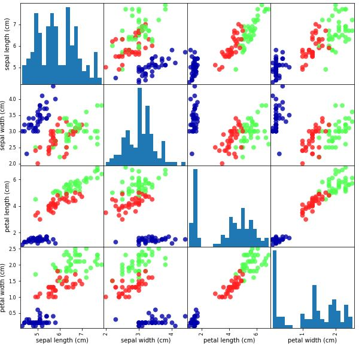

# 1. 소개

### 1.1 왜 머신러닝인가?

머신러닝이 없던 초창기에는 규칙 기반 전문가 시스템(Rule-based expert system)을 사용하여 지능형 애플리케이션을 개발했다고 한다.  예를 들어,  이메일이 하나 왔을 때, 이 메일이 스팸 메일인지 아닌지를 판단하기 위해서 다음과 같은 과정이 필요했을 것이다.

```python
...

if "싼" in an_email.text:
    an_email.check = "스팸"

elif "지금 바로" in an_email.text:
    an_email.check = "스팸"
   
elif "클릭" in an_email.text:
    an_email.check = "스팸"
    
...
```

 그러나 이와 같은 방식은 다음과 같은 이유들 때문에 인공지능, 특히 컴퓨터 비전에 적합하지 않다.


- **같은 사람의 얼굴이라도 조명, 각도, 색깔 등의 여러가지 요인에 따라 다르게 보일 수 있다.**


- **정교하게 사람의 얼굴과 같이 만들어진 모방품(로봇, 마네킹 등)은 사람조차 구별하기 쉽지 않다.**

  

따라서 단순히 하드 코딩으로 규칙을 추가하는 데에는 한계가 있음이 분명하다.


##### 1.1.1 머신러닝으로 풀 수 있는 문제


머신러닝이라고 함은 크게 두 가지 범주로 나눌 수 있다. 하나는 모델에게 입력과 그에 따른 출력 데이터를 제공하여, 모델로 하여금 데이터에 대한 출력을 가장 잘 산출해낼 수 있는 방법을 찾게 한다. 그렇게 되면 답을 모르는 새로운 입력이 들어 왔을 때, 모델 스스로 그 입력에 걸맞은 출력을 찾아낼 것이다. 이런 학습 방식을 **지도학습(Supervised learning)** 이라고 한다. 반대로 모델 스스로가 입력으로부터 의미있는 출력을 찾아내는 학습 방식을 **비지도학습(Unsupervised learning)** 이라고 한다. 지도 학습과 비지도 학습 모두 컴퓨터가 인식할 수 있는 형태로 데이터를 준비하는 것이 필요하다. 


| 지도학습(Supervised learning)       | 비지도학습(Unsupervised learning)             |
| ----------------------------------- | --------------------------------------------- |
| 1.  손으로 쓴 숫자 판별             | 1. 뉴스, 블로그 등의 주제 구분                |
| 2.  의료 영상 이미지 안의 종양 판단 | 2.  고객의 특성에 기반하여 그룹 짓기          |
| 3.  신용카드 부정 거래 감지         | 3.  웹 트래픽을 관찰하여 비정상적인 접근 탐지 |


특별히 데이터 하나를 **샘플(Sample)** 혹은 **데이터 포인트(Data point)** 라고 하며 열을 **특성(Feature)**라고 한다. 컴퓨터 비전적으로 Classification 같은 문제들은 데이터 포인트에 레이블이 포함되어 있는 경우가 많아 지도 학습이라고 볼 수 있다. 그런데 예를 들어, 사람 얼굴의 생김새를 특성으로 하여 특성을 바탕으로 그룹을 지어본다고 한다면 비지도 학습이라고 볼 수 있겠다. 이렇게 만들어진 그룹으로 성격, 취향 등을 유추해 볼 수 있지 않을까 싶다.


##### 1.1.2 문제와 데이터 이해하기


머신러닝 프로세스에서 가장 중요한 과정 중에 하나는 "데이터를 이해하는 것"과 "데이터과 문제와 어떤 연관이 있는 지 파악하기"라고 한다. 무턱대고 아무 알고리즘이나 선택하는 것은 머신러닝의 특성상 시간 낭비를 할 확률을 높게 만든다. 실제로 본격적으로 머신러닝 모델을 구축하기에 앞서 다음과 같은 질문들에 대한 답을 해보는 것은 문제 해결에 큰 도움을 줄 것이다. 


- 질문에 대한 답을 정확히 이해했는지
- 획득한 데이터가 원하는 답을 줄 수 있는지
- 획득한 데이터의 특성은 무엇이 있으며 어떤 특성이 문제 해결에 도움이 될 것인지
- 머닝러닝 애플리케이션의 성과는 어떻게 측정할 것인지


### 1.2 왜 파이썬인가?


데이터 과학을 위한 표준 프로그래밍 언어로서 MATLAB, R 등의 여러가지 프로그래밍 언어가 있지만 그 가운데서도 파이썬은 단연 돋보이는 위치를 확립해 나가고 있다. 여기에는 여러가지 이유가 있다. 


- 스크립팅 언어식 인터페이스와 대화형 언어식 인터페이스를 제공한다.
- 데이터 과학에 도움이 되는 여러가지 라이브러리들을 제공한다.(데이터 적재, 시각화 , 통계 등)
- GUI나 웹 서비스도 만들 수 있다.
- 커뮤니티 활성화가 잘 되어 있어 도움을 받기 쉽다.


### 1.3 scikit-learn


scikit-learn 라이브러리는 오픈 소스이기 때문에 누구나 쉽고 자유롭게 사용하거나 이를 활용한 부속물들을 배포할 수 있고 소스 코드를 보고 동작하는 원리를 확인 하기 쉽다.  알고리즘을 설명한 문서(http://scikit-learn.org/stable/documentation)을 제공하고 사용자 가이드(http://scikit-learn.org/stable/user_guide.html)와 API 문서(http://scikit-learn.org/stable/modules/classes.html)을 제공하고 있기 때문에 개발 과정에서 필요한 지식을 손쉽게 습득할 수 있다.


##### 1.3.1 scikit-learn 설치


scikit-learn은 **Numpy**와 **SciPy**의 두 파이썬 패키지를 사용한다. 그래프를 그리고 싶다면 **Matplotlib**을 설치하면 되고 대화식 환경에서 개발하고 싶다면 **IPython**과 **Jupyter notebook**을 설치하는 것을 권장한다. 다음은 scikit-learn을 사용하는 환경을 구축하는데 권장되는 파이썬 배포판들이다.


- **Anaconda (https://www.continuum.io/anaconda-overview)**
- **Enthought Canopy (https://www.enthought.com/products/canopy/)**
- **Python (x,y) (http://python-xy.github.io/)**


배포판을 설치했다면 다음과 같이 필요한 라이브러리들을 설치 할 수 있다.


`$ pip install numpy scipy matplotlib ipython scikit-learn pandas pillow`

`$conda install -c anaconda numpy scipy matplotlib ipython scikit-learn pandas pillow`


### 1.4 필수 라이브러리와 도구들


Jupyter notebook(https://jupyter.org/), Numpy(https://numpy.org/), Scipy(https://www.scipy.org/), Matplotlib(https://matplotlib.org/), Pandas(https://pandas.pydata.org/), Mglearn(https://github.com/amueller/mglearn)을 참조.


### 1.5 파이썬 2 vs. 파이썬 3


과거에 파이썬3가 나오기 전에 파이썬2가 많이 사용되었기 때문에 호환성 때문에 파이썬2를 사용하거나 파이썬2로 작성된 코드가 아직 많이 존재한다. 그러나 더이상 파이썬2의 개선사항이 존재하지 않고 파이썬3에는 변경사항이 많기 때문에 파이썬 2의 코드가 실행되지 않을 수 있다. 따라서 파이썬을 새로 배우는 경우, 파이썬 3를 익히는 것이 바람직하고 파이썬2에서 파이썬3로의 이관을 빠르게 진행하는 것을 추천한다. 다만 six 패키지(https://pypi.python.org/pypi/six)를 이용하면 파이썬2와 파이썬3 모두에서 동작하는 코드를 작성하는 것은 어렵지 않다.


### 1.6 사용하는 패키지 버전 확인


다음과 같은 명령어로 사용하고 있는 환경 혹은 패키지들의 버전을 확인할 수 있다.


`import sys; sys.version #Python 버전`

`import numpy as np; np.__version__ #Numpy 버전`


### 1.7 첫 번째 애플리케이션: 붓꽃의 품종 종류


앞에서 언급한 내용을 짚어가면서 첫번째 모델을 만들어보면 다음과 같다. 


1.  setosa, versicolor, virginica 세 종의 붓꽃의 측정 데이터가 있다. 측정 데이터는 꽃잎과 꽃받침의 폭과 길이를 센티미터 단위로 측정했다. 
2.  붗꽃의 측정 데이터로 새로 채집한 붗꽃이 어떤 품종인지 구분하려고 한다. 
3.  측정 데이터에는 어떤 품종인지에 대한 정보가 포함되어 있기 때문에 지도학습에 속한다.
4.  여러가지 선택 사항 중 하나를 선택하는 문제를 **분류(Classification)** 라고 한다. 여기서 선택사항들을 **클래스(Class)** 라고 한다. 데이터 포인트 하나가 가지는 출력을 **레이블(Label)** 이라고 한다. 이 문제는 setosa, versicolor, virginica의 세가지 클래스를 포함하고 있고, 각 측정 데이터의 포인트는 setosa 혹은 versicolor 혹은 virginica의 레이블을 포함하고 있다. 


##### 1.7.1 데이터 적재


사용하려는 데이터는 다음과 같이 로드할 수 있다. 

```python
from sklearn.datasets import load_iris 
iris = load_iris()
```


```python 
In: iris.keys()

Out: dict_keys(['target_names', 'feature_names', 'DESCR', 'data', 'target'])
```


DESCR에는 데이터 셋에 대한 설명이, target_names에는 클래스가 feature_names에는 각 특성에 대한 설명이 들어 있다. 실제 데이터는 target과 data에 들어 있다. 


```python 
In: iris['data']
    
Out: <class 'numpy.ndarray'>
```


```python 
In: iris['data'].shape
    
Out: (150, 4)
```


```python 
In: iris['target']
    
Out: <class 'numpy.ndarray'
```


```python 
In: iris['target'].shape
    
Out: (150,)
```


데이터 포인트의 갯수는 150개이고, feature_names 필드에서 확인해보면 각 데이터 포인트는 sepal length (cm), sepal width (cm), petal length (cm), petal width (cm)의 네가지 특성을 가지고 있다. 클래스는 세가지이므로 0부터 2까지의 정수로 이루어져 있다. 본격적으로 머신러닝 모델을 구축하기 전에 데이터에 대한 특성을 정확하게 파악하기 위해서 DESCR 필드를 활용해서 데이터에 대한 설명을 읽어보는 것이 도움이 될 것이다.


##### 1.7.2 성과 측정: 훈련 데이터와 테스트 데이터


머신러닝 모델을 구축할 때에는 훈련을 할 때 쓰는 데이터와 구축된 모델을 측정할 때 쓰는 데이터로 나누어야 한다. 모든 데이터로 모델을 훈련시키고 성능을 측정하면 모델이 데이터의 특성을 일반화 할 수 있는 방법을 찾는 것이 아니라 훈련 데이터 자체의 특성을 외우게 되는 불상사가 일어날 수 있다. 즉, 새로 획득한 데이터에 대해서는 잘 작동하지 않을 수 있다. 머신러닝 모델을 구축하고 훈련시킬때 쓰는 데이터를 **훈련 데이터(Training set)** 이라고 하고 만들어진 모델의 성능을 측정할 때 쓰는 데이터를 **테스트 데이터(Test set)** 혹은 **홀드 아웃 데이터(Hold-out set)** 이라고 한다. 보통 훈련 데이터와 테스트 데이터는 8:2 혹은 7:3의 비율로 나눈다. scikit-learn에서는 다음과 같이 데이터를 나눈다.


```python 
from sklearn.model_selection import train_test_split
X_train, X_test, y_train, y_test = train_test_split(iris['data'], iris['target'], random_state = 0) 
```


scikit-learn에서는 기본적으로 75:25의 비율로 데이터를 나눈다. 이 비율은 test_size 파라미터로 바꿀수 있다. 데이터를 나눌 때, 섞지 않은 상태로 나누면 테스트 데이터의 대부분이 한 레이블을 가지게 된다(데이터 포인트가 레이블 별로 정렬되어 있기 때문에). 따라서 데이터를 나누기 전에 각 레이블이 되도록 골고루 섞일 수 있도록 해야 한다. random_state 매개변수를 전달하면 함수를 여러번 실행해도 같은 결과가 나올 수 있도록 유사 난수 생성을 할 수 있다. 


```python 
In: X_train.shape, y_train.shape
Out: (112, 4), (112,)
```


```python 
In: X_test.shape, y_test.shape
Out: (38, 4), (38,)
```


##### 1.7.3 가장 먼저 할 일: 데이터 살펴보기


본격적으로 모델을 만들기 전에 


1.  머신러닝 없이도 풀 수 없는 문제인가.
2. 데이터에 필요한 정보가 누락되어 있는지.
3. 데이터에 비정상적인 값이나 특이한 값들이 들어 있는지.


시각화는 데이터를 조사하는 좋은 방법인데 **산점도(scatter plot)**, **산점도 행렬(scatter matrix)** 등이 있다. 이런 시각화 과정을 통해서 잘 보이지 않는 데이터 간의 특성을 발견할 수 도 있다.


```python 
iris_dataframe = pd.DataFrame(X_train, columns=iris.feature_names)
pd.plotting.scatter_matrix(iris_dataframe, c=y_train, figsize=(10, 10), marker='o', hist_kwds={'bins': 20}, s=60, alpha=.8, cmap=mglearn.cm3)
```





##### 1.7.4 첫 번째 머신러닝 모델: k-최근접 이웃 알고리즘


여기서는 비교적 이해하기 쉬운 ***k* -최근접 이웃(*k* - Nearest Neighbors)** 로 분류기를 사용한다. k-최근접 이웃 알고리즘에서는 대상 데이터 포인트에게서 가장 가까운 k개의 이웃 데이터 포인트를 찾고, 이웃 데이터 포인트의 레이블의 빈도수가 가장 큰 레이블을 대상 데이터 포인트의 레이블로 정한다. scikit-learn의 모든 머신러닝 모델은 Estimator라는 파이썬 클래스로 각각 구현되어 있다. k-NN은 neighbors 모듈 아래 KNeighborsClassifier 클래스에 구현되어 있다. 모델의 파라미터 중 k의 값을 지정하는 n_neighbors는 필수로 지정해야 한다. 


```python 
from sklearn.neighbors import KNeighborsClassifier
knn = KNeighborsClassifier(n_neighbors=1)
```


knn의 fit 메소드는 입력으로 받은 훈련 데이터로 훈련을 진행한다. 


```python 
In: knn.fit(X_train, y_train)
Out: KNeighborsClassifier(algorithm='auto', leaf_size=30, metric='minkowski', 
                         metric_params=None, n_jobs=1, n_neighbors=1, p=2, 
                         weights='uniform')
```


##### 1.7.5 예측하기


예측에는 분류기의 predict 메소드를 사용한다.


```python 
In: X_new = np.array([[5, 2.9, 1, 0.2]])
    prediction = knn.predict(X_new)
    print(prediction)
    print(iris['target_names'][prediction])
    
Out: [0]
     ['setosa']
```


##### 1.7.6 모델 평가하기


만든 모델을 평가하기 위해 모델의 훈련 과정에서 쓰지 않았던 테스트 데이터를 사용한다. 간단한 평가 지표로, 얼마나 많은 붓꽃 품종이 맞았는지 **정확도(Accuracy)** 를 확인할 수 있다.


```python 
In: y_pred = knn.predict(X_test)
    print(np.mean(y_pred === y_test))
    
Out: 0.97
```


특별히 분류기의 score 메소드로도 테스트 데이터에 대한 정확도를 계산할 수 있다.


```python 
In: knn.score(X_test, y_test)
Out: 0.97
```

