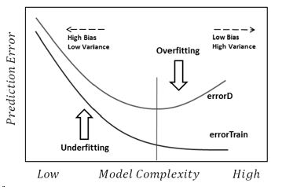

# 2. 지도 학습

지도 학습은 훈련데이터와 레이블이 있고 훈련을 통해서 완성된 모델로 새로 입력으로 들어온 데이터 포인트의 레이블을 예측하는 머신러닝 방법이다.

### 2.1 분류와 회귀

분류는 미래 정해져 있는 클래스 중에서 데이터 포인트에 맞는 레이블을 고르는 문제이다. 분류는 크게 두 가지 범주로 나눌 수 있는데 두 가지 레이블 중 하나를 고르는 **이진분류(Binary classification)** 과 세 가지 이상의 레이블 중 하나를 고르는 **다중분류(Multiclass classification)** 이다. 이진 분류에서 학습하고자 하는 대상을 **양성(Positive) 클래스** 라고 하고, 그 반대의 대상을 **음성(Negative) 클래스** 라고 한다. 컴퓨터 비전에서는 암 환자들의 MRI 등의 이미지를 보고 암인지 아닌지를 판별 할 수 있는데 이 경우에 이미지에 암 종양이 발견될 경우 양성 클래스, 아닐 경우 음성 클래스라고 할 수 있다. 다중 분류에서는 어떤 꽃의 이미지를 보여주고, 이 꽃이 어떤 꽃인지를 예측하는 모델을 만들 수 있다. 

회귀는 데이터 포인트의 특성를 고려하여 알맞는 **부동소수점수(Floating point value)** 를 찾아내는 문제이다. 대표적으로 어떤 사람의 학력, 집안 형편, 성별, 인종, 교육 수준, 주거지 등의 정보로 이 사람이 얼마만큼의 연봉을 받을 것인지를 예측하는 문제가 있고, 뉴스나 여러가지 웹 페이지에서 나타나는 단어의 빈도수를 체크하여 주가를 예측하는 문제도 있을 수 있다. 

분류와 회귀 문제를 구분하는 방법은 레이블이 **Continuous** 한지 **Discrete** 한지를 살펴보면 알 수 있다.

### 2.2 일반화, 과대적합, 과소적합

일반적으로 훈련데이터로 학습된 모델은 테스트 데이터에도 잘 맞을 것이라고 예상한다. 실제로 훈련데이터로 학습한 모델이 테스트 데이터에도 준수한 성적을 보일 때, 이 모델은 **일반화(Generalization)** 이 잘 되었다고 말할 수 있다. 그러나 훈련된 모델이 항상 일반화가 잘 되는 것은 아니다. 예를 들어서 어떤 동물이 곰인지 아닌지를 판단하는 분류기를 만들어 본다고 가정한다. 그런데 학습 데이터로 반달 가슴곰의 이미지만 입력데이터로 주입시킨다. 이 모델을 테스트 할 때, 반달 가슴곰의 이미지를 주입시키면 매우 뛰어난 성능을 보일 수 있겠지만 북극곰의 이미지를 넣었을때, 반달 가슴곰 모양의 석상 이미지를 주입시킬 때, 과연 곰인지 아닌지를 잘 판별 할 수 있을까. 이렇게 훈련 데이터의 특성만 기억하는 모델을 **과대적합(Overfitting)** 되었다고 말한다. 반대로 반달 가슴곰의 이미지를 아무리 넣어도 훈련과정에서 정확도가 나아지지 않는다. 이 때는 훈련 데이터를 점검하거나 모델의 개선이 필요한데, 이를 **과소적합(Underfitting)** 되었다고 이야기 한다. 과대적합인지 과소적합인지 아니면 일반화가 잘 되었는지를 판단하는 대표적인 방법 한 가지는 훈련 과정 간의 정확도나 손실 값을 확인 하는 것이다.

