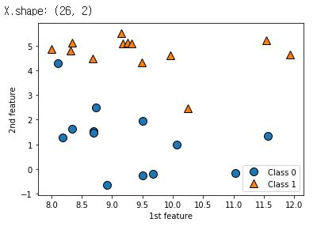
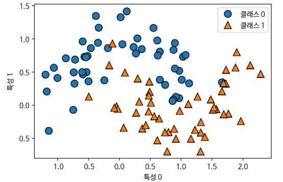
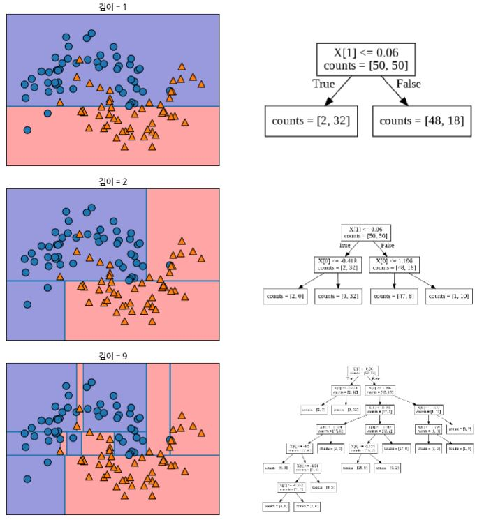
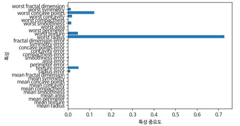
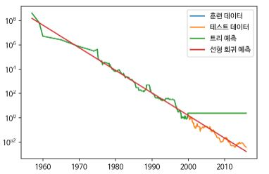
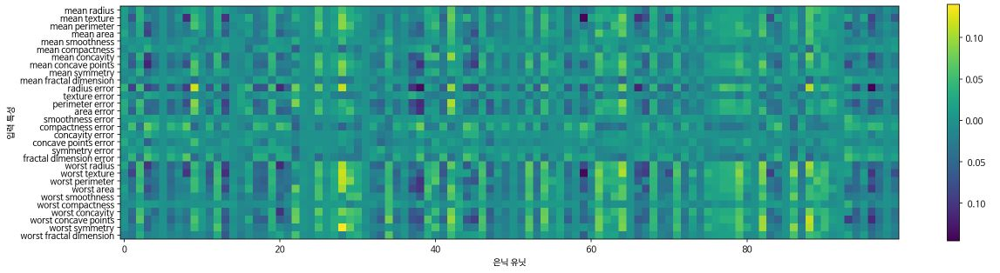

# 2. 지도 학습

지도 학습은 훈련데이터와 레이블이 있고 훈련을 통해서 완성된 모델로 새로 입력으로 들어온 데이터 포인트의 레이블을 예측하는 머신러닝 방법이다.


### 2.1 분류와 회귀

분류는 미래 정해져 있는 클래스 중에서 데이터 포인트에 맞는 레이블을 고르는 문제이다. 분류는 크게 두 가지 범주로 나눌 수 있는데 두 가지 레이블 중 하나를 고르는 **이진분류(Binary classification)** 과 세 가지 이상의 레이블 중 하나를 고르는 **다중분류(Multiclass classification)** 이다. 이진 분류에서 학습하고자 하는 대상을 **양성(Positive) 클래스** 라고 하고, 그 반대의 대상을 **음성(Negative) 클래스** 라고 한다. 컴퓨터 비전에서는 암 환자들의 MRI 등의 이미지를 보고 암인지 아닌지를 판별 할 수 있는데 이 경우에 이미지에 암 종양이 발견될 경우 양성 클래스, 아닐 경우 음성 클래스라고 할 수 있다. 다중 분류에서는 어떤 꽃의 이미지를 보여주고, 이 꽃이 어떤 꽃인지를 예측하는 모델을 만들 수 있다. 

회귀는 데이터 포인트의 특성를 고려하여 알맞는 **부동소수점수(Floating point value)** 를 찾아내는 문제이다. 대표적으로 어떤 사람의 학력, 집안 형편, 성별, 인종, 교육 수준, 주거지 등의 정보로 이 사람이 얼마만큼의 연봉을 받을 것인지를 예측하는 문제가 있고, 뉴스나 여러가지 웹 페이지에서 나타나는 단어의 빈도수를 체크하여 주가를 예측하는 문제도 있을 수 있다. 

분류와 회귀 문제를 구분하는 방법은 레이블이 **Continuous** 한지 **Discrete** 한지를 살펴보면 알 수 있다.


### 2.2 일반화, 과대적합, 과소적합


일반적으로 훈련데이터로 학습된 모델은 테스트 데이터에도 잘 맞을 것이라고 예상한다. 실제로 훈련데이터로 학습한 모델이 테스트 데이터에도 준수한 성적을 보일 때, 이 모델은 **일반화(Generalization)** 이 잘 되었다고 말할 수 있다. 그러나 훈련된 모델이 항상 일반화가 잘 되는 것은 아니다. 예를 들어서 어떤 동물이 곰인지 아닌지를 판단하는 분류기를 만들어 본다고 가정한다. 그런데 학습 데이터로 반달 가슴곰의 이미지만 입력데이터로 주입시킨다. 이 모델을 테스트 할 때, 반달 가슴곰의 이미지를 주입시키면 매우 뛰어난 성능을 보일 수 있겠지만 북극곰의 이미지를 넣었을때, 반달 가슴곰 모양의 석상 이미지를 주입시킬 때, 과연 곰인지 아닌지를 잘 판별 할 수 있을까. 이렇게 훈련 데이터의 특성만 기억하는 모델을 **과대적합(Overfitting)** 되었다고 말한다. 반대로 반달 가슴곰의 이미지를 아무리 넣어도 훈련과정에서 정확도가 나아지지 않는다. 이 때는 훈련 데이터를 점검하거나 모델의 개선이 필요한데, 이를 **과소적합(Underfitting)** 되었다고 이야기 한다. 과대적합인지 과소적합인지 아니면 일반화가 잘 되었는지를 판단하는 대표적인 방법 한 가지는 훈련 과정 간의 정확도나 손실 값을 확인 하는 것이다.


##### 2.2.1 모델 복잡도와 데이셋 크기의 관계


보통 데이셋의 특성이 다양하고 갯수가 많아질수록 **모델복잡도(Model capacity)** 가 커지기 마련이다. 실제로 과대적합의 경우, 중복없는 다양한 데이터를 더 모으는 것이 문제 해결에 도움이 된다. 과대 적합이 일어 났다면 모델을 조작하기 전에 데이터를 점검해보고 데이터의 양이 너무 적거나, 중복이 되었거나, 특성이 너무 적을 때, 다양한 데이터를 추가하면 성능 개선에 큰 도움이 된다. 과소 적합의 경우, 데이터 자체보다는 모델을 개선하는 방향이 더 도움이 된다.


### 2.3 지도 학습 알고리즘


##### 2.3.1 예제에 사용할 데이터셋


지도 학습 알고리즘에 사용될 예제 데이터 셋은 다음과 같다. 

- 이진 분류 데이터 셋

  

- 회귀 데이터 셋

  


(* 특성이 적은 데이터셋(저차원 데이터셋)에서 얻은 직관이 특성이 많은 데이터 셋(고차원 데이터셋)에서 그대로 유지되지 않을 수 있음.)


- scikit-learn의 위스콘신 유방암 데이터 셋

```python 
In: 
from sklearn.datasets import load_breast_cancer

cancer = load_breast_cancer()
print(f"cancer.keys(): {cancer.keys()}")
print(f"Data shape: {cancer.data.shape}")
target_number = {n: v for n, v in zip(cancer.target_names, np.bincount(cancer.target))}
print(f"The number of samples per class:\n{target_number}")
print(f"Features' name:\n{cancer.feature_names}")
```

```python 
Out:
cancer.keys(): dict_keys(['data', 'target', 'target_names', 'DESCR', 'feature_names', 'filename'])
Data shape: (569, 30)
The number of samples per class:
{'malignant': 212, 'benign': 357}
Features' name:
['mean radius' 'mean texture' 'mean perimeter' 'mean area'
 'mean smoothness' 'mean compactness' 'mean concavity'
 'mean concave points' 'mean symmetry' 'mean fractal dimension'
 'radius error' 'texture error' 'perimeter error' 'area error'
 'smoothness error' 'compactness error' 'concavity error'
 'concave points error' 'symmetry error' 'fractal dimension error'
 'worst radius' 'worst texture' 'worst perimeter' 'worst area'
 'worst smoothness' 'worst compactness' 'worst concavity'
 'worst concave points' 'worst symmetry' 'worst fractal dimension']    
```


- 보스턴 주택가격 데이터셋과 특성 공학을 거친 보스턴 주택 가격 데이터 셋

```python 
In:
from sklearn.datasets import load_boston

boston = load_boston()
print(f"Data shape: {boston.data.shape}")
# Has been gone through feature engineering
X, y = mglearn.datasets.load_extended_boston()
print(f"X.shape: {X.shape}")    
```

```python 
Out:
Data shape: (506, 13)
X.shape: (506, 104)    
```


##### 2.3.2 K-최근접 이웃


***K*-NN(*K*-Nearest Neighbors)** 알고리즘은 어떤 포인트 하나에 대하여 k개의 이웃을 찾아서 그 중에 가장 많은 레이블을 그 데이터 포인트의 레이블로 지정하는 알고리즘이다.


##### k-최근접 이웃 분류


- 이웃의 숫자가 1개일 때

  

- 이웃의 숫자가 3개일 때

  


실제로 scikit-learn에서 k-최근접 이웃 알고리즘을 적용하는 방법은 다음과 같다.


```python 
from sklearn.model_selection import train_test_split
from introduction_to_ml_with_python import mglearn

X, y = mglearn.datasets.make_forge()
X_train, X_test, y_train, y_test = train_test_split(X, y, random_state=0)
```

먼저 데이터를 훈련 세트와 테스트 세트로 나눈다.


```python 
In:
from sklearn.neighbors import KNeighborsClassifier

clf = KNeighborsClassifier(n_neighbors=3)    
```

scikit-learn에서 KNeighborsClassfier를 Import하고 이웃의 숫자를 지정한다.


```python 
In:
clf.fit(X_train, y_train)    
```

```python 
Out:
KNeighborsClassifier(algorithm='auto', leaf_size=30, metric='minkowski',
                     metric_params=None, n_jobs=None, n_neighbors=3, p=2,
                     weights='uniform')    
```

알고리즘 모델 객체의 fit메소드를 호출하면 입력으로 받은 데이터로 모델을 훈련시킨다. 여기서는 우리가 지정한 이웃의 숫자를 제외하고 기본적인 몇가지 매개변수들을 미리 셋팅이 되어 있음을 확인할 수 있다.


```python 
In:
print(f"Test set prediction: {clf.predict(X_test)}")    
```

```python 
Out:
Test set prediction: [1 0 1 0 1 0 0]    
```

테스트 데이터로 예측을 진행하고자 할 때는 알고리즘 모델 객체의 predict 메소드를 호출한다. 결과의 각 원소들은 예측 레이블을 뜻한다.


```python 
In:
print(f"Test set prediction score: {clf.score(X_test, y_test):.2f}")
```

```python 
Out:
Test set prediction score: 0.86
```

모델이 얼마나 잘 일반화 되었는지 확인하기 위해서 score 메소드를 호출할 수 있다.


##### KNeighborsClassifier 분석


다음은 이웃이 하나, 셋, 아홉  개일 때의 **결정 경계(Decision boundary)** 를 보여준다. 결정 경계란 클래스 별로 각 데이터 포인트가 속한 영역에 색을 칠했을 때 나뉘는 경계를 말한다.

```python 
In:
fig, axes = plt.subplots(1, 3, figsize=(10, 3))

for n_neighbors, ax in zip([3**i for i in range(3)], axes):
  clf = KNeighborsClassifier(n_neighbors=n_neighbors).fit(X, y)
  mglearn.plots.plot_2d_separator(clf, X, fill=True, eps=.5, ax=ax, alpha=.4)
  mglearn.discrete_scatter(X[:, 0], X[:, 1], y, ax=ax)
  ax.set_title(f"{n_neighbors} Neighbors")
  ax.set_xlabel("Feature 0")
  ax.set_ylabel("Feature 1")
axes[0].legend(loc=3)
```


위를 보면 이웃의 숫자가 늘어날수록 결정경계가 부드러워짐을 확인할 수 있다. 다시 말해서 이웃의 숫자가 늘어날수록 모델의 복잡도(과대적합할 확률)이 줄어들고 있음을 알 수 있다. 


```python 
In:
from sklearn.datasets import load_breast_cancer

cancer = load_breast_cancer()
X_train, X_test, y_train, y_test = train_test_split(cancer.data, cancer.target, stratify=cancer.target, random_state=66)
training_accuracy = []
test_accuracy = []
neighbors_settings = range(1, 11)

for n_neighbors in neighbors_settings:
  clf = KNeighborsClassifier(n_neighbors=n_neighbors)
  clf.fit(X_train, y_train)
  training_accuracy.append(clf.score(X_train, y_train))
  test_accuracy.append(clf.score(X_test, y_test))

plt.plot(neighbors_settings, training_accuracy, label="Train acc")
plt.plot(neighbors_settings, test_accuracy, label="Test acc")
plt.ylabel("Acc")
plt.xlabel("n_neighbors")
plt.legend()
```


이웃의 숫자가 매우 작을때는 과대적합이 일어나고 반대로 매우 많을 때는 과소적합이 일어난다. 따라서 적당한 수의 이웃을 설정하는 것이 중요하다.


##### k-최근접 이웃 회귀


k-최근접 이웃 알고리즘은 다음과 같이 회귀 분석에도 쓰일 수 있다.


- 이웃의 숫자가 1일 때

  

- 이웃의 숫자가 3일 때

  

여러개의 최근접 이웃을 사용하게 되면 이웃 간의 평균이 예측이 된다(KNeighborsRegression의 weights 매개변수가 'uniform'일 때는 np.mean 함수를 사용한 단순 평균을, 'distance'일 때는 거리를 고려한 가중치 평균을 계산한다).


scikit-learn에서 회귀를 위한 k-최근접 이웃 알고리즘은 KNeighborsRegressor에 구현되어 있다.

```python 
In:
from sklearn.neighbors import KNeighborsRegressor

X, y = mglearn.datasets.make_wave(n_samples=40)
X_train, X_test, y_train, y_test = train_test_split(X, y, random_state=0)
reg = KNeighborsRegressor(n_neighbors=3)
reg.fit(X_train, y_train)
```

```python 
Out:
KNeighborsRegressor(algorithm='auto', leaf_size=30, metric='minkowski',
                    metric_params=None, n_jobs=None, n_neighbors=3, p=2,
                    weights='uniform')
```


```python 
In:
print(f"Test set prediction:\n{reg.predict(X_test)}")
```

```python 
Out:
Test set prediction:
[-0.05396539  0.35686046  1.13671923 -1.89415682 -1.13881398 -1.63113382
  0.35686046  0.91241374 -0.44680446 -1.13881398]
```


```python 
In:
print(f"Test set prediction:\n{reg.predict(X_test)}")
```

```python 
Out:
Test set R^2: 0.83
```

마찬가지로 score 메소드를 통해서 모델을 평가 할 수 있는데 회귀에서는 R^2 값을 반환한다. R^2 값은 회귀 모델에서 예측의 적합 정도를 0과 1사이의 값으로 계산한 것인데, 1은 예측이 완벽한 것이고 0은 훈련 세트의 출력값의 평균으로만 예측하는 것이다.  y 값은 타깃 값이다.

$$ 
R^2 = 1- \frac{Σ(y -y(예측))^2}{Σ(y -y(평균))^2} 
$$


##### 장단점과 매개변수

KNeighbors 분류기의 주요 매개변수는 두 가지이다. 하나는 데이터 포인트의 이웃의 수이고 다른 하나는 데이터 포인트 간의 거리를 재는 방법이다. KNeighborsClassifier와 KNeighborsRegressor 객체를 생성할 때, metric 매개변수를 사용하여 거리 측정 방식을 변경 할 수 있다. 기본 값은 민코프스키 거리를 의미하는 "minkowski"이며 매개변수 p가 기본값 2일 때 유클리디안 거리와 같다.

KNeighbors의 장단점은 다음과 같다.

- 장점: 이해하기 쉽다, 모델을 빠르게 구축할 수 있다, 모델을 많이 조정하지 않아도 된다.
- 단점: 훈련 세트의 수가 많으면 느려진다, 데이터의 특성이 많으면 잘 동작하지 않는다(특히 특성 값 대두분이 0인 **희소 행렬(Sparse matrix)** )
- 주의: 이웃 간의 거리를 계산할때 범위가 작은 특성에 큰 영향을 받으므로 특성들이 같은 스케일을 갖도록 정규화 하는 것이 필요하다.


##### 2.3.3 선형 모델

선형 모델은 입력 특성에 대한 선형 함수를 만들어 예측을 수행한다.


##### 회귀의 선형 모델

일반적으로 회귀의 선형 모델을 위한 예측 함수는 다음과 같다.


$$ 
y(예측) = {w[0]}\times{x[0]}+{w[1]}\times{x[1]}+...+{w[p]}\times{x[p]}+b 
$$


x[0] ~ x[p]는 데이터 포인트의 특성을 나타내고 w[0] ~ w[p]와 b는 모델이 학습할 파라미터이다(모델이 학습하는 파라미터를 모델 파라미터, 사람이 설정해주어야 하는 파라미터를 **하이퍼 파라미터(Hyper parameter) 라고 한다 **). 이를 좌표 평면에서 보면 위의 식은 하나의 직선의 방적식이 되고 w는 기울기, b는 절편이 된다. 


KNeighborsRegressor와 비교했을 때, 데이터의 상세 정보를 모두 잃어 버린 것처럼 보일 수 있으나 어떤 데이터든지 그 추세를 구하고 싶다면 훌륭한 선택이 될 수 있다.


##### 선형 회귀(최소제곱법)

**선형 회귀(Linear regression)** 혹은 **최소 제곱법(Ordinary least squares)** 은 예측 값과 타겟 y 값 사이의 **평균제곱오차(Mean squared error)** 을 최소화 하는 모델 파라미터 w와 절편 b를 찾는다. 모델 생성 시의 설정해야하는 매개변수가 없는게 장점이지만 복델의 복잡도를 제어할 방법이 없다는 것이 단점이다. 


```python 
In:
from sklearn.linear_model import LinearRegression
from sklearn.model_selection import train_test_split

X, y = mglearn.datasets.make_wave(n_samples=60)
X_train, X_test, y_train, y_test = train_test_split(X, y, random_state=42)

lr = LinearRegression().fit(X_train, y_train)

print(f"lr.coef_: {lr.coef_}")
print(f"lr.intercept_: {lr.intercept_}")
```

```python 
Out:
lr.coef_: [0.39390555]
lr.intercept_: -0.031804343026759746
```

기울기 파라미터(w)는 **가중치(weight)** 혹은 **계수(coefficient)** 라고 하며 LinearRegression 객체의 coef_ 속성에 저장되어 있다. 편향 파라미터(b)는 **절편(intercept)** 이라고 하며 intercept_ 속성에 저장되어 있다(속성 뒤에 _는 scikit-learn에서 학습에 의해서 유도되는 특성이다.)


학습한 모델의 훈련 세트와 테스트 세트의 성능은 다음과 같다.

``````python
In:
print(f"Train set score: {lr.score(X_train, y_train):.2f}")
print(f"Test set score: {lr.score(X_test, y_test):.2f}")
``````

```python 
Out:
Train set score: 0.67
Test set score: 0.66
```

R^2 값이 두 세트 모두에서 그리 좋지 않기 때문에 과소적합이 발생했음을 알 수 있다. 일반적으로 저차원 데이터셋에서는 과대적합을 걱정할 필요가 없지만 고차원 데이터셋에서는 모델의 복잡도가 증가하여 과대적합할 가능성이 높아진다.


다음은 보스턴 주택가격 데이터셋으로 테스트 하는 코드이다. 이 확장된 보스턴 주택가격 세트에는 샘플이 506개가 있고 특성이 인위적으로 합성된 것을 합쳐서 105개가 있다. 

```python 
In:
X, y = mglearn.datasets.load_extended_boston()

X_train, X_test, y_train, y_test = train_test_split(X, y, random_state=0)
lr = LinearRegression().fit(X_train, y_train)

print(f"Train set score: {lr.score(X_train, y_train):.2f}")
print(f"Test set score: {lr.score(X_test, y_test):.2f}")
```

```python 
Out:
Train set score: 0.95
Test set score: 0.61
```

위에서 보는 것처럼 특성이 많을수록 원래의 선형회귀 모델은 쉽게 과대적합 함을 알 수 있다.


##### 릿지 회귀

**릿지(Ridge)** 회귀도 선형 모델이므로 최소적합법에서 사용한 것과 같은 예측 함수를 사용한다. 기본 선형 모델과의 차이점은 가중치의 절댓값을 가능한 작게(w의 모든 원소가 0에 가깝게) 만들어 모든 특성이 출력에 주는 영향을 최소한으로 만든다는 것이다(기울기를 작게). 이런 제약을 **규제(Regularization)** 이라고 한다. 규제는 과대적합이 일어나지 않도록 모델을 제한하는 것이 목적이다. 릿지 회귀에서 사용하는 규제 방식을 L2 규제라고 한다.


```python 
In:
from sklearn.linear_model import Ridge

ridge = Ridge().fit(X_train, y_train)
print(f"Train set score: {ridge.score(X_train, y_train):.2f}")
print(f"Test set score: {ridge.score(X_test, y_test):.2f}")
```

```python 
Out:
Train set score: 0.89
Test set score: 0.75
```

결과는 LinearRegression보다 훈련 데이터의 성능은 나빠졌지만 테스트 데이터에서의 성능은 좋아졌다. 즉, 과대 적합이 어느정도 해소되었음을 확인할 수 있다. 


Ridge에서 alpha 매개변수로 규제를 어느정도로 할 지 정할 수 있다. alpha의 값이 높으면 더 강하게 규제(가중치 w 값들이 좀 더 0에 가까워짐)하고 반대로 alpha 값이 낮으면 비교적 약하게 규제(가중치 w 값들이 0에서 멀어짐)한다. 기본 값은 1.0이다.

```python 
In:
ridge10 = Ridge(alpha=10).fit(X_train, y_train)
print(f"Train set score: {ridge10.score(X_train, y_train):.2f}")
print(f"Test set score: {ridge10.score(X_test, y_test):.2f}")
```

```python 
Out:
Train set score: 0.79
Test set score: 0.64
```

```python 
In: 
ridge01 = Ridge(alpha=.1).fit(X_train, y_train)
print(f"Train set score: {ridge01.score(X_train, y_train):.2f}")
print(f"Test set score: {ridge01.score(X_test, y_test):.2f}")
```

```python 
Out:
Train set score: 0.93
Test set score: 0.77
```


alpha 값에 따라 모델의 coef_ 속성, 즉 가중치들이 어떻게 달라지는 보면 다음과 같다.

```python 
plt.plot(ridge10.coef_, "^", label="Ridge alpha=10")
plt.plot(ridge.coef_, "^", label="Ridge alpha=1")
plt.plot(ridge01.coef_, "^", label="Ridge alpha=0.1")

plt.plot(lr.coef_, 'o', label="LinearRegression")
plt.xlabel("Feature index")
plt.ylabel("Feature value")
plt.hlines(0, 0, len(lr.coef_))
plt.ylim(-25, 25)
plt.legend(loc='best')
```


그림을 보면 alpha 값이 작을수록 전체적으로 0에 가깝게 분포하는 것을 확인할 수 있다.


다음은 alph를 1로 적용해서 LinearRegression과 Ridge의 데이터셋의 크기에 따른 모델의 성능 변화를 나타낸 **학습 곡선(Learning curve)** 이다. 


점선은 훈련데이터이고 실선은 테스트 데이터에서의 성능이다. 전체적으로 훈련데이터에서의 성능이 테스트 데이터에서의 성능보다 낫고 데이터가 적을 때, LinearRegression의 성능이 매우 좋지 않다가 데이터가 많을 때, Ridge의 성능을 따라 잡는 것을 확인 할 수 있다. 여기서 알 수 있는 사실은 다음과 같다.

- 데이터가 많을 때는 규제의 영향력이 약해진다.
- 데이터가 많아질수록 과대적합하기 어려워진다.


##### 라쏘

릿지 회귀에서와 같이 **라쏘(Lasso)** 에서도 계수를 0에 가깝게 만든다. 하지만 방식이 다르며 L1규제라고 부른다. 


L1 규제의 결과로 라쏘에서는 어떤 계수가 0이 될수도 있다. 즉 모델에서 완전히 제외되는 특성이 생긴다는 뜻이다. 


```python 
In:
from sklearn.linear_model import Lasso

lasso = Lasso().fit(X_train, y_train)
print(f"Train set score: {lasso.score(X_train, y_train):.2f}")
print(f"Test set score: {lasso.score(X_test, y_test):.2f}")
print(f"The number of features used : {np.sum(lasso.coef_ != 0)}")
```

```python 
Out:
Train set score: 0.29
Test set score: 0.21
The number of features used : 4
```

alpha가 기본값인 1일 때는 과소적합이 발생했으며 105개의 보스턴 데이터의 특성 중에서 4개만 사용된것을 확인 할 수 있다.


라쏘에서 alpha 값을 조정하기 위해서는 max_iter(반복 실행하는 최대 횟수)의 숫자를 늘려야 한다. Lasso는 L1, L2 규제를 함꼐 쓰는 **엘라스틱넷(Elastic-Net)** 방식에서 L2 규제가 빠진 것이다. 이는 한 특성씩 좌표축을 따라 최적화하는 좌표 하강법(Cordinate descent)방식을 사용하며 학습 과정이 반복적으로 진행되면서 최적의 값을 찾아 가게 된다. alpha 값을 줄이면 가장 낮은 오차를 찾아가는 이 반복 횟수가 늘어나게 된다. 

```python 
In:
lasso001 = Lasso(alpha=0.01, max_iter=100000).fit(X_train, y_train)
print(lasso001.n_iter_)
print(f"Train set score: {lasso001.score(X_train, y_train):.2f}")
print(f"Test set score: {lasso001.score(X_test, y_test):.2f}")
print(f"The number of features used : {np.sum(lasso001.coef_ != 0)}")
```

```python 
Out:
1886
Train set score: 0.90
Test set score: 0.77
The number of features used : 33
```

```python 
In:
lasso00001 = Lasso(alpha=0.0001, max_iter=100000).fit(X_train, y_train)
print(lasso00001.n_iter_)
print(f"Train set score: {lasso00001.score(X_train, y_train):.2f}")
print(f"Test set score: {lasso00001.score(X_test, y_test):.2f}")
print(f"The number of features used : {np.sum(lasso00001.coef_ != 0)}")
```

```python 
Out:
41420
Train set score: 0.95
Test set score: 0.64
The number of features used : 96
```

```python 
plt.plot(lasso.coef_, "s", label="Lasso alpha=1")
plt.plot(lasso001.coef_, "^", label="Lasso alpha=0.01")
plt.plot(lasso00001.coef_, "v", label="Lasso alpha=0.0001")

plt.plot(ridge01.coef_, 'o', label="Ridge alpha=0.1")
plt.xlabel("Feature index")
plt.ylabel("Feature value")
plt.ylim(-25, 25)
plt.legend(loc='best')
```


alpha가 0.01때까지 대부분의 특성이 0이 되는 분포를 얻게 되고 0.0001이 되면 대부분이 0이 아닌 큰 값을 가져 규제 받지 않는 모델이 됨을 확인할 수 있다. alpha=0.1인 Ridge 모델은 alpha=0.01인 라쏘 모델과 성능이 비슷하나 Ridge에서는 어떤 계수도 0이 되지 않는다. 

Lasso과 Ridge의 페널티를 결합한 ElasticNet도 있으나 L1 규제와 L2규제를 위한 매개변수를 조정해야 한다. l1_ratio매개변수를 0~1 사이의 값을 지정하여 L1규제의 비율을 정하면 L2 규제의 비율은 1-l1_ration가 되는 방식이다.


##### 분류용 선형 모델

선형 모델의 이진 분류에서 예측을 위한 방정식은 다음과 같다.

y_hat = w[0]x[0]+w[1]x[1]+...+w[p]*x[p]+b > 0

언뜻 보기에 선형 회귀와 비슷하나 특성들의 가중치 합을 그냥 이용하는 대신 임계치 0과 비교한다. 0보다 작으면 클래스를 -1로, 크면 +1로 예측한다. 

회귀용 선형 모델에서는 출력 y_hat이 특성의 선형 함수였다면, 분류형 선형 모델에서는 결정 경계가 입력의 선형 함수이다. 

가장 널리 알려진 두 개의 선형 분류 알고리즘은 다음과 같다.

- linear_model.LogisticRegression에 구현된 **로지스틱 회귀(Logistic regression)** 
- svm.LinearSVC(Support vector classifier)에 구현된 **서포트 벡터 머신(Support Vector Machine)** 

```python 
In:
from sklearn.linear_model import LogisticRegression
from sklearn.svm import LinearSVC

X, y = mglearn.datasets.make_forge()
fig, axes = plt.subplots(1, 2, figsize=(10, 3))
for model, ax in zip([LinearSVC(), LogisticRegression()], axes):
  clf = model.fit(X, y)
  mglearn.plots.plot_2d_separator(clf, X, fill=False, eps=.5, ax=ax, alpha=.7)
  mglearn.discrete_scatter(X[:, 0], X[:, 1], y, ax=ax)
  ax.set_title(f"{clf.__class__.__name__}")
  ax.set_xlabel("Feature 0")
  ax.set_ylabel("Feature 1")
axes[0].legend()
```


두 모델은 회귀에서 본 Ridge와 마찬가지로 L2 규제를 사용한다.


LogisticRegression과 LinearSVC에서 규제의 강도를 결정하는 매개변수는 C이다. C의 값이 높아지면 규제가 감소하여 과대적합이 일어날 확률이 늘어나고 C값을 낮추면 계수 백터(w)의 값을 0으로 가깝게 만들어 과대적합이 일어날 확률을 줄인다.


유방암 데이터로 LogisticRegression 모델을 구축한 결과는 다음과 같다.

```python 
In:
from sklearn.datasets import load_breast_cancer
from sklearn.model_selection import train_test_split

cancer = load_breast_cancer()
X_train, X_test, y_train, y_test = train_test_split(cancer.data, cancer.target, stratify=cancer.target, random_state=42)
logreg = LogisticRegression(solver='liblinear').fit(X_train, y_train)
print(f"{logreg.score(X_train, y_train):.3f}")
print(f"{logreg.score(X_test, y_test):.3f}")
```

```python 
Out:
0.953
0.958
```

```python 
In:
logreg100 = LogisticRegression(C=100, solver='liblinear').fit(X_train, y_train)
print(f"{logreg100.score(X_train, y_train):.3f}")
print(f"{logreg100.score(X_test, y_test):.3f}")
```

```python 
Out:
0.967
0.965
```

```python 
In:
logreg001 = LogisticRegression(C=.01, solver='liblinear').fit(X_train, y_train)
print(f"{logreg001.score(X_train, y_train):.3f}")
print(f"{logreg001.score(X_test, y_test):.3f}")
```

```python 
Out:
0.934
0.930
```

```python 
plt.plot(logreg.coef_.T, "o", label="C=1")
plt.plot(logreg100.coef_.T, "^", label="C=100")
plt.plot(logreg001.coef_.T, "v", label="C=0.001")
plt.xticks(range(cancer.data.shape[1]), cancer.feature_names, rotation=90)
plt.hlines(0, 0, cancer.data.shape[1])
plt.ylim(-5, 5)
plt.xlabel("Features")
plt.ylabel("Coefficients value")
plt.legend()
```


다음은 일부 특성만 사용하게 되는 L1규제를 사용했을때의 분류 정확도와 계수 그래프이다.

```python 
In:
for C, marker in zip([0.001, 1, 100], ['o', '^', 'v']):
  lr_l1 = LogisticRegression(C=C, penalty='l1', solver='liblinear').fit(X_train , y_train)
  print(f"C={C:.3f}, Train set acc: {lr_l1.score(X_train ,y_train):.2f}")
  print(f"C={C:.3f}, Test set acc: {lr_l1.score(X_test ,y_test):.2f}")
  plt.plot(lr_l1.coef_.T, marker, label=f"C={C:.3f}")

plt.xticks(range(cancer.data.shape[1]), cancer.feature_names, rotation=90)
plt.hlines(0, 0, cancer.data.shape[1])
plt.xlabel("Featuers")
plt.ylabel("Coefficients value")

plt.ylim(-5, 5)
plt.legend(loc="best")
```


회귀에서와 같이 모델들 간의 주요 차이는 규제에서 모든 특성을 이용할지 일부 특성만을 이용할지 결정하는 penalty 매개변수이다.


##### 다중 클래스 분류용 선형 모델

로지스틱 회귀를 제외하고 많은 선형 분류 모델은 기본적으로 다중 클래스 분류를 지원하지 않는다. 

이진 분류 알고리즘을 다중 분류 알고리즘으로 확장하기 위한 보편적인 기법은 **일대다(one_vs._rest)** 방법이다. 일대다 방식은 각 클래스를 다른 모든 클래스와 구분하도록 이진 분류 모델을 학습시켜서 결국 클래스의 수만큼 이진 분류 모델이 만들어지게 한다. 예측을 할 때는 모든 이진 분류기가 작동하여 그 중 가장 높은 점수를 내는 분류기의 클래스를 예측 값으로 한다.

클래스별 이진 분류기를 만들면 각 클래스가 계수 백터(w)와 절편(b)를 하나씪 갖게 되는데, 다음 공식의 결과값이 가장 높은 클래스가 해당 데이터 포인트의 클래스 레이블로 할당된다.

​                                                       w[0]x[0]+w[1]x[1]+...+w[p]*x[p]+b

다중 클래스 로지스틱 회귀를 위한 공식은 다음과 같으며 마찬가지로 클래스마다 하나의 계수 벡터와 절편을 만들고 예측 방법도 비슷하다.


(i번째 데이터 포인트 Xi의 출력 Yi가 K-1이 될 확률은 K개의 클래스에 대한 각 계수 W를 데이터 포인트에 곱하여 지수함수를 적용한 합으로 클래스 K-1에 대한 값을 나누어 계산한다. )


```python 
from sklearn.datasets import make_blobs

X, y = make_blobs(random_state=42)
mglearn.discrete_scatter(X[:, 0], X[:, 1], y)
plt.xlabel('Feature 0')
plt.ylabel('Feature 1')
plt.legend(['Class 0', 'Class 1', 'Class 2'])
```


```python 
In:
linear_svm = LinearSVC().fit(X, y)
print("The shape of coefficient array: ", linear_svm.coef_.shape)
print("The shape of biase array: ", linear_svm.intercept_.shape)
```

```python 
Out:
The shape of coefficient array:  (3, 2)
The shape of biase array:  (3,)
```

```python 
mglearn.discrete_scatter(X[:, 0], X[:, 1], y)
line = np.linspace(-15, 15)
for coef, intercept, color in zip(linear_svm.coef_, linear_svm.intercept_, mglearn.cm3.colors):
  plt.plot(line, -(line * coef[0] + intercept) / coef[1], c = color)
plt.ylim(-10, 15)
plt.xlim(-10, 8)
plt.xlabel('Feature 0')
plt.ylabel('Feature 1')
plt.legend(['Class 0', 'Class 1', 'Class 2', 'Class 0 boundary', 'Class 1 boundary', 'Class 2 boundary'], loc=(1.01, 0.3))
```


```python 
mglearn.plots.plot_2d_classification(linear_svm, X, fill=True, alpha=.7)
mglearn.discrete_scatter(X[:, 0], X[:, 1], y)
line = np.linspace(-15, 15)
for coef, intercept, color in zip(linear_svm.coef_, linear_svm.intercept_, mglearn.cm3.colors):
  plt.plot(line, -(line * coef[0] + intercept) / coef[1], c=color)
plt.legend(['Class 0', 'Class 1', 'Class 2', 'Class 0 boundary', 'Class 1 boundary', 'Class 2 boundary'], loc=(1.01, 0.3))
plt.xlabel('Feature 0')
plt.ylabel('Feature 1')
```


##### 장단점과 매개변수

선형모델에서의 주요 매개변수는 회귀 모델에서는 alpha이고 LinearSVC와 LogisticRegression에서는 C이다. alpha값이 클수록, C값이 작을수록 모델이 단순해진다. 보통 C와 alpha는 로그 스케일(자릿수가 바뀌도록 10배이상)로 최적치를 정한다.  중요 특성이 많지 않다고 생각하면 L1 규제를,  그렇지 않으면 L2 규제를 사용한다. L1 규제를 사용하면 중요 특성이 무엇이고 그 효과가 어느 정도인지 설명하기 쉽다.

선형 모델은 학습 속도가 빠르고 예측이 빠르다. 매우 큰 데이터셋과 희소한 데이터셋에서도 비교적 잘 작동하는데, 대용량 데이터의 경우 보다 빨리 처리할 수있도록 SOLVER='sag(Stochastic Average Gradient descent-경사하강법과 비슷하나 반복이 진행될때 이전에 구한 모든 경사의 평균을 사용하여 계수를 갱신한다)' 옵션을 주는것을 고려할만 하다. 다른 대안으로는 선형모델의 대용량 처리버전으로 구현된 SGDClassifier와 SGDRegressor를 사용할 수 있다.

선형 모델의 다른 장점은 앞에서 본 여러가지 공식으로 예측이 어떻게 만들어지는지 쉽게 이해할 수 있다는 것이다. 그러나 특성들이 서로 깊게 연관되어 있을때는 분석하기가 매우 어려울 수 있다.

선형 모델은 샘플에 비해 특성이 많을 때 잘 작동한다. 그러나 저차원의 데이터셋에서는 다른 모델들의 일반화 성능이 좋다.


##### 2.3.4 나이브 베이즈 분류기

**나이브 베이즈(Naive bayes)** 분류기는 선형 모델과 매우 유사하나. LogisticRegression 혹은 LinearSVC 같은 선형 분류기보다 훈련 속도가 빠르지만 일반화 성능이 조금 떨어진다.

나이브 베이브 분류기는 각 특성을 개별로 취급하여 파라미터를 학습하고 각 특성에서 클래스별 통계를 단순하게 취합한다.

scikit-learn에 구현된 나이브 베이즈 분류기는 다음과 같다.

- GaussianNB - 연속적인 데이터에 적용. 클래스별로 각 특성의 표준편차와 평균을 저장하고 예측 시에는 데이터 포인트를 클래스의 통계값과 비교하여 가장 잘 맞는 클래스를 예측값으로 한다.
- BernoulliNB - 이진 데이터에 적용. 각 클래스의 특성 중 0이 아닌 것이 몇개인지 센다.
- MultinomialNB - 카운트 데이터(예를 들어 문장에 나타난 단어의 횟수)에 적용. 클래스별 특성의 평균을 계산하고 예측할 때는 GaussianNB와 유사하다.

BernoulliNB, MultinomialNB은 대부분 텍스트 데이터를 분류할 때 사용한다. 예측 공식이 선형모델과 같으나 coef의 경우 기울기가 아니라 특성 카운트 수를 로그 변환한 형태이고 intercept는 클래스 카운트 수를 로그 변환한 형태이다. 


##### 장단점과 매개변수

MultinomialNB와 BernoulliNB는 모델의 복잡도를 조절하는 alpha 매개변수 하나를 가지고 있는데 alpha가 주어지면 모든 특성에 양의 값을 가진 가상의 데이터 포인트를 alpha 갯수만큼 추가한다. 즉 alpha가 크면 모델의 복잡도가 낮아지고 과적합 확률을 줄인다. alpha 값이 성능 향상에 크게 기여하지는 않으나 어느정도 정확도를 개선하는데 도움을 줄 수 있다. 

GaussianNB은 주로 고차원인 데이터셋에 사용하고 다른 두 모델은 텍스트 같은 희소한 데이터를 카운트하는데 사용된다. 0이 아닌 특성이 비교적 많은 데이터 세트에서는 MultinomailNB가 BernoulliNB보다 성능이 높다.

나이브 베이즈 모델과 선형 모델은 상당히 유사하기 때문에 장단점도 비슷하다. 훈련과 예측 속도가 빠르고 훈련과정을 이해하기 쉽다. 희소한 고차원 데이터에서 잘 작동하고 매개변수에 민감하지 않다. 선형 모델로 학습 시간이 오래 걸리는 매우 큰 데이터 세트에 나이브 베이즈 모델을 시도해 볼만 하다.


##### 2.3.5 결정 트리

**결정트리(Decision tree)** 는 분류와 회귀 문제에 널리 사용하는 모델로서 기본적으로 결정에 다다르기 위해 예/아니오 질문이을 이어 나간다.


위의 트리에서 노드는 질문이나 정답을 담고 있고 에지는 질문의 답과 다음 질문을 연결하고 있다.


##### 결정 트리 만들기

결정 트리를 학습한다는 것은 정답에 가장 빨리 도달하는 예/아니오 질문 목록을 학습한다는 것이다. 





트리를 만들 때 알고리즘은 가능한 모든 테스트에서 타깃 값에 대해 가장 많은 정보를 가진 것을 고른다.  루트 노드에서 클래스를 가장 많이 나눌 수 있는(많은 정보를 소유하고 있는) 질문에 따라서 분기가 일어나고 있다. 반복되는 분할 프로세스는 각 분할된 영어이 한 개의 타깃값(하나의 클래스나 회귀 분석 결과)을 가질 때까지 반복된다. 타깃 하나로만 이뤄진 리프노드를 **순수노드(Pure node)** 라고 한다. 이렇게 학습된 결정 트리 모델에 새로운 데이터 포인트에 대한 예측은 새로운 데이터의 특성이 분할된 영역 중 어디에 놓이는 지를 확인한다. 회귀 문제에서는 트리를 탐색해 나가다가 새로운 데이터 포인트에 해당하는 리프노드를 찾아 찾은 리프 노드의 훈련 데이터 평균 값을 이 데이터 포인트의 출력이 되게 한다.


##### 결정 트리의 복잡도 제어하기

일반적으로 모든 리프노드가 순수 노드가 될 때까지 트리를 만들면 모델이 매우 복잡해진다(과대적합 발생). 이때 클래스 포인트들에서 멀리 떨어진 이상치(Outlier)에 민감해져 결정 경계의 모습이 복잡해진다. 결정 트리의 과대 적합을 막는 전략은 두 가지이다.

- **사전 가지치기(Pre-pruning)** - 트리 생성을 일찍 중단한다.
- **사후 가지치기 혹은 가지치기(Post-pruning or Pruning)** - 트리를 만들고 나서 데이터 포인트가 적은 노드를 삭제 혹은 병합한다.

scikit-learn에서 결정 트리는 DecisionTreeRegressor나 DecisionTreeClassifier에 구현되어 있다. 

가지치기는 사전 가지치기만 지원한다.

```python 
In:
from sklearn.tree import DecisionTreeClassifier
from sklearn.datasets import load_breast_cancer
from sklearn.model_selection import train_test_split

cancer = load_breast_cancer()
X_train, X_test, y_train, y_test = train_test_split(cancer.data, cancer.target, stratify=cancer.target, random_state=42)
tree = DecisionTreeClassifier(random_state=0)
tree.fit(X_train, y_train)
print(f"훈련 세트 정확도: {tree.score(X_train, y_train):.3f}")
print(f"테스트 세트 정확도: {tree.score(X_test, y_test):.3f}")
```

```python 
Out:
훈련 세트 정확도: 1.000
테스트 세트 정확도: 0.937    
```

위 결과를 보면 사전 가지치기를 하지 않을 때 훈련 세트 정확도가 1.0, 테스트 세트 정확도가 0.93로 선형 모델에서의 정확도가 약 0.95 인것을 상기하면 과대 적합이 발생했음을 확인 할 수 있다.


```python 
In:
tree = DecisionTreeClassifier(max_depth=4, random_state=0)
tree.fit(X_train, y_train)
print(f"훈련 세트 정확도: {tree.score(X_train, y_train):.3f}")
print(f"테스트 세트 정확도: {tree.score(X_test, y_test):.3f}")
```

```python 
Out:
훈련 세트 정확도: 0.988
테스트 세트 정확도: 0.951
```

트리 모델을 만들때, max_depth=4로 설정하면 트리 깊이(연속된 질문)를 최대 4개로 제한 할 수 있다. 결과는 테스트 세트의 정확도가 약 0.95로 나아진 것을 확인할 수 있다.


##### 결정 트리 분석

다음과 같이 만들어진 트리를 이미지로 저장하고 읽어들여 시각화 할 수 있다.

```python 
from sklearn.tree import export_graphviz

export_graphviz(tree, out_file="tree.dot", class_names=["악성", "양성"], 
                feature_names=cancer.feature_names, impurity=False, filled=True)
```

```python 
import graphviz

with open("tree.dot") as f:
    dot_graph = f.read()
display(graphviz.Source(dot_graph))
```


##### 트리의 특성 중요도

트리를 만드는 결정에 각 특성이 얼마나 중요한지를 평가하여 나타낸 것을 **특성 중요도(Feature importance)** 라고 한다. 이 값은 0과 1 사이의 값으로 각 특성에 대해 0은 전혀 사용되지 않았고 1은 완벽하게 타깃 클래스를 예측했다는 뜻이다. 특성 중요도의 전체 합은 1이다.

```python 
In:
print(f"특성 중요도:\n{tree.feature_importances_}")
```

```python 
Out:
특성 중요도:
[0.         0.         0.         0.         0.         0.
 0.         0.         0.         0.         0.01019737 0.04839825
 0.         0.         0.0024156  0.         0.         0.
 0.         0.         0.72682851 0.0458159  0.         0.
 0.0141577  0.         0.018188   0.1221132  0.01188548 0.        ]
```

```python 
def plot_feature_importances_cancer(model):
  n_features = cancer.data.shape[1]
  plt.barh(range(n_features), model.feature_importances_, align='center')
  plt.yticks(np.arange(n_features), cancer.feature_names)
  plt.xlabel("특성 중요도")
  plt.ylabel("특성")
  plt.ylim(-1, n_features)
plot_feature_importances_cancer(tree)  
```



첫 번째 노드에서 "worst_radius"이 가장 중요한 특성으로 나타낸다. 

그러나 feature_importance_ 값이 낮다고 해서 이 특성이 유용하지 않다는 것은 아니다. 단지 트리가 그 특성을 선택하지 않을 뿐이며 다른 특성이 동일한 정보를 가지고 있을 수도 있다.

특성 중요도는 항상 양수이고 특성이 어떤 클래스를 지지하는지는 알 수 없다. 

```python 
tree = mglearn.plots.plot_tree_not_monotone()
display(tree)
```


특성 중요도의 값이 X[1]의 값이 높지만 그렇다고 해서 X[1]이 높으면 클래스 0이고 낮으면 1이라고 할 수 없다.


DecisionTreeRegressor로 구현된 회귀 결정 트리는 분류 트리와 매우 비슷하지만 주의해야할 점은 이 모델의 경우 외삽(Extrapolation), 즉 훈련 데이터의 범위 밖의 포인트에 대해서는 예측을 할 수 없다는 점이다. 

```python 
import pandas as pd
import os

ram_prices = pd.read_csv(os.path.join(mglearn.datasets.DATA_PATH, "ram_price.csv"))

plt.semilogy(ram_prices.date, ram_prices.price)
plt.xlabel("년")
plt.ylabel("가격 ($/Mbyte_)")
```


(그래프를 로그 스케일로 그리면 약간의 굴곡을 제외하고는 선형적으로 나타나서 비교적 예측하기가 쉬워진다.)

```python 
from sklearn.tree import DecisionTreeRegressor
from sklearn.linear_model import LinearRegression

data_train = ram_prices[ram_prices.date < 2000]
data_test = ram_prices[ram_prices.date >= 2000]

X_train = data_train.date[:, np.newaxis]
y_train = np.log(data_train.price)

tree = DecisionTreeRegressor().fit(X_train, y_train)
linear_reg = LinearRegression().fit(X_train, y_train)

X_all = ram_prices.date[:, np.newaxis]

pred_tree = tree.predict(X_all)
pred_lr = linear_reg.predict(X_all)

price_tree = np.exp(pred_tree)
price_lr = np.exp(pred_lr)
```

```python 
plt.semilogy(data_train.date, data_train.price, label="훈련 데이터")
plt.semilogy(data_test.date, data_test.price, label="테스트 데이터")
plt.semilogy(ram_prices.date, price_tree, label="트리 예측")
plt.semilogy(ram_prices.date, price_lr, label="선형 회귀 예측")
plt.legend()
```



선형 모델은 데이터를 직선으로 근사하여 테스트 데이터를 비교적 정확히 예측할 수 있으나 트리 모델은 훈련 데이터를 완벽하게 예측하지만 모델이 가진 범위 밖(테스트 데이터)에서는 예측이 불가함을 알 수 있다. 트리 모델은 시계열 데이터의 예측에는 잘 맞지 않는다.


##### 장단점과 매개변수

결정 트리에서 모델 복잡도를 조절하는 매개변수는 사전 가지치기 매개변수이다. max_depth, max_leaf_nodes(리프 노드의 최대 개수), min_samples_leaf(리프 노드가 되기 위한 최소한의 샘플 개수), min_samples_split(노드가 분기할 수 있는 최소 샘플 개수) 등이 있다.

결정트리는 비교적 작은 트리 일때 모델을 쉽게 시각화 할 수 있다. 또 데이터의 스케일에 구애받지 않으므로 특성의 정규화나 표준화 같은 전처리 과정이 필요 없다. 특히 특성의 스케일이 서로 다르거나 이진 특성과 연속 특성이 혼합되어 있을때도 잘 작동한다.

단일 결정 트리의 단점은 사전 가지치기에도 불구하고 과대적합하는 경향이 있어 일반화 성능이 좋지 않다는 점이다.


##### 랜덤 포레스트

랜덤 포레스트는 단일 결정 트리의 묶음이다. 잘 작동하되 서로 다른 방향으로 과대적합된 트리를 많이 만들고 그 결과를 평균내면 과대적합 효과를 줄일 수 있다. 이런 전략을 구현하려면 각각의 타깃 예측을 잘하며 다른 트리와는 구별되는 트리를 많이 만들어야 하는데 이를 위해서 데이터 포인트를 무작위로 선택하는 방법과 분할 테스트에서 특성을 무작위로 선택하는 방법을 사용해서 트리를 만든다.


##### 랜덤 포레스트 구축

랜덤 포레스트 모델을 만드려면 생성할 트리의 개수를 정해야한다(RandomForestRegressor, RandomForestClassifier의 n_estimators 매개변수). 트리들은 완전히 독립적으로 만들어져야 하므로 알고리즘이 각 트리가 고유하게 만들어 질 수 있도록 무작위한 선택을 한다. 트리를 만들기 위해서 먼저 **부트스트랩 샘플(Bootstrap sample)** 을 생성한다. 즉, n_smaples개의 데이터에서 무작위로 데이터를 n_samples 횟수만큼 반복 추출한다. 이 데이터셋은 원래 데이터셋과 크기가 같지만 어떤 데이터는 누락될 수도 있고 어떤 데이터는 중복되어 들어 있을 수 있다. 특성 부분에서는 알고리즘이 각 노드에서 후보 특성을 무작위로 선택한 후 이 후보들 중에서 최선의 질문을 찾는다. 몇 개의 특성을 고를지는 max_features 매개변수로 조정할 수 있다.  정리하면 부트스트랩 샘플링은 1. 트리가 조금씩 다른 데이터 셋을 사용하여 만들어지도록 하고 2. 트리의 각 분기가 각기 다른 특성 부분집합을 사용하도록 한다.

이 방식에서 핵심 매개변수는 max_features인데, max_features 값을 크게 하면 트리들이 매우 비슷해지고 가장 두드러진 특성을 이용해 데이터에 잘 맞춰질 것이다. 반대로 max_features 값을 낮추면 트리들이 많이 달라지고 각 트리는 데이터에 맞추기 위해 깊이가 깊어지게 된다.

예측을 진행할때는 모델에 있는 모든 트리의 예측을 만들고 회귀의 경우에는 이 예측들을 평균으로 하여 예측을 하고 분류는 각 트리들이 예측한 확률을 평균내어 가장 높은 확률을 가진 클래스를 예측 값으로 한다.


##### 랜덤 포레스트 분석

```python 
In:
from sklearn.ensemble import RandomForestClassifier
from sklearn.datasets import make_moons

X, y = make_moons(n_samples=100, noise=0.25, random_state=3)
X_train, X_test, y_train, y_test = train_test_split(X, y, stratify=y, random_state=42)
forest = RandomForestClassifier(n_estimators=5, random_state=2)
forest.fit(X_train, y_train)
```

```python 
Out:
RandomForestClassifier(bootstrap=True, ccp_alpha=0.0, class_weight=None,
                       criterion='gini', max_depth=None, max_features='auto',
                       max_leaf_nodes=None, max_samples=None,
                       min_impurity_decrease=0.0, min_impurity_split=None,
                       min_samples_leaf=1, min_samples_split=2,
                       min_weight_fraction_leaf=0.0, n_estimators=5,
                       n_jobs=None, oob_score=False, random_state=2, verbose=0,
                       warm_start=False)    
```

랜덤 포레스트 안에서 만들어진 트리는 estimator_ 속성에 저장된다.

```python 
fig, axes = plt.subplots(2, 3, figsize=(20, 10))
for i, (ax, tree) in enumerate(zip(axes.ravel(), forest.estimators_)):
  ax.set_title(f"트리 {i}")
  mglearn.plots.plot_tree_partition(X, y, tree, ax=ax)

mglearn.plots.plot_2d_separator(forest, X, fill=True, ax=axes[-1, -1], alpha=.4)
axes[-1, -1].set_title("랜덤 포레스트")
mglearn.discrete_scatter(X[:, 0], X[:, 1], y)
```


```python 
In:
X_train, X_test, y_train, y_test = train_test_split(cancer.data, cancer.target, random_state=0)
forest = RandomForestClassifier(n_estimators=100, random_state=0)
forest.fit(X_train, y_train)

print(f"훈련 데이터 정확도: {forest.score(X_train, y_train):.3f}")
print(f"테스트 데이터 정확도: {forest.score(X_test, y_test):.3f}")
```

```python 
Out:
훈련 데이터 정확도: 1.000
테스트 데이터 정확도: 0.972
```

랜덤 포레스트도 특성 중요도를 제공하는데 각 트리의 특성 중요도를 취합하여 계산한 것이다. 

```python 
plot_feature_importances_cancer(forest)
```


##### 장단점과 매개변수

랜덤 포레스트는 성능이 매우 뛰어나고 매개변수 튜닝을 많이 하지 않아도 잘 작동하며 데이터의 스케일을 맞출 필요도 없으므로 널리 사용되는 머신러닝 알고리즘이다.

n_jobs 매개변수를 통해 멀티 코어로 병렬 처리가 가능하다(1은 기본, -1은 컴퓨터의 모든 코어).

random_state마다 다른 결과를 만들어 낸다.

텍스트 데이터와 같이 매우 차원이 높고 희소한 데이터에는 잘 작동하지 않는다. 이런 모델은 선형 모델이 더 적합하다. 매우 큰 데이터셋에도 잘 작동하긴하나 선형 모델보다 많은 메모리를 사용하며 훈련과 예측이 느리다.

n_estimators는 클수록 좋으나 더 많은 메모리와 긴 훈련시간을 요구한다. 따라서 가용한 시간과 메모리 만큼 트리를 많이 만드는 것이 좋다. 단일 결정 트리와 같은 사전가지치기 옵션도 제공한다.

max_features는 트리가 얼마나 무작위가 될지를 결정하며 작을 수록 과대적합을 줄여준다. 기본 값은

회귀의 경우 sqrt(n_features)이고 분류는 n_features이다.


##### 그래디언트 부스팅 회귀 트리

GradientBoostingClassifier와 GradientBoostingRegressorsms는 모두 DecisionTreeRegressor를 사용하여 구현되어 있다. 랜덤포레스트와는 달리 이전 트리의 오차를 보완하는 방식으로 순차적으로 트리를 만든다.  랜덤포레스트에서와 같은 무작위성이 없는 대신 강력한 사전 가지치기가 사용된다. 보통 하나에서 다섯 정도의 깊지 않은 트리(**약한 학습기(weak learner)** )를 사용하므로 메모리를 적게 사용하고 예측도 빠르다. 각가의 트리는 데이터 일부에 대해서만 예측을 잘 수행하는데 이런 트리가 많이 추가될수록 성능이 좋아진다. 오차를 보완하여 새로운 트리를 보정할 때 손실함수를 정의하고 경사 하강법을 사용하게 된다. 사전 가지치기나 트리 개수외에 중요한 매개변수로는 오차를 얼마나 강하게 보정할지를 제어하는 learning_rate가 있다. 학습률이 크면 트리 보정을 강하게 해서 복잡한 모델을 만든다. 

```python 
In:
from sklearn.ensemble import GradientBoostingClassifier
from sklearn.datasets import load_breast_cancer
from sklearn.model_selection import train_test_split

cancer = load_breast_cancer()
X_train, X_test, y_train, y_test = train_test_split(cancer.data, cancer.target, random_state=0)
gbrt = GradientBoostingClassifier(random_state=0)
gbrt.fit(X_train, y_train)

print(f"훈련 세트 정확도: {gbrt.score(X_train, y_train):.3f}")
print(f"테스트 세트 정확도: {gbrt.score(X_test, y_test):.3f}")
```

```python 
Out:
훈련 세트 정확도: 1.000
테스트 세트 정확도: 0.965
```


훈련세트가 1.0의 정확도를 가지므로 과대 적합됨을 추측할 수 있다. 이를 개선하기 위해서 트리의 최대 깊이를 줄여 사전 가지치기를 하거나 학습률을 낮출 수 있다. 

```python 
In:
gbrt = GradientBoostingClassifier(random_state=0, max_depth=1)
gbrt.fit(X_train, y_train)

print(f"훈련 세트 정확도: {gbrt.score(X_train, y_train):.3f}")
print(f"테스트 세트 정확도: {gbrt.score(X_test, y_test):.3f}")
```

```python 
Out:
훈련 세트 정확도: 0.991
테스트 세트 정확도: 0.972
```

```python 
In:
gbrt = GradientBoostingClassifier(random_state=0, learning_rate=.01)
gbrt.fit(X_train, y_train)

print(f"훈련 세트 정확도: {gbrt.score(X_train, y_train):.3f}")
print(f"테스트 세트 정확도: {gbrt.score(X_test, y_test):.3f}")
```

```python 
Out:
훈련 세트 정확도: 0.988
테스트 세트 정확도: 0.965
```


다음은 그래디언트 부스팅 회귀 모델의 특성 중요도를 시각화 한 것이다.

```python 
def plot_feature_importances_cancer(model):
  n_features = cancer.data.shape[1]
  plt.barh(range(n_features), model.feature_importances_, align='center')
  plt.yticks(np.arange(n_features), cancer.feature_names)
  plt.xlabel("특성 중요도")
  plt.ylabel("특성")
  plt.ylim(-1, n_features)

gbrt = GradientBoostingClassifier(random_state=0, max_depth=1)
gbrt.fit(X_train, y_train)

plot_feature_importances_cancer(gbrt)
```


대규모 머신러닝 문제에 그래디언트 부스팅을 적용하려면 [xgboost](https://xgboost.readthedocs.io/en/latest/)
 패키지를 고려해보자.


##### 장단점과 매개변수

그래디언트 부스팅 결정 트리의 가장 큰 단점은 매개변수를 잘 조정해야한다는 것과 훈련 시간이 길다는 것이다. 그러나 트리 기반 모델의 특성 상 특성의 스케일을 조정하지 않아도 되고 이진 특성이나 연속적인 특성에 상관 없이 잘 동작한다. 희소한 고차원 데이터에는 잘 동작 하지 않는다.

보통 learning_rate를 낮추면 비슷한 복잡도의 모델을 만들기 위해서 더 많은 트리를 추가해야 한다. 랜덤 포레스트와는 달리 n_estimators를 크게 하면 모델이 복잡해지고 과대적합할 가능성이 커지므로 가능한 시간과 메모리 한도에서 n_estimators를 맞추고 learning_rate를 찾는 것이 좋다.

그 밖에 max_depth, max_leaf_nodes 등의 사전 가지치기 매개변수를 조정하는 것이 필요하고 max_depth를 작게 설정하여 트리의 깊이가 5보다 깊어지지 않게 하는 것이 필요하다. 


##### 2.3.7 커널 서포트 벡터 머신

**커널 서포트 벡터 머신(Kernelized support vector machines)** 의 수학적 정의는 다음을 참조.

[The Elements of Statistical Learning 12장](https://web.stanford.edu/~hastie/ElemStatLearn//)


##### 선형 모델과 비선형 특성

직선과 초평면은 유연하지 못하여 저차원 데이터 세트에서는 선형 모델이 제한적이다.  선형 모델을 유연하게 만드는 한 가지 방법은 특성끼리 곱하거나 거듭제곱하는 방식으로 새로운 특성을 추가 하는 것이다.


``````python
from sklearn.datasets import make_blobs

X, y = make_blobs(centers=4, random_state=8)
y = y % 2

mglearn.discrete_scatter(X[:, 0], X[:, 1], y)
plt.xlabel("특성 0")
plt.ylabel("특성 1")
``````


```python 
from sklearn.svm import LinearSVC

linear_svm = LinearSVC().fit(X, y)
mglearn.plots.plot_2d_separator(linear_svm, X)
mglearn.discrete_scatter(X[:, 0], X[:, 1], y)
plt.xlabel("특성 0")
plt.ylabel("특성 1")
```


분류를 위한 선형 모델은 직선으로만 데이터를 나눌 수 있기 때문에 위와 같은 데이터 세트에는 잘 맞지 않는다.  앞에서 언급한대로 두 번째 특성을 제곱한 특성1 ** 2를 새로운 특성으로 추가하면 이 데이터는 특성이 3개이므로 3차원 데이터 포인트로 표현될 수 있다. 

```python 
from mpl_toolkits.mplot3d import Axes3D, axes3d

X_new = np.hstack([X, X[:, 1:] ** 2])

figure = plt.figure()
ax = Axes3D(figure, elev=-152, azim=-26)
mask = y == 0
ax.scatter(X_new[mask, 0], X_new[mask, 1], X_new[mask, 2], c='b', cmap=mglearn.cm2, s=60, edgecolor='k')
ax.scatter(X_new[~mask, 0], X_new[~mask, 1], X_new[~mask, 2], c='r', marker='^', cmap=mglearn.cm2, s=60, edgecolor='k')
ax.set_xlabel("특성0")
ax.set_ylabel("특성1")
ax.set_zlabel("특성1 ** 2")
```


새로운 데이터세트에서는 선형 모델과 3차원 공간의 평면을 사용해 두 클래스를 구분할 수 있게 된다.

```python 
linear_svm_3d = LinearSVC().fit(X_new, y)
coef, intercept = linear_svm_3d.coef_.ravel(), linear_svm_3d.intercept_

figure = plt.figure()
ax = Axes3D(figure, elev=-152, azim=-26)
xx = np.linspace(X_new[:, 0].min() - 2, X_new[:, 0].max() + 2, 50)
yy = np.linspace(X_new[:, 1].min() - 2, X_new[:, 1].max() + 2, 50)

XX, YY = np.meshgrid(xx, yy)
ZZ = (coef[0]*XX + coef[1]*YY +intercept) / -coef[2]
ax.plot_surface(XX, YY, ZZ, rstride=8, cstride=8, alpha=.3)
ax.scatter(X_new[mask, 0], X_new[mask, 1], X_new[mask, 2], c='b', cmap=mglearn.cm2, s=60, edgecolor='k')
ax.scatter(X_new[~mask, 0], X_new[~mask, 1], X_new[~mask, 2], c='r', marker='^', cmap=mglearn.cm2, s=60, edgecolor='k')
ax.set_xlabel("특성0")
ax.set_ylabel("특성1")
ax.set_zlabel("특성1 ** 2")
```


이를 원래 특성으로 투영해보면 선형 SVM 모델은 더 이상 선형이 아니게 된다. 

```python 
ZZ = YY ** 2
dec = linear_svm_3d.decision_function(np.c_[XX.ravel(), YY.ravel(), ZZ.ravel()])
plt.contourf(XX, YY, dec.reshape(XX.shape), levels = [dec.min(), 0, dec.max()], cmap=mglearn.cm2, alpha=.5)
mglearn.discrete_scatter(X[:, 0], X[:, 1], y)
plt.xlabel("특성 0")
plt.ylabel("특성 1")
```


##### 커널 기법

수학적 기교를 사용하여 앞에서와 같은 새로운 특성을 많이 만들지 않고도 고차원에서 분류기를 학습 시킬 수 있는 방법이 있는데 이를 **커널 기법(Kernel trick)** 이라고 한다. 실제로 데이터를 확장하지 않고도 확장된 특성에 대한 데이터 포인트들의 거리(스칼라 곱)를 계산한다.

서포트 벡터 머신에서 데이터를 고차원 공간에 매핑하는데 주로 사용되는 방법은 두 가지이다. 

- 다항식 커널 - 원래 특성의 가능한 조합을 지정된 차수까지 모두 계산
- RBF(Radial basis function) or 가우시안(Gaussian) 커널 - 지수 함수의 테일러 전개를 이용하여 무한한 다항식 차원으로 매핑하는 것으로 모든 차수의 모든 다항식을 고려한다. 특성의 중요도는 고차항이 될수록 줄어든다.


##### SVM 이해하기

학습이 진행되는 동안 SVM은 두 클래스 사이의 경계에 위치한 데이터 포인트들을 참고하여 결정 경계를 만드는데 이 데이터 포인트들을 **서포트 벡터(Support vector)** 라고 한다.  새로운 데이터 포인트에 대해 예측할때, 분류의 경우 이 포인트와 서포트 벡터까지의 거리에 기반하여 중요도를 훈련 과정에서 학습하게 된다(SVC 객체의 dual_coef_ 속성). 

데이터 포인트 사이의 거리는 가우시안(RBF) 커널에 의해 계산된다.


(X1, X2는 데이터 포인트,  ∥x1 – x2∥^2는 유클리디안 거리, γ감마(gamma)는 가우시안 커널의 폭을 제어하는 매개 변수)


```python 
from sklearn.svm import SVC

X, y = mglearn.tools.make_handcrafted_dataset()
svm = SVC(kernel='rbf', C=10, gamma=.1).fit(X, y)
mglearn.plots.plot_2d_separator(svm, X, eps=.5)
mglearn.discrete_scatter(X[:, 0], X[:, 1], y)
sv = svm.support_vectors_
sv_labels = svm.dual_coef_.ravel() > 0
mglearn.discrete_scatter(sv[:, 0], sv[:, 1], sv_labels, s=15, markeredgewidth=3)
plt.xlabel("특성0")
plt.ylabel("특성1")
```


위에서 결정 경계는 검은 실선, 서포트 벡터는 굵은 테두리의 데이터 포인트들이다.


##### SVM 매개변수 튜닝

gamma 매개변수는 가우시안 커널 폭의 역수로, 하나의 훈련 샘플이 미치는 영향의 범위를 결정한다. 작은 값은 넓은 영역, 큰 값이면 영향이 미치는 범위가 제한된다. 즉, 가우시안 커널의 반경이 클수록 훈련 샘플의 영향 범위가 커진다(가우시안 커널 함수 값의 범위는 e^0~e^-∞). C 매개변수는 규제 매개변수로 각 포인트의 중요도(dual_coef_ 값)를 제한한다.


```python 
fig, axes = plt.subplots(3, 3, figsize=(15, 10))
for ax, C  in zip(axes, [-1, 0, 3]):
  for a, gamma in zip(ax, range(-1, 2)):
    mglearn.plots.plot_svm(log_C=C, log_gamma=gamma, ax=a)

axes[0, 0].legend(["클래스 0", "클래스 1", "클래스 0 서포트 벡터", "클래스 1 서포트 벡터"], ncol=4, loc=(.9, 1.2))
```


작은 gamma 값은 카우시안 카널의 반경을 크게하여 많은 포인트들이 가까이 있는 것으로 고려되므로 왼쪽에서 오른쪽로 갈수록 결정 경계가 하나의 포인트에 더 민감해짐을 알 수 있다. 작은 gamma 값은 결정 경계를 천천히 바뀌게 하므로 모델의 복잡도를 낮추고 큰 gamma 값은 더 복잡한 모델을 만든다.

작은C는 매우 제약이 큰 모델을 만들어 각 데이터 포인트의 영향력이 작다. 왼쪽 위의 결정 경계는 선형에 가깝고 잘못 분류된 데이터 포인트가 경계에 거의 영향을 주지 않는다. C를 증가시키면 이 포인트들이 모델에 큰 영향을 주며 경계를 휘게하여 정확하게 분류하게 만든다.


```python 
In:
from sklearn.model_selection import train_test_split
from sklearn.datasets import load_breast_cancer
from sklearn.svm import SVC

cancer = load_breast_cancer()
X_train, X_test, y_train, y_test = train_test_split(cancer.data, cancer.target, random_state=0)

#sklearn 0.22 버전부터 'scale'이 default로 설정되어 1 / (n_features * X.var()) 값을 gamma 값으로 사용.
svc = SVC()
svc.fit(X_train, y_train)

print(f"훈련 세트 정확도: {svc.score(X_train, y_train):.2f}")
print(f"테스트 세트 정확도: {svc.score(X_test, y_test):.2f}")
```

```python 
Out:
훈련 세트 정확도: 0.90
테스트 세트 정확도: 0.94
```

SVM은 대체로 잘 작동하지만 매개변수 설정과 데이터 스케일에 매우 민감하다. 따라서 입력 특성의 범위가 비슷해야 한다.

```python 
plt.boxplot(X_train, manage_ticks=False)
plt.yscale("symlog")
plt.xlabel("특성 목록")
plt.ylabel("특성 크기")
```


##### SVM을 위한 데이터 전처리

특성 값의 범위가 비슷해지도록 조정하는 방법은 여러가지 있는데 커널 SVM에서는 모든 특성 값을 0과 1사이로 맞추는 방법을 많이 사용한다. 

```python 
In:
min_on_training = X_train.min(axis=0)
range_on_training = (X_train - min_on_training).max(axis=0)

X_train_scaled = (X_train - min_on_training) / range_on_training
print(f"특성별 최소 값\n{X_train_scaled.min(axis=0)}")
print(f"특성별 최대 값\n{X_train_scaled.max(axis=0)}")
```

```python 
Out:
특성별 최소 값
[0. 0. 0. 0. 0. 0. 0. 0. 0. 0. 0. 0. 0. 0. 0. 0. 0. 0. 0. 0. 0. 0. 0. 0.
 0. 0. 0. 0. 0. 0.]
특성별 최대 값
[1. 1. 1. 1. 1. 1. 1. 1. 1. 1. 1. 1. 1. 1. 1. 1. 1. 1. 1. 1. 1. 1. 1. 1.
 1. 1. 1. 1. 1. 1.]
```

```python 
In:
X_test_scaled = (X_test - min_on_training) / range_on_training

svc = SVC()
svc.fit(X_train_scaled, y_train)
print(f"훈련 세트 정확도: {svc.score(X_train_scaled, y_train):.3f}")
print(f"테스트 세트 정확도: {svc.score(X_test_scaled, y_test):.3f}")
```

```python 
Out:
훈련 세트 정확도: 0.984
테스트 세트 정확도: 0.972
```

```python 
In:
svc = SVC(C=1000)
svc.fit(X_train_scaled, y_train)
print(f"훈련 세트 정확도: {svc.score(X_train_scaled, y_train):.3f}")
print(f"테스트 세트 정확도: {svc.score(X_test_scaled, y_test):.3f}")
```

```python 
Out:
훈련 세트 정확도: 1.000
테스트 세트 정확도: 0.958
```


##### 장단점과 매개변수

커널 서포트 벡터 머신은 다양한 데이터셋에서 잘 작동한다. 데이터의 특성이 몇 개 안되도 복잡한 결정 경계를 만들 수 있기 때문에 저차원과 고차원의 데이터에 모두 잘 작동한다. 하지만 샘플이 많을 때는 잘 작동하지 않을뿐더라 속도와 메모리를 많이 잡아 먹는다.

SVM의 다른 단점은 데이터 전처리와 매개변수 설정에 신경을 많이 써야 한다는 것이다. 그리고 분석하기 어렵기 때문에 예측이 어떻게 결정되었는지 이해하기 어렵고 비전문가에게 설명하기가 난해하다.

중요한 매개변수는 규제 매개변수 C와 각 커널에 따른 매개변수이다. RBF는 가우시안 커널 폭의 역수인 gamma 매개변수 설정이 중요하다.


##### 2.3.8 신경망(딥러닝)

**다층 퍼셉트론(Multilayer perceptrons, MLP)** 는 (기본) 피드포워드(Feed-forward) 신경망 또는 종종 신경망이라고도 한다.


##### 신경망 모델

MLP는 여러 단계를 거쳐 결과 값을 만들어 내는 선형 모델의 일반화된 모습이다. 선형 회귀 모델의 예측 공식은 다음과 같다.


y_hat은 x[0]에서 x[p]까지의 입력과 w[0]에서 w[p]까지 학습된 가중치의 곱셈의 합이다. 이를 그래프로 나타내면 다음과 같다.


왼쪽 노드는 입력을 나타내고 오른쪽 노드는 입력과 가중치들의 곱셈의 합, 즉 출력을 나타낸다. 엣지는 학습된 가중치들을 나타낸다.


MLP에서는 가중치 합을 만드는 과정이 여러번 반복되며, 입력과 출력의 중간 단계에서 가중치들의 여러 후보군을 두고 가중치 합을 계산해 놓는 **은닉 유닛(Hidden unit)** 을  이용하여 최종 결과를 산출하기도 한다.


이런 은닉유닛이 존재하는 층을 **은닉층(Hidden layer)** 라고 하며 은닉층은 여러개가 있을 수 있다.

여러 개의 가중치 합을 계산하는 것은 수학적으로 보면 하나의 가중치 합을 계산하는 것과 같다(단순 선형 함수만을 사용하면 하나의 가중치를 여러 개로 분할하는 역할만 한다). 그래서 선형 모델보다 강력하게 만드려면 다른 기교가 필요하다. 각 은닉 유닛의 가중치 합을 계산하 뒤 그 결과에 비선형 함수인 **렐루(Rectified linear unit, ReLU)** 나 **하이퍼볼릭 탄젠트(hyperbolic tangent, tanh)** 를 적용한다(이런 함수들을 **활성화 함수(Activation function)** 이라고 하며 렐루나 하이퍼볼릭 탄젠트 외에도 **시그모이드(Sigmoid)** 함수가 있다). 렐루 함수는 양수는 그대로, 0 이하는 0으로 출력 값을 산출하고 tanh 함수는 큰 양수 값에 대해서는 +1, 큰 음수 값에 대해서는 -1로 수렴한다.

(시그모이드 함수는 로지스틱 함수로도 불리우며 수식은 아래와 같다. z는 유닛의 출력 값(가중치와 입력의 곱의 합)이다.)


```python 
line = np.linspace(-3, 3, 100)
plt.plot(line, np.tanh(line), label='tanh')
plt.plot(line, np.maximum(line, 0), label='relu')
plt.legend(loc='best')
plt.xlabel("x")
plt.ylabel("relu(x), tanh(x)")
```


이를 식으로 나타내면 다음과 같은 형태를 띈다.


w[0, 1]은 맨 처음의 은닉층의 1번째 은닉 유닛으로 귀속되는 첫번째 입력 요소에 대한 가중치를 의미한다. v[0]는 출력 y_hat으로 귀속되는 1번째 은닉 노드의 가중치를 의미한다. v, w는 훈련 데이터에서 학습되며 갱신되어 진다. x는 입력 특성, h는 중간 계산 값이고 y_hat은 계산된 출력이다. 

(보통 분류를 위한 y_hat의 경우, 이진 분류는 시그모이드를, 다중 분류에는 소프트맥스 함수를 적용하여 최종 출력 y_hat을 게산한다. 소프트 함수는 여러 유닛의 출력 값을 정규화 하기 위한 것으로 함수의 수식은 아래와 같다. z는 각 유닛의 출력 값이고 k는 유닛의 갯수이다. )


위와 같이 은닉 층을 추가할 수도 있다. 위와 같이 많은 은닉층으로 구성된 신경망을 딥러닝이라고 한다.


##### 신경망 튜닝

```python 
from sklearn.neural_network import MLPClassifier
from sklearn.model_selection import train_test_split
from sklearn.datasets import make_moons

X, y = make_moons(n_samples=100, noise=.25, random_state=3)
X_train, X_test, y_train, y_test = train_test_split(X, y, stratify=y, random_state=42)
mlp = MLPClassifier(solver='lbfgs', random_state=0).fit(X_train, y_train)
mglearn.plots.plot_2d_separator(mlp, X_train, fill=True, alpha=.3)
mglearn.discrete_scatter(X_train[:, 0], X_train[:, 1], y_train)
plt.xlabel("특성 0")
plt.ylabel("특성 1")
```


#은닉 유닛의 갯수를 조정했을때(100 -> 10)

```python 
mlp = MLPClassifier(solver='lbfgs', random_state=0, hidden_layer_sizes=[10])
mlp.fit(X_train, y_train)
mglearn.plots.plot_2d_separator(mlp, X_train, fill=True, alpha=.3)
mglearn.discrete_scatter(X_train[:, 0], X_train[:, 1], y_train)
plt.xlabel("특성 0")
plt.ylabel("특성 1")
```


#은닉 층의 개수를 추가했을때

```python 
mlp = MLPClassifier(solver='lbfgs', random_state=0, hidden_layer_sizes=[10, 10])
mlp.fit(X_train, y_train)
mglearn.plots.plot_2d_separator(mlp, X_train, fill=True, alpha=.3)
mglearn.discrete_scatter(X_train[:, 0], X_train[:, 1], y_train)
plt.xlabel("특성 0")
plt.ylabel("특성 1")
```


#activation function을 tanh로 바꿨을때

```python 
mlp = MLPClassifier(solver='lbfgs', random_state=0, hidden_layer_sizes=[10, 10], activation='tanh')
mlp.fit(X_train, y_train)
mglearn.plots.plot_2d_separator(mlp, X_train, fill=True, alpha=.3)
mglearn.discrete_scatter(X_train[:, 0], X_train[:, 1], y_train)
plt.xlabel("특성 0")
plt.ylabel("특성 1")
```


#alpha로 L2 패널티를 조정했을때

```python 
fig, axes = plt.subplots(2, 4, figsize=(20, 8))
for axx, n_hidden_nodes in zip(axes, [10, 100]):
  for ax, alpha in zip(axx, [10**i for i in range(-4, 2)]):
    mlp = MLPClassifier(solver='lbfgs', random_state=0,
                        hidden_layer_sizes=[n_hidden_nodes, n_hidden_nodes],
                        alpha=alpha)
    mlp.fit(X_train, y_train)
    mglearn.plots.plot_2d_separator(mlp, X_train, fill=True, alpha=.3, ax=ax)
    mglearn.discrete_scatter(X_train[:, 0], X_train[:, 1], y_train, ax=ax)
    ax.set_title(f"n_hidden[{n_hidden_nodes}, {n_hidden_nodes}]\nalpha={alpha:.4f}")
```


#가중치 무작위 초깃값

```python 
fig, axes = plt.subplots(2, 4, figsize=(20, 8))
for i, ax in enumerate(axes.ravel()):
  mlp = MLPClassifier(solver='lbfgs', random_state=i, 
                      hidden_layer_sizes=[100, 100])
  mlp.fit(X_train, y_train)
  mglearn.plots.plot_2d_separator(mlp, X_train, fill=True, alpha=.3, ax=ax)
  mglearn.discrete_scatter(X_train[:, 0], X_train[:, 1], y_train, ax=ax)
```


#유방암 데이터를 적용한 예

```python 
In:
from sklearn.datasets import load_breast_cancer

cancer = load_breast_cancer()
print(f"유방암 데이터의 특성별 최댓값:\n{cancer.data.max(axis=0)}")
```

```python 
Out:
유방암 데이터의 특성별 최댓값:
[2.811e+01 3.928e+01 1.885e+02 2.501e+03 1.634e-01 3.454e-01 4.268e-01
 2.012e-01 3.040e-01 9.744e-02 2.873e+00 4.885e+00 2.198e+01 5.422e+02
 3.113e-02 1.354e-01 3.960e-01 5.279e-02 7.895e-02 2.984e-02 3.604e+01
 4.954e+01 2.512e+02 4.254e+03 2.226e-01 1.058e+00 1.252e+00 2.910e-01
 6.638e-01 2.075e-01]
```

```python 
In:
X_train, X_test, y_train, y_test = train_test_split(cancer.data, cancer.target, random_state=0)

mlp = MLPClassifier(random_state=42)
mlp.fit(X_train, y_train)

print(f"훈련 세트 정확도: {mlp.score(X_train, y_train):.3f}")
print(f"테스트 세트 정확도: {mlp.score(X_test, y_test):.3f}")
```

```python 
Out:
훈련 세트 정확도: 0.939
테스트 세트 정확도: 0.916
```


신경망 또한 SVC의 경우처럼 데이터 스케일이 영향을 끼친다. 신경망에서 데이터 스케일에 대한 전처리를 할 때는 모든 입력 특성의 평균은 0, 분산은 1이 되도록 변형하는 것이 좋다(이를 **z-점수(z-score)** 또는 **표준 점수(Standard score)** 라고 한다. z-점수는 평균이 0, 분산이 1인 표준정규분포를 따른다).

```python 
In:
mean_on_train = X_train.mean(axis=0)
std_on_train = X_train.std(axis=0)

X_train_scaled = (X_train - mean_on_train) / std_on_train
X_test_scaled = (X_test - mean_on_train) / std_on_train

mlp = MLPClassifier(random_state=0)
mlp.fit(X_train_scaled, y_train)

print(f"훈련 세트 정확도: {mlp.score(X_train_scaled, y_train):.3f}")
print(f"테스트 세트 정확도: {mlp.score(X_test_scaled, y_test):.3f}")
```

```python 
Out:
훈련 세트 정확도: 0.991
테스트 세트 정확도: 0.965
```


MLPClassifier와 MLPRegressor의 solver 매개변수 기본 값은 adam이고 **Adam(Adaptive Moment Estimation)** 알고리즘은 경사 하강법의 학습률 매개변수를 학습이 반복됨에 따라 조정해 가는 알고리즘이다. 따라서 MLPClassifier와 MLPRegressor의 최대 반복 횟수에 대한 경고가 나올 시 mat_iter 매개변수를 조정할 필요가 있다(기본 값은 200).

```python 
In:
mlp = MLPClassifier(random_state=0, max_iter=1000)
mlp.fit(X_train_scaled, y_train)

print(f"훈련 세트 정확도: {mlp.score(X_train_scaled, y_train):.3f}")
print(f"테스트 세트 정확도: {mlp.score(X_test_scaled, y_test):.3f}")
```

```python 
Out:
훈련 세트 정확도: 1.000
테스트 세트 정확도: 0.972
```


#가중치 규제를 더 강하게 했을때(alpha 값을 늘렸을때)

```python 
In:
mlp = MLPClassifier(random_state=0, max_iter=1000, alpha=1)
mlp.fit(X_train_scaled, y_train)

print(f"훈련 세트 정확도: {mlp.score(X_train_scaled, y_train):.3f}")
print(f"테스트 세트 정확도: {mlp.score(X_test_scaled, y_test):.3f}")
```

```python 
Out:
훈련 세트 정확도: 0.988
테스트 세트 정확도: 0.972
```


다음은 유방암 데이터 학습시킨 신경망 모델의 입력과 첫 번째 은닉 층 사이의 학습된 가중치를 시각화 한 것이다.

```python 
plt.figure(figsize=(20, 5))
plt.imshow(mlp.coefs_[0], interpolation='none', cmap='viridis')
plt.yticks(range(30), cancer.feature_names)
plt.xlabel("은닉 유닛")
plt.ylabel("입력 특성")
plt.colorbar()
```




##### 장단점과 매개변수

신경망의 주요 장점은 대량의 데이터에 내재된 정보를 잡아내고 매우 복잡한 모델을 만들 수 있다는 점이다(충분한 연산 시간과 데이터를 주고 매개변수를 세심하게 조정했을 때).

단점은 크고 강력한 모델에서 학습이 오래 걸린다는 점과 데이터 전처리에 주의해야 한다는 점이다. 신경망은 SVM과 같이 모든 특성이 같은 의미를 가진 동질의 데이터에서 잘 작동한다. 다른 종류의 특성을 가진 데이터라면 트리 기반 모델이 더 작동할 수 있다.

##### 신경망의 복잡도 추정

신경망에서 가장 중요한 매개변수는 은닉층의 개수와 각 은닉층의 유닛 수이다.

신경망의 모델 복잡도에 관해 도움이 될 만한 측정치는 학습된 가중치 또는 계수의 수이다.

신경망의 매개변수를 조정하는 일반적인 방법은 먼저 충분히 과대적합되어서 문제를 해결할만한 큰 모델을 만들고 훈련 데이터가 충분히 학습될 수 있는 범위 내에서 신경망의 구조를 줄이거나 규제를 강화하여 일반화 성능을 향상 시킨다.

solver 매개변수를 사용해 모델을 학습시키는 방법 또는 매개변수 학습에 사용하는 알고리즘을 지정할 수 있다(기본 값은 adam이지만 데이터 스케일에 민감하므로 표준 정규화로 전처리 하는 것이 중요). adam 이외에 지정할 수 있는 다른 알고리즘으로 **L-BFGS(Limited-memory BFGS)** 가 안정적이지만 규모가 큰 모델이나 대량의 데이터 셋에는 시간이 오래 걸린다(**BFGS(Broyden-Fletcher-Goldfarb-Shanno)** 알고리즘은 의사 뉴턴 메소드(Newton Method) 중 하나이고 L-BFGS는 알고리즘을 제한된 메모리 공간에서 구현한다). **SGD(Stochastic Gradient Decent)** 가 옵션일 때는 momentum과 nesterovs_momentum이 중요한 매개변수이다. 모멘텀 방식은 이전의 그래디언트를 momentum 매개변수 비율만큼 현재 계산된 그래디언트에 반영하여 갱신할 그래디언트를 구한다. 이전의 그래디언트를 속도라고도 하며, 일정 비율의 과거 그래디언트를 모두 포함하고 있어 마치 관성 같은 효과를 줄 수 있다. 네스테로프 모멘텀은 모멘텀에서 구한 그래디언트를 이전 그래디언트로 가정하고 한 번 더 모멘텀 방식을 적용하여 갱신할 그래디언트를 계산한다.

| standard_momentum_updates                               | Simplified Nesterov momentum updates                         |
| ------------------------------------------------------- | ------------------------------------------------------------ |
|  |  |

(solver 매개변수를 adam 또는 sgd로 두고 전체 데이터를 일정 크기로 나눈 미니 배치(mini-batch)를 사용하여 모델을 점진적으로 학습 시킬 때는 fit 메소드 대신 학습된 것을 유지하면서 반복하여 학습할 수 있는 partial_fit 메소드를 사용한다.)


