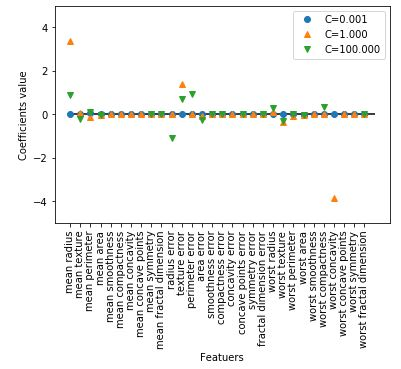

# 2. 지도 학습

지도 학습은 훈련데이터와 레이블이 있고 훈련을 통해서 완성된 모델로 새로 입력으로 들어온 데이터 포인트의 레이블을 예측하는 머신러닝 방법이다.


### 2.1 분류와 회귀

분류는 미래 정해져 있는 클래스 중에서 데이터 포인트에 맞는 레이블을 고르는 문제이다. 분류는 크게 두 가지 범주로 나눌 수 있는데 두 가지 레이블 중 하나를 고르는 **이진분류(Binary classification)** 과 세 가지 이상의 레이블 중 하나를 고르는 **다중분류(Multiclass classification)** 이다. 이진 분류에서 학습하고자 하는 대상을 **양성(Positive) 클래스** 라고 하고, 그 반대의 대상을 **음성(Negative) 클래스** 라고 한다. 컴퓨터 비전에서는 암 환자들의 MRI 등의 이미지를 보고 암인지 아닌지를 판별 할 수 있는데 이 경우에 이미지에 암 종양이 발견될 경우 양성 클래스, 아닐 경우 음성 클래스라고 할 수 있다. 다중 분류에서는 어떤 꽃의 이미지를 보여주고, 이 꽃이 어떤 꽃인지를 예측하는 모델을 만들 수 있다. 

회귀는 데이터 포인트의 특성를 고려하여 알맞는 **부동소수점수(Floating point value)** 를 찾아내는 문제이다. 대표적으로 어떤 사람의 학력, 집안 형편, 성별, 인종, 교육 수준, 주거지 등의 정보로 이 사람이 얼마만큼의 연봉을 받을 것인지를 예측하는 문제가 있고, 뉴스나 여러가지 웹 페이지에서 나타나는 단어의 빈도수를 체크하여 주가를 예측하는 문제도 있을 수 있다. 

분류와 회귀 문제를 구분하는 방법은 레이블이 **Continuous** 한지 **Discrete** 한지를 살펴보면 알 수 있다.


### 2.2 일반화, 과대적합, 과소적합


일반적으로 훈련데이터로 학습된 모델은 테스트 데이터에도 잘 맞을 것이라고 예상한다. 실제로 훈련데이터로 학습한 모델이 테스트 데이터에도 준수한 성적을 보일 때, 이 모델은 **일반화(Generalization)** 이 잘 되었다고 말할 수 있다. 그러나 훈련된 모델이 항상 일반화가 잘 되는 것은 아니다. 예를 들어서 어떤 동물이 곰인지 아닌지를 판단하는 분류기를 만들어 본다고 가정한다. 그런데 학습 데이터로 반달 가슴곰의 이미지만 입력데이터로 주입시킨다. 이 모델을 테스트 할 때, 반달 가슴곰의 이미지를 주입시키면 매우 뛰어난 성능을 보일 수 있겠지만 북극곰의 이미지를 넣었을때, 반달 가슴곰 모양의 석상 이미지를 주입시킬 때, 과연 곰인지 아닌지를 잘 판별 할 수 있을까. 이렇게 훈련 데이터의 특성만 기억하는 모델을 **과대적합(Overfitting)** 되었다고 말한다. 반대로 반달 가슴곰의 이미지를 아무리 넣어도 훈련과정에서 정확도가 나아지지 않는다. 이 때는 훈련 데이터를 점검하거나 모델의 개선이 필요한데, 이를 **과소적합(Underfitting)** 되었다고 이야기 한다. 과대적합인지 과소적합인지 아니면 일반화가 잘 되었는지를 판단하는 대표적인 방법 한 가지는 훈련 과정 간의 정확도나 손실 값을 확인 하는 것이다.


##### 2.2.1 모델 복잡도와 데이셋 크기의 관계


보통 데이셋의 특성이 다양하고 갯수가 많아질수록 **모델복잡도(Model capacity)** 가 커지기 마련이다. 실제로 과대적합의 경우, 중복없는 다양한 데이터를 더 모으는 것이 문제 해결에 도움이 된다. 과대 적합이 일어 났다면 모델을 조작하기 전에 데이터를 점검해보고 데이터의 양이 너무 적거나, 중복이 되었거나, 특성이 너무 적을 때, 다양한 데이터를 추가하면 성능 개선에 큰 도움이 된다. 과소 적합의 경우, 데이터 자체보다는 모델을 개선하는 방향이 더 도움이 된다.


### 2.3 지도 학습 알고리즘


##### 2.3.1 예제에 사용할 데이터셋


지도 학습 알고리즘에 사용될 예제 데이터 셋은 다음과 같다. 

- 이진 분류 데이터 셋

  

- 회귀 데이터 셋

  


(* 특성이 적은 데이터셋(저차원 데이터셋)에서 얻은 직관이 특성이 많은 데이터 셋(고차원 데이터셋)에서 그대로 유지되지 않을 수 있음.)


- scikit-learn의 위스콘신 유방암 데이터 셋

```python 
In: 
from sklearn.datasets import load_breast_cancer

cancer = load_breast_cancer()
print(f"cancer.keys(): {cancer.keys()}")
print(f"Data shape: {cancer.data.shape}")
target_number = {n: v for n, v in zip(cancer.target_names, np.bincount(cancer.target))}
print(f"The number of samples per class:\n{target_number}")
print(f"Features' name:\n{cancer.feature_names}")
```

```python 
Out:
cancer.keys(): dict_keys(['data', 'target', 'target_names', 'DESCR', 'feature_names', 'filename'])
Data shape: (569, 30)
The number of samples per class:
{'malignant': 212, 'benign': 357}
Features' name:
['mean radius' 'mean texture' 'mean perimeter' 'mean area'
 'mean smoothness' 'mean compactness' 'mean concavity'
 'mean concave points' 'mean symmetry' 'mean fractal dimension'
 'radius error' 'texture error' 'perimeter error' 'area error'
 'smoothness error' 'compactness error' 'concavity error'
 'concave points error' 'symmetry error' 'fractal dimension error'
 'worst radius' 'worst texture' 'worst perimeter' 'worst area'
 'worst smoothness' 'worst compactness' 'worst concavity'
 'worst concave points' 'worst symmetry' 'worst fractal dimension']    
```


- 보스턴 주택가격 데이터셋과 특성 공학을 거친 보스턴 주택 가격 데이터 셋

```python 
In:
from sklearn.datasets import load_boston

boston = load_boston()
print(f"Data shape: {boston.data.shape}")
# Has been gone through feature engineering
X, y = mglearn.datasets.load_extended_boston()
print(f"X.shape: {X.shape}")    
```

```python 
Out:
Data shape: (506, 13)
X.shape: (506, 104)    
```


##### 2.3.2 K-최근접 이웃


***K*-NN(*K*-Nearest Neighbors)** 알고리즘은 어떤 포인트 하나에 대하여 k개의 이웃을 찾아서 그 중에 가장 많은 레이블을 그 데이터 포인트의 레이블로 지정하는 알고리즘이다.


##### k-최근접 이웃 분류


- 이웃의 숫자가 1개일 때

  

- 이웃의 숫자가 3개일 때

  


실제로 scikit-learn에서 k-최근접 이웃 알고리즘을 적용하는 방법은 다음과 같다.


```python 
from sklearn.model_selection import train_test_split
from introduction_to_ml_with_python import mglearn

X, y = mglearn.datasets.make_forge()
X_train, X_test, y_train, y_test = train_test_split(X, y, random_state=0)
```

먼저 데이터를 훈련 세트와 테스트 세트로 나눈다.


```python 
In:
from sklearn.neighbors import KNeighborsClassifier

clf = KNeighborsClassifier(n_neighbors=3)    
```

scikit-learn에서 KNeighborsClassfier를 Import하고 이웃의 숫자를 지정한다.


```python 
In:
clf.fit(X_train, y_train)    
```

```python 
Out:
KNeighborsClassifier(algorithm='auto', leaf_size=30, metric='minkowski',
                     metric_params=None, n_jobs=None, n_neighbors=3, p=2,
                     weights='uniform')    
```

알고리즘 모델 객체의 fit메소드를 호출하면 입력으로 받은 데이터로 모델을 훈련시킨다. 여기서는 우리가 지정한 이웃의 숫자를 제외하고 기본적인 몇가지 매개변수들을 미리 셋팅이 되어 있음을 확인할 수 있다.


```python 
In:
print(f"Test set prediction: {clf.predict(X_test)}")    
```

```python 
Out:
Test set prediction: [1 0 1 0 1 0 0]    
```

테스트 데이터로 예측을 진행하고자 할 때는 알고리즘 모델 객체의 predict 메소드를 호출한다. 결과의 각 원소들은 예측 레이블을 뜻한다.


```python 
In:
print(f"Test set prediction score: {clf.score(X_test, y_test):.2f}")
```

```python 
Out:
Test set prediction score: 0.86
```

모델이 얼마나 잘 일반화 되었는지 확인하기 위해서 score 메소드를 호출할 수 있다.


##### KNeighborsClassifier 분석


다음은 이웃이 하나, 셋, 아홉  개일 때의 **결정 경계(Decision boundary)** 를 보여준다. 결정 경계란 클래스 별로 각 데이터 포인트가 속한 영역에 색을 칠했을 때 나뉘는 경계를 말한다.

```python 
In:
fig, axes = plt.subplots(1, 3, figsize=(10, 3))

for n_neighbors, ax in zip([3**i for i in range(3)], axes):
  clf = KNeighborsClassifier(n_neighbors=n_neighbors).fit(X, y)
  mglearn.plots.plot_2d_separator(clf, X, fill=True, eps=.5, ax=ax, alpha=.4)
  mglearn.discrete_scatter(X[:, 0], X[:, 1], y, ax=ax)
  ax.set_title(f"{n_neighbors} Neighbors")
  ax.set_xlabel("Feature 0")
  ax.set_ylabel("Feature 1")
axes[0].legend(loc=3)
```


위를 보면 이웃의 숫자가 늘어날수록 결정경계가 부드러워짐을 확인할 수 있다. 다시 말해서 이웃의 숫자가 늘어날수록 모델의 복잡도(과대적합할 확률)이 줄어들고 있음을 알 수 있다. 


```python 
In:
from sklearn.datasets import load_breast_cancer

cancer = load_breast_cancer()
X_train, X_test, y_train, y_test = train_test_split(cancer.data, cancer.target, stratify=cancer.target, random_state=66)
training_accuracy = []
test_accuracy = []
neighbors_settings = range(1, 11)

for n_neighbors in neighbors_settings:
  clf = KNeighborsClassifier(n_neighbors=n_neighbors)
  clf.fit(X_train, y_train)
  training_accuracy.append(clf.score(X_train, y_train))
  test_accuracy.append(clf.score(X_test, y_test))

plt.plot(neighbors_settings, training_accuracy, label="Train acc")
plt.plot(neighbors_settings, test_accuracy, label="Test acc")
plt.ylabel("Acc")
plt.xlabel("n_neighbors")
plt.legend()
```


이웃의 숫자가 매우 작을때는 과대적합이 일어나고 반대로 매우 많을 때는 과소적합이 일어난다. 따라서 적당한 수의 이웃을 설정하는 것이 중요하다.


##### k-최근접 이웃 회귀


k-최근접 이웃 알고리즘은 다음과 같이 회귀 분석에도 쓰일 수 있다.


- 이웃의 숫자가 1일 때

  

- 이웃의 숫자가 3일 때

  

여러개의 최근접 이웃을 사용하게 되면 이웃 간의 평균이 예측이 된다(KNeighborsRegression의 weights 매개변수가 'uniform'일 때는 np.mean 함수를 사용한 단순 평균을, 'distance'일 때는 거리를 고려한 가중치 평균을 계산한다).


scikit-learn에서 회귀를 위한 k-최근접 이웃 알고리즘은 KNeighborsRegressor에 구현되어 있다.

```python 
In:
from sklearn.neighbors import KNeighborsRegressor

X, y = mglearn.datasets.make_wave(n_samples=40)
X_train, X_test, y_train, y_test = train_test_split(X, y, random_state=0)
reg = KNeighborsRegressor(n_neighbors=3)
reg.fit(X_train, y_train)
```

```python 
Out:
KNeighborsRegressor(algorithm='auto', leaf_size=30, metric='minkowski',
                    metric_params=None, n_jobs=None, n_neighbors=3, p=2,
                    weights='uniform')
```


```python 
In:
print(f"Test set prediction:\n{reg.predict(X_test)}")
```

```python 
Out:
Test set prediction:
[-0.05396539  0.35686046  1.13671923 -1.89415682 -1.13881398 -1.63113382
  0.35686046  0.91241374 -0.44680446 -1.13881398]
```


```python 
In:
print(f"Test set prediction:\n{reg.predict(X_test)}")
```

```python 
Out:
Test set R^2: 0.83
```

마찬가지로 score 메소드를 통해서 모델을 평가 할 수 있는데 회귀에서는 R^2 값을 반환한다. R^2 값은 회귀 모델에서 예측의 적합 정도를 0과 1사이의 값으로 계산한 것인데, 1은 예측이 완벽한 것이고 0은 훈련 세트의 출력값의 평균으로만 예측하는 것이다.  y 값은 타깃 값이다.

$$ 
R^2 = 1- \frac{Σ(y -y(예측))^2}{Σ(y -y(평균))^2} 
$$


##### 장단점과 매개변수

KNeighbors 분류기의 주요 매개변수는 두 가지이다. 하나는 데이터 포인트의 이웃의 수이고 다른 하나는 데이터 포인트 간의 거리를 재는 방법이다. KNeighborsClassifier와 KNeighborsRegressor 객체를 생성할 때, metric 매개변수를 사용하여 거리 측정 방식을 변경 할 수 있다. 기본 값은 민코프스키 거리를 의미하는 "minkowski"이며 매개변수 p가 기본값 2일 때 유클리디안 거리와 같다.

KNeighbors의 장단점은 다음과 같다.

- 장점: 이해하기 쉽다, 모델을 빠르게 구축할 수 있다, 모델을 많이 조정하지 않아도 된다.
- 단점: 훈련 세트의 수가 많으면 느려진다, 데이터의 특성이 많으면 잘 동작하지 않는다(특히 특성 값 대두분이 0인 **희소 행렬(Sparse matrix)** )
- 주의: 이웃 간의 거리를 계산할때 범위가 작은 특성에 큰 영향을 받으므로 특성들이 같은 스케일을 갖도록 정규화 하는 것이 필요하다.


##### 2.3.3 선형 모델

선형 모델은 입력 특성에 대한 선형 함수를 만들어 예측을 수행한다.


##### 회귀의 선형 모델

일반적으로 회귀의 선형 모델을 위한 예측 함수는 다음과 같다.


$$ 
y(예측) = {w[0]}\times{x[0]}+{w[1]}\times{x[1]}+...+{w[p]}\times{x[p]}+b 
$$


x[0] ~ x[p]는 데이터 포인트의 특성을 나타내고 w[0] ~ w[p]와 b는 모델이 학습할 파라미터이다(모델이 학습하는 파라미터를 모델 파라미터, 사람이 설정해주어야 하는 파라미터를 **하이퍼 파라미터(Hyper parameter) 라고 한다 **). 이를 좌표 평면에서 보면 위의 식은 하나의 직선의 방적식이 되고 w는 기울기, b는 절편이 된다. 


KNeighborsRegressor와 비교했을 때, 데이터의 상세 정보를 모두 잃어 버린 것처럼 보일 수 있으나 어떤 데이터든지 그 추세를 구하고 싶다면 훌륭한 선택이 될 수 있다.


##### 선형 회귀(최소제곱법)

**선형 회귀(Linear regression)** 혹은 **최소 제곱법(Ordinary least squares)** 은 예측 값과 타겟 y 값 사이의 **평균제곱오차(Mean squared error)** 을 최소화 하는 모델 파라미터 w와 절편 b를 찾는다. 모델 생성 시의 설정해야하는 매개변수가 없는게 장점이지만 복델의 복잡도를 제어할 방법이 없다는 것이 단점이다. 


```python 
In:
from sklearn.linear_model import LinearRegression
from sklearn.model_selection import train_test_split

X, y = mglearn.datasets.make_wave(n_samples=60)
X_train, X_test, y_train, y_test = train_test_split(X, y, random_state=42)

lr = LinearRegression().fit(X_train, y_train)

print(f"lr.coef_: {lr.coef_}")
print(f"lr.intercept_: {lr.intercept_}")
```

```python 
Out:
lr.coef_: [0.39390555]
lr.intercept_: -0.031804343026759746
```

기울기 파라미터(w)는 **가중치(weight)** 혹은 **계수(coefficient)** 라고 하며 LinearRegression 객체의 coef_ 속성에 저장되어 있다. 편향 파라미터(b)는 **절편(intercept)** 이라고 하며 intercept_ 속성에 저장되어 있다(속성 뒤에 _는 scikit-learn에서 학습에 의해서 유도되는 특성이다.)


학습한 모델의 훈련 세트와 테스트 세트의 성능은 다음과 같다.

``````python
In:
print(f"Train set score: {lr.score(X_train, y_train):.2f}")
print(f"Test set score: {lr.score(X_test, y_test):.2f}")
``````

```python 
Out:
Train set score: 0.67
Test set score: 0.66
```

R^2 값이 두 세트 모두에서 그리 좋지 않기 때문에 과소적합이 발생했음을 알 수 있다. 일반적으로 저차원 데이터셋에서는 과대적합을 걱정할 필요가 없지만 고차원 데이터셋에서는 모델의 복잡도가 증가하여 과대적합할 가능성이 높아진다.


다음은 보스턴 주택가격 데이터셋으로 테스트 하는 코드이다. 이 확장된 보스턴 주택가격 세트에는 샘플이 506개가 있고 특성이 인위적으로 합성된 것을 합쳐서 105개가 있다. 

```python 
In:
X, y = mglearn.datasets.load_extended_boston()

X_train, X_test, y_train, y_test = train_test_split(X, y, random_state=0)
lr = LinearRegression().fit(X_train, y_train)

print(f"Train set score: {lr.score(X_train, y_train):.2f}")
print(f"Test set score: {lr.score(X_test, y_test):.2f}")
```

```python 
Out:
Train set score: 0.95
Test set score: 0.61
```

위에서 보는 것처럼 특성이 많을수록 원래의 선형회귀 모델은 쉽게 과대적합 함을 알 수 있다.


##### 릿지 회귀

**릿지(Ridge)** 회귀도 선형 모델이므로 최소적합법에서 사용한 것과 같은 예측 함수를 사용한다. 기본 선형 모델과의 차이점은 가중치의 절댓값을 가능한 작게(w의 모든 원소가 0에 가깝게) 만들어 모든 특성이 출력에 주는 영향을 최소한으로 만든다는 것이다(기울기를 작게). 이런 제약을 **규제(Regularization)** 이라고 한다. 규제는 과대적합이 일어나지 않도록 모델을 제한하는 것이 목적이다. 릿지 회귀에서 사용하는 규제 방식을 L2 규제라고 한다.


```python 
In:
from sklearn.linear_model import Ridge

ridge = Ridge().fit(X_train, y_train)
print(f"Train set score: {ridge.score(X_train, y_train):.2f}")
print(f"Test set score: {ridge.score(X_test, y_test):.2f}")
```

```python 
Out:
Train set score: 0.89
Test set score: 0.75
```

결과는 LinearRegression보다 훈련 데이터의 성능은 나빠졌지만 테스트 데이터에서의 성능은 좋아졌다. 즉, 과대 적합이 어느정도 해소되었음을 확인할 수 있다. 


Ridge에서 alpha 매개변수로 규제를 어느정도로 할 지 정할 수 있다. alpha의 값이 높으면 더 강하게 규제(가중치 w 값들이 좀 더 0에 가까워짐)하고 반대로 alpha 값이 낮으면 비교적 약하게 규제(가중치 w 값들이 0에서 멀어짐)한다. 기본 값은 1.0이다.

```python 
In:
ridge10 = Ridge(alpha=10).fit(X_train, y_train)
print(f"Train set score: {ridge10.score(X_train, y_train):.2f}")
print(f"Test set score: {ridge10.score(X_test, y_test):.2f}")
```

```python 
Out:
Train set score: 0.79
Test set score: 0.64
```

```python 
In: 
ridge01 = Ridge(alpha=.1).fit(X_train, y_train)
print(f"Train set score: {ridge01.score(X_train, y_train):.2f}")
print(f"Test set score: {ridge01.score(X_test, y_test):.2f}")
```

```python 
Out:
Train set score: 0.93
Test set score: 0.77
```


alpha 값에 따라 모델의 coef_ 속성, 즉 가중치들이 어떻게 달라지는 보면 다음과 같다.

```python 
plt.plot(ridge10.coef_, "^", label="Ridge alpha=10")
plt.plot(ridge.coef_, "^", label="Ridge alpha=1")
plt.plot(ridge01.coef_, "^", label="Ridge alpha=0.1")

plt.plot(lr.coef_, 'o', label="LinearRegression")
plt.xlabel("Feature index")
plt.ylabel("Feature value")
plt.hlines(0, 0, len(lr.coef_))
plt.ylim(-25, 25)
plt.legend(loc='best')
```


그림을 보면 alpha 값이 작을수록 전체적으로 0에 가깝게 분포하는 것을 확인할 수 있다.


다음은 alph를 1로 적용해서 LinearRegression과 Ridge의 데이터셋의 크기에 따른 모델의 성능 변화를 나타낸 **학습 곡선(Learning curve)** 이다. 


점선은 훈련데이터이고 실선은 테스트 데이터에서의 성능이다. 전체적으로 훈련데이터에서의 성능이 테스트 데이터에서의 성능보다 낫고 데이터가 적을 때, LinearRegression의 성능이 매우 좋지 않다가 데이터가 많을 때, Ridge의 성능을 따라 잡는 것을 확인 할 수 있다. 여기서 알 수 있는 사실은 다음과 같다.

- 데이터가 많을 때는 규제의 영향력이 약해진다.
- 데이터가 많아질수록 과대적합하기 어려워진다.


##### 라쏘

릿지 회귀에서와 같이 **라쏘(Lasso)** 에서도 계수를 0에 가깝게 만든다. 하지만 방식이 다르며 L1규제라고 부른다. 


L1 규제의 결과로 라쏘에서는 어떤 계수가 0이 될수도 있다. 즉 모델에서 완전히 제외되는 특성이 생긴다는 뜻이다. 


```python 
In:
from sklearn.linear_model import Lasso

lasso = Lasso().fit(X_train, y_train)
print(f"Train set score: {lasso.score(X_train, y_train):.2f}")
print(f"Test set score: {lasso.score(X_test, y_test):.2f}")
print(f"The number of features used : {np.sum(lasso.coef_ != 0)}")
```

```python 
Out:
Train set score: 0.29
Test set score: 0.21
The number of features used : 4
```

alpha가 기본값인 1일 때는 과소적합이 발생했으며 105개의 보스턴 데이터의 특성 중에서 4개만 사용된것을 확인 할 수 있다.


라쏘에서 alpha 값을 조정하기 위해서는 max_iter(반복 실행하는 최대 횟수)의 숫자를 늘려야 한다. Lasso는 L1, L2 규제를 함꼐 쓰는 **엘라스틱넷(Elastic-Net)** 방식에서 L2 규제가 빠진 것이다. 이는 한 특성씩 좌표축을 따라 최적화하는 좌표 하강법(Cordinate descent)방식을 사용하며 학습 과정이 반복적으로 진행되면서 최적의 값을 찾아 가게 된다. alpha 값을 줄이면 가장 낮은 오차를 찾아가는 이 반복 횟수가 늘어나게 된다. 

```python 
In:
lasso001 = Lasso(alpha=0.01, max_iter=100000).fit(X_train, y_train)
print(lasso001.n_iter_)
print(f"Train set score: {lasso001.score(X_train, y_train):.2f}")
print(f"Test set score: {lasso001.score(X_test, y_test):.2f}")
print(f"The number of features used : {np.sum(lasso001.coef_ != 0)}")
```

```python 
Out:
1886
Train set score: 0.90
Test set score: 0.77
The number of features used : 33
```

```python 
In:
lasso00001 = Lasso(alpha=0.0001, max_iter=100000).fit(X_train, y_train)
print(lasso00001.n_iter_)
print(f"Train set score: {lasso00001.score(X_train, y_train):.2f}")
print(f"Test set score: {lasso00001.score(X_test, y_test):.2f}")
print(f"The number of features used : {np.sum(lasso00001.coef_ != 0)}")
```

```python 
Out:
41420
Train set score: 0.95
Test set score: 0.64
The number of features used : 96
```

```python 
plt.plot(lasso.coef_, "s", label="Lasso alpha=1")
plt.plot(lasso001.coef_, "^", label="Lasso alpha=0.01")
plt.plot(lasso00001.coef_, "v", label="Lasso alpha=0.0001")

plt.plot(ridge01.coef_, 'o', label="Ridge alpha=0.1")
plt.xlabel("Feature index")
plt.ylabel("Feature value")
plt.ylim(-25, 25)
plt.legend(loc='best')
```


alpha가 0.01때까지 대부분의 특성이 0이 되는 분포를 얻게 되고 0.0001이 되면 대부분이 0이 아닌 큰 값을 가져 규제 받지 않는 모델이 됨을 확인할 수 있다. alpha=0.1인 Ridge 모델은 alpha=0.01인 라쏘 모델과 성능이 비슷하나 Ridge에서는 어떤 계수도 0이 되지 않는다. 

Lasso과 Ridge의 페널티를 결합한 ElasticNet도 있으나 L1 규제와 L2규제를 위한 매개변수를 조정해야 한다. l1_ratio매개변수를 0~1 사이의 값을 지정하여 L1규제의 비율을 정하면 L2 규제의 비율은 1-l1_ration가 되는 방식이다.


##### 분류용 선형 모델

선형 모델의 이진 분류에서 예측을 위한 방정식은 다음과 같다.

y_hat = w[0]x[0]+w[1]x[1]+...+w[p]*x[p]+b > 0

언뜻 보기에 선형 회귀와 비슷하나 특성들의 가중치 합을 그냥 이용하는 대신 임계치 0과 비교한다. 0보다 작으면 클래스를 -1로, 크면 +1로 예측한다. 

회귀용 선형 모델에서는 출력 y_hat이 특성의 선형 함수였다면, 분류형 선형 모델에서는 결정 경계가 입력의 선형 함수이다. 

가장 널리 알려진 두 개의 선형 분류 알고리즘은 다음과 같다.

- linear_model.LogisticRegression에 구현된 **로지스틱 회귀(Logistic regression)** 
- svm.LinearSVC(Support vector classifier)에 구현된 **서포트 벡터 머신(Support Vector Machine)** 

```python 
In:
from sklearn.linear_model import LogisticRegression
from sklearn.svm import LinearSVC

X, y = mglearn.datasets.make_forge()
fig, axes = plt.subplots(1, 2, figsize=(10, 3))
for model, ax in zip([LinearSVC(), LogisticRegression()], axes):
  clf = model.fit(X, y)
  mglearn.plots.plot_2d_separator(clf, X, fill=False, eps=.5, ax=ax, alpha=.7)
  mglearn.discrete_scatter(X[:, 0], X[:, 1], y, ax=ax)
  ax.set_title(f"{clf.__class__.__name__}")
  ax.set_xlabel("Feature 0")
  ax.set_ylabel("Feature 1")
axes[0].legend()
```


두 모델은 회귀에서 본 Ridge와 마찬가지로 L2 규제를 사용한다.


LogisticRegression과 LinearSVC에서 규제의 강도를 결정하는 매개변수는 C이다. C의 값이 높아지면 규제가 감소하여 과대적합이 일어날 확률이 늘어나고 C값을 낮추면 계수 백터(w)의 값을 0으로 가깝게 만들어 과대적합이 일어날 확률을 줄인다.


유방암 데이터로 LogisticRegression 모델을 구축한 결과는 다음과 같다.

```python 
In:
from sklearn.datasets import load_breast_cancer
from sklearn.model_selection import train_test_split

cancer = load_breast_cancer()
X_train, X_test, y_train, y_test = train_test_split(cancer.data, cancer.target, stratify=cancer.target, random_state=42)
logreg = LogisticRegression(solver='liblinear').fit(X_train, y_train)
print(f"{logreg.score(X_train, y_train):.3f}")
print(f"{logreg.score(X_test, y_test):.3f}")
```

```python 
Out:
0.953
0.958
```

```python 
In:
logreg100 = LogisticRegression(C=100, solver='liblinear').fit(X_train, y_train)
print(f"{logreg100.score(X_train, y_train):.3f}")
print(f"{logreg100.score(X_test, y_test):.3f}")
```

```python 
Out:
0.967
0.965
```

```python 
In:
logreg001 = LogisticRegression(C=.01, solver='liblinear').fit(X_train, y_train)
print(f"{logreg001.score(X_train, y_train):.3f}")
print(f"{logreg001.score(X_test, y_test):.3f}")
```

```python 
Out:
0.934
0.930
```

```python 
plt.plot(logreg.coef_.T, "o", label="C=1")
plt.plot(logreg100.coef_.T, "^", label="C=100")
plt.plot(logreg001.coef_.T, "v", label="C=0.001")
plt.xticks(range(cancer.data.shape[1]), cancer.feature_names, rotation=90)
plt.hlines(0, 0, cancer.data.shape[1])
plt.ylim(-5, 5)
plt.xlabel("Features")
plt.ylabel("Coefficients value")
plt.legend()
```


다음은 일부 특성만 사용하게 되는 L1규제를 사용했을때의 분류 정확도와 계수 그래프이다.

```python 
In:
for C, marker in zip([0.001, 1, 100], ['o', '^', 'v']):
  lr_l1 = LogisticRegression(C=C, penalty='l1', solver='liblinear').fit(X_train , y_train)
  print(f"C={C:.3f}, Train set acc: {lr_l1.score(X_train ,y_train):.2f}")
  print(f"C={C:.3f}, Test set acc: {lr_l1.score(X_test ,y_test):.2f}")
  plt.plot(lr_l1.coef_.T, marker, label=f"C={C:.3f}")

plt.xticks(range(cancer.data.shape[1]), cancer.feature_names, rotation=90)
plt.hlines(0, 0, cancer.data.shape[1])
plt.xlabel("Featuers")
plt.ylabel("Coefficients value")

plt.ylim(-5, 5)
plt.legend(loc="best")
```



회귀에서와 같이 모델들 간의 주요 차이는 규제에서 모든 특성을 이용할지 일부 특성만을 이용할지 결정하는 penalty 매개변수이다.


##### 다중 클래스 분류용 선형 모델

로지스틱 회귀를 제외하고 많은 선형 분류 모델은 기본적으로 다중 클래스 분류를 지원하지 않는다. 

이진 분류 알고리즘을 다중 분류 알고리즘으로 확장하기 위한 보편적인 기법은 **일대다(one_vs._rest)** 방법이다. 일대다 방식은 각 클래스를 다른 모든 클래스와 구분하도록 이진 분류 모델을 학습시켜서 결국 클래스의 수만큼 이진 분류 모델이 만들어지게 한다. 예측을 할 때는 모든 이진 분류기가 작동하여 그 중 가장 높은 점수를 내는 분류기의 클래스를 예측 값으로 한다.

클래스별 이진 분류기를 만들면 각 클래스가 계수 백터(w)와 절편(b)를 하나씪 갖게 되는데, 다음 공식의 결과값이 가장 높은 클래스가 해당 데이터 포인트의 클래스 레이블로 할당된다.

​                                                       w[0]x[0]+w[1]x[1]+...+w[p]*x[p]+b

다중 클래스 로지스틱 회귀를 위한 공식은 다음과 같으며 마찬가지로 클래스마다 하나의 계수 벡터와 절편을 만들고 예측 방법도 비슷하다.


(i번째 데이터 포인트 Xi의 출력 Yi가 K-1이 될 확률은 K개의 클래스에 대한 각 계수 W를 데이터 포인트에 곱하여 지수함수를 적용한 합으로 클래스 K-1에 대한 값을 나누어 계산한다. )


```python 
from sklearn.datasets import make_blobs

X, y = make_blobs(random_state=42)
mglearn.discrete_scatter(X[:, 0], X[:, 1], y)
plt.xlabel('Feature 0')
plt.ylabel('Feature 1')
plt.legend(['Class 0', 'Class 1', 'Class 2'])
```


```python 
In:
linear_svm = LinearSVC().fit(X, y)
print("The shape of coefficient array: ", linear_svm.coef_.shape)
print("The shape of biase array: ", linear_svm.intercept_.shape)
```

```python 
Out:
The shape of coefficient array:  (3, 2)
The shape of biase array:  (3,)
```

```python 
mglearn.discrete_scatter(X[:, 0], X[:, 1], y)
line = np.linspace(-15, 15)
for coef, intercept, color in zip(linear_svm.coef_, linear_svm.intercept_, mglearn.cm3.colors):
  plt.plot(line, -(line * coef[0] + intercept) / coef[1], c = color)
plt.ylim(-10, 15)
plt.xlim(-10, 8)
plt.xlabel('Feature 0')
plt.ylabel('Feature 1')
plt.legend(['Class 0', 'Class 1', 'Class 2', 'Class 0 boundary', 'Class 1 boundary', 'Class 2 boundary'], loc=(1.01, 0.3))
```


```python 
mglearn.plots.plot_2d_classification(linear_svm, X, fill=True, alpha=.7)
mglearn.discrete_scatter(X[:, 0], X[:, 1], y)
line = np.linspace(-15, 15)
for coef, intercept, color in zip(linear_svm.coef_, linear_svm.intercept_, mglearn.cm3.colors):
  plt.plot(line, -(line * coef[0] + intercept) / coef[1], c=color)
plt.legend(['Class 0', 'Class 1', 'Class 2', 'Class 0 boundary', 'Class 1 boundary', 'Class 2 boundary'], loc=(1.01, 0.3))
plt.xlabel('Feature 0')
plt.ylabel('Feature 1')
```


##### 장단점과 매개변수

선형모델에서의 주요 매개변수는 회귀 모델에서는 alpha이고 LinearSVC와 LogisticRegression에서는 C이다. alpha값이 클수록, C값이 작을수록 모델이 단순해진다. 보통 C와 alpha는 로그 스케일(자릿수가 바뀌도록 10배이상)로 최적치를 정한다.  중요 특성이 많지 않다고 생각하면 L1 규제를,  그렇지 않으면 L2 규제를 사용한다. L1 규제를 사용하면 중요 특성이 무엇이고 그 효과가 어느 정도인지 설명하기 쉽다.

선형 모델은 학습 속도가 빠르고 예측이 빠르다. 매우 큰 데이터셋과 희소한 데이터셋에서도 비교적 잘 작동하는데, 대용량 데이터의 경우 보다 빨리 처리할 수있도록 SOLVER='sag(Stochastic Average Gradient descent-경사하강법과 비슷하나 반복이 진행될때 이전에 구한 모든 경사의 평균을 사용하여 계수를 갱신한다)' 옵션을 주는것을 고려할만 하다. 다른 대안으로는 선형모델의 대용량 처리버전으로 구현된 SGDClassifier와 SGDRegressor를 사용할 수 있다.

선형 모델의 다른 장점은 앞에서 본 여러가지 공식으로 예측이 어떻게 만들어지는지 쉽게 이해할 수 있다는 것이다. 그러나 특성들이 서로 깊게 연관되어 있을때는 분석하기가 매우 어려울 수 있다.

선형 모델은 샘플에 비해 특성이 많을 때 잘 작동한다. 그러나 저차원의 데이터셋에서는 다른 모델들의 일반화 성능이 좋다.


##### 2.3.4 나이브 베이즈 분류기

**나이브 베이즈(Naive bayes)** 분류기는 선형 모델과 매우 유사하나. LogisticRegression 혹은 LinearSVC 같은 선형 분류기보다 훈련 속도가 빠르지만 일반화 성능이 조금 떨어진다.

나이브 베이브 분류기는 각 특성을 개별로 취급하여 파라미터를 학습하고 각 특성에서 클래스별 통계를 단순하게 취합한다.

scikit-learn에 구현된 나이브 베이즈 분류기는 다음과 같다.

- GaussianNB - 연속적인 데이터에 적용. 클래스별로 각 특성의 표준편차와 평균을 저장하고 예측 시에는 데이터 포인트를 클래스의 통계값과 비교하여 가장 잘 맞는 클래스를 예측값으로 한다.
- BernoulliNB - 이진 데이터에 적용. 각 클래스의 특성 중 0이 아닌 것이 몇개인지 센다.
- MultinomialNB - 카운트 데이터(예를 들어 문장에 나타난 단어의 횟수)에 적용. 클래스별 특성의 평균을 계산하고 예측할 때는 GaussianNB와 유사하다.

BernoulliNB, MultinomialNB은 대부분 텍스트 데이터를 분류할 때 사용한다. 예측 공식이 선형모델과 같으나 coef의 경우 기울기가 아니라 특성 카운트 수를 로그 변환한 형태이고 intercept는 클래스 카운트 수를 로그 변환한 형태이다. 


##### 장단점과 매개변수

MultinomialNB와 BernoulliNB는 모델의 복잡도를 조절하는 alpha 매개변수 하나를 가지고 있는데 alpha가 주어지면 모든 특성에 양의 값을 가진 가상의 데이터 포인트를 alpha 갯수만큼 추가한다. 즉 alpha가 크면 모델의 복잡도가 낮아지고 과적합 확률을 줄인다. alpha 값이 성능 향상에 크게 기여하지는 않으나 어느정도 정확도를 개선하는데 도움을 줄 수 있다. 

GaussianNB은 주로 고차원인 데이터셋에 사용하고 다른 두 모델은 텍스트 같은 희소한 데이터를 카운트하는데 사용된다. 0이 아닌 특성이 비교적 많은 데이터 세트에서는 MultinomailNB가 BernoulliNB보다 성능이 높다.

나이브 베이즈 모델과 선형 모델은 상당히 유사하기 때문에 장단점도 비슷하다. 훈련과 예측 속도가 빠르고 훈련과정을 이해하기 쉽다. 희소한 고차원 데이터에서 잘 작동하고 매개변수에 민감하지 않다. 선형 모델로 학습 시간이 오래 걸리는 매우 큰 데이터 세트에 나이브 베이즈 모델을 시도해 볼만 하다.
