# 3. 비지도 학습과 데이터 전처리

**비지도 학습(Unsupervised learning)** 은 출력 값이나 정보 없이 학습 알고리즘을 가르쳐야 하는 모든 종류의 머신러닝이다. 즉, 모델은 입력 데이터만으로 데이터에서 지식을 추출할 수 있어야 한다.


### 3.1 비지도 학습의 종류

**비지도 변환(Unsupervised transformation)** 은 데이터를 새롭게 표현하여 원래보다 쉽게 해석할 수 있도록 만드는 알고리즘이다. 가장 널리 사용되는 분야는 고차원 데이터 중에 필요한 특징을 포함한 채로 특성의 수를 줄이는 **차원 축소(Dimensionality reduction)** 이다. 비지도 변환으로 소셜 미디어 등의 문서에서 이야기하는 주제들이 무엇인지 파악할 수 있는 단위나 성분을 찾을 수도 있다. 

**군집 알고리즘(Clustering)** 은 데이터를 비슷한 그룹으로 묶는 것이다. 소셜 미디어 사이트에서의 사진을 같은 사람의 얼굴 이미지로 그룹화 하는 등의 일에 사용된다.


### 3.2 비지도 학습의 도전 과제

보통 비지도 학습에서 가장 어려운 일은 알고리즘이 뭔가 유용한 것을 학습했는지에 대한 평가이다.  레이블이 없기 때문에 알고리즘에게 우리가 원하는 것을 알려줄 방법이 없다. 비지도 학습의 결과를 평가하위해서 직접 눈으로 확인하는 것이 좋은 때가 많다. 이런 이유로 비지도 학습 알고리즘은 **탐색적 분석 (EDA, Exploratory data analysis)** 단계에서 많이 사용한다. 그리고 지도 학습의 전처리 단계에서도 사용되는데 실제로 비지도 학습의 결과로 새롭게 표현된 데이터를 사용하면 지도학습의 정확도가 좋아지기도 한다. 


### 3.3 데이터 전처리와 스케일 조정

지도학습에서의 신경망과 SVM 같은 알고리즘은 데이터 스케일에 매우 민감하므로 조정이 필요하다.

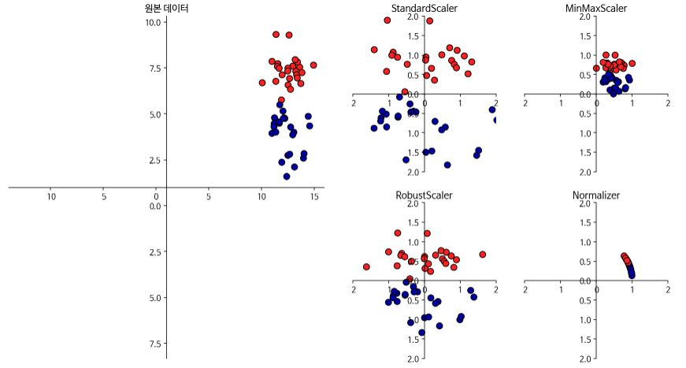

1. StandardScaler는 각 특성의 평균을 0, 분산으로 1로 변경하여 모든 특성이 같은 크기를 가지게 한다. 그러나 각 특성의 최솟값과 최댓값의 크기를 제한하지는 않는다(x - x_bar / σ, 여기서 x_bar는 평균,  σ는 분산)
2. RobustScaler는 특성들이 같은 스케일을 갖는 다는 점에서는 1번과 유사하나 평균과 분산 대신 중간 값(Median)과 사분위 값(Quartile)을 사용한다. 이런 방식 때문에 **이상치(Outlier)** 에 큰 영향을 받지 않는다(x - q2 / q3 - q1, 여기서 qi는 i사분위 값).
3. MinMaxScaler는 모든 특성이 정확하게 0과 1 사이에 위치하도록 데이터를 변경한다(x - x_min / x_max - x_min, 여기서 x_min은 최솟값, x_max는 최댓값).
4. Normalizer는 특성 벡터의 유클리디안 길이가 1이 되도록 데이터 포인트를 조정한다. Normalizer의 norm 매개변수는 l1, l2, max 세가 옵션을 제공하며 유클리디안 거리를 의미하는 l2가 기본 값이다. 앞의 3가지 방식에서는 각 열(특성)의 통계치를 이용한다면 Normalizer는 행(데이터 포인트)마다 각기 정규화된다. 다른말로 하면 2차원에서는 지름이 1인 원, 3차원에서는 지름이 1인 구에 데이터 포인트를 사영(Projection)한다. 이는 특성 벡터의 길이와 상관 없이 데이터의 방향 또는 각도가 중요할 때 많이 사용한다.


##### 3.3.2 데이터 변환 적용하기

sklearn의 유방암 데이터를 MinMaxScaler를 사용하여 전처리한 결과는 다음과 같다.

```python 
In:
from sklearn.datasets import load_breast_cancer
from sklearn.model_selection import train_test_split

cancer = load_breast_cancer()
X_train, X_test, y_train, y_test = train_test_split(cancer.data, cancer.target, random_state=1)
print(X_train.shape, X_test.shape)
```

```python 
Out:
(426, 30) (143, 30)
```

```python 
In:
from sklearn.preprocessing import MinMaxScaler

scaler = MinMaxScaler()
scaler.fit(X_train)
```

```python 
Out:
MinMaxScaler(copy=True, feature_range=(0, 1))
```

```python 
In:
X_train_scaled = scaler.transform(X_train)
print(f"변환된 후 크기: {X_train_scaled.shape}")
print(f"스케일 조정 전 특성별 최솟값:")
print(np.array(list(map(lambda x:f"{x:.3f}", X_train.min(axis=0))), dtype="float"))
print(f"스케일 조정 전 특성별 최댓값:")
print(np.array(list(map(lambda x:f"{x:.3f}", X_train.max(axis=0))), dtype="float"))
print(f"스케일 조정 후 특성별 최솟값:\n {X_train_scaled.min(axis=0)}")
print(f"스케일 조정 후 특성별 최댓값:\n {X_train_scaled.max(axis=0)}")
```

```python 
In:
변환된 후 크기: (426, 30)
스케일 조정 전 특성별 최솟값:
[6.981e+00 9.710e+00 4.379e+01 1.435e+02 5.300e-02 1.900e-02 0.000e+00
 0.000e+00 1.060e-01 5.000e-02 1.150e-01 3.600e-01 7.570e-01 6.802e+00
 2.000e-03 2.000e-03 0.000e+00 0.000e+00 1.000e-02 1.000e-03 7.930e+00
 1.202e+01 5.041e+01 1.852e+02 7.100e-02 2.700e-02 0.000e+00 0.000e+00
 1.570e-01 5.500e-02]
스케일 조정 전 특성별 최댓값:
[2.811e+01 3.928e+01 1.885e+02 2.501e+03 1.630e-01 2.870e-01 4.270e-01
 2.010e-01 3.040e-01 9.600e-02 2.873e+00 4.885e+00 2.198e+01 5.422e+02
 3.100e-02 1.350e-01 3.960e-01 5.300e-02 6.100e-02 3.000e-02 3.604e+01
 4.954e+01 2.512e+02 4.254e+03 2.230e-01 9.380e-01 1.170e+00 2.910e-01
 5.770e-01 1.490e-01]
스케일 조정 후 특성별 최솟값:
 [0. 0. 0. 0. 0. 0. 0. 0. 0. 0. 0. 0. 0. 0. 0. 0. 0. 0. 0. 0. 0. 0. 0. 0.
 0. 0. 0. 0. 0. 0.]
스케일 조정 후 특성별 최댓값:
 [1. 1. 1. 1. 1. 1. 1. 1. 1. 1. 1. 1. 1. 1. 1. 1. 1. 1. 1. 1. 1. 1. 1. 1.
 1. 1. 1. 1. 1. 1.]
```

```python 
In:
X_test_scaled = scaler.transform(X_test)
print(f"스케일 조정 후 특성별 최솟값:")
print(np.array(list(map(lambda x:f"{x:.3f}", X_test_scaled.min(axis=0))), dtype="float"))
print(f"스케일 조정 후 특성별 최댓값:")
print(np.array(list(map(lambda x:f"{x:.3f}", X_test_scaled.max(axis=0))), dtype="float"))
```

```python 
Out:
스케일 조정 후 특성별 최솟값:
[ 0.034  0.023  0.031  0.011  0.141  0.044  0.     0.     0.154 -0.006
 -0.001  0.006  0.004  0.001  0.039  0.011  0.     0.    -0.032  0.007
  0.027  0.058  0.02   0.009  0.109  0.026  0.     0.    -0.    -0.002]
스케일 조정 후 특성별 최댓값:
[0.958 0.815 0.956 0.894 0.811 1.22  0.88  0.933 0.932 1.037 0.427 0.498
 0.441 0.284 0.487 0.739 0.767 0.629 1.337 0.391 0.896 0.793 0.849 0.745
 0.915 1.132 1.07  0.924 1.205 1.631]
```

참고로 테스트 데이터를 조정할 때는 훈련 데이터의 통계치를 사용해야 한다. 


##### 3.3.3 훈련 데이터와 테스트 데이터의 스케일을 같은 방법으로 조정하기

```python 
from sklearn.datasets import make_blobs

X, _ = make_blobs(n_samples=50, centers=5, random_state=4, cluster_std=2)
X_train, X_test = train_test_split(X, random_state=5, test_size=.1)

fig, axes = plt.subplots(1, 3, figsize=(13, 4))
axes[0].scatter(X_train[:, 0], X_train[:, 1], c=mglearn.cm2(0), label="훈련 세트", s =60)
axes[0].scatter(X_test[:, 0], X_test[:, 1],marker='^', c=mglearn.cm2(1), label="테스트 세트", s =60)
axes[0].legend(loc='upper left')
axes[0].set_title("원본 데이터")

scaler = MinMaxScaler()
scaler.fit(X_train)
X_train_scaled = scaler.transform(X_train)
X_test_scaled = scaler.transform(X_test)

axes[1].scatter(X_train_scaled[:, 0], X_train_scaled[:, 1], c=mglearn.cm2(0), label="훈련 세트", s =60)
axes[1].scatter(X_test_scaled[:, 0], X_test_scaled[:, 1],marker='^', c=mglearn.cm2(1), label="테스트 세트", s =60)
axes[1].set_title("스케일 조정된 데이터")

test_scaler = MinMaxScaler()
test_scaler.fit(X_test)
X_test_scaled_badly = test_scaler.transform(X_test)

axes[2].scatter(X_train_scaled[:, 0], X_train_scaled[:, 1], c=mglearn.cm2(0), label="훈련 세트", s =60)
axes[2].scatter(X_test_scaled_badly[:, 0], X_test_scaled_badly[:, 1],marker='^', c=mglearn.cm2(1), label="테스트 세트", s =60)
axes[2].set_title("잘못 조정된 데이터")

for ax in axes:
  ax.set_xlabel("특성 0")
  ax.set_ylabel("특성 1")
```


위와 같이 테스트 데이터의 통계치를 사용하여 전처리 했을 경우, 데이터 분포가 달라져 버리는 결과를 초래할 수 있다. 또한 훈련과 테스트 데이터를 분리하기 전에 합쳤을 때의 통계치를 사용해도 문제가 되는데, 그 이유는 모델에 테스트 데이터에 대한 **정보 유출(Information leak)** 이 발생할 수 있기 때문이다.


#####  3.3.4 지도 학습에서 데이터 전처리 효과

```python 
In:
from sklearn.svm import SVC

X_train , X_test, y_train, y_test = train_test_split(cancer.data, cancer.target, random_state=0)
svm = SVC(C=100)
svm.fit(X_train, y_train)
print(f"테스트 세트 정확도: {svm.score(X_test, y_test):.2f}")
```

```python 
Out:
테스트 세트 정확도: 0.94
```

```python 
In:
scaler = MinMaxScaler()
scaler.fit(X_train)
X_train_scaled = scaler.transform(X_train)
X_test_sacled = scaler.transform(X_test)

svm.fit(X_train_scaled, y_train)

print(f"스케일 조정된 테스트 세트의 정확도: {svm.score(X_test_sacled, y_test):.2f}")
```

```python 
Out:
스케일 조정된 테스트 세트의 정확도: 0.97
```

```python 
In:
from sklearn.preprocessing import StandardScaler

scaler = StandardScaler()
scaler.fit(X_train)
X_train_scaled = scaler.transform(X_train)
X_test_scaled = scaler.transform(X_test)

svm.fit(X_train_scaled, y_train)

print(f"SVM 테스트 정확도: {svm.score(X_test_sacled, y_test):.2f}")
```

```python 
Out:
SVM 테스트 정확도: 0.37
```


### 3.4 차원 축소, 특성 추출, 매니폴드 학습

비지도 학습을 이용해 데이터를 변환 시키는 가장 일반적인 이유는 시각화, 압축, 정보가 더 잘 드러나는 표현을 찾기 위함이다.


##### 3.4.1 주성분 분석(PCA)

**주성분 분석(PCA, Principal component analysis)** 는 특성들이 통계적으로 상관관계가 없도록 데이터 셋을 회전 시키는 기술이다. 회전한 뒤에는 종종 새로운 특성 중 중요한 일부만 선택되기도 한다.

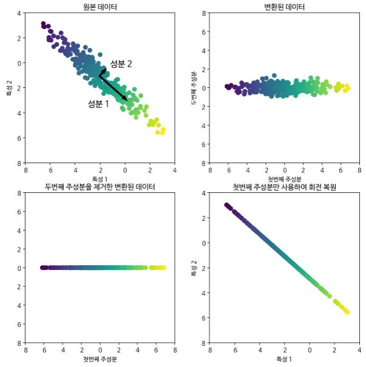

첫번째 그래프를 보면 주 성분 분석이 성분 1이라고 하는 분산이 가장 큰 방향을 찾은 것을 볼 수 있다. 이 방향(혹은 벡터)이 데이터에서 가장 많은 정보를 담고 있는 방향이다. 즉, 특성들간의 상관 관계가 가장 큰 방향이다. 그 다음으로 첫 번째 방향과 직각인 방향 중에서 가장 많은 정보를 담고 있는 성분 2를 찾아낸다. 고차원에서는 무수히 많은 직각 방향이 존재할 수 있다. 여기서 방향(화살표의 머리와 꼬리)은 중요하지 않다. 이런 과정을 거쳐 찾은 성분을 **주성분(Principal component)** 이라고 한다. 일반적으로는 원본 특성의 갯수만큼 주성분이 있다. 오른쪽 상단의 그래프와 같이 주성분 1과 2를 각각 x축과 y축에 나란하도록 회전하면 두 축은 상관이 없기 때문에 데이터의 상관관계 행렬(Correlation matrix)의 대각선 방향을 제외하고는 모두 0이 된다. 하단의 그래프들과 같이 중요하다고 생각되는 성분만을 남기고 원래 방향으로 회전하는 기술은 데이터에서 노이즈를 제거하거나 주성분에서 유지되는 정보를 시각화하는데 종종 사용한다. 


##### PCA를 적용해 유방암 데이터셋 시각화하기

유방암 데이터셋은 특성을 30개나 가지고 있어서 산점도 행렬로 그리기 힘들다. 이를 양성과 음성 두 클래스에 대해 각 특성의 히스토그램으로 표현하면 다음과 같다.

```python 
from sklearn.datasets import load_breast_cancer

cancer = load_breast_cancer()
fig, axes = plt.subplots(5, 6, figsize=(20, 10))
malignant = cancer.data[cancer.target == 0]
benign = cancer.data[cancer.target == 1]

ax = axes.ravel()

for i in range(30):
  _, bins = np.histogram(cancer.data[:, i], bins=50)
  ax[i].hist(malignant[:, i], bins=bins, color=mglearn.cm3(0), alpha=.5)
  ax[i].hist(benign[:, i], bins=bins, color=mglearn.cm3(2), alpha=.5)
  ax[i].set_title(cancer.feature_names[i])
  ax[i].set_yticks(())

ax[0].set_xlabel("특성 크기")
ax[0].set_ylabel("빈도")
ax[0].legend(["악성", "양성"], loc='best')
fig.tight_layout()
```

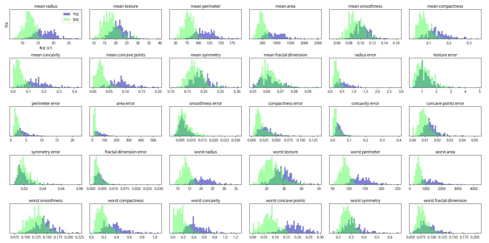

히스토그램을 보면 어떤 특성이 양성과 음성간의 뚜렷한 차이가 있는지는 확인 할 수 있지만 특성들 간의 상호작용이나 상호작용과 클래스와 연관점은 전혀 알 수 없다. PCA를 사용하면 주요 상호작용을 찾아낼 수 있다. 


PCA를 적용하기 전에 특성의 스케일을 조정해야한다.

```python 
from sklearn.preprocessing import StandardScaler

scaler = StandardScaler()
scaler.fit(cancer.data)
X_scaled = scaler.transform(cancer.data)
```


PCA에서는 특잇값 분해(SVD, Singular value decomposition) 방식을 사용해 주성분을 찾는다. fit 메소드에서는 Scipy의 linalg.svd 함수를 이용해 U, s, V 배열을 구한다. transform 메소드에서는 입력 데이터와 주성분 V 행렬의 전치 행렬을 곱하여 변환된 데이터를 구한다. fit_transform에서는 U와 s를 사용해 변환된 데이터를 계산하여 고차원 데이터에서 몇개의 주성분만 고를 경우 성능이 좀 더 좋을 수 있다.

```python 
In:
from sklearn.decomposition import PCA

pca= PCA(n_components=2)
pca.fit(X_scaled)

X_pca = pca.transform(X_scaled)
print(f"원본 데이터 형태: {str(X_scaled.shape)}")
print(f"축소된 데이터 형태: {str(X_pca.shape)}")
```

```python 
Out:
원본 데이터 형태: (569, 30)
축소된 데이터 형태: (569, 2)
```

```python 
plt.figure(figsize=(8, 8))
mglearn.discrete_scatter(X_pca[:, 0], X_pca[:, 1], cancer.target)
plt.legend(["악성", "양성"], loc='best')
plt.gca().set_aspect("equal")
plt.xlabel("첫 번째 주성분")
plt.ylabel("두 번째 주성분")
```

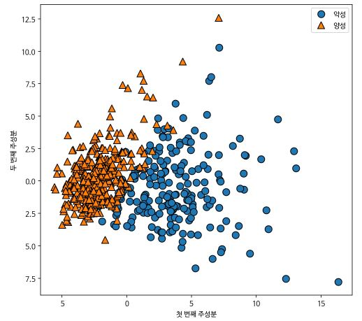

PCA는 비지도 학습이므로 회전 축을 찾을 때 어떤 클래스 정보도 사용하지 않는다. 단순히 데이터 있는 상관관계만을 고려한다.


PCA의 단점은 그래프의 두 축을 해석하기가 쉽지 않다는 점이다. 주성분은 원본 데이터에 있는 어떤 방향에 대응하는 여러 특성이 조하뵌 형태이다. 이런 조합은 보통 매우 복잡하다.

```python 
In:
print(f"PCA 주성분 형태: {pca.components_.shape}")
```

```python 
Out:
PCA 주성분 형태: (2, 30)
```

```python 
In:
print(f"PCA 주성분:\n{pca.components_}")
```

```python 
Out:
PCA 주성분:
[[ 0.21890244  0.10372458  0.22753729  0.22099499  0.14258969  0.23928535
   0.25840048  0.26085376  0.13816696  0.06436335  0.20597878  0.01742803
   0.21132592  0.20286964  0.01453145  0.17039345  0.15358979  0.1834174
   0.04249842  0.10256832  0.22799663  0.10446933  0.23663968  0.22487053
   0.12795256  0.21009588  0.22876753  0.25088597  0.12290456  0.13178394]
 [-0.23385713 -0.05970609 -0.21518136 -0.23107671  0.18611302  0.15189161
   0.06016536 -0.0347675   0.19034877  0.36657547 -0.10555215  0.08997968
  -0.08945723 -0.15229263  0.20443045  0.2327159   0.19720728  0.13032156
   0.183848    0.28009203 -0.21986638 -0.0454673  -0.19987843 -0.21935186
   0.17230435  0.14359317  0.09796411 -0.00825724  0.14188335 .27533947]]
```

각 행은 주성분 하나씩을 나타내고, 중요도에 따라 정렬되어 있다(맨 처음 주성분이 가장 위). 열은 원본 데이터의 특성에 대응하는 값이다. 앞에서 언급한대로 부호는 크게 중요하지 않다.

```python 
plt.matshow(pca.components_, cmap="viridis")
plt.yticks([0, 1], ["첫 번째 주성분", "두 번째 주성분"])
plt.colorbar()
plt.xticks(range(len(cancer.feature_names)), cancer.feature_names, rotation=60, ha='left')
plt.xlabel("특성")
plt.ylabel("주성분")
```


##### 고유얼굴(eigenface) 특성 추출

```python 
from sklearn.datasets import fetch_lfw_people

people = fetch_lfw_people(min_faces_per_person=20, resize=.7)
image_shape = people.images[0].shape
fig, axes= plt.subplots(2, 5, figsize=(15, 8), subplot_kw={'xticks': (), 'yticks': ()})

for target, image, ax in zip(people.target, people.images, axes.ravel()):
  ax.imshow(image)
  ax.set_title(people.target_names[target])
```

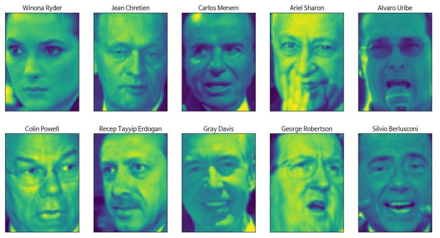

```python 
In:
print(f"people.images.shape: {people.images.shape}")
print(f"클래스 개수: {len(people.target_names)}")
```

```python 
Out:
people.images.shape: (3023, 87, 65)
클래스 개수: 62
```

```python 
In:
counts = np.bincount(people.target)
for i, (count, name) in enumerate(zip(counts, people.target_names)):
  print(f"{name:25} {count:3}", end = '    ')
  if(i + 1) % 3 == 0:
    print()
```

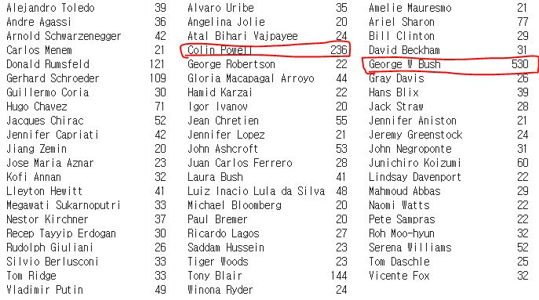

```python 
#데이터 편중을 없애기 위해서 사람마다 50개의 이미지만 사용
mask = np.zeros(people.target.shape, dtype=np.bool)
for target in np.unique(people.target):
  mask[np.where(people.target == target)[0][:50]] = 1

X_people = people.data[mask]
y_people = people.target[mask]

X_people /= 255.
```

```python 
In:
from sklearn.neighbors import KNeighborsClassifier
from sklearn.model_selection import train_test_split

X_train, X_test, y_train, y_test = train_test_split(X_people, y_people, stratify=y_people, random_state=0)
knn = KNeighborsClassifier(n_neighbors=1)
knn.fit(X_train, y_train)
print(f"1-최근접 이웃의 테스트 세트 점수: {knn.score(X_test, y_test):.2f}")
```

```python 
Out:
1-최근접 이웃의 테스트 세트 점수: 0.23
```


얼굴의 유사도를 측정하기 위해 원본 픽셀 공간에서 거리를 계산하는 것은 나쁜 방법이다. 이미지의 각 픽셀 값을 다른 이미지에서 동일한 위치에 있는 픽셀 값과 비교하는 방식은 사람이 얼굴 이미지를 인식하는 것과 많이 다르고 얼굴의 특징을 잡아 내기 어렵다. 예를 들어 픽셀을 비교할 때 얼굴 위치가 한 픽셀만 오른쪽으로 이동해도 큰 차이가 난다. 여기에 주성분 분석을 통해 데이터를 주성분으로 변환하여 거리를 계산할 수 있다. PCA의 **화이트닝(Whitening)** 옵션은 주성분의 스케일이 같아지도록 조정한다. 이것은 화이트닝 옵션 없이 주성분으로 변환한 뒤에 StandardScaler를 적용하는 것과 같다(PCA로 변환된 데이터의 표준편차는 linalg.svd 함수에서 반환한 특잇값 배열 s를 샘플 개수의 제곱근으로 나누어 구할 수 있다. PCA 변환은 데이터의 평균을 0으로 만들어 주므로 화이트닝 옵션에서 이 표준편차를 나누어 적용하는 것은 곧 StandardScaler 적용 한 것과 같다).

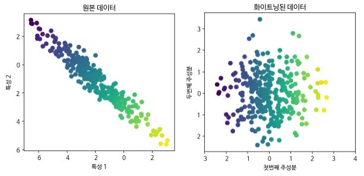

```python 
In:
pca = PCA(n_components=100, whiten=True, random_state=0).fit(X_train)
X_train_pca = pca.transform(X_train)
X_test_pca = pca.transform(X_test)

print(f"X_train_pca.shape: {X_train_pca.shape}")
```

```python 
Out:
X_train_pca.shape: (1547, 100)
```

```python 
In:
knn = KNeighborsClassifier(n_neighbors=1)
knn.fit(X_train_pca, y_train)
print(f"테스트 세트 정확도: {knn.score(X_test_pca, y_test):.2f}")
```

```python 
Out:
테스트 세트 정확도: 0.31
```

```python 
In:
print(f"pca.components_.shape: {pca.components_.shape}")
```

```python 
Out:
pca.components_.shape: (100, 5655)
```

```python 
fig, axes = plt.subplots(3, 5, figsize=(15, 12), subplot_kw={'xticks': (), 'yticks': ()})
for i, (component, ax) in enumerate(zip(pca.components_, axes.ravel())):
  ax.imshow(component.reshape(image_shape), cmap='viridis')
  ax.set_title(f"주성분 {i+1}")
```

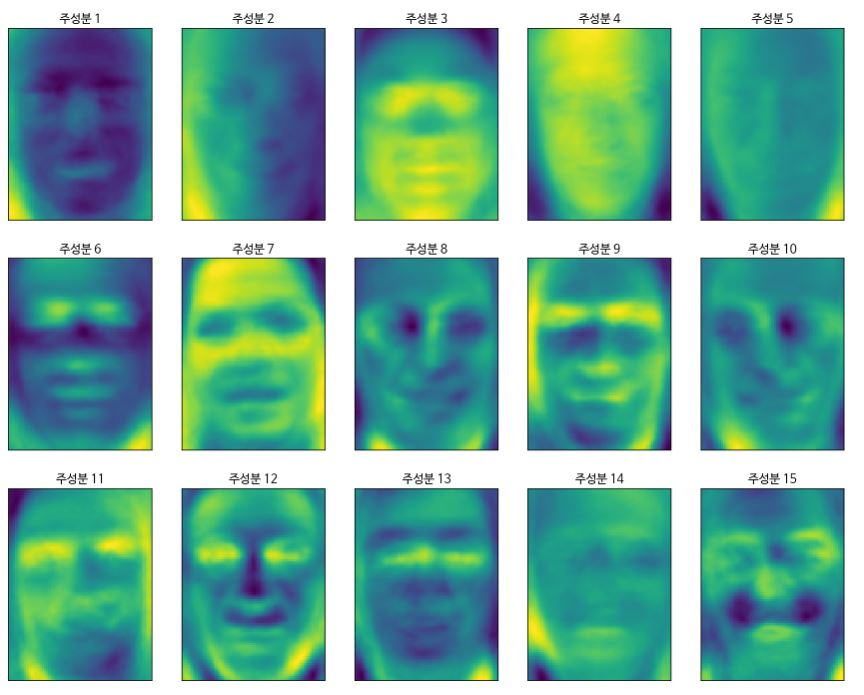

시각화한 주성분들은 완전히 이해할 수는 없지만 몇몇 주성분이 잡아낸 얼굴 이미지의 특징을 짐작할 수는 있다. 예를 들어 첫 번째 주성분은 얼굴과 배경의 명암 차이를 기록한 것으로 보이고 두 번째 주성분은 오른쪽과 왼쪽 조명의 차이를 담고 있는 것 같아 보인다.


주성분의 갯수에 따라 이미지가 어떻게 변하는지 확인이 가능하다.
(87x65 크기의 샘플데이터 1x5,655에 주성분의 전치행렬 5,655x100을 곱하면 100개의 새로운 특성 값을 얻는다. 여기에(1x100) 주성분(100x5,655)을 곱하면 원본 샘플(1x5,655)를 얻을 수 있다.)

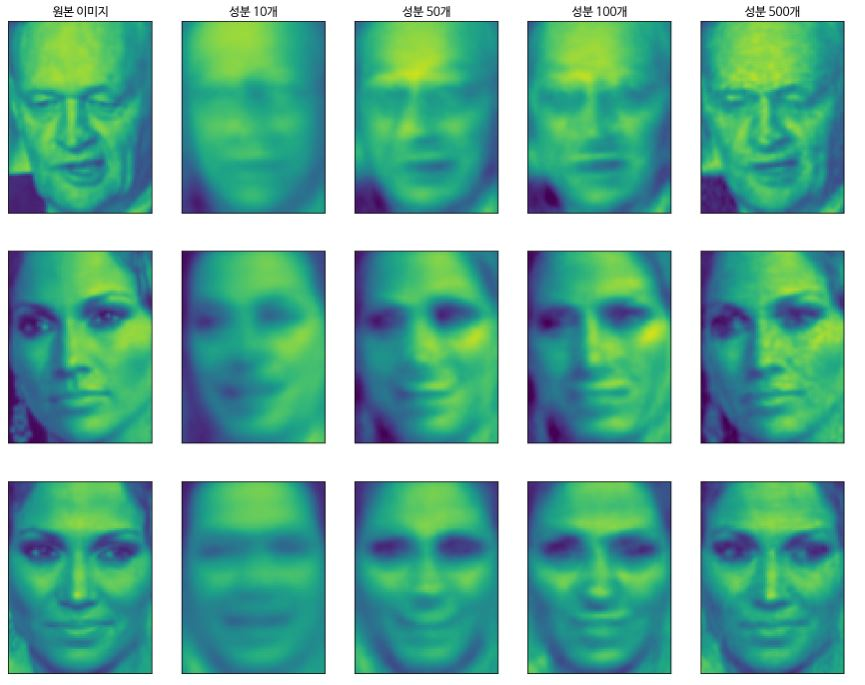


```python 
mglearn.discrete_scatter(X_train_pca[:, 0], X_train_pca[:, 1], y_train)
plt.xlabel("첫 번째 주성분")
plt.ylabel("두 번째 주성분")
```

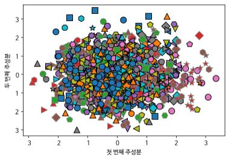


##### 3.4.2 비음수 행렬 분해(NMF)

**NMF(Non-negative matrix factorization)** 는 PCA와 비슷하게 유용한 특성을 뽑아낼 수 있고 차원 축소에도 사용할 수 있다.  PCA와 다른 점은, PCA의 경우, 데이터의 분산이 가장 크고 수직인 성분을 찾았다면 NMF에서는 음수가 아닌 성분과 계수 값을 찾는다. 즉, 주성분과 계수가 0보다 크거나 같다.

이 알고리즘은 오디오 트랙에서 특정 소리를 추출하는 것과 같은 음수가 아닌 특성을 가진 데이터에만 적용 가능하다.


##### 인위적 데이터에 NMF 적용하기

PCA를 사용할때와는 달리 NMF로 데이터를 다루려면 주어진 데이터가 양수인지 확인해야 한다. 즉 원점(0, 0)에서 데이터로 가는 방향을 추출한 것으로 음수 미포함 성분을 이해할 수 있다.

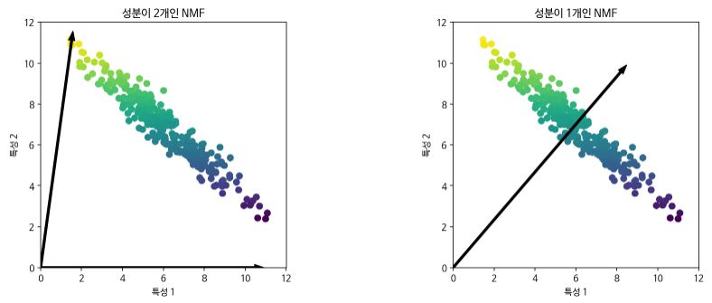

왼쪽 그래프는 성분이 둘인 NMF로, 데이터셋의 모든 포인트를 양수로 이뤄진 두 개의 성분으로 표현 가능하다. 데이터를 완벽하게 재구성할 수 있을만큼 성분이 아주 많다면(특성 개수만큼 많다면) 알고리즘은 데이터의 각 특성의 끝에 위치한 포인트를 가리키는 방향을 선택할 것이다.

(Scikit-learn에서 NMF 알고리즘은 입력 데이터 X, 변환 데이터 W, 성분 H가 X = WH를 만족하는 W, H 행렬을 구하기 위해 행렬의 L2 Norm인 프로베니우스 Norm(Frobenius norm)의 제곱으로 만든 목적 함수  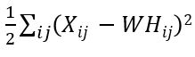 을 좌표 하강법으로 최소화 한다. 구해진 성분 H는 NMF 객체의 component_ 속성에 저장된다.)

오른쪽 그래프와 같이 하나의 성분만 사용한다면 NMF는 데이터를 가장 잘 표현할 수 있는 평균으로 향하는 성분을 만든다. PCA와는 달리, 성분 개수를 줄이면 특정 방향이 단순히 제거되는 것이 아니라 전체 성분이 완전히 바뀐다. NMF에서의 성분은 순서가 없고 모든 성분을 동등하게 취급한다.

NMF는 난수 생성 초깃 값에 따라 결과가 달라진다. 간단한 예에서는 영향을 주지 않지만 복잡한 데이터에서는 큰 차이를 만들 수 있다.

(NMF에서 기본 초기화 방식은 데이터 평균을 성분의 개수로 나눈 후 제곱근을 구하고, 그런 다음 정규 분포의 난수를 발생시켜 앞에서 구한 제곱근을 곱하여 H와 W 행렬을 만든다. 이는 데이터 평균값을 각 성분과 두 개의 행렬에 나누어 놓는 효과를 발생시킨다.)


##### 얼굴 이미지에 NMF 적용하기

다음은 NMF를 사용해 데이터를 재구성했을 때 성분의 개수에 따른 이미지의 모습이다.

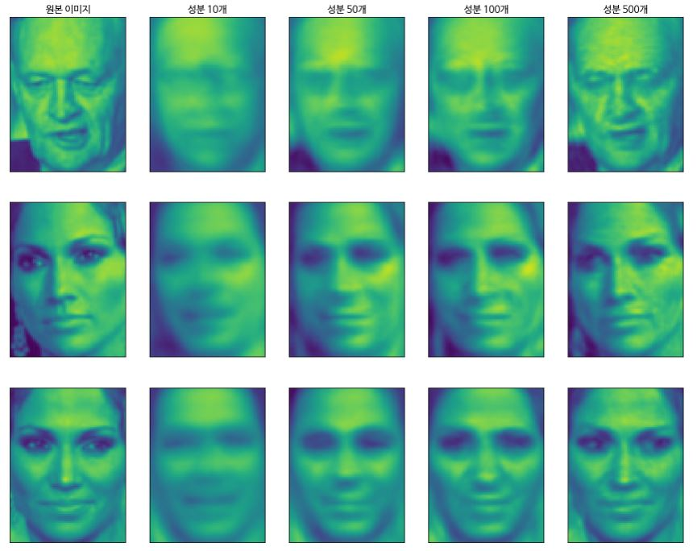

PCA가 재구성 측면에서 최선의 방향을 찾는다면 NMF는 데이터를 인코딩하거나 재구성하는 용도로 사용하기 보다는 데이터에 있는 패턴을 찾는데 활용한다.


```python 
from sklearn.decomposition import NMF

nmf = NMF(n_components=15, random_state=0)
nmf.fit(X_train)
X_train_nmf = nmf.transform(X_train)
X_test_nmf = nmf.transform(X_test)
fig, axes = plt.subplots(3, 5, figsize=(15, 12), subplot_kw={'xticks': (), 'yticks': ()})
for i, (component, ax) in enumerate(zip(nmf.components_, axes.ravel())):
  ax.imshow(component.reshape(image_shape))
  ax.set_title(f"성분 {i}")
```

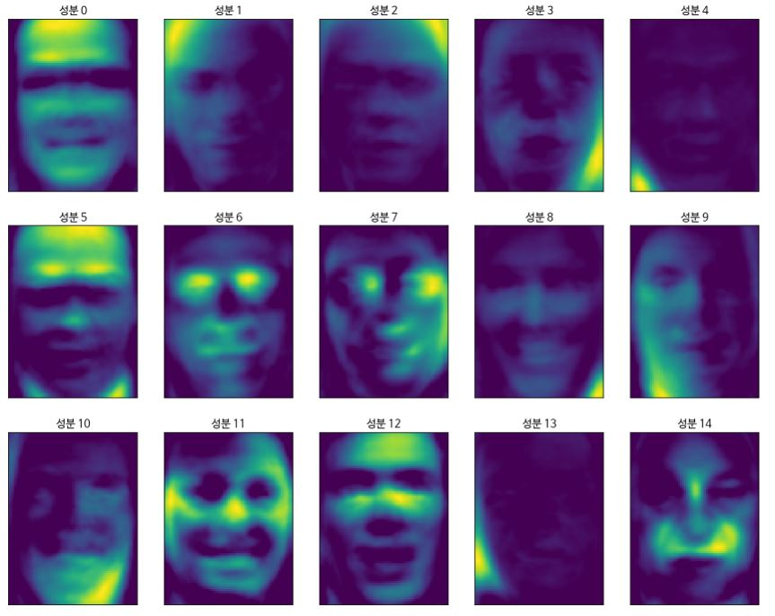


위에서 성분3이 오른쪽으로 조금 돌아간 얼굴로 보인 것을 확인할 수 있다. 실제 확인해보면 다음과 같다.

```python 
compn = 3
inds = np.argsort(X_train_nmf[:, compn])[::-1]
fig, axes = plt.subplots(2, 5, figsize=(15, 8), subplot_kw={'xticks': (), 'yticks': ()})
for i, (ind, ax) in enumerate(zip(inds, axes.ravel())):
  ax.imshow(X_train[ind].reshape(image_shape))
```

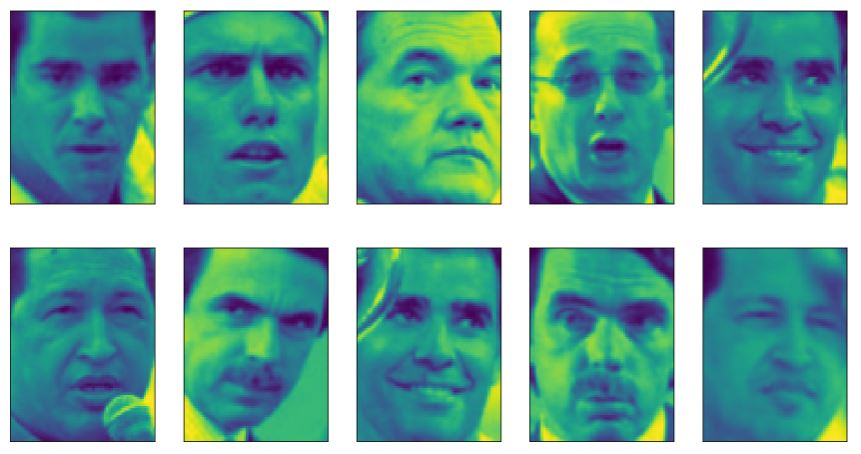


```python 
compn = 7
inds = np.argsort(X_train_nmf[:, compn])[::-1]
fig, axes = plt.subplots(2, 5, figsize=(15, 8), subplot_kw={'xticks': (), 'yticks': ()})
for i, (ind, ax) in enumerate(zip(inds, axes.ravel())):
  ax.imshow(X_train[ind].reshape(image_shape))
```

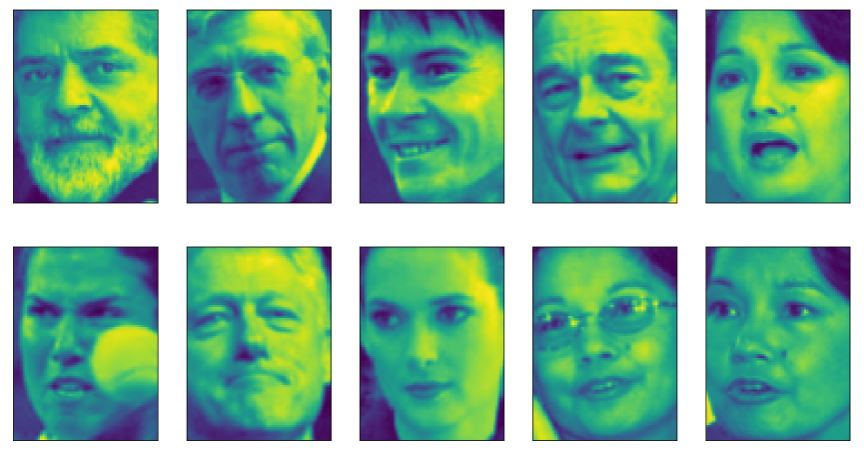


다음은 임의의 합성 신호들을 NMF와 PCA로 복원한 예이다.

```python 
S = mglearn.datasets.make_signals()
plt.figure(figsize=(6, 1))
plt.plot(S, '-')
plt.xlabel("시간")
plt.ylabel("신호")
```

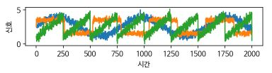

```python 
In:
A = np.random.RandomState(0).uniform(size=(100, 3))
X = np.dot(S, A.T)
print(f"측정 데이터 형태: {X.shape}")
```

```python 
Out:
측정 데이터 형태: (2000, 100)
```

```python 
In:
nmf = NMF(n_components=3, random_state=42)
S_ = nmf.fit_transform(X)
print(f"복원한 신호 데이터 형태 {S_.shape}")
```

```python 
Out:
복원한 신호 데이터 형태 (2000, 3)
```

```python 
from sklearn.decomposition import PCA

pca = PCA(n_components=3)
H = pca.fit_transform(X)
```

```python 
models = [X, S, S_, H]
names = ['측정 신호 (처음 3개)', '원본 신호', 'NMF로 복원한 신호', 'PCA로 복원한 신호']
fig, axes = plt.subplots(4, figsize=(8, 4), gridspec_kw={'hspace': .5}, subplot_kw={'xticks': (), 'yticks': ()})

for model, name, ax in zip(models, names, axes):
  ax.set_title(name)
  ax.plot(model[:, :3], '-')
```

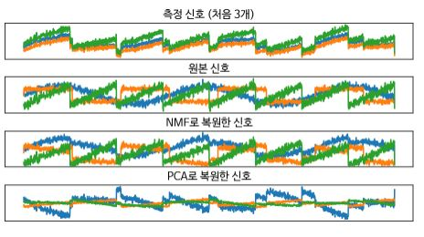


패턴 추출에 관해서는 독립 성분 분석(ICA), 요인 분석(FA), 희소 코딩(Sparse coding)-딕셔너리(Dictionary 학습)에 관해 설명하고 있는 다음 페이지를 참고.

[Scikit-learn 분해 메서드](https://scikit-learn.org/stable/modules/decomposition.html)


##### 3.4.3 t-SNE를 이용한 매니폴드 학습

**t-SNE(t-Distributed Stochastic Neighbor Embedding)** 알고리즘은 **매니폴드 학습(Manifold learning)** 알고리즘이라고 하는 시각화 알고리즘의 한 종류이다. 시각화가 목적이기 때문에 3개 이상의 특성을 뽑는 경우는 없다. 매니폴드 학습 알고리즘은 훈련 데이터를 새로운 표현으로 변환 시키지만 새로운 데이터(테스트 데이터)에는 적용할 수 없고 훈련했던 데이터만 변환 할 수 있다. 그래서 탐색적 데이터 분석에 유용하지만 지도 학습의 전처리용으로는 사용하지 않는다. t-SNE는 데이터 포인트 사이의 거리를 가장 잘 보존하는 2차원 표현을 찾는다. 각 데이터 포인트를 2차원에 무작위로 표현한 뒤 원본 특성 공간에 가까운 포인트는 가깝게, 멀리 떨어진 포인트는 멀어지게 만든다. 멀리 떨어진 포인트와 거리를 보존하는 것보다 가까이 있는 포인트에 더 많은 비중을 두는데, 이는 이웃 데이터 포인트에 대한 정보를 보존하려고 하는 것이다.

(scikit-learn의 t-SNE 구현은 쿨백-라이블러 발산(Kullback-Leibler divergence) 목적 함수를 최적하기 위해 모멘텀을 적용한 배치 경사 하강법을 사용한다.  TSNE의 method 매개변수의 기본 값은 'barnes_hut'로 그래디언트 계산의 복잡도를 O(N^2)에서 O(NlogN))으로 낮춰주는 반스-헛(Barnes-Hut) 방법이다. 'exact' 옵션은 정확한 계산을 하지만 느리므로 대량의 데이터에는 적합하지 않다.)

```python 
from sklearn.datasets import load_digits

digits = load_digits()
fig, axes = plt.subplots(2, 5, figsize=(10, 5), subplot_kw={'xticks': (), 'yticks': ()})
for ax, img in zip(axes.ravel(), digits.images):
  ax.imshow(img)
```

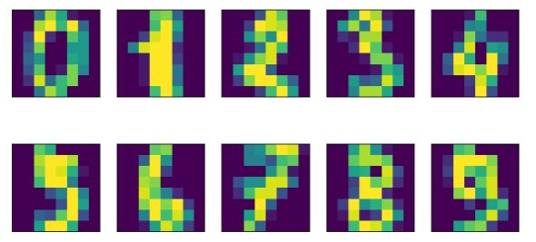


PCA를 사용한 데이터 변환의 시각화

```python 
from sklearn.decomposition import PCA

pca = PCA(n_components=2)
pca.fit(digits.data)
digits_pca = pca.transform(digits.data)
digits_pca = pca.transform(digits.data)
colors = ["#476A2A", "#7851B8", "#BD3430", "#4A2D4E", "#875525",
          "#A83683", "#4E655E", "#853541", "#3A3120","#535D8E"]
plt.figure(figsize=(10, 10))
plt.xlim(digits_pca[:, 0].min(), digits_pca[:, 0].max())
plt.ylim(digits_pca[:, 1].min(), digits_pca[:, 1].max())
for i in range(len(digits.data)):
  plt.text(digits_pca[i, 0], digits_pca[i, 1], str(digits.target[i]), 
           color=colors[digits.target[i]], fontdict={'weight': 'bold', 'size': 9})
plt.xlabel("첫 번째 주성분")
plt.ylabel("두 번째 주성분")
```

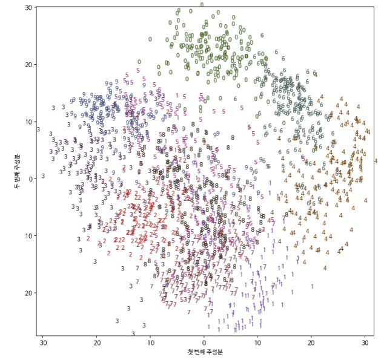


t-SNE를 사용한 데이터 변환의 시각화

```python 
from sklearn.manifold import TSNE

tsne = TSNE(random_state=42)
digits_tsne = tsne.fit_transform(digits.data)
colors = ["#476A2A", "#7851B8", "#BD3430", "#4A2D4E", "#875525",
          "#A83683", "#4E655E", "#853541", "#3A3120","#535D8E"]
plt.figure(figsize=(10, 10))
plt.xlim(digits_tsne[:, 0].min(), digits_tsne[:, 0].max())
plt.ylim(digits_tsne[:, 1].min(), digits_tsne[:, 1].max())
for i in range(len(digits.data)):
  plt.text(digits_tsne[i, 0], digits_tsne[i, 1], str(digits.target[i]), 
           color=colors[digits.target[i]], fontdict={'weight': 'bold', 'size': 9})
plt.xlabel("t-SNE 특성 0")
plt.ylabel("t-SNE 특성 1")
```

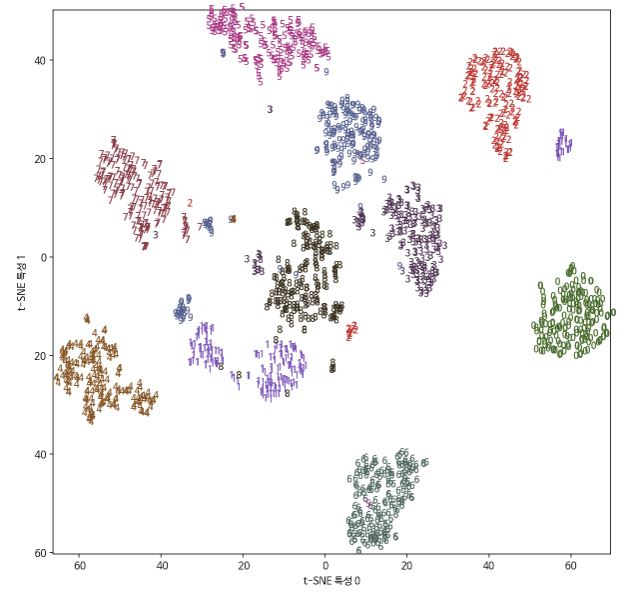

t-SNE의 매개변수 조정을 고려해 볼만한 매개변수로 perplexity와 early_exaggeration이 있다. perplexity의 값이 크면 더 많은 이웃을 포함하며 작은 그룹이 무시된다. 보통 데이터셋이 클 경우 perplexity 값도 커져야 한다. TSNE 모델은 초기 과정(early exaggeration) 단계와 최적화 단계를 가지는데 early_exaggeration 매개변수는 초기 과장 단계에서 원본 공간의 클러스터들이 얼마나 멀게 2차원에 나타낼지르 정한다. early_exaggeration의 값이 클수록 간격이 커진다.


### 3.5 군집

**군집(Clustering)** 은 데이터 셋을 **클러스터(Cluster)** 라는 그룹으로 나누는 작업이다. 클러스터 안의 데이터 포인트 끼리는 비슷하고 다른 클러스트의 데이터 포인트와는 구분된다.  군집 알고리즘은 각 데이터 포인트가 어느 클러스터에 속하는지 할당(예측)한다.


##### 3.5.1 k-평균 군집

***k*-평균(*k*-means)** 군집은 어떤 영역을 대표하는 **클러스터 중심(Cluster center)** 을 찾는다. 먼저 데이터 포인트를 가장 가까운 클러스터 중심에 할당하고, 그런 다음 클러스터에 할당된 데이터 포인트의 평균으로 클러스터 중심을 다시 지정한다. 이 과정은 클러스터에 할당되는 데이터 포인트에 변화가 없을 때까지 진행된다. 

```python 
mglearn.plots.plot_kmeans_algorithm()
```

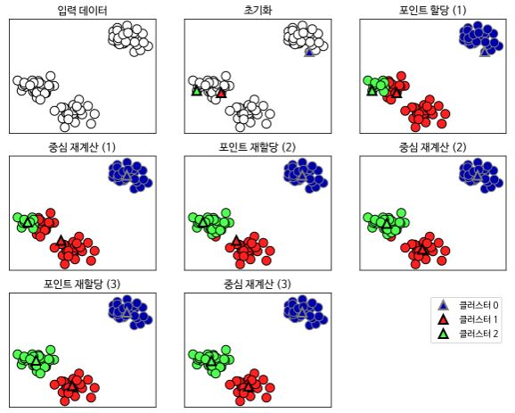


새로운 데이터 포인트가 주어지면 k-평균 알고리즘은 가장 가까운 클러스터 중심을 할당한다.

```python 
mglearn.plots.plot_kmeans_boundaries()
```


```python 
In:
from sklearn.datasets import make_blobs
from sklearn.cluster import KMeans

X, y = make_blobs(random_state=1)
kmeans = KMeans(n_clusters=3)
kmeans.fit(X)
```

```python 
Out:
KMeans(algorithm='auto', copy_x=True, init='k-means++', max_iter=300,
       n_clusters=3, n_init=10, n_jobs=None, precompute_distances='auto',
       random_state=None, tol=0.0001, verbose=0)
```

```python 
In:
print(f"클러스터 레이블:\n{kmeans.labels_}")
```

```python 
Out:
클러스터 레이블:
[1 2 2 2 0 0 0 2 1 1 2 2 0 1 0 0 0 1 2 2 0 2 0 1 2 0 0 1 1 0 1 1 0 1 2 0 2
 2 2 0 0 2 1 2 2 0 1 1 1 1 2 0 0 0 1 0 2 2 1 1 2 0 0 2 2 0 1 0 1 2 2 2 0 1
 1 2 0 0 1 2 1 2 2 0 1 1 1 1 2 1 0 1 1 2 2 0 0 1 0 1]
```

```python 
In:
print(kmeans.predict(X))
```

```python 
Out:
[1 2 2 2 0 0 0 2 1 1 2 2 0 1 0 0 0 1 2 2 0 2 0 1 2 0 0 1 1 0 1 1 0 1 2 0 2
 2 2 0 0 2 1 2 2 0 1 1 1 1 2 0 0 0 1 0 2 2 1 1 2 0 0 2 2 0 1 0 1 2 2 2 0 1
 1 2 0 0 1 2 1 2 2 0 1 1 1 1 2 1 0 1 1 2 2 0 0 1 0 1]
```

군집은 각 데이터 포인트가 레이블을 가진다는 면에서 분류와 조금 비슷해 보이나 레이블 자체에 아무 의미가 없고 정답을 모르고 있다는 점에서 다르다. 


```python 
mglearn.discrete_scatter(X[:, 0], X[:, 1], kmeans.labels_, markers='o')
mglearn.discrete_scatter(kmeans.cluster_centers_[:, 0], kmeans.cluster_centers_[:, 1], [0, 1, 2], markers='^', markeredgewidth=2)
```


```python 
fig, axes = plt.subplots(1, 2, figsize=(10, 5))

kmeans = KMeans(n_clusters=2)
kmeans.fit(X)
assignments = kmeans.labels_

mglearn.discrete_scatter(X[:, 0], X[:, 1], assignments, ax=axes[0])

kmeans = KMeans(n_clusters=5)
kmeans.fit(X)
assignments = kmeans.labels_

mglearn.discrete_scatter(X[:, 0], X[:, 1], assignments, ax=axes[1])
```

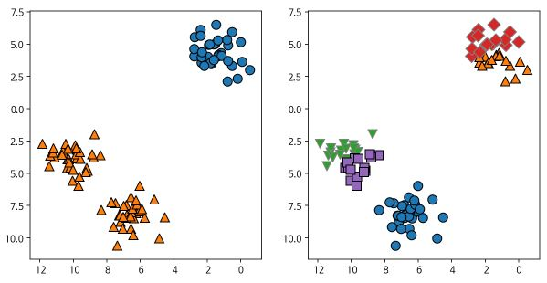


##### k-평균 알고리즘이 실패하는 경우

데이터 셋의 클러스터의 개수를 정확하게 알고 있더라도 k-평균 알고리즘이 항상 이를 구분해낼 수 있는 것은 아니다. 각 클러스터를 정의 하는 것이 중심 하나뿐이므로 클러스터는 둥근 형태로 나타난다. k-평균은 모든 클러스터의 반경이 똑같다고 가정한다. 그래서 클러스터 중심 사이의 정확히 중간에 경계를 그린다.

```python 
X_varided, y_varied = make_blobs(n_samples=200, cluster_std=[1.0, 2.5, 0.5], random_state=170)
y_pred = KMeans(n_clusters=3, random_state=0).fit_predict(X_varided)
mglearn.discrete_scatter(X_varided[:, 0], X_varided[:, 1], y_pred)
plt.legend(['클러스터 0', '클러스터 1', '클러스터 2'], loc='best')
plt.xlabel("특성 0")
plt.ylabel("특성 1")
```

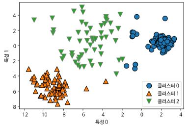

```python 
X, y = make_blobs(random_state=170, n_samples=600)
rng = np.random.RandomState(74)

transformation = rng.normal(size=(2, 2))
X = np.dot(X, transformation)

kmeans = KMeans(n_clusters=3)
kmeans.fit(X)
y_pred = kmeans.predict(X)

mglearn.discrete_scatter(X[:, 0], X[:, 1], kmeans.labels_, markers='o')
mglearn.discrete_scatter(kmeans.cluster_centers_[:, 0], kmeans.cluster_centers_[:, 1], [0, 1, 2], markers='^', markeredgewidth=2)
plt.xlabel("특성 0")
plt.ylabel("특성 1")
```


```python 
from sklearn.datasets import make_moons

X, y = make_moons(n_samples=200, noise=.05, random_state=0)

kmeans = KMeans(n_clusters=2)
kmeans.fit(X)
y_pred = kmeans.predict(X)

plt.scatter(X[:, 0], X[:, 1], c=y_pred, cmap=mglearn.cm2, s=60, edgecolors='k')
plt.scatter(kmeans.cluster_centers_[:, 0], kmeans.cluster_centers_[:, 1], marker='^', 
            c=[mglearn.cm2(0), mglearn.cm2(1)], s=100, linewidths=2, edgecolors='k')
plt.xlabel("Feature 0")
plt.ylabel("Feature 1")
```


