# 4. 데이터 표현과 특성 공학

데이터을 데이터들의 성격으로 분리해보면 **연속형 특성(Continuous feature)** , **범주형 특성(Categorical feature)** , **이산형 특성(Discrete feature)** 로 나눌 수 있다. 

이렇게 데이터가 어떤 형태의 특성으로 구성되어 있는가로 구성되어 있는가를 살펴봐야 하지만 그 보다 중요한 것은 데이터를 어떻게 표현하는가이다. 예컨대 데이터의 스케일을 조정하지 않으면 데이터 특성의 범위에 따라 결과 값에 차이가 생길 것이다. 또 특성의 상호작용(특성 간의 곱 등)이나 일반적인 다항식을 투가 특성으로 도움이 될 수 있음을 Chapter2에서 살펴봤다.

특정 애플리케이션에 가장 적합한 데이터 표현을 찾는 것을 **특성 공학(Feature engineering)** 이라고 한다. 올바른 데이터 표현은 지도 학습 모델에서 적절한 매개변수를 선택하는 것보다 성능에 더 큰 영향을 끼친다.


### 4.1 범주형 변수

예제에 사용할 데이터는 1994년 인구 조사 데이터베이스에서 추출한 미국 성인의 소득 데이터셋이다. 

[UCI 미국 성인의 소득 데이터](https://archive.ics.uci.edu/ml/machine-learning-databases/adult/)

이 데이터 셋을 사용해 어떤 근로자의 수입(income)이 50,000 달러를 초과하는지, 이하일지를 예측하려고 한다.  아래의 표에서 age, hours-per-week은 연속형 특성이지만 workclass, education, sex, occupation은 범주형 특성이다. 이런 특성들은 고정된 목록 중 하나를 값으로 가지며, 정략적이 아니고 정성적인 속성이다.

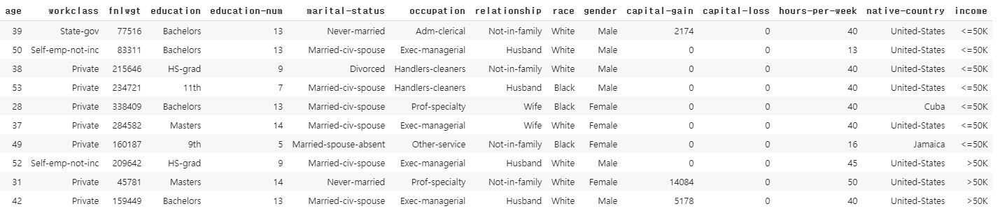

범주형 특성을 로지스틱 회귀 분류기에서 학습시키기 위해서(입력 특성 x[i]에 삽입하기 위해서)는 텍스트 데이터가 아닌 숫자여야 한다. 


##### 4.1.1 원-핫-인코딩(가변수)

범주형 변수를 표현하는 데 가장 널리 쓰이는 방법은 **원-핫-인코딩(One-hot-encoding)** 이다(**원-아웃-오브-엔 인코딩(One-out-of-N encoding)** or **가변수(Dummy variable)** ). 가변수는 범주형 변수를 0 또는 1 값을 가진 하나 이상의 새로운 특성으로 바꾼다.

예를 들어서 workclass 특성에는 "Government Employee", "Private Employee", "Self Employed", "Self Employed Incorporated"란 값이 있는데 어떤 사람의 workclass 값에 해당하는 특성은 1이 되고 나머지 세 특성은 0이 된다.


우선 pandas를 이용해 CSV 파일에서 데이터를 읽는다. 

```python 
import pandas as pd
import os

data = pd.read_csv(
    os.path.join(mglearn.datasets.DATA_PATH, "adult.data"),
    header=None, index_col=False,
    names=['age', 'workclass', 'fnlwgt', 'education',  'education-num',
           'marital-status', 'occupation', 'relationship', 'race', 'gender',
           'capital-gain', 'capital-loss', 'hours-per-week', 'native-country',
           'income'])
data = data[['age', 'workclass', 'education', 'gender', 'hours-per-week', 'occupation', 'income']]
display(data.head())
```

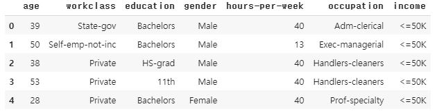


##### 범주형 데이터 문자열 확인하기

데이터셋을 일고 나면, 열에 어떤 의미가 있는 범주형 데이터가 있는지 확인해 보는 것이 좋다.

열의 내용을 확인하는 좋은 방법은 pandas에서 Series 객체의 value_counts 메소드를 사용하여 유일한 값이 각각 며 번 나타나는지 출력해 보는 것이다.

```python
In:
print(data.gender.value_counts())
```

```python 
Out:
 Male      21790
 Female    10771
Name: gender, dtype: int64
```


pandas에서는 get_dummies 함수를 사용해 데이터를 매우 쉽게 인코딩할 수 있다. get_dummies 함수는 객체 타입(문자열 같은)이나 범주형을 가진 열을 자동으로 변환해 준다.

```python 
import pprint

print("원본 특성:\n", list(data.columns), "\n")
data_dummies = pd.get_dummies(data)
print("get_dummies 후의 특성:", )
pprint.pprint(list(data_dummies.columns), width=100, compact=True)
```

```python 
원본 특성:
 ['age', 'workclass', 'education', 'gender', 'hours-per-week', 'occupation', 'income'] 

get_dummies 후의 특성:
['age', 'hours-per-week', 'workclass_ ?', 'workclass_ Federal-gov', 'workclass_ Local-gov',
 'workclass_ Never-worked', 'workclass_ Private', 'workclass_ Self-emp-inc',
 'workclass_ Self-emp-not-inc', 'workclass_ State-gov', 'workclass_ Without-pay', 'education_ 10th',
 'education_ 11th', 'education_ 12th', 'education_ 1st-4th', 'education_ 5th-6th',
 'education_ 7th-8th', 'education_ 9th', 'education_ Assoc-acdm', 'education_ Assoc-voc',
 'education_ Bachelors', 'education_ Doctorate', 'education_ HS-grad', 'education_ Masters',
 'education_ Preschool', 'education_ Prof-school', 'education_ Some-college', 'gender_ Female',
 'gender_ Male', 'occupation_ ?', 'occupation_ Adm-clerical', 'occupation_ Armed-Forces',
 'occupation_ Craft-repair', 'occupation_ Exec-managerial', 'occupation_ Farming-fishing',
 'occupation_ Handlers-cleaners', 'occupation_ Machine-op-inspct', 'occupation_ Other-service',
 'occupation_ Priv-house-serv', 'occupation_ Prof-specialty', 'occupation_ Protective-serv',
 'occupation_ Sales', 'occupation_ Tech-support', 'occupation_ Transport-moving', 'income_ <=50K',
 'income_ >50K']
```


연속형 특성인 age나 hours-per-week는 그대로지만 범주형 특성은 값마다 새로운 특성으로 확장되었다.

```python 
data_dummies.head()[data_dummies.head().columns[:6]]
```

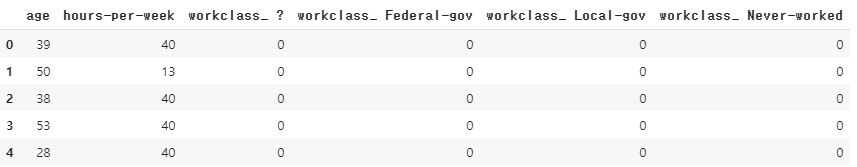


DataFrame 객체의 values 속성을 이용해 값을 NumPy 배열로 바꿀수 있고 이 배열로 머신러닝 모델을 학습시킨다. 모델을 학습하기 전에는 이 데이터로부터 타깃값을 분리해야 한다. 

(pandas에서 열 인덱싱은 범위 끝을 포함한다. 'a':'b' 라 하면 'b'를 포함한다. 이와 달리 NumPy 배열의 슬라이싱은 마지막 범위를 포함하지 않는다. np.arange(11)[0:10]은 인덱스 10인 항목을 포함하지 않는다.)

여기서는 특성을 포함한 열, 즉 age부터 occupation_ Transport-moving까지 모든 열을 추출한다. 이때 타깃을 뺀 모든 특성이 포함된다.

```python 
In:
features = data_dummies.loc[:, 'age':'occupation_ Transport-moving']
X = features.values
y = data_dummies['income_ >50K'].values
print(f"X.shape: {X.shape} y.shape: {y.shape}")
```

```python 
Out:
X.shape: (32561, 44) y.shape: (32561,)
```

```python 
In:
from sklearn.linear_model import LogisticRegression
from sklearn.model_selection import train_test_split

X_train, X_test, y_train, y_test = train_test_split(X, y, random_state=0)
logreg = LogisticRegression()
logreg.fit(X_train, y_train)
print(f"테스트 점수: {logreg.score(X_test, y_test)}")
```

```python 
Out:
테스트 점수: 0.8067804937968308
```

주의할 점은 훈련 데이터와 테스트 데이터를 모두 포함하는 DataFrame을 사용해 get_dummies 함수를 호출하든지, 각각 get_dummies를 호출한 후에 훈련 세트와 테스트 세트의 열 이름을 비교해서 같은 속성인지 확인해야 한다. 각 열의 클래스 값들이 훈련 데이터와 테스트 데이터에 고루 분포하지 않을 가능성이 있기 때문이다.


##### 4.1.2 숫자로 표현된 범주형 특성

범주형 특성은 종종 숫자로 인코딩된다. 특성의 값이 숫자라고 해서 연속형 특성으로 항상 다뤄지는 것은 아니다. 인코딩된 값 사이에 어떤 순서도 없으면, 이 특성은 이산적이라고 생각해야 한다. 예컨대 별 다섯 개 만점으로 매긴 평점 데이터는 보통 범주형으로 다루지만, 평균을 구하는 등 연속형으로 다루기 한다. pandas의 get_dummies 함수는 숫자 특성은 모두 연속형이라고 여겨 가변수를 만들지 않는다. 이를 해결하기 위한 방법은 2가지이다.

- 어떤 열이 연속형인지 범주형인지를 지정할 수 있는 scikit-learn의 OneHotEncoder
- DataFrame에 있는 숫자로 된 열을 문자열로 바꾼다.

```python 
demo_df = pd.DataFrame({'숫자 특성': [0, 1, 2, 1],
                        '범주형 특성': ['양말', '여우', '양말', '상자']})
display(demo_df)
```

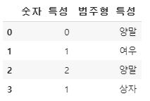

```python 
display(pd.get_dummies(demo_df))
```

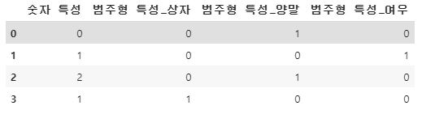

 ```python 
demo_df['숫자 특성'] = demo_df['숫자 특성'].astype(str)
display(pd.get_dummies(demo_df, columns=['숫자 특성', '범주형 특성']))
 ```

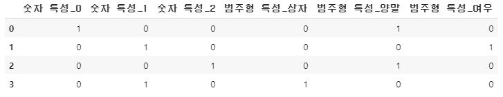


### 4.2 구간 분할, 이산화 그리고 선형 모델, 트리 모델

데이터를 가장 잘 표현하는 방법은 데이터가 가진 의미뿐 아니라 어떤 모델을 사용하는지에 따라 다르다. 선형 모데로가 트리 기반 모델은 특성의 표현 방식으로 인해 미치는 영향이 매우 다르다.

```python 
from sklearn.linear_model import LinearRegression
from sklearn.tree import DecisionTreeRegressor

X, y = mglearn.datasets.make_wave(n_samples=100)
line = np.linspace(-3, 3, 1000, endpoint=False).reshape(-1, 1)

reg = DecisionTreeRegressor(min_samples_split=3).fit(X, y)
plt.plot(line, reg.predict(line), label='결정 트리')

reg = LinearRegression().fit(X, y)
plt.plot(line, reg.predict(line), '--', label='선형 회귀')

plt.plot(X[:, 0], y, 'o', c='k')
plt.ylabel("회귀 출력")
plt.xlabel("입력 특성")
plt.legend(loc='best')
```

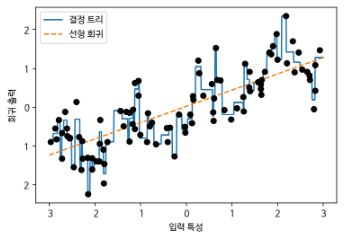

선형 모델은 선형 관계로만 모델링하므로 특성이 하나일 때는 직성으로 나타난다. 결정 트리는 이 데이터로 훨씬 복잡한 모델을 만들 수 있다. 그러나 이는 데이터의 표현 형태에 따라 굉장히 달라지는데 그 중 하나는 한 특성을 여러 특성으로 나누는 **구간 분할(Bining)** or **이산화(Discretization)** 이다. 

예를 들어 -3에서 3까지의 입력 값 범위가 10개의 구간으로 구성된다면 다음과 같이 구간 분할을 할 수 있다.

```python 
In:
bins = np.linspace(-3, 3, 11)
print(f"구간: {bins}")
```

```python 
Out:
구간: [-3.  -2.4 -1.8 -1.2 -0.6  0.   0.6  1.2  1.8  2.4  3. ]
```

그 다음 각 데이터 포인트가 어느 구간에 속하는지 기록한다(np.digitize 함수는 시작점을 포함하고 종료점은 포함하지 않는다. 첫번째 구간인 1은  -3 <= x < -2.4이다.  -3보다 작은 데이터는 0, 3보다 크거나 같은 데이터는 11이 된다).

```python 
In:
which_bin = np.digitize(X, bins=bins)
print("\n데이터 포인트:\n", X[:5])
print("\n데이터 포인트의 소속 구간:\n", which_bin[:5])
```

```python 
Out:
데이터 포인트:
 [[-0.75275929]
 [ 2.70428584]
 [ 1.39196365]
 [ 0.59195091]
 [-2.06388816]]

데이터 포인트의 소속 구간:
 [[ 4]
 [10]
 [ 8]
 [ 6]
 [ 2]]
```


연속형 특성을 각 데이터 포인트가 어느 구간에 속했는지로 인코딩한 범주형 특성으로 변환하였으면 원-핫-인코딩으로 변환 할 수 있다.

```python 
In:
from sklearn.preprocessing import OneHotEncoder

encoder = OneHotEncoder(sparse=False)
encoder.fit(which_bin)
X_binned = encoder.transform(which_bin)
print(X_binned[:5])
```

```python 
Out:
[[0. 0. 0. 1. 0. 0. 0. 0. 0. 0.]
 [0. 0. 0. 0. 0. 0. 0. 0. 0. 1.]
 [0. 0. 0. 0. 0. 0. 0. 1. 0. 0.]
 [0. 0. 0. 0. 0. 1. 0. 0. 0. 0.]
 [0. 1. 0. 0. 0. 0. 0. 0. 0. 0.]]
```

```python 
In:
print(f"X_binned.shape: {X_binned.shape}")
```

```python 
Out:
X_binned.shape: (100, 10)
```

```python 
line_binned = encoder.transform(np.digitize(line, bins=bins))

reg = LinearRegression().fit(X_binned, y)
plt.plot(line, reg.predict(line_binned), label='구간 선형 회귀')

reg = DecisionTreeRegressor(min_samples_split=3).fit(X_binned, y)
plt.plot(line, reg.predict(line_binned), '--', label='구간 결정 트리')
plt.plot(X[:, 0], y, 'o', c='k')
plt.vlines(bins, -3, 3, linewidth=1, alpha=.2)
plt.legend(loc='best')
plt.ylabel("회귀 출력")
plt.xlabel("입력 특성")
```

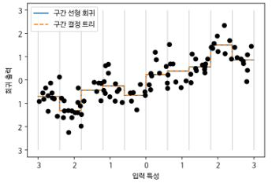

구간으로 나눈 특성을 사용하기 전과 비교해보면, 각 구간에서 다른 값을 가지고 있으므로 선형 모델이 훨씬 유연해진 것을 알 수 있다. 반면에 결정 트리는 덜 유연해졌다. 트리 모델은 데이터를 자유롭게 나눠 학습할 수 있으므로 특성의 값을 구간으로 나누는 것이 아무런 득이 되지 않는다. 결정 트리는 데이터셋에서 예측을 위한 가장 좋은 구간을 학습한다고 볼 수 있다. 거기다가 구간 분할은 특성마다 따로 해야 하나, 결정 트리는 한 번에 여러 특성을 살필 수 있다. 선형 모델은 이런 변환으로부터 큰 이득을 얻었다.

용량이 매우 크고 고차원 데이터셋이라 선형 모델을 사용해야 한다면 구간 분할이 모델 성능을 높이는 데 아주 좋은 방법이 될 수 있다. 


##### 4.3 상호 작용과 다항식

특성을 풍부하게 나타내는 다른 방법은 원본 데이터에 **상호 작용(Interaction)** 과 **다항식(Polynomial)** 을 추가하는 것이다.

선형 모델에 기울기를 추가하는 방법은 구간으로 분할된 데이터에 원래 특성을 추가하는 것이다. 

 ```python 
In:
X_combined = np.hstack([X, X_binned])
print(X_combined.shape)
 ```

```python 
Out:
(100, 11)
```

```python 
reg = LinearRegression().fit(X_combined, y)

line_combined = np.hstack([line, line_binned])
plt.plot(line, reg.predict(line_combined), label='원본 특성을 더한 선형 회귀')

for bin in bins:
  plt.plot([bin, bin], [-3, 3], ":", c='k', linewidth=1)
plt.legend(loc='best')
plt.ylabel("회귀 출력")
plt.xlabel("입력 특성")
plt.plot(X[:, 0], y, 'o', c='k')
```

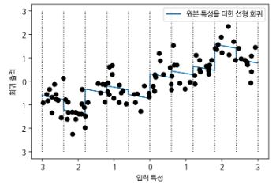


다음은 구간 특성과 원본 특성의 곱을 추가한 새로운 특성을 추가했을 때이다.

```python 
In:
X_product = np.hstack([X_binned, X * X_binned])
print(X_product.shape)
```

```python 
Out:
(100, 20)
```

```python 
reg = LinearRegression().fit(X_product, y)

line_product = np.hstack([line_binned, line * line_binned])
plt.plot(line, reg.predict(line_product), label='원본 특성을 곱합 선형 회귀')

for bin in bins:
  plt.plot([bin, bin], [-3, 3], ':', c='k', linewidth=1)

plt.plot(X[:, 0], y, 'o', c='k')
plt.ylabel("회귀 출력")
plt.xlabel("입력 특성")
plt.legend(loc='best')
```

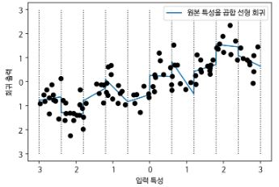


원본 특성의 다항식을 추가하는 방법도 존재한다.

```python 
In:
from sklearn.preprocessing import PolynomialFeatures

poly = PolynomialFeatures(degree=10, include_bias = False)
poly.fit(X)
X_poly = poly.transform(X)
print(f"X_poly.shape: {X_poly.shape}")
```

```python 
Out:
X_poly.shape: (100, 10)
```

```python 
In:
print(f"X 원소:\n{X[:5]}")
print(f"X_poly 원소:\n{X_poly[:5]}")
```

```python 
Out:
X 원소:
[[-0.75275929]
 [ 2.70428584]
 [ 1.39196365]
 [ 0.59195091]
 [-2.06388816]]
X_poly 원소:
[[-7.52759287e-01  5.66646544e-01 -4.26548448e-01  3.21088306e-01
  -2.41702204e-01  1.81943579e-01 -1.36959719e-01  1.03097700e-01
  -7.76077513e-02  5.84199555e-02]
 [ 2.70428584e+00  7.31316190e+00  1.97768801e+01  5.34823369e+01
   1.44631526e+02  3.91124988e+02  1.05771377e+03  2.86036036e+03
   7.73523202e+03  2.09182784e+04]
 [ 1.39196365e+00  1.93756281e+00  2.69701700e+00  3.75414962e+00
   5.22563982e+00  7.27390068e+00  1.01250053e+01  1.40936394e+01
   1.96178338e+01  2.73073115e+01]
 [ 5.91950905e-01  3.50405874e-01  2.07423074e-01  1.22784277e-01
   7.26822637e-02  4.30243318e-02  2.54682921e-02  1.50759786e-02
   8.92423917e-03  5.28271146e-03]
 [-2.06388816e+00  4.25963433e+00 -8.79140884e+00  1.81444846e+01
  -3.74481869e+01  7.72888694e+01 -1.59515582e+02  3.29222321e+02
  -6.79478050e+02  1.40236670e+03]]
```


각 특성의 차수를 알려주는 get_feature_names 메소드를 사용해 특성의 의미를 알 수 있다.

```python 
In:
print(f"항 이름:\n{poly.get_feature_names()}") 
```

```python 
Out:
항 이름:
['x0', 'x0^2', 'x0^3', 'x0^4', 'x0^5', 'x0^6', 'x0^7', 'x0^8', 'x0^9', 'x0^10']
```


다항식 특성을 선형 모델과 함께 사용하면 **다항 회귀(Polynomail regression)** 모델이 된다.

```python 
reg = LinearRegression().fit(X_poly, y)

line_poly = poly.transform(line)
plt.plot(line, reg.predict(line_poly), label='다항 선형 회귀')
plt.plot(X[:, 0], y, 'o', c='k')
plt.ylabel("회귀 출력")
plt.xlabel("입력 특성")
plt.legend(loc="best")
```

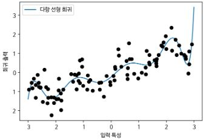


고차원 다항식은 데이터가 부족한 여역에서는 민감하게 동작할 수 있다.

```python 
from sklearn.svm import SVR

for gamma in [1, 10]:
  svr = SVR(gamma=gamma).fit(X, y)
  plt.plot(line, svr.predict(line), label=f"SVR gamma={gamma}")

plt.plot(X[:, 0], y, 'o', c='k')
plt.ylabel("회귀 출력")
plt.xlabel("입력 특성")
plt.legend(loc="best")
```

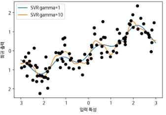


보스턴 주택 가격 데이터 셋에 앞에서 언급한 내용을 반영하면 다음과 같다.

```python 
In:
from sklearn.datasets import load_boston
from sklearn.model_selection import train_test_split
from sklearn.preprocessing import MinMaxScaler

boston = load_boston()
X_train, X_test, y_train, y_test = train_test_split(boston.data, boston.target, random_state=0)

scaler = MinMaxScaler()
X_train_scaled = scaler.fit_transform(X_train)
X_test_scaled = scaler.transform(X_test)

poly = PolynomialFeatures(degree=2).fit(X_train_scaled)
X_train_poly = poly.transform(X_train_scaled)
X_test_poly = poly.transform(X_test_scaled)
print(f"X_train.shape: {X_train.shape}")
print(f"X_train_poly.shape: {X_train_poly.shape}")
```

```python 
Out:
X_train.shape: (379, 13)
X_train_poly.shape: (379, 105)
```

```python 
In:
import pprint

print("다항 특성 이름:")
pprint.pprint(poly.get_feature_names(), width=75, compact=True)
```

```python 
Out:
다항 특성 이름:
['1', 'x0', 'x1', 'x2', 'x3', 'x4', 'x5', 'x6', 'x7', 'x8', 'x9', 'x10',
 'x11', 'x12', 'x0^2', 'x0 x1', 'x0 x2', 'x0 x3', 'x0 x4', 'x0 x5',
 'x0 x6', 'x0 x7', 'x0 x8', 'x0 x9', 'x0 x10', 'x0 x11', 'x0 x12', 'x1^2',
 'x1 x2', 'x1 x3', 'x1 x4', 'x1 x5', 'x1 x6', 'x1 x7', 'x1 x8', 'x1 x9',
 'x1 x10', 'x1 x11', 'x1 x12', 'x2^2', 'x2 x3', 'x2 x4', 'x2 x5', 'x2 x6',
 'x2 x7', 'x2 x8', 'x2 x9', 'x2 x10', 'x2 x11', 'x2 x12', 'x3^2', 'x3 x4',
 'x3 x5', 'x3 x6', 'x3 x7', 'x3 x8', 'x3 x9', 'x3 x10', 'x3 x11', 'x3 x12',
 'x4^2', 'x4 x5', 'x4 x6', 'x4 x7', 'x4 x8', 'x4 x9', 'x4 x10', 'x4 x11',
 'x4 x12', 'x5^2', 'x5 x6', 'x5 x7', 'x5 x8', 'x5 x9', 'x5 x10', 'x5 x11',
 'x5 x12', 'x6^2', 'x6 x7', 'x6 x8', 'x6 x9', 'x6 x10', 'x6 x11', 'x6 x12',
 'x7^2', 'x7 x8', 'x7 x9', 'x7 x10', 'x7 x11', 'x7 x12', 'x8^2', 'x8 x9',
 'x8 x10', 'x8 x11', 'x8 x12', 'x9^2', 'x9 x10', 'x9 x11', 'x9 x12',
 'x10^2', 'x10 x11', 'x10 x12', 'x11^2', 'x11 x12', 'x12^2']
```


상호 작용이 있는 특성 데이터와 없는 데이터에 대해 Ridge 회귀와 랜덤 포레스트에서의 성능을 비교하면 다음과 같다.

```python 
In:
from sklearn.linear_model import Ridge

ridge = Ridge().fit(X_train_scaled, y_train)
print(f"상호 작용 특성이 없을 때 점수: {ridge.score(X_test_scaled, y_test):.3f}")
ridge = Ridge().fit(X_train_poly, y_train)
print(f"상호 작용 특성이 있을 때 점수: {ridge.score(X_test_poly, y_test):.3f}")
```

```python 
Out:
상호 작용 특성이 없을 때 점수: 0.621
상호 작용 특성이 있을 때 점수: 0.753
```

```python 
In:
from sklearn.ensemble import RandomForestRegressor

rf = RandomForestRegressor(n_estimators=100, random_state=0).fit(X_train_scaled, y_train)
print(f"상호 작용 특성이 없을 때 점수: {rf.score(X_test_scaled, y_test):.3f}")
rf = RandomForestRegressor(n_estimators=100, random_state=0).fit(X_train_poly, y_train)
print(f"상호 작용 특성이 있을 때 점수: {rf.score(X_test_poly, y_test)}")
```

```python 
Out:
상호 작용 특성이 없을 때 점수: 0.795
상호 작용 특성이 있을 때 점수: 0.7736296204464514
```

위와 같이 Ridge에서는 상호작용과 다항식 특성이 성능을 크게 높였으나 랜덤 포레스트에서는 오히려 성능이 조금 줄어 들었다.
