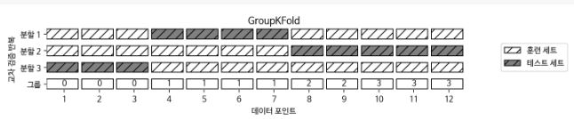

# 5. 모델 평가와 성능 향상

지도 학습 모델을 평가하기 위해 train_test_split 함수를 사용해서 데이터셋을 훈련 세트와 테스트 세트로 나눴다. 그리고 모델을 만들기 위해서 fit 메소드를 적용했고, 모델을 평가하기 위해서 테스트 세트에 score 메소드를 사용했다. 

```python 
In:
from sklearn.datasets import make_blobs
from sklearn.linear_model import LogisticRegression
from sklearn.model_selection import train_test_split

X, y = make_blobs(random_state=0)
X_train, X_test, y_train, y_test = train_test_split(X, y, random_state=0)
logreg = LogisticRegression().fit(X_train, y_train)
print(f"테스트 세트 점수: {logreg.score(X_test, y_test):.2f}")
```

```python 
Out:
테스트 세트 점수: 0.88
```


### 5.1 교차 검증

**교차 검증(Cross-validation)** 에서는 데이터를 여러 번 반복해서 나누고 여러 모델을 학습한다. 가장 널리 사용되는 교차 검증 방법은 ***k*-겹 교차 검증(*k* -fold cross-validation) ** 으로 *k* 는 특정 숫자인데 보통 5 또는 10을 사용한다. 예를 들어 5-겹 교차 검증을 하려면 데이터를 먼저 **폴드(Fold)** 라고 하는 비슷한 크기의 부분 집합 다섯 개로 나눈다. 그 다음 일련의 모델을 만드는데 첫 번째 모델은 첫 번째 폴드를 테스트 세트로, 두 번째 모델은 두 번째 폴드를 테스트 세트로 사용하는 식으로 5개의 모델의 학습 시킨다. 이렇게 결국 다섯 개의 정확도 값을 얻게 된다. 


##### 5.1.1 scikit-learn의 교차 검증

```python 
In:
from sklearn.model_selection import cross_val_score
from sklearn.datasets import load_iris
from sklearn.linear_model import LogisticRegression

iris = load_iris()
logreg = LogisticRegression()

scores = cross_val_score(logreg, iris.data, iris.target, cv=3)
scores = list(map(lambda x:float(f"{x:.3f}"), scores))
print(f"교차 검증 점수: {scores}")
```

```python 
Out:
교차 검증 점수: [0.98, 0.96, 0.98]
```

```python 
In:
scores = cross_val_score(logreg, iris.data, iris.target, cv=5)
scores = list(map(lambda x:float(f"{x:.3f}"), scores))
print(f"교차 검증 점수: {scores}")
```

```python 
Out:
교차 검증 점수: [0.967, 1.0, 0.933, 0.967, 1.0]
```

```python 
In:
print(f"교차 검증 평균 점수: {np.array(scores).mean():.3f}")
```

```python 
Out:
교차 검증 평균 점수: 0.973
```

5-겹 교차 검증이 만든 다섯 개의 값을 보면 100%에서 90%까지 폴드에 따라 비교적 차이가 큰데 이는 모델이 훈련에 사용한 폴드에 매우 의존적이거나 데이터셋이 작기 때문일 수 있다.


##### 5.1.2 교차 검증의 장점

- 장점 
  - 모든 샘플은 테스트 세트에 각 샘플이 한 번씩 들어가게 되므로 분류하기 쉽거나 반대로 어려운 샘플이 적어도 한 번씩 샘플에 들어가게 된다. 이를 통해서 모델을 잘 일반화 할 수 있도록 조정할 수 있다. 
  - 모델이 훈련 데이터에 얼마나 민감한지 알 수 있다. 최악의 경우와 최선의 경우를 짐작할 수 있게 한다.
- 단점 : 모델을 *k*개 만들어야 하므로 데이터를 한 번 나눴을 때보다 대략 *k*배 더 느리다.
- 주의: 교차 검증은 모델을 반환하지 않는다. 즉, 새로운 데이터 적용할 모델을 만드는 방법이 아니다. 다만 주어진 데이셋에 학습된 알고리즘이 얼마나 잘 일반화될지 평가하는 것이다(sklearn.model_selection.cross_val_predict 함수를 사용하면 교차 검증으로 만든 예측값을 구할 수는 있다).


##### 교차 검증 상세 옵션

cross_val_score를 사용할 때 cv 매개변수에 **교차 검증 분할기(Cross-validation splitter)** 를 전달함으로써 데이터를 분할할 때 더 세밀하게 제어 할 수 있다. 

```python 
In:
from sklearn.model_selection import KFold

kfold = KFold(n_splits=5)
scores = cross_val_score(logreg, iris.data, iris.target, cv=kfold)
scores = list(map(lambda x:float(f"{x:.3f}"), scores))
print(f"교차 검증 점수:\n{scores}")
```

```python 
Out:
교차 검증 점수:
[1.0, 1.0, 0.867, 0.933, 0.833]
```


```python 
In:
kfold = KFold(n_splits=3)
scores = cross_val_score(logreg, iris.data, iris.target, cv=kfold)
scores = list(map(lambda x:float(f"{x:.3f}"), scores))
print(f"교차 검증 점수:\n{scores}")
```

```python 
Out:
교차 검증 점수:
[0.0, 0.0, 0.0]
```

위와 같이 데이터가 클래스별로 정렬되어 있을 때 클래스의 갯수만큼 폴드를 생성하면 각 폴드는 데이터셋의 클래스 중 하나에 대응하므로 아무것도 학습할 수 없게 된다.


계층별 폴드를 만드는 대신 이 문제를 해결하는 다른 방법은 데이터를 섞어서 샘플의 순서를 뒤죽박죽으로 만드는 것이다. 이때 random_state를 고정해서 똑같은 작업을 재현할 수 있다. 데이터를 분할하기 전에 섞어주면 결과를 더 좋게 만든다.

```python 
In:
kfold = KFold(n_splits=3, shuffle=True, random_state=0)
scores = cross_val_score(logreg, iris.data, iris.target, cv=kfold)
scores = list(map(lambda x:float(f"{x:.3f}"), scores))
print(f"교차 검증 점수:\n{scores}")
```

```python 
Out:
교차 검증 점수:
[0.98, 0.96, 0.96]
```


##### LOOCV

**LOOCV(Leave-one-out cross-validation)** 교차 검증은 폴드 하나에 샘플 하나만 들어 있는 *k*-겹 교차 검증으로 생각할 수 있다. 각 반복에서 하나의 데이터 포인트를 선택해 테스트 세트로 사용한다. 데이터셋이 클 때는 시간이 오래 걸리지만 작은 데이터에는 더 좋은 결과를 만들어내기도 한다.

```python 
In:
from sklearn.model_selection import LeaveOneOut

loo = LeaveOneOut()
scores = cross_val_score(logreg, iris.data, iris.target, cv=loo)
scores = list(map(lambda x:float(f"{x:.3f}"), scores))
print("교차 검증 분할 횟수: ", len(scores))
print(f"평균 정확도: {np.array(scores).mean():.3f}")
```

```python 
Out:
교차 검증 분할 횟수:  150
평균 정확도: 0.967   
```


##### 임의 분할 교차 검증

**임의 분할 교차 검증(Shuffle-split cross-validation)** 은 train_size만큼의 포인트로 훈련 세트를 만들고, test_size 만큼의 (훈련 세트와 중첩되지 않는) 포인트로 테스트 세트를 만들도록 분할한다. 이 분할은 n_splits 횟수만큼 반복된다.


샘플이 10개인 데이터셋을 5개의 포인트의 훈련세트, 2개의 포인트의 테스트 세트로 4번 반복하여 나누는 예


train_size와 test_size에 정수를 입력하면 데이터 포인트의 절대 개수를 의미하며, 실수를 입력하면 전체 데이터에서의 비율을 나타낸다.

```python 
In:
from sklearn.model_selection import ShuffleSplit

shuffle_split = ShuffleSplit(test_size=.5, train_size=.5, n_splits=10)
scores = cross_val_score(logreg, iris.data, iris.target, cv=shuffle_split)
scores = list(map(lambda x: float(f"{x:.3f}"), scores))
print(f"교차 검증 점수:\n{scores}")
```

```python 
Out:
교차 검증 점수:
[0.973, 0.96, 0.96, 0.973, 1.0, 0.947, 0.973, 0.947, 0.987, 0.947]
```

임의 분할 교차 검증은 반복 횟수를 훈련 세트나 테스트 세트의 크기와 독립적으로 조절해야 할 때 유용하다. 또한 train_size와 test_size의 합을 전체와 다르게 함으로써 전체 데이터의 일부만 사용할 수 있는데 이렇게 데이터를 부분 샘플링(Subsampling)하는 방식은 대규모 데이터셋으로 작업할 때 도움이 된다.

ShuffleSplit의 계층별 버전으로 분류 작업에 더 적합한 StratifiedShuffleSplit도 있다.


##### 그룹별 교차 검증

훈련 세트와 테스트 세트를 만들 때 분리되지 않아야 할 그룹을 지정할 필요가 있는데 이때 그룹을 지정하는 매개변수 groups를 인자로 넘겨받을 수 있는 GroupKFold를 사용할 수 있다. 여기서 주의할 점은 분리되지 않아야할 그룹을 지정한다는 점이며 클래스 레이블과 혼동해서는 안된다.


다음의 데이터셋은 12개로 이루어져 있고 groups는 각 데이터 포인트에 대해 각 포인트가 어떤 그룹에 속하는지를 나타낸다.  처음 3개의 샘플이 첫 번째 그룹, 다음 4개의 샘플은 두 번째 그룹을 나타내는 식이다. 샘플 데이터를 그룹별로 정렬할 필요는 없다.

```python 
In:
from sklearn.model_selection import GroupKFold

X, y = make_blobs(n_samples=12, random_state=0)
groups = [0, 0, 0, 1, 1, 1, 1, 2, 2, 3, 3, 3]
scores = cross_val_score(logreg, X, y, groups, cv=GroupKFold(n_splits=3))
scores = list(map(lambda x: float(f"{x:.3f}"), scores))
print(f"교차 검증 점수:\n{scores}") 
```

```python 
Out:
교차 검증 점수:
[0.75, 0.6, 0.667]
```




### 5.2 그리드 서치

모델에서 중요한 매개변수의 (일반화 성능을 최대로 높여주는) 값을 찾는 일은 어려운 작업이지만, 모든 모델과 데이터셋에서 해야하는 필수적인 일이다.  scikit-learn에서는 **그리드 서치(Grid search)** 로 관심 있는 매개변수들을 대상으로 가능한 모든 조합을 시도해 본다.


##### 5.2.1 간단한 그리드 서치

```python 
In:
from sklearn.datasets import load_iris
from sklearn.model_selection import train_test_split
from sklearn.svm import SVC

iris = load_iris()
X_train, X_test, y_train, y_test = train_test_split(iris.data, iris.target, random_state=0)
print(f"훈련 세트의 크기: {X_train.shape[0]} 테스트 세트의 크기: {X_test.shape[0]}")

best_score = 0

for gamma in [10**i for i in range(-3, 3)]:
  for C in [10**j for j in range(-3, 3)]:
    svm = SVC(gamma=gamma, C=C)
    svm.fit(X_train, y_train)
    score = svm.score(X_test, y_test)
    if score > best_score:
      best_score = score
      best_parameter = {'C': C, 'gamma' : gamma}

print(f"최고 점수: {best_score:.2f}")
print(f"최적 매개변수: {best_parameter}")
```

```python 
Out:
훈련 세트의 크기: 112 테스트 세트의 크기: 38
최고 점수: 0.97
최적 매개변수: {'C': 100, 'gamma': 0.001}
```


##### 5.2.2 매개변수 과대적합과 검증 세트

앞에서 여러 가지 매개변수 값으로 많이 시도해보고 테스트 세트 정확도가 높은 조합을 선택했는데 이 정확도는 새로운 데이터까지 이어지지 않을 수 있다. 왜냐하면 매개변수를 조정하기 위해 테스트 세트를 이미 사용했기 때문이다. 평가를 위해서는 모델을 만들 때 사용하지 않는 독립된 테스트 셋이 필요하다.


모델을 생성할 때는 세 개의 세트로 나누어 훈련 세트로는 모델을 만들고, 검증 세트로는 모델의 매개변수를 선택하고, 테스트 세트로는 선택된 매개변수의 성능을 평가한다.


```python 
In:
from sklearn.datasets import load_iris
from sklearn.model_selection import train_test_split
from sklearn.svm import SVC

iris = load_iris()
X_trainval, X_test, y_trainval, y_test = train_test_split(iris.data, iris.target, random_state=0)
X_train, X_valid, y_train, y_valid = train_test_split(X_trainval, y_trainval, random_state=1)
print(f"훈련 세트의 크기: {X_train.shape[0]}  검증 세트의 크기: {X_valid.shape[0]}  \
테스트 세트의 크기: {X_test.shape[0]}\n")

best_score = 0

for gamma in [10**i for i in range(-3, 3)]:
  for C in [10**j for j in range(-3, 3)]:
    svm = SVC(gamma=gamma, C=C)
    svm.fit(X_train, y_train)
    score = svm.score(X_valid, y_valid)
    if score > best_score:
      best_score = score
      best_parameters = {'C': C, 'gamma' : gamma}

svm = SVC(**best_parameters)
svm.fit(X_trainval, y_trainval)
test_score = svm.score(X_test, y_test)
print(f"검증 세트에서 최고 점수: {best_score:.2f}")
print(f"최적 매개변수: ", best_parameters)
print(f"최적 매개변수에서 테스트 세트 점수: {test_score:.2f}")
```

```python 
Out:
훈련 세트의 크기: 84  검증 세트의 크기: 28  테스트 세트의 크기: 38

검증 세트에서 최고 점수: 0.96
최적 매개변수:  {'C': 10, 'gamma': 0.001}
최적 매개변수에서 테스트 세트 점수: 0.92
```

훈련 세트, 검증 세트, 테스트 세트의 구분은 실제 머신러닝 알고리즘을 적용하는 데 아주 중요하다. 테스트 세트 정확도에 기초해 어떤 선택을 했다면 테스트 세트의 정보를 모델에 누설하는 것이다. 그렇기 때문에 최종 평가에만 사용하도록 테스트 세트를 분리해 유지하는 것이 중요하다.


##### 5.2.3 교차 검증을 사용한 그리드 서치

일반화 성능을 더 잘 평가하려면 훈련 세트와 검증 세트를 한 번만 나누지 않고, 교차 검증을 사용해서 각 매개변수 조합의 성능을 평가할 수 있다. 

```python 
In:
from sklearn.model_selection import cross_val_score

best_score = 0

for gamma in [10**i for i in range(-3, 3)]:
  for C in [10**j for j in range(-3, 3)]:
    svm = SVC(gamma=gamma, C=C)
    scores = cross_val_score(svm, X_trainval, y_trainval, cv=5)
    score = np.mean(scores)
    if score > best_score:
      best_score = score
      best_parameters = {'C': C, 'gamma' : gamma}

svm = SVC(**best_parameters)
svm.fit(X_trainval, y_trainval)
```

```python 
Out:
SVC(C=10, break_ties=False, cache_size=200, class_weight=None, coef0=0.0,
    decision_function_shape='ovr', degree=3, gamma=0.1, kernel='rbf',
    max_iter=-1, probability=False, random_state=None, shrinking=True,
    tol=0.001, verbose=False)
```


데이터를 나누고 그리드 서치를 적용하여 최종 매개변수를 평가하는 전체과정은 다음과 같다.


교차 검증을 사용한 그리드 서치는 scikit-learn에서 GridSearchCV로 제공하고 있다. GridSearchCV에서 분류에는 StratifiedKFold를, 회귀에서는 KFold를 기본 값으로 사용한다. 다른 추정기를 사용해 만든 추정기를 scikit-learn에서는 메타 추정기(Meta-estimator)라고 한다(MetaEstimatorMixin 클래스를 상속한 모델로 랜덤 포레스트, 그래디언트 부스팅, RFE 등이 있다). GridSearchCV는 가장 널리 사용되는 메타 추정기 중 하나이다. GridSearchCV는 전체 데이터로 학습한 모델에 접근할 수 있도록 predict, score, predict_proba, decision_function 같은 메소드를 제공한다.

```python 
In:
from sklearn.model_selection import GridSearchCV
from sklearn.svm import SVC

param_grid = {'C' : [10**i for i in range(-3, 3)],
              'gamma' : [10**j for j in range(-3, 3)]}
grid_search = GridSearchCV(SVC(), param_grid, cv=5)
X_train, X_test, y_train, y_test = train_test_split(iris.data, iris.target, random_state=0)
grid_search.fit(X_train, y_train)
print(f"테스트 세트 점수: {grid_search.score(X_test, y_test):.2f}")
print(f"최적 매개변수: {grid_search.best_params_}")
print(f"최상 교차 검증 점수: {grid_search.best_score_:.2f}")
print(f"최고 성능 모델:\n{grid_search.best_estimator_}")
```

```python 
Out:
테스트 세트 점수: 0.97
최적 매개변수: {'C': 10, 'gamma': 0.1}
최상 교차 검증 점수: 0.97
최고 성능 모델:
SVC(C=10, break_ties=False, cache_size=200, class_weight=None, coef0=0.0,
    decision_function_shape='ovr', degree=3, gamma=0.1, kernel='rbf',
    max_iter=-1, probability=False, random_state=None, shrinking=True,
    tol=0.001, verbose=False)
```


##### 교차 검증 결과 분석

교차 검증의 결과를 시각화하면 검색 대생 매개변수가 모델의 일반화에 영향을 얼마나 주는지 이해하는 데 도움이 된다. 그리드 서치는 연산 비용이 매우 크므로 비교적 간격을 넓게 하여 적은 수의 그리드로 시작하는 것이 좋다. 그런 다음 교차 검증된 그리드 서치의 결과를 분석하여 검색을 확장해나갈 수 있다(GridSearchCV외 에도 널리 사용하는 또 하나의 방법으로, 주어진 범위에서 매개변수를 무작위로 선택하여 조사하는 RandomizedSearchCV가 있다. GridSearchCV와 비교하여 결과가 크게 뒤지지 않고 검색이 빠르기 때문에 매개변수의 조합이 매우 많거나 규제 매개변수와 같이 연속형 값을 조정해야할 때 널리 사용한다). 그리드 서치의 결과는 검색과 관련한 여러 정보가 cv_results_ 딕셔너리 속성에 담겨있다. 

```python 
import pandas as pd

results = pd.DataFrame(grid_search.cv_results_)
display(results.head())
```


results 행 하나는 특정한 하나의 매개변수 설정에 대응한다. 각 설정에 대해 교차 검증의 모든 분할의 평균값, 표준편차를 포함한 결과가 기록되어 있다. 

```python 
scores = np.array(results.mean_test_score).reshape(6, 6)
mglearn.tools.heatmap(scores, xlabel='gamma', xticklabels=param_grid['gamma'],
                      ylabel='C', yticklabels=param_grid['C'], cmap='viridis')
```


다음은 검색 범위가 적절하게 선택되지 않아서 바람직하지 못한 결과를 내는 그래프의 예이다.

```python 
fig, axes = plt.subplots(1, 3, figsize=(13, 5))
param_grid_linear = {'C': np.linspace(1, 2, 6),
                     'gamma': np.linspace(1, 2, 6)}

param_grid_one_log = {'C': np.linspace(1, 2, 6),
                      'gamma': np.logspace(-3, 2, 6)}

param_grid_range = {'C': np.logspace(-3, 2, 6),
                    'gamma' : np.logspace(-7, -2, 6)}

for param_grid, ax in zip([param_grid_linear, param_grid_one_log,
                           param_grid_range], axes):
  grid_search = GridSearchCV(SVC(), param_grid, cv=5)
  grid_search.fit(X_train, y_train)
  scores = grid_search.cv_results_['mean_test_score'].reshape(6, 6)

  scores_image = mglearn.tools.heatmap(
      scores, xlabel="gamma", ylabel='C', xticklabels = param_grid['gamma'],
      yticklabels=param_grid['C'], cmap='viridis', ax=ax
  )

plt.colorbar(scores_image, ax=axes.tolist())
```


첫번째 그래프는 점수 변화가 전혀 없는데 이런 결과는 매개변수의 스케일과 점위가 부적절할 때 발생한다. 매개변수의 설정이 바뀌어도 정확도에 아무런 변화가 없다면 그 매개변수가 전혀 중요하지 않은 것일 수도 있다. 처음에 매우 극단적인 값을 적용해보고, 매개변수를 바꿔가며 정확도가 변하는지 살펴보는 것이 좋다. 

두번째 그래프에서는 gamma 매개변수는 적절한 범위를 탐색하고 있지만 C 매개변수는 그렇지 못든지, 아니면 중요한 매개변수가 아닐 수도 있다. 

세번째 그래프에서는 다음 번 검색 땐 매개변수 그리드에서 매우 작은 단위는 제외할 수 있을 것이다.

교차검증 점수를 토대로 매개변수 그리드를 튜닝하는 것은 아주 안전한 방법이며, 매개변수들의 중요도를 확인하는 데도 좋다.

