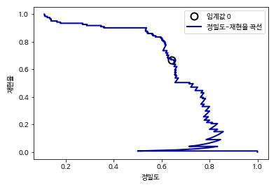

# 5. 모델 평가와 성능 향상

지도 학습 모델을 평가하기 위해 train_test_split 함수를 사용해서 데이터셋을 훈련 세트와 테스트 세트로 나눴다. 그리고 모델을 만들기 위해서 fit 메소드를 적용했고, 모델을 평가하기 위해서 테스트 세트에 score 메소드를 사용했다. 

```python 
In:
from sklearn.datasets import make_blobs
from sklearn.linear_model import LogisticRegression
from sklearn.model_selection import train_test_split

X, y = make_blobs(random_state=0)
X_train, X_test, y_train, y_test = train_test_split(X, y, random_state=0)
logreg = LogisticRegression().fit(X_train, y_train)
print(f"테스트 세트 점수: {logreg.score(X_test, y_test):.2f}")
```

```python 
Out:
테스트 세트 점수: 0.88
```


### 5.1 교차 검증

**교차 검증(Cross-validation)** 에서는 데이터를 여러 번 반복해서 나누고 여러 모델을 학습한다. 가장 널리 사용되는 교차 검증 방법은 ***k*-겹 교차 검증(*k* -fold cross-validation) ** 으로 *k* 는 특정 숫자인데 보통 5 또는 10을 사용한다. 예를 들어 5-겹 교차 검증을 하려면 데이터를 먼저 **폴드(Fold)** 라고 하는 비슷한 크기의 부분 집합 다섯 개로 나눈다. 그 다음 일련의 모델을 만드는데 첫 번째 모델은 첫 번째 폴드를 테스트 세트로, 두 번째 모델은 두 번째 폴드를 테스트 세트로 사용하는 식으로 5개의 모델의 학습 시킨다. 이렇게 결국 다섯 개의 정확도 값을 얻게 된다. 


##### 5.1.1 scikit-learn의 교차 검증

```python 
In:
from sklearn.model_selection import cross_val_score
from sklearn.datasets import load_iris
from sklearn.linear_model import LogisticRegression

iris = load_iris()
logreg = LogisticRegression()

scores = cross_val_score(logreg, iris.data, iris.target, cv=3)
scores = list(map(lambda x:float(f"{x:.3f}"), scores))
print(f"교차 검증 점수: {scores}")
```

```python 
Out:
교차 검증 점수: [0.98, 0.96, 0.98]
```

```python 
In:
scores = cross_val_score(logreg, iris.data, iris.target, cv=5)
scores = list(map(lambda x:float(f"{x:.3f}"), scores))
print(f"교차 검증 점수: {scores}")
```

```python 
Out:
교차 검증 점수: [0.967, 1.0, 0.933, 0.967, 1.0]
```

```python 
In:
print(f"교차 검증 평균 점수: {np.array(scores).mean():.3f}")
```

```python 
Out:
교차 검증 평균 점수: 0.973
```

5-겹 교차 검증이 만든 다섯 개의 값을 보면 100%에서 90%까지 폴드에 따라 비교적 차이가 큰데 이는 모델이 훈련에 사용한 폴드에 매우 의존적이거나 데이터셋이 작기 때문일 수 있다.


##### 5.1.2 교차 검증의 장점

- 장점 
  - 모든 샘플은 테스트 세트에 각 샘플이 한 번씩 들어가게 되므로 분류하기 쉽거나 반대로 어려운 샘플이 적어도 한 번씩 샘플에 들어가게 된다. 이를 통해서 모델을 잘 일반화 할 수 있도록 조정할 수 있다. 
  - 모델이 훈련 데이터에 얼마나 민감한지 알 수 있다. 최악의 경우와 최선의 경우를 짐작할 수 있게 한다.
- 단점 : 모델을 *k*개 만들어야 하므로 데이터를 한 번 나눴을 때보다 대략 *k*배 더 느리다.
- 주의: 교차 검증은 모델을 반환하지 않는다. 즉, 새로운 데이터 적용할 모델을 만드는 방법이 아니다. 다만 주어진 데이셋에 학습된 알고리즘이 얼마나 잘 일반화될지 평가하는 것이다(sklearn.model_selection.cross_val_predict 함수를 사용하면 교차 검증으로 만든 예측값을 구할 수는 있다).


##### 교차 검증 상세 옵션

cross_val_score를 사용할 때 cv 매개변수에 **교차 검증 분할기(Cross-validation splitter)** 를 전달함으로써 데이터를 분할할 때 더 세밀하게 제어 할 수 있다. 

```python 
In:
from sklearn.model_selection import KFold

kfold = KFold(n_splits=5)
scores = cross_val_score(logreg, iris.data, iris.target, cv=kfold)
scores = list(map(lambda x:float(f"{x:.3f}"), scores))
print(f"교차 검증 점수:\n{scores}")
```

```python 
Out:
교차 검증 점수:
[1.0, 1.0, 0.867, 0.933, 0.833]
```


```python 
In:
kfold = KFold(n_splits=3)
scores = cross_val_score(logreg, iris.data, iris.target, cv=kfold)
scores = list(map(lambda x:float(f"{x:.3f}"), scores))
print(f"교차 검증 점수:\n{scores}")
```

```python 
Out:
교차 검증 점수:
[0.0, 0.0, 0.0]
```

위와 같이 데이터가 클래스별로 정렬되어 있을 때 클래스의 갯수만큼 폴드를 생성하면 각 폴드는 데이터셋의 클래스 중 하나에 대응하므로 아무것도 학습할 수 없게 된다.


계층별 폴드를 만드는 대신 이 문제를 해결하는 다른 방법은 데이터를 섞어서 샘플의 순서를 뒤죽박죽으로 만드는 것이다. 이때 random_state를 고정해서 똑같은 작업을 재현할 수 있다. 데이터를 분할하기 전에 섞어주면 결과를 더 좋게 만든다.

```python 
In:
kfold = KFold(n_splits=3, shuffle=True, random_state=0)
scores = cross_val_score(logreg, iris.data, iris.target, cv=kfold)
scores = list(map(lambda x:float(f"{x:.3f}"), scores))
print(f"교차 검증 점수:\n{scores}")
```

```python 
Out:
교차 검증 점수:
[0.98, 0.96, 0.96]
```


##### LOOCV

**LOOCV(Leave-one-out cross-validation)** 교차 검증은 폴드 하나에 샘플 하나만 들어 있는 *k*-겹 교차 검증으로 생각할 수 있다. 각 반복에서 하나의 데이터 포인트를 선택해 테스트 세트로 사용한다. 데이터셋이 클 때는 시간이 오래 걸리지만 작은 데이터에는 더 좋은 결과를 만들어내기도 한다.

```python 
In:
from sklearn.model_selection import LeaveOneOut

loo = LeaveOneOut()
scores = cross_val_score(logreg, iris.data, iris.target, cv=loo)
scores = list(map(lambda x:float(f"{x:.3f}"), scores))
print("교차 검증 분할 횟수: ", len(scores))
print(f"평균 정확도: {np.array(scores).mean():.3f}")
```

```python 
Out:
교차 검증 분할 횟수:  150
평균 정확도: 0.967   
```


##### 임의 분할 교차 검증

**임의 분할 교차 검증(Shuffle-split cross-validation)** 은 train_size만큼의 포인트로 훈련 세트를 만들고, test_size 만큼의 (훈련 세트와 중첩되지 않는) 포인트로 테스트 세트를 만들도록 분할한다. 이 분할은 n_splits 횟수만큼 반복된다.


샘플이 10개인 데이터셋을 5개의 포인트의 훈련세트, 2개의 포인트의 테스트 세트로 4번 반복하여 나누는 예


train_size와 test_size에 정수를 입력하면 데이터 포인트의 절대 개수를 의미하며, 실수를 입력하면 전체 데이터에서의 비율을 나타낸다.

```python 
In:
from sklearn.model_selection import ShuffleSplit

shuffle_split = ShuffleSplit(test_size=.5, train_size=.5, n_splits=10)
scores = cross_val_score(logreg, iris.data, iris.target, cv=shuffle_split)
scores = list(map(lambda x: float(f"{x:.3f}"), scores))
print(f"교차 검증 점수:\n{scores}")
```

```python 
Out:
교차 검증 점수:
[0.973, 0.96, 0.96, 0.973, 1.0, 0.947, 0.973, 0.947, 0.987, 0.947]
```

임의 분할 교차 검증은 반복 횟수를 훈련 세트나 테스트 세트의 크기와 독립적으로 조절해야 할 때 유용하다. 또한 train_size와 test_size의 합을 전체와 다르게 함으로써 전체 데이터의 일부만 사용할 수 있는데 이렇게 데이터를 부분 샘플링(Subsampling)하는 방식은 대규모 데이터셋으로 작업할 때 도움이 된다.

ShuffleSplit의 계층별 버전으로 분류 작업에 더 적합한 StratifiedShuffleSplit도 있다.


##### 그룹별 교차 검증

훈련 세트와 테스트 세트를 만들 때 분리되지 않아야 할 그룹을 지정할 필요가 있는데 이때 그룹을 지정하는 매개변수 groups를 인자로 넘겨받을 수 있는 GroupKFold를 사용할 수 있다. 여기서 주의할 점은 분리되지 않아야할 그룹을 지정한다는 점이며 클래스 레이블과 혼동해서는 안된다.


다음의 데이터셋은 12개로 이루어져 있고 groups는 각 데이터 포인트에 대해 각 포인트가 어떤 그룹에 속하는지를 나타낸다.  처음 3개의 샘플이 첫 번째 그룹, 다음 4개의 샘플은 두 번째 그룹을 나타내는 식이다. 샘플 데이터를 그룹별로 정렬할 필요는 없다.

```python 
In:
from sklearn.model_selection import GroupKFold

X, y = make_blobs(n_samples=12, random_state=0)
groups = [0, 0, 0, 1, 1, 1, 1, 2, 2, 3, 3, 3]
scores = cross_val_score(logreg, X, y, groups, cv=GroupKFold(n_splits=3))
scores = list(map(lambda x: float(f"{x:.3f}"), scores))
print(f"교차 검증 점수:\n{scores}") 
```

```python 
Out:
교차 검증 점수:
[0.75, 0.6, 0.667]
```


### 5.2 그리드 서치

모델에서 중요한 매개변수의 (일반화 성능을 최대로 높여주는) 값을 찾는 일은 어려운 작업이지만, 모든 모델과 데이터셋에서 해야하는 필수적인 일이다.  scikit-learn에서는 **그리드 서치(Grid search)** 로 관심 있는 매개변수들을 대상으로 가능한 모든 조합을 시도해 본다.


##### 5.2.1 간단한 그리드 서치

```python 
In:
from sklearn.datasets import load_iris
from sklearn.model_selection import train_test_split
from sklearn.svm import SVC

iris = load_iris()
X_train, X_test, y_train, y_test = train_test_split(iris.data, iris.target, random_state=0)
print(f"훈련 세트의 크기: {X_train.shape[0]} 테스트 세트의 크기: {X_test.shape[0]}")

best_score = 0

for gamma in [10**i for i in range(-3, 3)]:
  for C in [10**j for j in range(-3, 3)]:
    svm = SVC(gamma=gamma, C=C)
    svm.fit(X_train, y_train)
    score = svm.score(X_test, y_test)
    if score > best_score:
      best_score = score
      best_parameter = {'C': C, 'gamma' : gamma}

print(f"최고 점수: {best_score:.2f}")
print(f"최적 매개변수: {best_parameter}")
```

```python 
Out:
훈련 세트의 크기: 112 테스트 세트의 크기: 38
최고 점수: 0.97
최적 매개변수: {'C': 100, 'gamma': 0.001}
```


##### 5.2.2 매개변수 과대적합과 검증 세트

앞에서 여러 가지 매개변수 값으로 많이 시도해보고 테스트 세트 정확도가 높은 조합을 선택했는데 이 정확도는 새로운 데이터까지 이어지지 않을 수 있다. 왜냐하면 매개변수를 조정하기 위해 테스트 세트를 이미 사용했기 때문이다. 평가를 위해서는 모델을 만들 때 사용하지 않는 독립된 테스트 셋이 필요하다.


모델을 생성할 때는 세 개의 세트로 나누어 훈련 세트로는 모델을 만들고, 검증 세트로는 모델의 매개변수를 선택하고, 테스트 세트로는 선택된 매개변수의 성능을 평가한다.


```python 
In:
from sklearn.datasets import load_iris
from sklearn.model_selection import train_test_split
from sklearn.svm import SVC

iris = load_iris()
X_trainval, X_test, y_trainval, y_test = train_test_split(iris.data, iris.target, random_state=0)
X_train, X_valid, y_train, y_valid = train_test_split(X_trainval, y_trainval, random_state=1)
print(f"훈련 세트의 크기: {X_train.shape[0]}  검증 세트의 크기: {X_valid.shape[0]}  \
테스트 세트의 크기: {X_test.shape[0]}\n")

best_score = 0

for gamma in [10**i for i in range(-3, 3)]:
  for C in [10**j for j in range(-3, 3)]:
    svm = SVC(gamma=gamma, C=C)
    svm.fit(X_train, y_train)
    score = svm.score(X_valid, y_valid)
    if score > best_score:
      best_score = score
      best_parameters = {'C': C, 'gamma' : gamma}

svm = SVC(**best_parameters)
svm.fit(X_trainval, y_trainval)
test_score = svm.score(X_test, y_test)
print(f"검증 세트에서 최고 점수: {best_score:.2f}")
print(f"최적 매개변수: ", best_parameters)
print(f"최적 매개변수에서 테스트 세트 점수: {test_score:.2f}")
```

```python 
Out:
훈련 세트의 크기: 84  검증 세트의 크기: 28  테스트 세트의 크기: 38

검증 세트에서 최고 점수: 0.96
최적 매개변수:  {'C': 10, 'gamma': 0.001}
최적 매개변수에서 테스트 세트 점수: 0.92
```

훈련 세트, 검증 세트, 테스트 세트의 구분은 실제 머신러닝 알고리즘을 적용하는 데 아주 중요하다. 테스트 세트 정확도에 기초해 어떤 선택을 했다면 테스트 세트의 정보를 모델에 누설하는 것이다. 그렇기 때문에 최종 평가에만 사용하도록 테스트 세트를 분리해 유지하는 것이 중요하다.


##### 5.2.3 교차 검증을 사용한 그리드 서치

일반화 성능을 더 잘 평가하려면 훈련 세트와 검증 세트를 한 번만 나누지 않고, 교차 검증을 사용해서 각 매개변수 조합의 성능을 평가할 수 있다. 

```python 
In:
from sklearn.model_selection import cross_val_score

best_score = 0

for gamma in [10**i for i in range(-3, 3)]:
  for C in [10**j for j in range(-3, 3)]:
    svm = SVC(gamma=gamma, C=C)
    scores = cross_val_score(svm, X_trainval, y_trainval, cv=5)
    score = np.mean(scores)
    if score > best_score:
      best_score = score
      best_parameters = {'C': C, 'gamma' : gamma}

svm = SVC(**best_parameters)
svm.fit(X_trainval, y_trainval)
```

```python 
Out:
SVC(C=10, break_ties=False, cache_size=200, class_weight=None, coef0=0.0,
    decision_function_shape='ovr', degree=3, gamma=0.1, kernel='rbf',
    max_iter=-1, probability=False, random_state=None, shrinking=True,
    tol=0.001, verbose=False)
```


데이터를 나누고 그리드 서치를 적용하여 최종 매개변수를 평가하는 전체과정은 다음과 같다.


교차 검증을 사용한 그리드 서치는 scikit-learn에서 GridSearchCV로 제공하고 있다. GridSearchCV에서 분류에는 StratifiedKFold를, 회귀에서는 KFold를 기본 값으로 사용한다. 다른 추정기를 사용해 만든 추정기를 scikit-learn에서는 메타 추정기(Meta-estimator)라고 한다(MetaEstimatorMixin 클래스를 상속한 모델로 랜덤 포레스트, 그래디언트 부스팅, RFE 등이 있다). GridSearchCV는 가장 널리 사용되는 메타 추정기 중 하나이다. GridSearchCV는 전체 데이터로 학습한 모델에 접근할 수 있도록 predict, score, predict_proba, decision_function 같은 메소드를 제공한다.

```python 
In:
from sklearn.model_selection import GridSearchCV
from sklearn.svm import SVC

param_grid = {'C' : [10**i for i in range(-3, 3)],
              'gamma' : [10**j for j in range(-3, 3)]}
grid_search = GridSearchCV(SVC(), param_grid, cv=5)
X_train, X_test, y_train, y_test = train_test_split(iris.data, iris.target, random_state=0)
grid_search.fit(X_train, y_train)
print(f"테스트 세트 점수: {grid_search.score(X_test, y_test):.2f}")
print(f"최적 매개변수: {grid_search.best_params_}")
print(f"최상 교차 검증 점수: {grid_search.best_score_:.2f}")
print(f"최고 성능 모델:\n{grid_search.best_estimator_}")
```

```python 
Out:
테스트 세트 점수: 0.97
최적 매개변수: {'C': 10, 'gamma': 0.1}
최상 교차 검증 점수: 0.97
최고 성능 모델:
SVC(C=10, break_ties=False, cache_size=200, class_weight=None, coef0=0.0,
    decision_function_shape='ovr', degree=3, gamma=0.1, kernel='rbf',
    max_iter=-1, probability=False, random_state=None, shrinking=True,
    tol=0.001, verbose=False)
```


##### 교차 검증 결과 분석

교차 검증의 결과를 시각화하면 검색 대생 매개변수가 모델의 일반화에 영향을 얼마나 주는지 이해하는 데 도움이 된다. 그리드 서치는 연산 비용이 매우 크므로 비교적 간격을 넓게 하여 적은 수의 그리드로 시작하는 것이 좋다. 그런 다음 교차 검증된 그리드 서치의 결과를 분석하여 검색을 확장해나갈 수 있다(GridSearchCV외 에도 널리 사용하는 또 하나의 방법으로, 주어진 범위에서 매개변수를 무작위로 선택하여 조사하는 RandomizedSearchCV가 있다. GridSearchCV와 비교하여 결과가 크게 뒤지지 않고 검색이 빠르기 때문에 매개변수의 조합이 매우 많거나 규제 매개변수와 같이 연속형 값을 조정해야할 때 널리 사용한다). 그리드 서치의 결과는 검색과 관련한 여러 정보가 cv_results_ 딕셔너리 속성에 담겨있다. 

```python 
import pandas as pd

results = pd.DataFrame(grid_search.cv_results_)
display(results.head())
```


results 행 하나는 특정한 하나의 매개변수 설정에 대응한다. 각 설정에 대해 교차 검증의 모든 분할의 평균값, 표준편차를 포함한 결과가 기록되어 있다. 

```python 
scores = np.array(results.mean_test_score).reshape(6, 6)
mglearn.tools.heatmap(scores, xlabel='gamma', xticklabels=param_grid['gamma'],
                      ylabel='C', yticklabels=param_grid['C'], cmap='viridis')
```


다음은 검색 범위가 적절하게 선택되지 않아서 바람직하지 못한 결과를 내는 그래프의 예이다.

```python 
fig, axes = plt.subplots(1, 3, figsize=(13, 5))
param_grid_linear = {'C': np.linspace(1, 2, 6),
                     'gamma': np.linspace(1, 2, 6)}

param_grid_one_log = {'C': np.linspace(1, 2, 6),
                      'gamma': np.logspace(-3, 2, 6)}

param_grid_range = {'C': np.logspace(-3, 2, 6),
                    'gamma' : np.logspace(-7, -2, 6)}

for param_grid, ax in zip([param_grid_linear, param_grid_one_log,
                           param_grid_range], axes):
  grid_search = GridSearchCV(SVC(), param_grid, cv=5)
  grid_search.fit(X_train, y_train)
  scores = grid_search.cv_results_['mean_test_score'].reshape(6, 6)

  scores_image = mglearn.tools.heatmap(
      scores, xlabel="gamma", ylabel='C', xticklabels = param_grid['gamma'],
      yticklabels=param_grid['C'], cmap='viridis', ax=ax
  )

plt.colorbar(scores_image, ax=axes.tolist())
```


첫번째 그래프는 점수 변화가 전혀 없는데 이런 결과는 매개변수의 스케일과 점위가 부적절할 때 발생한다. 매개변수의 설정이 바뀌어도 정확도에 아무런 변화가 없다면 그 매개변수가 전혀 중요하지 않은 것일 수도 있다. 처음에 매우 극단적인 값을 적용해보고, 매개변수를 바꿔가며 정확도가 변하는지 살펴보는 것이 좋다. 

두번째 그래프에서는 gamma 매개변수는 적절한 범위를 탐색하고 있지만 C 매개변수는 그렇지 못든지, 아니면 중요한 매개변수가 아닐 수도 있다. 

세번째 그래프에서는 다음 번 검색 땐 매개변수 그리드에서 매우 작은 단위는 제외할 수 있을 것이다.

교차검증 점수를 토대로 매개변수 그리드를 튜닝하는 것은 아주 안전한 방법이며, 매개변수들의 중요도를 확인하는 데도 좋다.


##### 비대칭 매개변수 그리드 탐색

GridSearchCV에 전달할 param_grid를 딕셔너리의 리스트로 만들면 리스트에 있는 각 딕셔너리는 독립적인 그리드로 적용된다. 

```python 
In:
from sklearn.model_selection import GridSearchCV, train_test_split
from sklearn.datasets import load_iris
from sklearn.svm import SVC

iris = load_iris()
X_train, X_test, y_train, y_test = train_test_split(iris.data, iris.target, random_state=0)

param_grid = [{'kernel': ['rbf'], 
               'C': [10**i for i in range(-3, 3)],
               'gamma': [10**i for i in range(-3, 3)]},
              {'kernel': ['linear'],
               'C': [10**i for i in range(-3, 3)]}]
grid_search = GridSearchCV(SVC(), param_grid, cv=5)
grid_search.fit(X_train, y_train)
print(f"최적 매개변수: {grid_search.best_params_}")
print(f"최고 교차 검증 점수: {grid_search.best_score_:.2f}")
```

```python 
Out:
최적 매개변수: {'C': 10, 'gamma': 0.1, 'kernel': 'rbf'}
최고 교차 검증 점수: 0.97
```

```python 
import pandas as pd

results = pd.DataFrame(grid_search.cv_results_)
display(results.T)
```


##### 그리드 서치에 다양한 교차 검증 적용

GridSearchCV의 분류에서는 기본적으로 계층형 *k*-겹 교차 검증을 사용하고 회귀에는 *k*-겹 교차 검증을 사용한다. 그러나 cv 매개변수를 통해 다른 교차 검증 분할기를 사용할 수도 있다. ShuffleSplit이나 StratifiedShuffleSplit의 n_splits=1로 하면 훈련 세트와 검증 세트를 1번만 분할하는데 이런 방법은 데이터 셋이 매우 크거나 모델 구축에 시간이 오래 걸릴 때 유용하다.


##### 중첩 교차 검증

원본 데이터를 훈련 세트와 테스트 세트로 한 번만 나누는 방식 대신 더 나아가 교차 검증 분할 방식을 사용할 수 있다. **중첩 교차 검증(Nested cross-validation)** 은 바깥쪽 루프에서 데이터를 훈련 세트와 테스트 세트로 나눈다. 그리고 각 훈련 세트에 대해 그리드 서치를 실행한다(바깥쪽 루프에서 분할된 훈련 세트마다 최적의 매개변수가 다를 수 있음). 그런 다음 바깥쪽에서 분할된 테스트 세트의 점수를 최적의 매개변수 설정을 사용해 각각 측정한다. 

이 방법은 모델이나 매개변수 설정이 아닌 테스트 점수의 목록을 만들어준다. 이 점수들은 그리드 서치를 통해 찾은 최적 매개변수가 모델을 얼마나 잘 일반화시키는지 알려준다. 새로운 데이터에 적용할 모델을 만드는 것이 아니니, 중첩 교차 검증은 새로운 데이터에 적용하기위한 예측 모델을 찾는데는 사용하지 않는다. 

```python 
In:
from sklearn.model_selection import cross_val_score

param_grid = {'C' : [10**i for i in range(-3, 3)],
              'gamma' : [10**i for i in range(-3, 3)]}
scores = cross_val_score(GridSearchCV(SVC(), param_grid, cv=5), iris.data, iris.target, cv=5)

scores = list(map(lambda x: float(f"{x:.3f}"), scores))
print("교차 검증 점수: ", scores)
print(f"교차 검증 평균 점수: {np.array(scores).mean():.3f}") 
```

```python 
Out:
교차 검증 점수:  [0.967, 1.0, 0.967, 0.967, 1.0]
교차 검증 평균 점수: 0.980
```

이를 직접 간단하게 구현해보면 아래와 같다.

```python 
In:
from sklearn.model_selection import ParameterGrid, StratifiedKFold

def nested_cv(X, y, inner_cv, outer_cv, Classifier, parameter_grid):
    outer_scores = []
    # split 메소드는 훈련과 테스트 세트에 해당하는 인덱스를 리턴
    for training_samples, test_samples in outer_cv.split(X, y):
        best_parms = {}
        best_score = -np.inf
        for parameters in parameter_grid:
            cv_scores = []
            for inner_train, inner_test in inner_cv.split(
                    X[training_samples], y[training_samples]):
                clf = Classifier(**parameters)
                clf.fit(X[inner_train], y[inner_train])
                score = clf.score(X[inner_test], y[inner_test])
                cv_scores.append(score)
            mean_score = np.mean(cv_scores)
            if mean_score > best_score:
                best_score = mean_score
                best_params = parameters
        clf = Classifier(**best_params)
        clf.fit(X[training_samples], y[training_samples])
        outer_scores.append(clf.score(X[test_samples], y[test_samples]))
    outer_scores = list(map(lambda x: float(f"{x:.3f}"), outer_scores))
    return np.array(outer_scores)

scores = nested_cv(iris.data, iris.target, StratifiedKFold(5), StratifiedKFold(5),
                   SVC, ParameterGrid(param_grid))
print(f"교차 검증 점수: {scores}")
```

```python 
Out:
교차 검증 점수: [0.967 1.    0.967 0.967 1.   ]
```


##### 교차 검증과 그리드 서치 병렬화

그리드 서치는 쉽게 병렬화할 수 있다. 하나의 교차 검증 분할에서 특정 매개변수 설정을 사용해 모델을 만드는 일이 매개변수 설정이나 모델과 상관없이 진행할 수 있기 때문이다. GridSearchCV와 cross_val_score에서 n_jobs 매개변수에 사용할 CPU 코어수를 지정할 수 있다. -1이면 가능한 모든 코어를 사용한다.

scikit-learn에서는 병렬화를 중첩해서 사용할 수 없기 때문에 예컨대 모델에서 n_jobs 옵션을 사용하면 이 모델을 사용하는 GridSearchCV에서는 병렬화 옵션을 사용할 수 없다(scikit-learn에서는 병렬화를 위해 joblib.Parallel 라이브러리를 사용하는데 이 라이브러리가 사용하는 파이썬의 multiprocessing 모듈은 작업 프로세스가 고아 프로세스(또는 데몬)가 되는 것을 방지하기 위해서, 포크된 프로세스가 다시 자식 프로세스를 포크하지 못하게 막는다. 그래고 병렬화 옵션을 중첩해서 사용할 경우 경고 메세지와 함꼐 n_jobs 매개변수를 1로 변경한다). 또 데이터셋과 모델이 매우 클 때는 여러 코어를 사용하면 너무 많은 메모리를 차지한다. 


### 5.3 평가 지표와 측정

실전에서 애플리케이션에 따라 모델을 선택하고 매개변수를 튜닝할 때 올바른 지표를 선택하는 것이 중요하다.


##### 5.3.1 최종 목표를 기억하라

평가 지표를 선택할 때 머신러닝 애플리케이션의 최종 목표를 기억해야 한다. 머신 러닝 평가 지표를 선택하기 전에 비즈니스 지표라고 부르는 애플링케이션의 고차원적인 목표를 생각해야 한다. 어떤 애플리케이션에서 특정 알고리즘을 선택하여 나타난 결과를 **비즈니스 임팩트(Business impact)** 라고 한다. 모델을 선택하고 매개변수를 조정할 때, 이런 비즈니스 지표에 긍정적인 영향을 주는 모델과 매개변수를 선택해야 한다. 


##### 5.3.2 이진 분류의 평가 지표

이진 분류에는 양성 클래스와 음성 클래스가 있으며 양성 클래스가 우리의 관심 클래스이다.


##### 에러의 종류

암 진단을 목적으로 하는 애플리케이션에서 건강한 사람을 암에 걸린으로 잘못된 양성 예측을 하는 것과 같은 에러를 **거짓 양성(False positive)** 라고 한다. 반대로 실제로 암에 걸린 사람을 건강하다고 잘못된 음성 에측을 하는 것과 같은 에러를 **거짓 음성(False negative)** 라고 한다. 통계학에서는 거짓 양성을 타입1 에러, 거짓 음성을 타입2 에러라고도 한다. 


##### 불균형 데이터셋

한 클래스가 다른 것보다 훨씬 많은 데이터셋을 **불균형 데이터셋(Imbalanced datasets)** 이라고 한다. 샘플의 99%가 음성인 데이터와 1%의 양성의 데이터가 있을 때 무조건 음성으로 예측하면 99%의 정확도를 얻을 수 있다. 그래서 정확도로는 무조건 음성 데이터 모델과 진짜 좋은 모델을 구분하기 어렵다.


DummyClassifier는 실제 모델과 비교하기 위해 간단한 규칙을 지원하는 모델로 strategy 옵션으로 지정할 수 있는 규칙은 클래스 레이블 비율에 맞게 예측하는 stratified, 가장 많은 레이블을 예측하는 most_frequent 등이 있다. 회귀에는 이에 상응하는 DummyRegressor가 있으며, 지원하는 규칙으로는 평균값을 예측하는 mean과 중간값을 예측하는 median 등이 있다.

```python 
from sklearn.datasets import load_digits
from sklearn.model_selection import train_test_split
from sklearn.dummy import DummyClassifier
import numpy as np

digits = load_digits()
y = digitis.target == 9

X_train, X_test, y_train, y_test = train_test_split(digits.data, y, random_state=0)

dummy_majority = DummyClassifier(strategy="most_frequent").fit(X_train, y_train)
pred_most_frequent = dummy_majority.predict(X_test)
print(f"예측된 유니크 레이블: {np.unique(pred_most_frequent)}")
print(f"테스트 점수: {dummy_majority.score(X_test, y_test):.2f}")
```

```python 
Out:
예측된 유니크 레이블: [False]
테스트 점수: 0.90
```

```python 
In:
from sklearn.tree import DecisionTreeClassifier

tree = DecisionTreeClassifier(max_depth=2).fit(X_train, y_train)
pred_tree = tree.predict(X_test)
print(f"테스트 점수: {tree.score(X_test, y_test):.2f}")    
```

```python 
Out:
테스트 점수: 0.92
```

거의 아무것도 학습하지 않은 분류기와 의사결정트리 분류기의 정확도 차이가 2%밖에 차이나지 않는다.


```python 
In:
from sklearn.linear_model import LogisticRegression

dummy = DummyClassifier().fit(X_train, y_train)
pred_dummy = dummy.predict(X_test)
print(f"dummy 점수: {dummy.score(X_test, y_test):.2f}")

logreg = LogisticRegression(C=0.1).fit(X_train, y_train)
pred_logreg = logreg.predict(X_test)
print(f"logreg 점수: {logreg.score(X_test, y_test):.2f}")
```

```python 
Out:
dummy 점수: 0.80
logreg 점수: 0.98
```

DummyClassifier의 strategy옵션의 기본 값인 stratified로 무작위 선택으로 훈련해도 77%나 맞출 수 있다. 이런 결과가 실제로 유용한 것인지 판단하기가 매우 어려우며 불균형 데이터셋에서 예측 성능을 정량화 하는데 정확도는 적절한 측정 방법이 아니다.


##### 오차 행렬

**오차 행렬(Confusion matrix)** 는 이진 분류 평가 결과를 나타낼 때 가장 널리 사용하는 방법 중 하나이다. 행은 정 답 클래스에 해당하고, 열은 예측 클래스에 해당한다. 오차 행렬의 대각 행렬은 정확히 분류된 경우이고 다른 항목은 한 클래스의 샘플들이 다른 클래스로 잘못 분류된 경우가 얼마나 많은지를 알려준다. 

```python 
from sklearn.metrics import confusion_matrix

confusion = confusion_matrix(y_test, pred_logreg)
print(f"오차 행렬:\n{confusion}")
```


양성 클래스로 올바르게 분류한 샘플을 진짜 양성(True positive), 음성 클래스로 정확하게 분류한 샘플을 진짜 음성(True negative)라 한다. 진짜 양성, 진짜 음성, 거짓 양성, 거짓 음성을 각각 축약해서 TP, TN, FP, FN으로 쓰고 다음과 같이 표시한다.


앞에서 만든 모델 결과를 오차 행렬을 사용하여 비교하면 다음과 같다. 

```python 
print("빈도 기반 더미 모델:")
print(confusion_matrix(y_test, pred_most_frequent))
print("\n무작위 더미 모델:")
print(confusion_matrix(y_test, pred_dummy))
print("\n결정 트리:")
print(confusion_matrix(y_test, pred_tree))
print("\n로지스틱 회귀:")
print(confusion_matrix(y_test, pred_logreg))
```

```python 
Out:
빈도 기반 더미 모델:
[[403   0]
 [ 47   0]]

무작위 더미 모델:
[[365  38]
 [ 43   4]]

결정 트리:
[[390  13]
 [ 24  23]]

로지스틱 회귀:
[[402   1]
 [  6  41]]
```


##### 정확도와의 관계

정확도는 정확히 예측한 수(TP와 TN)를 전체 샘플 수 (오차 행렬의 모든 항목을 더한 값)으로 나눈 것이다.


##### 정밀도, 재현율, f-점수

 **정밀도(Precision)** 는 양성으로 예측된 것(TP + FP) 중 얼마나 많은 샘플이 진짜 양성(TP)인지 측정한다.


정밀도는 거짓 양성(FP)의 수를 줄이는 것이 목표일 때 성능 지표로 사용하낟. 예를 들어 임상 실험을 통해 신약의 치료 효과를 예측하는 모델에서 임상 실험은 비싸기 때문에 제약 회사는 단 한 번의 실험으로 신약의 효과를 검증하기 원한다고 하자. 그렇기 떄문에 모델이 거짓 양성(FP)을 많이 만들지 않는 것이 중요하다. 다른 말로 하면 높은 정밀도가 필요하다. 정밀도는 **양성 예측도(PPV)** 라고도 한다.


**재현율(Recall)** 은 전체 양성 샘플(TP + FN) 중에서 얼마나 많은 샘플이 양성 클래스(TP)로 분류되는 지를 측정한다. 


재현율은 모든 양성 샘플을 식별해야 할 때 성능 지표로 사용한다. 즉 거짓 음성(FN)을 피하는 것이 중요할 때이다. 건강한 사람이 일부 포함되더라도 암에 걸린 사람을 빠짐없이 찾는 것이 중요할 때 같은 상황이 있다. 재현율을 **민감도(Sensitivity)** , **적중률(Hit rate)** , **진짜 양성 비율(TPR)** 이라고도 한다. 


재현율 최적화와 정밀도 최적화는 상충한다.


정밀도와 재현율이 매우 중요한 측정 방법이지만, 전체 그림을 보기 위해서 정밀도와 재현율의 조화 평균인 ***f*-점수(*f*-score)** 또는 *f*-측정(*f*-measure)을 사용하기도 한다. 


*f*-점수의 일반화된 가중치 조화 평균 공식은 정밀도를 P, 재현율을 R이라고 할 때,


이다.  *f1*은 *β* = 1일때, 즉 정밀도와 재현율의 가중치가 동일한 *α* = 0.5일 때 점수를 말한다. *β*가 1보다 크면 재현율이 강조되고 1보다 작으면 정밀도가 강조된다. 

```python 
In:
from sklearn.metrics import f1_score

print(f"빈도 기반 더미 모델의 f1 score: {f1_score(y_test, pred_most_frequent):.2f}")
print(f"무작위 더미 모델의 f1 score: {f1_score(y_test, pred_dummy):.2f}")
print(f"트리 모델의 f1 score: {f1_score(y_test, pred_tree):.2f}")
print(f"로지스틱 회귀 몰델의 f1 score: {f1_score(y_test, pred_logreg):.2f}")
```

```python 
Out:
빈도 기반 더미 모델의 f1 score: 0.00
무작위 더미 모델의 f1 score: 0.09
트리 모델의 f1 score: 0.55
로지스틱 회귀 몰델의 f1 score: 0.92
```


classification_report 함수는 정밀도, 재현율, *f1*-점수 모두를 한 번에 계산해서 깔끔하게 출력해준다.

```python 
In:
from sklearn.metrics import classification_report

print(classification_report(y_test, pred_most_frequent, target_names=["9 아님", "9"]))
```

```python 
Out:
                 precision    recall  f1-score   support

        9 아님      0.90      1.00      0.94       403
           9       0.00      0.00      0.00        47

    accuracy                           0.90       450
   macro avg       0.45      0.50      0.47       450
weighted avg       0.80      0.90      0.85       450
```

```python 
In:
print(classification_report(y_test, pred_dummy, target_names=["9 아님", "9"]))
```

```python 
Out:
                precision    recall  f1-score   support

        9 아님      0.89      0.91      0.90       403
           9       0.10      0.09      0.09        47

    accuracy                           0.82       450
   macro avg       0.49      0.50      0.50       450
weighted avg       0.81      0.82      0.82       450
```

```python 
In:
print(classification_report(y_test, pred_logreg, target_names=["9 아님", "9"]))
```

```python 
Out:
                precision    recall  f1-score   support

        9 아님      0.99      1.00      0.99       403
           9       0.98      0.87      0.92        47

    accuracy                           0.98       450
   macro avg       0.98      0.93      0.96       450
weighted avg       0.98      0.98      0.98       450
```

만약에 양성 클래스를 "9 아님"으로 바꿨을 때 f1-score만 본다면 로지스틱 회귀 모델과 무작위 더미 모델의 큰 성능 차이가 나지 않는다. 따라서 모든 숫자를 함께 보고 정확한 판단을 내리는 것이 중요하다. 


##### 불확실성 고려

오차 행렬과 분류 리포트가 예측 결과를 자세히 분석할 수 있도록 도와주기는 하나, 예측 값은 모델에 감긴 많은 정보가 이미 손실된 상태이다. 대부분의 분류기는 예측의 확신을 가늠하기 위한 decision_function이나 predict_proba 메소드를 제공한다. 예측을 만들어 내는 과정은 decision_function이나 predict_proba 출력의 임계 값을 검증하는 것이다. 이진 탐색에서 decision_function은 0을, predict_proba는 0.5를 임계값으로 사용한다. 

```python 
X, y = make_blobs(n_samples=(400, 50), cluster_std=[7.0, 2], random_state=22)
X_train, X_test, y_train, y_test = train_test_split(X, y, random_state=0)
svc = SVC(gamma=.05).fit(X_train, y_train)
mglearn.plots.plot_decision_threshold()
```


위의 결과를 보면 임계 값을 조정하여 양성에 해당하는 범위를 더 넓혔을 때 더 많은 포인트들이 양성으로 분류됨을 확인 할 수 있다. 이에 따라 재현율과 정밀도도 변하게 된다.

```python 
In:
print(classification_report(y_test, svc.predict(X_test)))
```

```python 
Out:
				precision    recall  f1-score   support

           0       0.97      0.89      0.93       104
           1       0.35      0.67      0.46         9

    accuracy                           0.88       113
   macro avg       0.66      0.78      0.70       113
weighted avg       0.92      0.88      0.89       113
```

```python 
y_pred_lower_threshold = svc.decision_function(X_test) > -.8
```

```python 
In:
print(classification_report(y_test, y_pred_lower_threshold))
```

```python 
Out:
				precision    recall  f1-score   support

           0       1.00      0.82      0.90       104
           1       0.32      1.00      0.49         9

    accuracy                           0.83       113
   macro avg       0.66      0.91      0.69       113
weighted avg       0.95      0.83      0.87       113
```


이처럼 재현율과 정밀도의 중요도가 달라지거나 데이터가 심하게 불균형일 때 결정 함수의 임계 값을 바꾸면 더 나은 결과를 얻을 수도 있다. decision_function은 임의의 범위를 가지고 있으므로 임계점을 고르는 일반적인 방법을 제시하기는 어렵다. predict_proba 메소드는 출력이 0에서 1 사이로 고정되니 predict_proba를 제공하는 모델은 임계값을 선택하기가 더 쉽다. 기본 값인 0.5를 임계값으로 설정한 모델은 양성 클래스라는 확인 50% 이상일 때 양성으로 분류한다. **보정(Calibration)** 된 모델은 불확실성을 정확하게 측정하는 모델이다. 

보정에 관한 내용은 Alexandru Niculescu-Mizil과 Rich Caruana가 쓴 Predicting Good Probabilities with Supervised Learning 참조.


##### 정밀도-재현율 곡선과 ROC 곡선

모델의 분류 작업을 결정하는 임계값을 바꾸는 것은 해당 분류기의 정밀도와 재현율의 상충 관계를 조정하는 일이다. 조정의 정도는 애플리케이션에 따라 다르며 비즈니스 목표에 따라 결정된다. 어떤 목표가 선택되면(어떤 클래스에 대한 특정 재현율 또는 정밀도의 값) 적절한 임계값을 지정할 수 있다. 그러면서 중요한 부분은 이 임계값을 유지하면서 적절한 정밀도를 만드는 일이다. 어떤 분류기의 필요조건을 지정하는 것을 **운영 포인트(Operating point)** 를 지정한다고 한다. 운영 포인트를 고정하면 비즈니스 목표를 설정할 때 고객이나 조직 내 다른 그룹에 성능을 보장하는 데 도움이 된다. 새로운 모델을 만들 때 운영 포인트가 명확하지 않은 경우가 많은데 이런 경우에는 문제를 더 잘 이해하기 위해서 모든 임계값을 조사해보거나, 한 번에 정밀도나 재현율의 모든 장단점을 살펴 보는 것이 좋다. 이를 위해 **정밀도-재현율 곡선(Precision-recall curve)** 를 사용한다. sklearn에서 제공하는 이 곡선을 만드는 함수는 타깃 레이블과 decision_function이나 predict_proba 메소드로 계산한 예측 불확실성을 이용한다. 

```python 
from sklearn.model_selection import train_test_split
from sklearn.svm import SVC
from sklearn.metrics import precision_recall_curve
from mglearn.datasets import make_blobs

X, y = make_blobs(n_samples=(4000, 500), cluster_std=[7.0, 2], random_state=22)
X_train, X_test, y_train, y_test = train_test_split(X, y, random_state=0)

svc = SVC(gamma=.05).fit(X_train, y_train)

precision, recall, thresholds = precision_recall_curve(
    y_test, svc.decision_function(X_test))

# 0에 가까운 임계값을 찾는다.
close_zero = np.argmin(np.abs(thresholds))
plt.plot(precision[close_zero], recall[close_zero], 'o', markersize=10,
         label="임계값 0", fillstyle="none", c='k', mew=2)

plt.plot(precision, recall, label="정밀도-재현율 곡선")
plt.xlabel("정밀도")
plt.ylabel("재현율")
plt.legend(loc="best")
```



곡선의 각 포인트는 decision_function의 가능한 모든 임계값에 대응한다. 예를 들어 정밀도가 약 0.75일 때의 재현율은 0.4이다. 가운데 검은 원은 decision_function의 기본 임계 값인 0 지점을 나타낸다. 이 지점은 predict 메소드를 호출 할 때 사용되는 임계 값이다. 

곡선이 오른쪽 위로 갈수록 더 좋은 분류기이다. 곡선은 임계값이 매우 낮아 전부 양성 클래스가 되는 왼쪽에서 시작해서 임계값이 점점 커지면서 정밀도가 커지고 재현율이 낮아진다. 정밀도가 높아져도 재현율이 높게 유지될수록 더 좋은 모델이다. 


분류기가 다르면 곡선의 다른 부분에서 장점이 생긴다. 즉, 운영 포인트가 달라지게 된다. 랜덤 포레스트의 경우 decision_function을 제공하지 않고 predict_proba만 가지고 있다. 이진 분류에서 predict_proba의 기본 임계값은 0.5이다. 

```python 
from sklearn.ensemble import RandomForestClassifier

rf = RandomForestClassifier(n_estimators=100, random_state=0, max_features=2)
rf.fit(X_train, y_train)

# RandomForestClassifier는 decision_function 대신 predict_proba를 제공한다.
precision_rf, recall_rf, thresholds_rf = precision_recall_curve(
    y_test, rf.predict_proba(X_test)[:, 1])

plt.plot(precision, recall, label="svc")

plt.plot(precision[close_zero], recall[close_zero], 'o', markersize=10,
         label="svc: 임계값 0", fillstyle="none", c='k', mew=2)

plt.plot(precision_rf, recall_rf, label="rf")

close_default_rf = np.argmin(np.abs(thresholds_rf - 0.5))
plt.plot(precision_rf[close_default_rf], recall_rf[close_default_rf], '^', c='k',
         markersize=10, label="rf: 임계값 0.5", fillstyle="none", mew=2)
plt.xlabel("정밀도")
plt.ylabel("재현율")
plt.legend(loc="best")
```


그래프를 보면 극단적인 부분, 즉 재현율이 매우 높거나 정밀도가 매우 높을 때는 랜덤 포레스트가 더 낫다는 것을 알 수 있다. 정밀도가 0.7 정도 되는 곳은 SVM이 더 좋다. 


*f1*-점수만으로 전체 성능을 비교한다면 이런 부분을 놓칠수 있다. 왜냐하면 *f1*-점수는 정밀도-재현율 곡선의 한 지점인 기본 임계값에 대한 점수 이기 때문이다.

```python 
In:
from sklearn.metrics import f1_score    
    
print(f"랜덤 포레스트의 f1_score: {f1_score(y_test, rf.predict(X_test)):.3f}")
print(f"SVC의 f1_score: {f1_score(y_test, svc.predict(X_test)):.3f}")
```

```python 
Out:
랜덤 포레스트의 f1_score: 0.610
svc의 f1_score: 0.656
```


모델을 자동으로 비교하려면 특정 임계값이나 운영 포인트에 국한하지 않고 전체 곡선에 담긴 정보를 요약해야 한다. 이러한 요약 방법 중 하나로 정밀도-재현율 곡선의 아랫부분 면적을 계산할 수 있으며, 이를 **평균 정밀도(Average precision)** 이라고 한다(정밀도-재현율 곡선의 아래 면적과 정보 검색 이론에서 말하는 평균 정밀도는 미묘한 기술적 차이가 있다. 정보 검색 이론에서 평균 정밀도는 샘플이 TP로 분류될 때 마다 정밀도를 누적하여 전체 양성 샘플수(TP + FN)로 나눈 값이다. 이는 각 정밀도에 재현율의 변화량 1/TP+FN 을 곱하여 누적한 것과 같다. 정밀도-재현율 곡선의 아래 면적은 재현율 변화량을 높이로 하는 두 정밀도 사이의 사다리꼴 면적을 누적한 것이다). 

```python 
In:
from sklearn.metrics import average_precision_score

ap_rf = average_precision_score(y_test, rf.predict_proba(X_test)[:, 1])
ap_svc = average_precision_score(y_test, svc.decision_function(X_test))
print("랜덤 포레스트의 평균 정밀도: {:.3f}".format(ap_rf))
print("svc의 평균 정밀도: {:.3f}".format(ap_svc))
```

```python 
Out:
랜덤 포레스트의 평균 정밀도: 0.660
svc의 평균 정밀도: 0.666    
```

평균 정밀도는 0에서 1 사이를 지나는 곡선의 아래 면적이므로 항상 0(가장 나쁨)과 1(가장 좋음) 사이의 값을 반환한다. 무작위로 예측하는 분류기의 decision_function의 평균 정밀도는 데이터셋에 있는 양성 클래스의 비율이 된다. 


##### ROC와 AUC

**ROC(Receiver operating characteristics)** 곡선은 정밀도-재현율 곡선과 비슷하게 분류기의 모든 임계값을 고려하지만, 정밀도와 재현율 대신에 **진짜 양성 비율(TPR)** 에 대한 **거짓 양성 비율(FPR)** 을 나타낸다. 진짜 양성 비율은 재현율의 다른 이름이며, 거짓 양성 비율은 전체 음성 샘플 중에서 거짓 양성으로 잘못 분류한 비율이다. 


```python 
from sklearn.metrics import roc_curve

fpr, tpr, thresholds = roc_curve(y_test, svc.decision_function(X_test))
plt.plot(fpr, tpr, label="ROC 곡선")
plt.xlabel("FPR")
plt.ylabel("TPR (재현율)")

# 0 근처의 임계값을 찾는다.
close_zero = np.argmin(np.abs(thresholds))
plt.plot(fpr[close_zero], tpr[close_zero], 'o', markersize=10,
         label="임계값 0", fillstyle="none", c='k', mew=2)
plt.legend(loc=4)
```


ROC 곡선은 왼쪽 위에 가까울 수록 좋다. 거짓 양성 비율(FPR)이 낮게 유지되면서 재현율이 높은 분류기가 좋다. 기본 임계값 0의 지점과 비교했을 떄, FPR을 조금 늘리면 재현율을 크게 높일 수 있다(재현율 0.9 부근). 왼쪽 상단에 가장 가까운 지점이 기본 값으로 찾은 것보다 더 좋은 운영 포인트가 된다. 


다음은 랜덤 포레스트와 SVM의 ROC 곡선이다. 

```python 
from sklearn.metrics import roc_curve

fpr_rf, tpr_rf, thresholds_rf = roc_curve(y_test, rf.predict_proba(X_test)[:, 1])
plt.plot(fpr, tpr, label="SVC의 ROC 곡선")
plt.plot(fpr_rf, tpr_rf, label="RF의 ROC 곡선")

plt.xlabel("FPR")
plt.ylabel("TPR (재현율)")
plt.plot(fpr[close_zero], tpr[close_zero], 'o', markersize=10,
         label="SVC 임계값 0", fillstyle="none", c='k', mew=2)
close_default_rf = np.argmin(np.abs(thresholds_rf - 0.5))
plt.plot(fpr_rf[close_default_rf], tpr[close_default_rf], '^', markersize=10,
         label="RF 임계값 0.5", fillstyle="none", c='k', mew=2)

plt.legend(loc=4)
```


정밀도-재현율 곡선에서처럼 곡선 아래의 면적 값으로 ROC 곡선을 요약할 때가 많다(이 면적을 **AUC(Area under the curve)**라고 한다). 

```python 
In:
from sklearn.metrics import roc_auc_score

rf_auc = roc_auc_score(y_test, rf.predict_proba(X_test)[:, 1])
svc_auc = roc_auc_score(y_test, svc.decision_function(X_test))
print("랜덤 포레스트의 AUC: {:.3f}".format(rf_auc))
print("SVC의 AUC: {:.3f}".format(svc_auc))
```

```python 
Out:
랜덤 포레스트의 AUC: 0.937
SVC의 AUC: 0.916    
```

AUC가 0과 1 사이의 곡선 아래 면적이므로 항상 0(최악)과 1(최선) 사이의 값을 가진다. 데이터셋에 담긴 클래스가 아무리 불균형 하더라도 무작위로 예측한 AUC 값은 0.5가 된다(FPR과 TPR은 오차 행렬에서 각각 다른 행을 이용하여 만들기 때문에 클래스 불균형이 FPR과 TPR 계산에 영향을 주지 않는다. 클래스별 양성과 음성 비율이 비슷해저 FPR과 TPR 값이 거의 같이 지므로, ROC 곡선은 y=x에 가깝게 되어 AUC 면적은 0.5가 된다). 그래서 불균형한 데이터셋에서는 정확도보다 AUC가 훨씬 좋은 지표가 된다. AUC는 양성 샘플의 순위를 평가하는 것으로 볼 수있는데 이는 분류기에서 무작위로 선책한 양성 클래스 포인트이 점수가 무작위로 선택한 음성 클래스 포인트의 점수보다 높을 확률과 같다. 그래서 AUC가 1일 때는 모든 양성 포인트의 점수가 모든 음성 포인트의 점수보다 높다(양성 포인트가 음성 클래스로 분류될 가능성이 없기 때문에 FN이 0이 되고 TPR(재현율)은 항상 1이 된다). 불균형한 클래스를 분류하는 문제에서 모델을 선택할 때는 정확도보다 AUC가 훨씬 의미 있는 정보를 제공한다. 


```python 
from sklearn.model_selection import train_test_split
from sklearn.metrics import roc_auc_score
from sklearn.metrics import roc_curve
from sklearn.datasets import load_digits

digits = load_digits()
y = digits.target == 9
X_train, X_test, y_train, y_test = train_test_split(digits.data, y, random_state=0)

plt.figure()

for gamma in [10**i for i in range(0, -3, -1)]:
  svc = SVC(gamma=gamma).fit(X_train, y_train)
  accuracy = svc.score(X_test, y_test)
  auc = roc_auc_score(y_test, svc.decision_function(X_test))
  fpr, tpr, _ = roc_curve(y_test, svc.decision_function(X_test))
  print(f"gamma = {gamma:.2f}, 정확도 = {accuracy:.2f}, AUC = {auc:.2f}")
  plt.plot(fpr, tpr, label=f"gamma={gamma:.2f}")

plt.xlabel("FPR")
plt.ylabel("TPR")
plt.xlim(-.01, 1)
plt.ylim(0, 1.02)
plt.legend(loc="best")
```


결과를 보면 세 가지 gamma에 대한 정확도는 90%로 모두 같다. 그러나 AUC와 ROC 곡선을 보면 세 모델의 차이가 뚜렷하게 확인된다. gamma=1.0에서 AUC는 0.5로, decision_function의 출력이 무작위 선택과 다를 바가 없다. gamma=0.01에서 AUC는 1로, 결정 함수에 의해서 모든 양성 포인트는 어떤 음성 포인트보다 더 높은 점수를 가진다. 즉, 적절한 임계 값에서 이 모델은 데이터를 완벽하게 분류할 수 있다. 

이 사실은 이모델에서 임계 값을 조정해서 아주 높은 예측 성능을 얻을 수있음을 말해준다. 정확도만 사용한다면 이런 점을 결코 발견하지 못한다. 이런 이유로 불균형한 데이터셋에서 모델을 평가할 때는 AUC를 주로 사용한다. 하지만 AUC 값이 기본 임계 값과는 상관 없으므로, AUC가 높은 모델에서 좋은 분류 결과를 얻으려면 결정 임계 값을 조정해야 한다. 


##### 다중 분류의 평가 지표

기본적으로 다중 분류를 위한 지표는 모두 이진 분류에서 유도되었으며, 모든 클래스에 대해 평균을 낸 것이다. 다중 분류의 정확도도 정확히 분류된 샘플의 비율로 정의 한다. 그래서 클래스가 불균형 할 때의 정확도는 조은 평가 방법이 되지 못한다. 다중 분류의 평가에는 정확도 외에 앞 절의 이진 분류에서 사용한 오차 행렬과 분류 리포트 등을 일반적으로 사용한다. 

```python 
In:
from sklearn.model_selection import train_test_split
from sklearn.datasets import load_digits
from sklearn.metrics import accuracy_score, confusion_matrix
from sklearn.linear_model import LogisticRegression

digits = load_digits()
X_train, X_test, y_train, y_test = train_test_split(digits.data, digits.target, random_state=0)

lr = LogisticRegression().fit(X_train, y_train)
pred = lr.predict(X_test)

print(f"정확도: {accuracy_score(y_test, pred):.3f}")
print(f"오차행렬:\n{confusion_matrix(y_test, pred)}")
```

```python 
Out:
정확도: 0.951
오차행렬:
[[37  0  0  0  0  0  0  0  0  0]
 [ 0 40  0  0  0  0  0  0  2  1]
 [ 0  1 40  3  0  0  0  0  0  0]
 [ 0  0  0 43  0  0  0  0  1  1]
 [ 0  0  0  0 37  0  0  1  0  0]
 [ 0  0  0  0  0 46  0  0  0  2]
 [ 0  1  0  0  0  0 51  0  0  0]
 [ 0  0  0  1  1  0  0 46  0  0]
 [ 0  3  1  0  0  0  0  0 43  1]
 [ 0  0  0  0  0  1  0  0  1 45]]
```

```python 
scores_image = mglearn.tools.heatmap(
    confusion_matrix(y_test, pred), xlabel="예측 레이블",
    ylabel="진짜 레이블", xticklabels=digits.target_names,
    yticklabels=digits.target_names, cmap=plt.cm.gray_r, fmt="%d"
)
plt.title("오차 행렬")
plt.gca().invert_yaxis()
```


첫 번째 클래스인 숫자 0은 샘플이 총 37개이며, 모두 클래스 0으로 분류했다. 클래스 0에는 거짓 음성(FN)이 없다. 왜냐하면 오차 행렬의 첫 번째 행에서 다른 항목들이 모두 0이기 때문이다. 또한 오차 행렬의 첫 번째 열의 다른 항목들이 모두 0이므로 클래스 0에는 거짓 양성(FP)가 없다. 

```python 
In:
from sklearn.metrics import classification_report

print(classification_report(y_test, pred))
```

```python 
Out:
				precision    recall  f1-score   support

           0       1.00      1.00      1.00        37
           1       0.89      0.93      0.91        43
           2       0.98      0.91      0.94        44
           3       0.91      0.96      0.93        45
           4       0.97      0.97      0.97        38
           5       0.98      0.96      0.97        48
           6       1.00      0.98      0.99        52
           7       0.98      0.96      0.97        48
           8       0.91      0.90      0.91        48
           9       0.90      0.96      0.93        47

    accuracy                           0.95       450
   macro avg       0.95      0.95      0.95       450
weighted avg       0.95      0.95      0.95       450
```

숫자 0에는 오차가 없으므로 클래스 0의 정밀도와 재현율은 모두 1이다. 클래스 7은 다른 클래스가 7로 잘못 분류한 것이 없어서 정밀도가 1이고, 클래스 6은 거짓 음성(FN)이 없어서 재현율이 1이다. 


다중 분류에서 불균형 데이터셋을 위해 가장 널리 사용하는 평가 지표는 *f1*-점수의 다중 분류 버전이다(f1_score는 averate 매개변수를 통하여 이진 분류와 다중 분류를 모두 지원한다. average 매개변수의 기본 값은 이진 분류에 해당하는 binary이다). 다중 클래스용 *f1*-점수는 한 클래스를 양성 클래스로 두고 나머지 클래스들을 음성 클래스로 간주하여 클래스마다 f1-점수를 계산한다. 그런 다음, 클래스별 *f1*-점수를 다음 전략 중 하나를 사용하여 평균을 낸다.

- "macro" 평균은 클래스별 *f1*-점수에 가중치를 두지 않고 클래스 크기에 상관 없이 모든 클래스를 같은 비중으로 다룬다.
- "weighted" 평균은 클래스별 샘플 수로 가중치를 두어 *f1*-점수의 평균을 계산한다. 이 값이 분류 리포트에 나타나는 값이다.
- "micro" 평균은 모든 클래스의 거짓 양성(FP), 거짓 음성(FN), 진짜 양성(TP)의 총 수를 세고 정밀도, 재현율, *f1*-점수를 이 수치로 계산한다. 

일반적으로 각 샘플을 똑같이 간주한다면 "micro" 평균 *f1*-점수를, 각 클래스를 동일한 비중으로 고려한다면 "macro" 평균 *f1*-점수를 추천한다. 

```python 
In:
from sklearn.metrics import f1_score

print(f"Micro 평균 f1 점수: {f1_score(y_test, pred, average='micro'):.3f}")
print(f"Macro 평균 f1 점수: {f1_score(y_test, pred, average='macro'):.3f}")
```

```python 
Out:
Micro 평균 f1 점수: 0.951
Macro 평균 f1 점수: 0.952
```


##### 5.3.4 회귀의 평가 지표

회귀 평가는 분류에서와 비슷하게 할 수 있다. 예를 들어, 타겟을 과대 예측한 것 대비 과소 예측 한것을 분석한다. 대부분의 애플리케이션에서는 회귀 추정기의 score 메소드에서 이용하는 R^2만으로 충분하다. 가끔 평균 제곱 에러나 평균 절댓값 에러를 사용하여 모델을 튜닝할 때 이련 지표를 기반으로 비즈니스 결정을 할 수 있다. 그러나 일반적으로 R^2이 회귀 모델을 평가하는 데 나은 지표이다. 


##### 5.3.5 모델 선택에서 평가 지표 사용하기

scikit-learn에서 GridSearchCV와 cross_val_score의 scoring 매개 변수를 통해 AUC 같은 평가 지표를 사용할 수 있다. 

```python 
In:
from sklearn.model_selection import cross_val_score
from sklearn.datasets import load_digits
from sklearn.svm import SVC

digits = load_digits()
scores = cross_val_score(SVC(), digits.data, digits.target == 9)
scores_default = list(map(lambda x: float(f"{x:.3f}"), scores))
print(f"기본 평가 지표: {scores_default}")

explicit_accuracy = cross_val_score(SVC(), digits.data, digits.target == 9,
                                    scoring="accuracy")
scores_acc = list(map(lambda x: float(f"{x:.3f}"), explicit_accuracy))
print(f"정확도 지표: {scores_acc}")
roc_auc = cross_val_score(SVC(), digits.data, digits.target == 9,
                          scoring="roc_auc")
scores_roc_auc = list(map(lambda x: float(f"{x:.3f}"), roc_auc))
print(f"AUC 지표: {scores_roc_auc}")
```

```python 
Out:
기본 평가 지표: [0.975, 0.992, 1.0, 0.994, 0.981]
정확도 지표: [0.975, 0.992, 1.0, 0.994, 0.981]
AUC 지표: [0.997, 0.999, 1.0, 1.0, 0.984]
```

```python 
In:
from sklearn.model_selection import train_test_split, GridSearchCV
from sklearn.metrics import roc_auc_score
from sklearn.datasets import load_digits

digits = load_digits()
X_train, X_test, y_train, y_test = train_test_split(
    digits.data, digits.target == 9, random_state=0)

#적절하지 않은 그리드
param_grid = {'gamma': [10**i for i in range(-4, 2) if i != -3]}
grid = GridSearchCV(SVC(), param_grid=param_grid)
grid.fit(X_train, y_train)
print("정확도 지표를 사용한 그리드 서치")
print("최적의 매개변쉬 ", grid.best_params_)
print(f"최상의 교차 검증 점수 (정확도): {grid.best_score_:.3f}")
print(f"테스트 세트 AUC: {roc_auc_score(y_test, \
                          grid.decision_function(X_test)):.3f}")
print(f"테스트 세트 정확도: {grid.score(X_test, y_test):.3f}")
```

```python 
Out:
정확도 지표를 사용한 그리드 서치
최적의 매개변쉬  {'gamma': 0.0001}
최상의 교차 검증 점수 (정확도): 0.976
테스트 세트 AUC: 0.992
테스트 세트 정확도: 0.973
```

```python 
In:
grid = GridSearchCV(SVC(), param_grid=param_grid, scoring="roc_auc")
grid.fit(X_train, y_train)
print("AUC 지표를 사용한 그리드 서치")
print("최적의 매개변쉬 ", grid.best_params_)
print(f"최상의 교차 검증 점수 (AUC): {grid.best_score_:.3f}")
print(f"테스트 세트 AUC: {roc_auc_score(y_test, \
                          grid.decision_function(X_test)):.3f}")
print(f"테스트 세트 정확도: {grid.score(X_test, y_test):.3f}")
```

```python 
Out:
AUC 지표를 사용한 그리드 서치
최적의 매개변쉬  {'gamma': 0.01}
최상의 교차 검증 점수 (AUC): 0.998
테스트 세트 AUC: 1.000
테스트 세트 정확도: 1.000
```

정확도를 사용할 때는 gamma=0.001이 선택되지만 AUC를 사용하면 gamma=0.01이 선택된다. AUC를 사용한 것이 AUC와 정확도 비교 측면에서 더 나은 매개변수를 찾았다.


scoring 옵션에 대한 정보는 다음과 같이 확인 할 수 있다. 

[Scoring 매개변수 옵션](https://scikit-learn.org/stable/modules/model_evaluation.html#the-scoring-parameter-defining-model-evaluation-rules)

```python 
In:
from sklearn.metrics.scorer import SCORERS
import pprint

print("가능한 평가 방식:", )
pprint.pprint(list(sorted(SCORERS.keys())), width=100, compact=True)
```

```python 
Out:
가능한 평가 방식:
['accuracy', 'adjusted_mutual_info_score', 'adjusted_rand_score', 'average_precision',
 'balanced_accuracy', 'completeness_score', 'explained_variance', 'f1', 'f1_macro', 'f1_micro',
 'f1_samples', 'f1_weighted', 'fowlkes_mallows_score', 'homogeneity_score', 'jaccard',
 'jaccard_macro', 'jaccard_micro', 'jaccard_samples', 'jaccard_weighted', 'max_error',
 'mutual_info_score', 'neg_brier_score', 'neg_log_loss', 'neg_mean_absolute_error',
 'neg_mean_gamma_deviance', 'neg_mean_poisson_deviance', 'neg_mean_squared_error',
 'neg_mean_squared_log_error', 'neg_median_absolute_error', 'neg_root_mean_squared_error',
 'normalized_mutual_info_score', 'precision', 'precision_macro', 'precision_micro',
 'precision_samples', 'precision_weighted', 'r2', 'recall', 'recall_macro', 'recall_micro',
 'recall_samples', 'recall_weighted', 'roc_auc', 'roc_auc_ovo', 'roc_auc_ovo_weighted',
 'roc_auc_ovr', 'roc_auc_ovr_weighted', 'v_measure_score']
```


### 5.4 요약 및 정리

- 교차 검증 또는 테스트 세트를 사용하면 머신러닝 모델의 미래 성능을 평가할 수 있다. 하지만 테스트 세트나 교차 검증을 모델이나 모델의 매개 변수 선택에 사용하면 테스트 데이터로 미래 성능을 평가했을 때 매우 낙관적인 예측치를 얻게 된다. 그러므로 모델 학습에는 훈련 데이터로, 모델ㅇ과 매개 변수 선택에는 검증 데이터로, 모델 평가에는 테스트 데이터로 분리해서 사용해야 한다. 간단하게 한 번만 분리하는 대신 교차 검증으로 분할을 반복한다. 가장 널리 사용하는 구성은 훈련 세트와 테스트 세트로 분할하고 모델과 모델 매개변수 선택을 위해 훈련 세트에 교차 검증을 적용하는 방식이다. 
- 모델 선택과 평가에 사용하는 평가 지표와 방법이 중요하다. 모델을 평가하고 선택하기 위한 지표가 어떤 모델이 실제로 사용되는 상황을 잘 대변해야 한다. 실전에서는 분류 문제에서 균형 잡힌 클래스를 가진 경우가 거의 없고, 거짓 양성(FP)과 거짓 음성(FN)이 매우 큰 영향을 미친다. 이를 이해하고 적절한 평가 지표를 선택해야 한다. 
