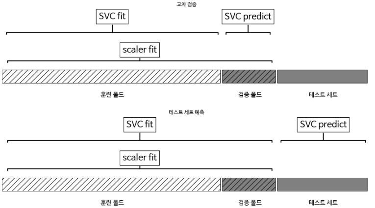
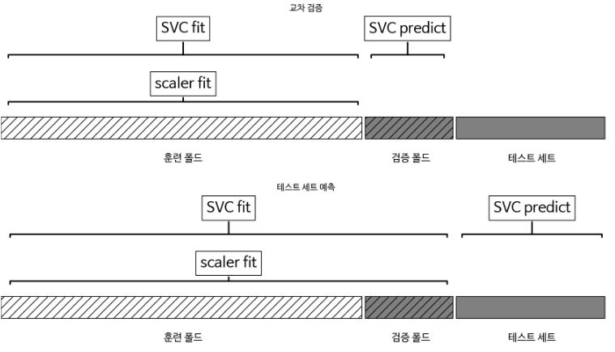
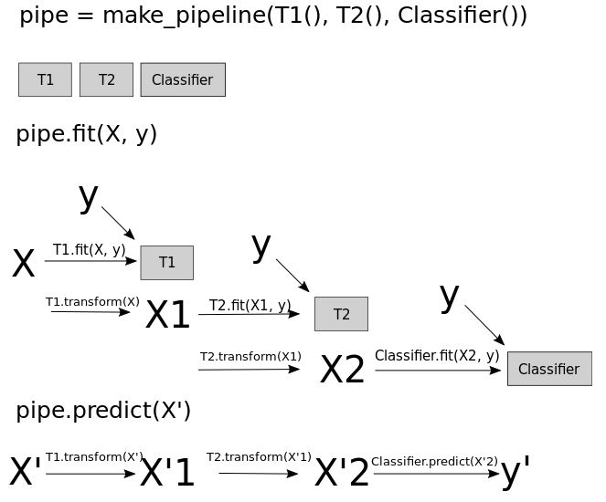

# 6. 알고리즘 체인과 파이프라인

대부분의 머신런이 애플리케이션은 하나의 알고리즘으로 이뤄져 있지 않고, 여러 단계의 처리 과정과 머신러닝 모델이 연결되어 있다. 데이터 변환 과정과 머신러닝 모델을 쉽게 연결해주는 Pipeline 파이썬 클래스로 이를 쉽게 구현할 수 있다. 특히 Pipeline과 GridSearchCV를 함께 사용하여 각 처리 단계에서 필요한 매개변수 탐색을 동시에 수행할 수도 있다. 


아래 예제는 caner 데이터셋을 MinMaxScaler로 전처리 해서 커널 SVM을 훈련 시키는 코드이다.

```python 
In:
from sklearn.svm import SVC
from sklearn.datasets import load_breast_cancer
from sklearn.model_selection import train_test_split
from sklearn.preprocessing import MinMaxScaler

cancer = load_breast_cancer()
X_train, X_test, y_train, y_test = train_test_split(
    cancer.data, cancer.target, random_state=0)

scaler = MinMaxScaler().fit(X_train)
X_train_scaled = scaler.transform(X_train)

svm = SVC()
svm.fit(X_train_scaled, y_train)
X_test_scaled = scaler.transform(X_test)

print(f"테스트 점수: {svm.score(X_test_scaled, y_test):.2f}")
```

```python 
Out:
테스트 점수: 0.97
```


### 6.1 데이터 전처리와 매개변수 선택

GridSearchCV를 사용해서 최적의 SVC의 매개변수를 단순한 방법(잘못된 방법).

```python 
In:
from sklearn.model_selection import GridSearchCV
from sklearn.svm import SVC

param_grid = {'C': [10**i for i in range(-3, 3)],
              'gamma': [10**i for i in range(-3, 3)]}
grid = GridSearchCV(SVC(), param_grid=param_grid)
grid.fit(X_train_scaled, y_train)
print(f"최상의 교차 검증 정확도: {grid.best_score_:.2f}")
print(f"테스트 세트 점수: {grid.score(X_test_scaled, y_test):.2f}")
print(f"최적의 매개변수: ", grid.best_params_)
```

```python 
Out:
최상의 교차 검증 정확도: 0.98
테스트 세트 점수: 0.97
최적의 매개변수:  {'C': 1, 'gamma': 1}
```

이 코드의 문제점은 데이터의 최솟값과 최댓값을 계산할 때 학습을 위해 훈련 세트에 있는 모든 데이터를 사용했다는 것이다. 그런 다음에 스케일이 조정된 훈련 데이터에서 교차 검증을 사용해 그리드 서치를 수행했다. 교차 검증의 각 분할에서 원본 훈련 세트 데이터의 어떤 부분은 훈련 폴드가 되고 어떤 부분은 검증 폴드가 된다. 검증 폴드는 훈련 폴드로 학습된 모델이 새로운 데이터에 적용될 떄의 성능을 측정하는 데 사용한다. 그러나 데이터 스케일을 조정할 때 검증 폴드에 들어 있는 정보까지 사용하게 된다. 검증 폴드 데이터의 정보가 모델 구축 과정에서 이미 누설되었으므로 교차 검증에서 최적의 매개변수를 찾지 못하고 낙관적인 결과가 만들어 지게 된다. 



이 문제를 해결하려면 교차 검증의 분할이 모든 전처리 과정보다 앞서 이뤄져야 한다. 데이터셋의 정보를 이용하는 모든 처리 과정은 데이터셋의 훈련 부분에만 적용되어야 하므로 교차 검증 반복 안에 있어야 한다. Pipeline은 여러 처리 단계를 하나의 scikit-learn 추정기 형태로 묶어주는 파이썬 클래스이다(Pipeline은 BaseEstimator 클래스를 상속한다). Pipeline은 fit, predict, score 메소드를 제공하고 다른 모델들과 유사하게 작동한다. Pipeline을 사용하는 가장 일반적인 경우는 분류기 같은 지도 학습 모델과 (데이터 스케일 조정 같은) 전처리 단계를 연결할 때이다.


### 6.2 파이프라인 구축하기

다음은 MinMaxScaler로 데이터의 스케일을 조정하고 SVM 모델을 훈련시키는 워크플로(Workflow)를 Pipeline을 사용해 표현한 것이다. 먼저 각 단계를 리스트 전달하여 파이프 라인 객체를 만든다. 각 단계는 추가정기의 객체와 임의이 이름(이중 밑줄 문자(__)를 제외한 아무 문자열)으로 구성된 튜플이다. fit 메소드는 첫번째 단계의 fit 메소드를 호출하여 훈련 데이터를 반환하고, 마지막으로 변환된 데이터에 SVM 모델을 훈련시킨다. score 메소드를 호출하면 첫 번째 단계를 사용하여 테스트 데이터를 변환하고, 변환된 데이터에 SVM 모델의 score 메소드를 호출한다. 

```python 
In:
from sklearn.pipeline import Pipeline

pipe = Pipeline([("scaler", MinMaxScaler()), ("svm", SVC())])
pipe.fit(X_train, y_train)
print(f"테스트 점수: {pipe.score(X_test, y_test):.2f}")
```

```python 
Out:
테스트 점수: 0.97
```

파이프라인을 사용하면 "전처리+분류" 과정을 위해 작성해야할 코드가 줄어든다. 그러나 파이프 라인의 가장 큰 장점은 cross_val_score나 GridSearchCV에 파이프라인을 하나의 추정기처럼 사용할 수 있다는 것이다.


### 6.3 그리드 서치에 파이프라인 적용하기 

그리드 서치에 파이프라인을 사용하는 방식 역시 다른 추정기를 사용할 때와 같긴하나 조금 달라지는 것이 있다. 각 매개변수가 파이프라인의 어떤 단계에 속한 것인지 알려줘야 한다. C와 gamma 매개변수는 두 번째 단계인 SVC의 매개변수이다. 이 단계의 이름을 "svm"이라고 지정했기 때문에 파이프라인용 매개변수 그리드는 단계 이름과 매개변수 이름을 "__"(밑줄 2개)로 연결해 만든다. 그래서 SVC의 매개변수 C를 그리드 서치로 탐색하려면 매개변수 그리드 딕셔너리의 키를 "svm__C"로 해야하고 gamma에 대해서도 동일하다. 

```python 
In:
param_grid = {'svm__C': [10**i for i in range(-3, 3)],
              'svm__gamma': [10**i for i in range(-3, 3)]}
grid = GridSearchCV(pipe, param_grid=param_grid, cv=5)
grid.fit(X_train, y_train)
print(f"최상의 교차 검증 정확도: {grid.best_score_:.2f}")
print(f"테스트 세트 점수: {grid.score(X_test, y_test):.2f}")
print(f"최적의 매개변수: ", grid.best_params_)
```

```python 
Out:
최상의 교차 검증 정확도: 0.98
테스트 세트 점수: 0.97
최적의 매개변수:  {'svm__C': 1, 'svm__gamma': 1}
```

이전에 본 그리드 서치와 다른 점은 교차 검증의 각 분할에 MinMaxScaler가 훈련 폴드에 매번 적용되어, 매개변수 검색 과정에 검증 폴더의 정보가 누설되지 않은 것이다. 



교차 검증에서 정보 누설에 의한 영향은 전처리 종류에 따라 다르다. 검증 폴드를 사용해 데이터의 스케일을 조정하는 경우엔 심각한 문제가 생기지 않지만, 검증 폴드를 이용해 특성을 추출하거나 선택하며 결과가 확연히 달라진다. 


##### 정보 누설에 대한 예시

헤이스티, 팁시라니, 프리드먼 "The Elements of Statistical Learning" 참조. 

다음은 정규 분포로부터 독립적으로 추출한 10,000개의 특성을 가진 샘플 100개를 사용한 회귀문제이다. 출력값도 정규 분포로부터 샘플링한다. 데이터셋을 무작위로 생성했기 때문에 데이터 X와 타깃 y 사이에는 아무런 관계가 없다(독립적이다). 그래서 이 데이터셋으로는 무언가를 학습하기가 불가능하다. 여기에 SelectPercentile로 10,000개 중 유용한 특성을 선택하고, 교차 검증을 사용하여 Ridge 회귀를 평가해본다. 

```python 
In:
from sklearn.feature_selection import SelectPercentile, f_regression

rnd = np.random.RandomState(seed=0)
X = rnd.normal(size=(100, 10000))
y = rnd.normal(size=(100, ))

select = SelectPercentile(score_func=f_regression, percentile=5).fit(X, y)
X_selected = select.transform(X)
print(f"X_selected.shape: {X_selected.shape}")

from sklearn.model_selection import cross_val_score
from sklearn.linear_model import Ridge

print(f"교차 검증 정확도(릿지): {np.mean(cross_val_score(Ridge(), X_selected, y, cv=5)):.2f}")
```

```python 
Out:
X_selected.shape: (100, 500)
교차 검증 정확도(릿지): 0.91    
```

교차 검증으로 계산한 평균 R^2은 0.91인데 데이터셋을 완전히 무작위로 만들었으므로 있을 수 없는 일이다. 이는 교차 검증 밖에서 특성을 선택했기 때문에 훈련과 테스트 폴드 양쪽에 연관된 특성이 찾아 질 수 있기 때문이다. 테스트 폴드에서 유출된 정보가 매우 중요한 역할을 하기 때문에 비현실적으로 높은 결과가 나왔다. 


다음은 파이프라인을 사용한 교차 검증이다. 

```python 
In:
pipe = Pipeline([("select", SelectPercentile(score_func=f_regression,
                                             percentile=5)),
                 ("ridge", Ridge())])
print(f"교차 검증 정확도 (파이프라인): {np.mean(cross_val_score(pipe, X, y, cv=5)):.2f}")
```

```python 
Out:
교차 검증 정확도 (파이프라인): -0.25
```

R^2 점수가 음수로 성능이 매우 낮은 모델임을 나타낸다. 파이프라인을 사용했기 때문에 특성 선택이 교차 검증 반복 안으로 들어갔다. 특성 선택 단계에서 훈련 폴드의 타깃값과 연관된 특성을 찾았지만, 전체 데이터가 무작위로 만들어졌으므로 테스트 폴드의 타깃과는 연관성이 없다. 위의 예는 특성 선택 단계에서 일어나는 정보 누설을 막는 것이 모델의 성능을 평가하는 데 큰 차이를 만든다는 것을 보여준다. 


### 6.4 파이프라인 인터페이스

파이프라인에 들어갈 추정기는 마지막 단계를 제외하고는 모두 transform 메소드를 가지고 있어야 한다. 그래서 다음 단계를 위한 새로운 데이터 표현을 만들 수 있어야 한다. 

내부적으로는 Pipeline.fit 메소드가 실행되는 동안, 파이프라인은 각 단계에서 이전 단계의 transform의 출력을 입력으로 받아 fit과 transform 메소드를 차례로 호출한다(fit_transform이 있는 경우 이를 호출). 그리고 마지막 단계는 fit 메소드만 호출한다. 그러므로 마지막 단계에는 predict는 없어도 최소한 fit 메소드는 있어야 한다. 

세부 사항은 예를 들어, pipeline.steps는 튜플의 리스트라서 pipeline.steps[0][0]은 첫 번째 추정기의 이름이고  pipeline.steps[0][1]은 첫 번째 추정기 자체가 된다. 

```python 
def fit(self, X, y):
    X_transformed = X
    for name, estimator in self.steps[:-1]:
        # 마지막 단계를 빼고 fit과 transform을 반복.
        X_transformed = estimator.fit_transform(X_transformed, y)
    # 마지막 단계 fit을 호출.
    self.steps[-1][1].fit(X_transformed, y)
    return self
```

Pipeline을 사용해서 예측할 때는, 비슷한 방식으로 마지막 단계 이전까지 transform 메소드를 호출한 다음, 마지막 단계에서 predict를 호출한다(predict_proba와 decision_function 메소드도 마지막 단계에서 한 번 호출한다). 

```python 
def predict(self, X):
    X_transformed = X
    for step in self.steps[:-1]:
        # 마지막 단계를 빼고 transform을 반복.
        X_transformed = step[1].transform(X_transformed)
    # 마지막 단계 predict을 호출.
    return self.steps[-1][1].predict(X_transformed)
```



 

##### 6.4.1 make_pipeline을 사용한 파이프라인 생성

make_pipeline 함수는 각 단계 이름에 해당 파이썬 클래스의 이름을 부여한 파이프라인을 만들어준다. 

```python 
In:
from sklearn.pipeline import Pipeline
from sklearn.pipeline import make_pipeline
from sklearn.preprocessing import MinMaxScaler
from sklearn.svm import SVC

#표준적인 방법
pipe_ling = Pipeline([("scaler", MinMaxScaler()), ("svm", SVC(C=100))])
#간소화된 방법
pipe_short = make_pipeline(MinMaxScaler(), SVC(C=100))
print(f"파이프라인 단계:\n{pipe_short.steps}")
```

```python 
Out:
파이프라인 단계:
[('minmaxscaler', MinMaxScaler(copy=True, feature_range=(0, 1))), ('svc', SVC(C=100, break_ties=False, cache_size=200, class_weight=None, coef0=0.0,
    decision_function_shape='ovr', degree=3, gamma='scale', kernel='rbf',
    max_iter=-1, probability=False, random_state=None, shrinking=True,
    tol=0.001, verbose=False))]
```

같은 파이썬 클래스를 여러 단계에서 사용하면 이름 뒤에 숫자가 추가로 붙는다.

```python 
In:
from sklearn.preprocessing import StandardScaler
from sklearn.decomposition import PCA

pipe = make_pipeline(StandardScaler(), PCA(n_components=2), StandardScaler())
print(f"파이프라인 단계:\n{pipe.steps}")
```

```python 
Out:
파이프라인 단계:
[('standardscaler-1', StandardScaler(copy=True, with_mean=True, with_std=True)), ('pca', PCA(copy=True, iterated_power='auto', n_components=2, random_state=None,
    svd_solver='auto', tol=0.0, whiten=False)), ('standardscaler-2', StandardScaler(copy=True, with_mean=True, with_std=True))]
```


##### 6.4.2 단계 속성에 접근하기

선형 모델의 계수나 PCA에서 추출한 주성분 같이 파이프라인의 단계 중 하나의 속성을 확인하려면 단계 이름을 키로 가진 딕셔너리인 named_steps 속성을 사용하면 파이프라인의 각 단계에 쉽게 접근할 수 있다. 

```python 
In:
from sklearn.datasets import load_breast_cancer

cancer = load_breast_cancer()
pipe.fit(cancer.data)
components = pipe.named_steps["pca"].components_
print(f"Components.shape: {components.shape}")
```

```python 
Out:
Components.shape: (2, 30) 
```


##### 6.4.3 그리드 서치 안의 파이프라인 속성에 접근하기

```python 
In:
from sklearn.linear_model import LogisticRegression
from sklearn.model_selection import train_test_split, GridSearchCV
import pprint

pipe = make_pipeline(StandardScaler(), LogisticRegression())
param_grid = {'logisticregression__C': [10**i for i in range(-2, 3)]}
X_train, X_test, y_train, y_test = train_test_split(cancer.data, cancer.target, random_state=4)
grid = GridSearchCV(pipe, param_grid, cv=5)
grid.fit(X_train, y_train)
print(f"최상의 모델:\n{grid.best_estimator_}")
print("\n")
print(f"로지스틱 회귀 단계:\n{grid.best_estimator_.named_steps['logisticregression']}")
print("\n")
print("로지스틱 회귀 계수:", )
pprint.pprint(grid.best_estimator_.named_steps["logisticregression"].coef_, width=100, compact=True)
```

```python 
Out:
최상의 모델:
Pipeline(memory=None,
         steps=[('standardscaler',
                 StandardScaler(copy=True, with_mean=True, with_std=True)),
                ('logisticregression',
                 LogisticRegression(C=1, class_weight=None, dual=False,
                                    fit_intercept=True, intercept_scaling=1,
                                    l1_ratio=None, max_iter=100,
                                    multi_class='auto', n_jobs=None,
                                    penalty='l2', random_state=None,
                                    solver='lbfgs', tol=0.0001, verbose=0,
                                    warm_start=False))],
         verbose=False)


로지스틱 회귀 단계:
LogisticRegression(C=1, class_weight=None, dual=False, fit_intercept=True,
                   intercept_scaling=1, l1_ratio=None, max_iter=100,
                   multi_class='auto', n_jobs=None, penalty='l2',
                   random_state=None, solver='lbfgs', tol=0.0001, verbose=0,
                   warm_start=False)


로지스틱 회귀 계수:
array([[-0.43570655, -0.34266946, -0.40809443, -0.5344574 , -0.14971847,
         0.61034122, -0.72634347, -0.78538827,  0.03886087,  0.27497198,
        -1.29780109,  0.04926005, -0.67336941, -0.93447426, -0.13939555,
         0.45032641, -0.13009864, -0.10144273,  0.43432027,  0.71596578,
        -1.09068862, -1.09463976, -0.85183755, -1.06406198, -0.74316099,
         0.07252425, -0.82323903, -0.65321239, -0.64379499, -0.42026013]])
```
