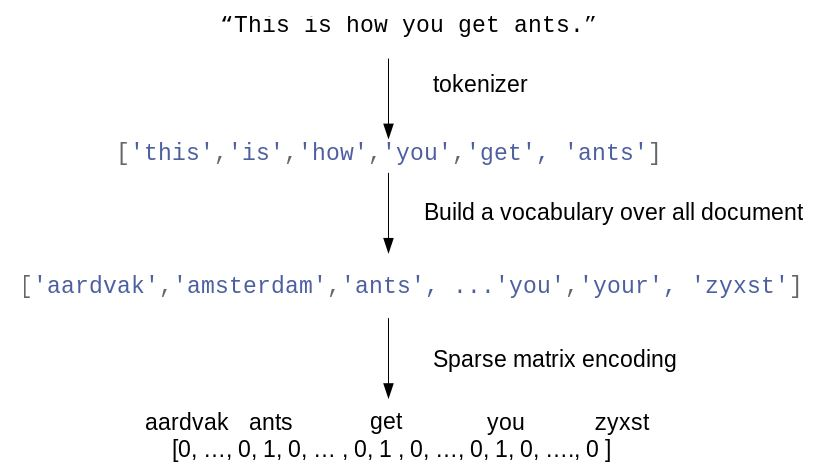
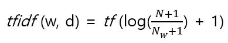
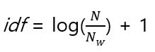

# 7. 텍스트 데이터 다루기

텍스트 데이터는 글자가 연결된 문자열로 표현된다. 텍스트 데이터의 길이는 서로 같은 경우가 거의 없다. 이런 특성은 이제까지 본 수치형 특성과 매우 다르므로 머신러닝 알고리즘에 적용하기 전에 전처리를 해야 한다(이제까지 본 데이터는 - 정량적인 연속형 특성, 고정된 목록에서 값이 정해지는 범주형 특성 - 데이터 포인트의 속성이 고정된, 즉 특성의 개수가 같았다. 텍스트 데이터는 내용의 길이가 달라지므로 전처리 과정이 없다면 샘플마다 특성의 수가 달라진다)


### 7.1 문자열 데이터 타입

- 범주형 데이터 - 범주형 데이터는 고정된 목록으로 구성된다. 드롭 다운 메뉴에서 "빨강", "녹색", "파랑" 등의 옵션이 있으면 데이터셋에 3개의 값 중 하나가 들어가면 당연히 범주형 변수로 인코딩 된다. 만약 오타가 있으면 데이터셋에는 같은 의미를 나타내는 값으로 합쳐야한다("뻘건"과 "빨강").
- 범주에 의미를 연결시킬 수 있는 임의 문자열 - "치과 오랜지색", "녹색과 빨강 줄무늬" 같이 사람들의 의견을 텍스트 필드로 받을 때의 응답은 범주에 의미를 연결시킬 수 있는 임의의 문자열이다. 이런 데이터는 범주형 변수로 인코딩하려면 가장 보편적인 값을 선택하든지, 애플리케이션에 맞게 이런 응답을 포용할 수 있는 점주를 정의하는 게 최선이다. 
- 구조화된 문자열 데이터 - 미리 정의된 범주에 속하지 않지만 직접 입력한 값들이 주소나 장소, 사람 이름, 날짜, 전화 번호, 식별 변호처럼 일정한 구조를 가지기도 한다. 이런 종류의 문자열은 분석하기 매우 어렵고, 처리 방법이 문맥이나 분야에 따라 매우 다르다.
- 텍스트 데이터 - 자유로운 형태의 절과 문장으로 구성되어 있다. 이런 데이터는 대부분 단어로 구성된 문장에 정보를 담고 있다. 텍스트 분석에서 데이터 셋을 말뭉치(Corpus), 하나의 텍스트를 의미하는 각 데이터 포인트를 문서(Document)라고 한다. 이런 용어는 텍스트 데이터를 주로 다루는 정보 검색(Information retrieval(IR))과 자연어 처리(Natural language processing(NLP))에서 유래했다. 


### 7.2 예제 애플리케이션: 영화 리뷰 감성 분석

다음은 스탠퍼드 대학교 연구원인 Andrew Mass가 IMDb(Internet Movie Database) 웹사이트에서 수집한 영화 리뷰 데이터셋이다. 이 데이터셋은 리뷰 텍스트와 "양성" 혹은 "음성"을 나타내는 레이블을 포함하고 있다. 1에서 10점의 평점중에서 7점 이상은 "양성", 4점 이하는 "음성"인 이진 분류 데이터셋이다(중간 포함x). 

train 폴더에 unsup 폴더는 레이블이 없는 데이터를 담고 있으므로 삭제한다.  하위 폴더가 레이블로 구분된 폴더 구조라면 scikit-learn의 load_files 함수를 사용해서 파일을 읽을 수 있다. 이 때 폴더의 알파벳 순서에 따라 0부터 부여된다. 

```python 
In:
!tar -xvzf ./introduction_to_ml_with_python/data/aclImdb_v1.tar.gz
!find ./aclImdb/ -type d
```

```python 
Out:
./aclImdb/
./aclImdb/train
./aclImdb/train/neg
./aclImdb/train/pos
./aclImdb/train/unsup
./aclImdb/test
./aclImdb/test/neg
./aclImdb/test/pos
```

```python 
!rm -r ./aclImdb/train/unsup
```

```python 
In:
from sklearn.datasets import load_files
import pprint

reviews_train = load_files("./aclImdb/train/")

text_train, y_train = reviews_train.data, reviews_train.target
print(f"text_train의 타입: {type(text_train)}")
print(f"text_train의 길이: {len(text_train)}")
print("text_train[6]:")
pprint.pprint(text_train[6], width=140, compact=True)
```

```python 
Out:
text_train의 타입: <class 'list'>
text_train의 길이: 25000
text_train[6]:
(b'This movie has a special way of telling the story, at first i found it rather odd as it jumped through time and I had no idea whats happ'
 b'ening.<br /><br />Anyway the story line was although simple, but still very real and touching. You met someone the first time, you fell '
 b"in love completely, but broke up at last and promoted a deadly agony. Who hasn't go through this? but we will never forget this kind of "
 b'pain in our life. <br /><br />I would say i am rather touched as two actor has shown great performance in showing the love between the c'
 b'haracters. I just wish that the story could be a happy ending.')
```

```python 
In:
import numpy as np

text_train = [doc.replace(b"<br />", b" ") for doc in text_train]
print(f"클래스별 샘플 수 (훈련 데이터): {np.bincount(y_train)}")
```

```python 
Out:
클래스별 샘플 수 (훈련 데이터): [12500 12500]
```

text \_train의 항목의 타입은 파이썬 버전에 따라 다른데 파이썬 3에서는 문자열 데이터의 바이너리 인코딩인 bytes 타입이다. 파이썬 2에서는 text_train의 타입이 문자열이다. 아스키(ASCII) 코드에 대응하는 파이썬 2의 문자열(str)이 파이썬 3에서 사라지고, 파이썬 2의 unicode 문자열이 파이썬 3의 기본 str이 되었다. 그리고 파이썬 3에서는 str의 바이너리 표현인 bytes가 추가되었다. 파이썬 3에서 문자열 "한글"의 길이는 2지만, "한글".encode('utf8')과 같이 bytes 타입으로 변환하면 길이가 6이 된다. load_files 함수는 open 함수에 "rb" 옵션을 주어 파일을 바이너리로 읽기 때문에 파이썬 3에서 text_train의 타입이 bytes가 된다. 

```python 
In:
reviews_test = load_files("./aclImdb/test/")
text_test, y_test = reviews_test.data, reviews_test.target
print(f"테스트 데이터의 문서 수: {len(text_test)}")
print(f"클래스별 샘플 수 (테스트 데이터): {np.bincount(y_test)}")
text_test = [doc.replace(b"<br />", b" ") for doc in text_test]
```

```python 
Out:
테스트 데이터의 문서 수: 25000
클래스별 샘플 수 (테스트 데이터): [12500 12500]
```

텍스트 데이터는 머신러닝 모델이 다룰 수 있는 형태가 아니다. 따라서 텍스트의 문자열 표현을 머신러닝 알고리즘에 적용할 수 있도록 수치 표현으로 바꿔줘야 한다. 


### 7.3 텍스트 데이터를 BOW로 표현하기

BOW(Bag of words)를 쓰면 장, 문단, 문장, 서식 같은 입력 테스트의 구조 대부분을 잃고, 각 단어가 이 말뭉치에 있는 텍스트에 얼마나 많이 나타나는지만 헤아린다. 구조와 상관 없이 단어의 출현 횟수만 세기 떄문에 텍스트를 담는 '가방(bag)'을 생각할 수 있다. 

BOW 표현의 3단계는 다음과 같다.

1. **토큰화(Tokenization)** - 각 문서를 문서에 포함된 단어(토큰)으로 나눈다. 예를 들어 공백이나 구두점을 기준으로 분리한다.
2. **어휘 사전 구축** - 모든 문서에 나타난 모든 단어의 어휘를 모으고 번호를 매긴다(알파벳 순서).
3. **인코딩** - 어휘 사전의 단어가 문서마다 몇 번이나 나타나는지를 헤아린다. 



출력은 각 문서에서 나타난 단어의 횟수가 담긴 하나의 벡터이다. 이를 위해 사전에 있는 각 단어가 문서마다 얼마나 자주 나타나는지 세야 한다. 즉, 이 수치 표현은 전체 데이터셋에서 고유한 각 단어를 특성으로 가진다. 원본 문자열에 있는 단어의 순서는 BOW 특성 표현에서는 완전히 무시된다. 


##### 7.3.1 샘플 데이터에 BOW 적용하기

BOW 표현은 CountVectorizer에 변환기 인터페이스로 구현되어 있다. 

```python 
In:
from sklearn.feature_extraction.text import CountVectorizer

bards_words = ["The fool doth think he is wise,",
               "but the wise man knows himself to be a fool"]

vect = CountVectorizer()
vect.fit(bards_words)
print(f"어휘 사전의 크기: {len(vect.vocabulary_)}")
print(f"어휘 사전의 내용: {vect.vocabulary_}")
```

```python 
Out:
어휘 사전의 크기: 13
어휘 사전의 내용: {'the': 9, 'fool': 3, 'doth': 2, 'think': 10, 'he': 4, 'is': 6, 'wise': 12, 'but': 1, 'man': 8, 'knows': 7, 'himself': 5, 'to': 11, 'be': 0}
```

훈련 데이터에 대해 BOW 표현을 만들려면 transform 메소드를 호출한다.

```python 
In:
bag_of_words = vect.transform(bards_words)
print(f"BOW: {repr(bag_of_words)}")
```

```python 
Out:
BOW: <2x13 sparse matrix of type '<class 'numpy.int64'>'
	with 16 stored elements in Compressed Sparse Row format>
```

BOW 표현은 0이 아닌 값만 저장하는 SciPy 희소행렬로 저장되어  있다. 각각의 행은 하나의 데이터 포인트를 나타내고, 각 특성은 어휘 사전에 있는 각 단어에 대응한다. 대부분의 문서는 어휘 사전에 있는 단어 중 일부만 포함하므로, 즉 특성 배열의 대부분의 원소가 0이라서 희소 행렬을 사용한다. 어휘 사전에 있는 전체 영어 단어 수에 비해 한 편의 영화 리뷰에 들어 있는 단어의 수가 적기 때문에 값이 0인 원소를 모두 저장하는 것은 메모리 낭비이다. 희소 행렬의 실제 내용을 보려면 toarray 메소드를 사용하여(0인 원소도 모두 저장되도록) 밀집된 NumPy 배열로 바꿔야 한다.

```python 
In:
print(f"BOW의 밀집 표현:\n{bag_of_words.toarray()}")
```

```python 
Out:
BOW의 밀집 표현:
[[0 0 1 1 1 0 1 0 0 1 1 0 1]
 [1 1 0 1 0 1 0 1 1 1 0 1 1]]
```

각 행은 앞에서의 문자열 리스트의 원소 ["The fool doth think he is wise,",  "but the wise man knows himself to be a fool"] 이고 어휘 사전을 만들 때 알파벳 순서대로 단어를 정렬하면 BOW는 "be", "but", "doth" 등의 순으로 나타난다(결과의 열). 결과의 각 원소는 이 열이 각 문자열에 대해서 얼만큼 나타났는지를 의미한다.  


##### 7.3.2 영화 리뷰에 대한 BOW

이전 영화 리뷰에 대한 감성 분석(IMDb)을 적용해보면 다음과 같다.

```python 
In:
vect = CountVectorizer().fit(text_train)
X_train = vect.transform(text_train)
print(f"X_train:\n{repr(X_train)}")
```

```python 
Out:
X_train:
<25000x74849 sparse matrix of type '<class 'numpy.int64'>'
	with 3431196 stored elements in Compressed Sparse Row format>
```

훈련 데이터의 BOW 표현은 25,000 X 74,849의 크기를 가지고 있는데, 이 어휘 사전은 74,849의 단어로 이루어진 SciPy 희소 행렬로 저장되어 있다. 

```python 
In:
feature_names = vect.get_feature_names()
print(f"특성 개수: {len(feature_names)}")
print(f"처음 20개 특성:\n{feature_names[:20]}")
print(f"20,010에서 20,030까지 특성:\n{feature_names[20010:20030]}")
print(f"매 2,000번째 특성:\n{feature_names[::2000]}")
```

```python 
Out:
특성 개수: 74849
처음 20개 특성:
['00', '000', '0000000000001', '00001', '00015', '000s', '001', '003830', '006', '007', '0079', '0080', '0083', '0093638', '00am', '00pm', '00s', '01', '01pm', '02']
20,010에서 20,030까지 특성:
['dratted', 'draub', 'draught', 'draughts', 'draughtswoman', 'draw', 'drawback', 'drawbacks', 'drawer', 'drawers', 'drawing', 'drawings', 'drawl', 'drawled', 'drawling', 'drawn', 'draws', 'draza', 'dre', 'drea']
매 2,000번째 특성:
['00', 'aesir', 'aquarian', 'barking', 'blustering', 'bête', 'chicanery', 'condensing', 'cunning', 'detox', 'draper', 'enshrined', 'favorit', 'freezer', 'goldman', 'hasan', 'huitieme', 'intelligible', 'kantrowitz', 'lawful', 'maars', 'megalunged', 'mostey', 'norrland', 'padilla', 'pincher', 'promisingly', 'receptionist', 'rivals', 'schnaas', 'shunning', 'sparse', 'subset', 'temptations', 'treatises', 'unproven', 'walkman', 'xylophonist']
```

영화 리뷰라는 것을 고려하면 숫자들 대부분은 그 자체로 의미가 있어 보이지 않는다. "dra"로 시작하는 영어 단어의 목록을 보면 "draught", "drawback", "drawer" 모두 단수와 복수형이 서로 다른 단어로 어휘 사전에 포함되어 있는데 이런 단어들은 의미가 매우 비슷하므로 다른 특성으로 간주하여 개별적으로 기록하는 것이 바람직 하지 않다. 

이런 희소 행렬의 고차원 데이터셋에서는 LogisticRegression 같은 선형 모델의 성능이 뛰어나다. 이 알고리즘의 분류기를 만들어 교차 검증 성능 수치를 확인하면 다음과 같다(CountVectorizer의 min_df, max_df 같은  매개변수의 기본 값을 바꾸면 교차 검증의 결과에 영향을 주므로 Pipeline을 사용하는 것이 좋다).

```python 
In:
from sklearn.model_selection import cross_val_score
from sklearn.linear_model import LogisticRegression

scores = cross_val_score(LogisticRegression(), X_train, y_train, cv=5)
print(f"교차 검증 평균 점수: {np.mean(scores):.2f}")
```

```python 
Out:
교차 검증 평균 점수: 0.88
```

LogisticRegression의 규제 매개변수 C를 그리드 서치를 사용해 조정해보면 다음과 같다.

```python 
In:
from sklearn.model_selection import GridSearchCV

param_grid = {'C': [10**i for i in range(-3, 3)]}
grid = GridSearchCV(LogisticRegression(), param_grid, cv=5)
grid.fit(X_train, y_train)
print(f"최상의 교차 검증 점수: {grid.best_score_:.2f}")
print(f"최적의 매개변수: ", grid.best_params_)
```

```python 
Out:
최상의 교차 검증 점수: 0.88
최적의 매개변수:  {'C': 0.1}
```

```python 
In:
X_test = vect.transform(text_test)
print(f"테스트 덤수: {grid.score(X_test, y_test):.2f}")
```

```python 
Out:
테스트 덤수: 0.88
```

CountVectorizer는 정규 표현식을 사용해 토큰을 추출한다. 기본적으로 사용하는 정규표현식은 "\b\w\w+\b"이다. 이 식으로 경계(\b)가 구분되고 적어도 둘 이상의 문자나 숫자(\w)가 연속된 단어를 찾는다. 한 글자로 된 단어는 찾지 않으며, "doesn't" 같은 축양형이나 "bit.ly" 같은 단어는 분리되고, "h8ter"는 한단어로 매칭된다. CountVectorizer는 모든 단어를 소문자로 바꾸므로 "soon", "Soon", "sOon"이 모두 가은 토큰(즉 특성)이 된다. 이런 특성은 대체로 잘 작동하나 의미 없는 특성(숫자 같은)을 많이 생성한다. 이를 줄이는 방법은 적어도 두 개의 문서(또는 다섯 개의 문서 등)에 나타난 토큰만을 사용하는 것이다. 하나의 문서에서만 나타난 토큰은 테스트 세트에 나타날 가능성이 적으므로 큰 도움이 되지 않는다. min_df 매개변수로 토큰이 나타날 최소 문서 개수를 지정할 수 있다. 

```python 
In:
vect = CountVectorizer(min_df=5).fit(text_train)
X_train = vect.transform(text_train)
print(f"min_df로 제한한 X_train: {repr(X_train)}")
```

```python 
Out:
min_df로 제한한 X_train: <25000x27271 sparse matrix of type '<class 'numpy.int64'>'
	with 3354014 stored elements in Compressed Sparse Row format>
```

토큰이 적어도 다섯 번 이상 나타나야 하므로,  결과에서 보면 특성의 수가 원래의 74,849에서 1/3 정도로 줄어든 것을 확인할 수 있다.

```python 
In:
feature_names = vect.get_feature_names()

print(f"처음 50개 특성:\n{feature_names[:50]}")
print(f"20,010에서 20,030까지 특성:\n{feature_names[20010:20030]}")
print(f"매 700번째 특성:\n{feature_names[::700]}")
```

```python 
Out:
처음 50개 특성:
['00', '000', '007', '00s', '01', '02', '03', '04', '05', '06', '07', '08', '09', '10', '100', '1000', '100th', '101', '102', '103', '104', '105', '107', '108', '10s', '10th', '11', '110', '112', '116', '117', '11th', '12', '120', '12th', '13', '135', '13th', '14', '140', '14th', '15', '150', '15th', '16', '160', '1600', '16mm', '16s', '16th']
20,010에서 20,030까지 특성:
['repentance', 'repercussions', 'repertoire', 'repetition', 'repetitions', 'repetitious', 'repetitive', 'rephrase', 'replace', 'replaced', 'replacement', 'replaces', 'replacing', 'replay', 'replayable', 'replayed', 'replaying', 'replays', 'replete', 'replica']
매 700번째 특성:
['00', 'affections', 'appropriately', 'barbra', 'blurbs', 'butchered', 'cheese', 'commitment', 'courts', 'deconstructed', 'disgraceful', 'dvds', 'eschews', 'fell', 'freezer', 'goriest', 'hauser', 'hungary', 'insinuate', 'juggle', 'leering', 'maelstrom', 'messiah', 'music', 'occasional', 'parking', 'pleasantville', 'pronunciation', 'recipient', 'reviews', 'sas', 'shea', 'sneers', 'steiger', 'swastika', 'thrusting', 'tvs', 'vampyre', 'westerns']
```

```python 
In:
grid = GridSearchCV(LogisticRegression(), param_grid, cv=5)
grid.fit(X_train, y_train)
print(f"최상의 교차 검증 점수: {grid.best_score_:.2f}")
```

```python 
Out:
최상의 교차 검증 점수: 0.89
```

그리드 서치의 교차 검증 점수가 크게 개선되지는 않았지만, 특성의 개수가 줄어서 처리 속도가 빨리지고, 불필요한 특성이 없어져 모델을 이해하기가 더 쉬워졌다. 

(CountVectorizer의 transform 메소드를 훈련 데이터에 없던 단어가 포함된 문서에 적용하면, 어휘 사전에 없기 때문에 그 단어를 무시한다. 훈련 데이터에 없는 단어에 대해 무언가 학습한다는 것이  불가능하므로, 분류 작업에서 보통 문제가 되지는 않는다.)


### 7.4 불용어

의미 없는 단어를 제거하는 또 다른 방법은 너무 빈번하여 유용하지 않은 단어를 제외하는 것이다. 두 가지 방식이 있는 언어별 불용어(Stopword) 목록을 사용하는 것과 max_df 옵션을 사용하여 너무 자주 나타나는 단어를 제외하는 것이다. 

```python 
In:
from sklearn.feature_extraction.text import ENGLISH_STOP_WORDS

print(f"불용어 개수: {len(ENGLISH_STOP_WORDS)}")
print(f"매 10번째 불용어:\n{list(ENGLISH_STOP_WORDS)[::10]}")
```

```python 
Out:
불용어 개수: 318
매 10번째 불용어:
['twelve', 'thus', 'cannot', 'latterly', 'whom', 'few', 'whenever', 'show', 'they', 'throughout', 'was', 'you', 'are', 'ltd', 'two', 'what', 'eleven', 'together', 'in', 'towards', 'one', 'since', 'and', 'none', 'your', 'meanwhile', 'being', 'whose', 'fifty', 'ever', 'becoming', 'as']
```

```python 
In:
vect = CountVectorizer(min_df=5, stop_words="english").fit(text_train)
X_train = vect.transform(text_train)
print(f"불용어가 제거된 X_train:\n{repr(X_train)}")
```

```python 
Out:
불용어가 제거된 X_train:
<25000x26966 sparse matrix of type '<class 'numpy.int64'>'
	with 2149958 stored elements in Compressed Sparse Row format>
```

원래의 특성 27,271에서 305개가 줄어든 26,966개가 남아있음을 확인할 수 있다.

```python 
In:
gird = GridSearchCV(LogisticRegression(), param_grid, cv=5)
grid.fit(X_train, y_train)
print(f"최상의 교차 검증 점수: {grid.best_score_:.2f}")
```

```python 
Out:
최상의 교차 검증 점수: 0.88
```

고정된 불용어 목록은 모델이 데이터셋만 보고 불용어를 골라내기 어려운 작은 데이터셋에서나 도움이 될 수 있다. 다른 방식으로는 CountVectorizer의 max_df 옵션을 지정하여 자주 나타나는 단어를 제거하는 방법이 있다. 


### 7.5 tf-idf로 데이터 스케일 변경하기

중요하지 않아 보이는 특성을 제외하는 대신, 얼마나 의미 있는 특성인지를 계산해서 스케일을 조정하는 방식 중 하나가 **tf-idf(Term frequency-inverse document frequency)** 이다. tf-idf는 말뭉치의 다른 문서보다 특정 문서에 자주 나타나는 단어에 높은 가중치를 주는 방법이다. 한 단어가 특정 문서에 자주 나타나고 다른 여러 문서에서는 그렇지 않다면, 그 문서의 내용을 아주 잘 설명하는 단어라고 볼 수 있다. TfidfTransformer는 CountVectorizer가 만든 희소 행렬을 입력받아 변환한다. TfidfVectorizer는 텍스트 데이터를 입력 받아 BOW 특성 추출과 tf-idf 변환을 수행한다(TfidfVectorizer는 CountVectorizer의 서브 클래스로 CountVectorizer를 이용해 BOW를 만들고 TfidfTransformer를 사용해 tf-idf 변환을 한다).

 문서 d에 있는 단어 w에 대한 tf-df 점수는 TfidfTransformer와 TfidfVectorizer에 다음과 같이 저장되어 있다. 단 smooth_idf 매개변수가 기본값(True)일 때 아래와 같은 공식이 사용된다. 



N은 훈련 세트에 있는 문서의 개수고, N_w는 단어 w가 나타난 훈련 세트 문서의 개수이며, tf(단어 빈도수)는 간어 w가 대상 문서 d(변환 또는 인코딩 하려는 문서)에 나타난 횟수이다. 로그 안의 분모와 분자에 1을 더해 모든 단어가 포함된 가상의 문서가 있는 거 같은 효과를 내거 분모가 0이 되는 것을 막아준다. 또 모든 문서에 포함된 단어가 있으면 로그 값이 0이 되므로, 전체 tf-idf 값이 0이 되는 것을 막기 위해 idf 공식 마지막에 1을 더한다. 

smooth_idf 매개변수가 False일 때는 위의 공식에 분모와 분자에 1을 더하지 않는 표준 idf 공식이 사용된다.



두 파이썬 클래스 모두 tf-idf 계산을 한 후에 L2 정규화(L2 normalization)를 적용한다. 즉, 유클리디안 놈(Euclidean norm)이 1이 되도록 각 문서 벡터의 스케일을 바꾼다. 이렇게 스케일이 바뀐 벡터는 문서의 길이(단어의 수)에 영향을 받지 않는다(벡터의 원소를 유클리디안 놈으로 나누면 L2 놈이 1인 단위 벡터가 된다. norm 매개변수의 기본 값은 L2 정규화를 의미하는 "l2"이다). 

```python 
In:
from sklearn.feature_extraction.text import TfidfVectorizer
from sklearn.pipeline import make_pipeline

pipe = make_pipeline(TfidfVectorizer(min_df=5), LogisticRegression())
param_grid = {'logisticregression__C': [10**i for i in range(-3, 3)]}

grid = GridSearchCV(pipe, param_grid, cv=5)
grid.fit(text_train, y_train)
print(f"최상의 교차 검증 점수: {grid.best_score_:.2f}")
```

```python 
Out:
최상의 교차 검증 점수: 0.89
```

여기서는 tf-idf가 성능에 큰 영향을 주지 못했다. tf-idf는 어떤 단어가 가장 중요한지도 알려준다. tf-idf 변환은 문서를 구별하는 단어를 찾는 방법이지만 완전히 비지도 학습이다. 그래서 우리의 관심사인 '긍정적인 리뷰'와 '부정적인 리뷰' 레이블과 꼭 관계있지 않다. 

```python 
In:
vectorizer = grid.best_estimator_.named_steps['tfidfvectorizer']
X_train = vectorizer.transform(text_train)
#특성 별로 가장 큰 값을 찾는다.
max_value = X_train.max(axis=0).toarray().ravel()
sorted_by_tfidf = max_value.argsort()
#특성 이름을 구한다.
feature_names = np.array(vectorizer.get_feature_names())

print(f"tfidf가 가장 낮은 특성:\n{feature_names[sorted_by_tfidf[:20]]}")
print(f"tfidf가 가장 높은 특성:\n{feature_names[sorted_by_tfidf[-20:]]}")
```

```python 
Out:
tfidf가 가장 낮은 특성:
['suplexes' 'gauche' 'hypocrites' 'oncoming' 'songwriting' 'galadriel'
 'emerald' 'mclaughlin' 'sylvain' 'oversee' 'cataclysmic' 'pressuring'
 'uphold' 'thieving' 'inconsiderate' 'ware' 'denim' 'reverting' 'booed'
 'spacious']
tfidf가 가장 높은 특성:
['gadget' 'sucks' 'zatoichi' 'demons' 'lennon' 'bye' 'dev' 'weller'
 'sasquatch' 'botched' 'xica' 'darkman' 'woo' 'casper' 'doodlebops'
 'smallville' 'wei' 'scanners' 'steve' 'pokemon']
```

tf-idf가 낮은 특성은 전체 문서에 걸쳐 매우 많이 나타나거나, 조금씩만 사용되거나, 매우 긴 문서에서만 사용된다(전체 문서에 걸쳐 많이 나타나면 idf 값이 1에 가깝게 되고, 조금씩 사용괴거나 매우 긴 문서에서만 사용되면 L2 정규화 때문에 tf-idf 값이 작아진다). 

```python 
In:
sorted_by_idf = np.argsort(vectorizer.idf_)
print(f"idf가 가장 낮은 특성:\n{feature_names[sorted_by_tfidf[:100]]}")
```

```python 
Out:
idf가 가장 낮은 특성:
['suplexes' 'gauche' 'hypocrites' 'oncoming' 'songwriting' 'galadriel'
 'emerald' 'mclaughlin' 'sylvain' 'oversee' 'cataclysmic' 'pressuring'
 'uphold' 'thieving' 'inconsiderate' 'ware' 'denim' 'reverting' 'booed'
 'spacious' 'gliding' 'orientated' 'attained' 'coaxing' 'auspicious'
 'sharpshooter' 'basking' 'southampton' 'manically' 'livelier' 'vertical'
 'backfire' 'negotiate' 'slyly' 'roughing' 'patrolman' 'distort'
 'temperamental' 'immunity' 'inciting' 'ralli' 'swells' 'melchior'
 'stifled' 'confessing' 'subtracted' 'nyree' 'deportation' 'alloy'
 'unspectacular' 'usefulness' 'mays' 'annihilated' 'scuffle' 'unsavoury'
 'ancestral' 'labourer' 'administered' 'shoehorn' 'père' 'plunder'
 'plunging' 'empowered' '800' 'perched' 'nursed' 'decayed' 'dubs'
 'assassinates' 'leverage' 'mistreatment' 'bibles' 'confiscated' 'collier'
 'cineplex' 'lifeboats' 'jurisdiction' 'radiating' '1890s' 'confidante'
 'negotiating' 'tahoe' 'tanovic' 'levene' 'malignant' 'unlocked' 'trots'
 'extravaganzas' 'lenin' 'quip' 'outcry' 'foetus' 'sagas' 'squash'
 'disclose' 'peculiarly' 'tellingly' 'brainchild' 'britons'
 'dimensionality']
```
