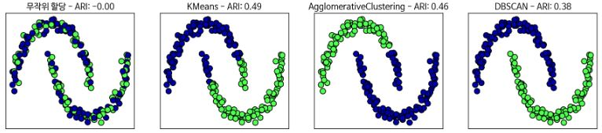

# 군집

**군집(Clustering)** 은 데이터 셋을 **클러스터(Cluster)** 라는 그룹으로 나누는 작업이다. 클러스터 안의 데이터 포인트 끼리는 비슷하고 다른 클러스트의 데이터 포인트와는 구분된다.  군집 알고리즘은 각 데이터 포인트가 어느 클러스터에 속하는지 할당(예측)한다.


##### 3.5.1 k-평균 군집

***k*-평균(*k*-means)** 군집은 어떤 영역을 대표하는 **클러스터 중심(Cluster center)** 을 찾는다. 먼저 데이터 포인트를 가장 가까운 클러스터 중심에 할당하고, 그런 다음 클러스터에 할당된 데이터 포인트의 평균으로 클러스터 중심을 다시 지정한다. 이 과정은 클러스터에 할당되는 데이터 포인트에 변화가 없을 때까지 진행된다. 

```python 
mglearn.plots.plot_kmeans_algorithm()
```


새로운 데이터 포인트가 주어지면 k-평균 알고리즘은 가장 가까운 클러스터 중심을 할당한다.

```python 
mglearn.plots.plot_kmeans_boundaries()
```


```python 
In:
from sklearn.datasets import make_blobs
from sklearn.cluster import KMeans

X, y = make_blobs(random_state=1)
kmeans = KMeans(n_clusters=3)
kmeans.fit(X)
```

```python 
Out:
KMeans(algorithm='auto', copy_x=True, init='k-means++', max_iter=300,
       n_clusters=3, n_init=10, n_jobs=None, precompute_distances='auto',
       random_state=None, tol=0.0001, verbose=0)
```

```python 
In:
print(f"클러스터 레이블:\n{kmeans.labels_}")
```

```python 
Out:
클러스터 레이블:
[1 2 2 2 0 0 0 2 1 1 2 2 0 1 0 0 0 1 2 2 0 2 0 1 2 0 0 1 1 0 1 1 0 1 2 0 2
 2 2 0 0 2 1 2 2 0 1 1 1 1 2 0 0 0 1 0 2 2 1 1 2 0 0 2 2 0 1 0 1 2 2 2 0 1
 1 2 0 0 1 2 1 2 2 0 1 1 1 1 2 1 0 1 1 2 2 0 0 1 0 1]
```

```python 
In:
print(kmeans.predict(X))
```

```python 
Out:
[1 2 2 2 0 0 0 2 1 1 2 2 0 1 0 0 0 1 2 2 0 2 0 1 2 0 0 1 1 0 1 1 0 1 2 0 2
 2 2 0 0 2 1 2 2 0 1 1 1 1 2 0 0 0 1 0 2 2 1 1 2 0 0 2 2 0 1 0 1 2 2 2 0 1
 1 2 0 0 1 2 1 2 2 0 1 1 1 1 2 1 0 1 1 2 2 0 0 1 0 1]
```

군집은 각 데이터 포인트가 레이블을 가진다는 면에서 분류와 조금 비슷해 보이나 레이블 자체에 아무 의미가 없고 정답을 모르고 있다는 점에서 다르다. 


```python 
mglearn.discrete_scatter(X[:, 0], X[:, 1], kmeans.labels_, markers='o')
mglearn.discrete_scatter(kmeans.cluster_centers_[:, 0], kmeans.cluster_centers_[:, 1], [0, 1, 2], markers='^', markeredgewidth=2)
```


```python 
fig, axes = plt.subplots(1, 2, figsize=(10, 5))

kmeans = KMeans(n_clusters=2)
kmeans.fit(X)
assignments = kmeans.labels_

mglearn.discrete_scatter(X[:, 0], X[:, 1], assignments, ax=axes[0])

kmeans = KMeans(n_clusters=5)
kmeans.fit(X)
assignments = kmeans.labels_

mglearn.discrete_scatter(X[:, 0], X[:, 1], assignments, ax=axes[1])
```


##### k-평균 알고리즘이 실패하는 경우

데이터 셋의 클러스터의 개수를 정확하게 알고 있더라도 k-평균 알고리즘이 항상 이를 구분해낼 수 있는 것은 아니다. 각 클러스터를 정의 하는 것이 중심 하나뿐이므로 클러스터는 둥근 형태로 나타난다. k-평균은 모든 클러스터의 반경이 똑같다고 가정한다. 그래서 클러스터 중심 사이의 정확히 중간에 경계를 그린다.

```python 
X_varided, y_varied = make_blobs(n_samples=200, cluster_std=[1.0, 2.5, 0.5], random_state=170)
y_pred = KMeans(n_clusters=3, random_state=0).fit_predict(X_varided)
mglearn.discrete_scatter(X_varided[:, 0], X_varided[:, 1], y_pred)
plt.legend(['클러스터 0', '클러스터 1', '클러스터 2'], loc='best')
plt.xlabel("특성 0")
plt.ylabel("특성 1")
```


```python 
X, y = make_blobs(random_state=170, n_samples=600)
rng = np.random.RandomState(74)

transformation = rng.normal(size=(2, 2))
X = np.dot(X, transformation)

kmeans = KMeans(n_clusters=3)
kmeans.fit(X)
y_pred = kmeans.predict(X)

mglearn.discrete_scatter(X[:, 0], X[:, 1], kmeans.labels_, markers='o')
mglearn.discrete_scatter(kmeans.cluster_centers_[:, 0], kmeans.cluster_centers_[:, 1], [0, 1, 2], markers='^', markeredgewidth=2)
plt.xlabel("특성 0")
plt.ylabel("특성 1")
```


```python 
from sklearn.datasets import make_moons

X, y = make_moons(n_samples=200, noise=.05, random_state=0)

kmeans = KMeans(n_clusters=2)
kmeans.fit(X)
y_pred = kmeans.predict(X)

plt.scatter(X[:, 0], X[:, 1], c=y_pred, cmap=mglearn.cm2, s=60, edgecolors='k')
plt.scatter(kmeans.cluster_centers_[:, 0], kmeans.cluster_centers_[:, 1], marker='^', 
            c=[mglearn.cm2(0), mglearn.cm2(1)], s=100, linewidths=2, edgecolors='k')
plt.xlabel("Feature 0")
plt.ylabel("Feature 1")
```


##### 벡터 양자화 또는 분해 메서드로서의 k-평균

k-평균은 클러스터 중심으로 각 데이터를 표현한다. 이를 각 데이터 포인트가 클러스터 중심, 즉 하나의 성분으로 표현된다고 볼 수 있다. k-평균을 이렇게 각 포인트가 하나의 성분으로 분해되는 관점으로 보는 것을 **벡터 양자화(Vector quantization)** 이라고 한다. 

```python 
from sklearn.model_selection import train_test_split
from sklearn.decomposition import NMF, PCA
from sklearn.cluster import KMeans

X_train, X_test, y_train, y_test = train_test_split(X_people, y_people, stratify=y_people, random_state=0)
nmf = NMF(n_components=100, random_state=0)
nmf.fit(X_train)
pca = PCA(n_components=100, random_state=0)
pca.fit(X_train)
kmeans = KMeans(n_clusters=100, random_state=0)
kmeans.fit(X_train)
X_reconstructed_pca = pca.inverse_transform(pca.transform(X_test))
X_reconstructed_kmenas = kmeans.cluster_centers_[kmeans.predict(X_test)]
X_reconstructed_nmf = np.dot(nmf.transform(X_test), nmf.components_)
fig, axes = plt.subplots(3, 5, figsize=(8, 8), subplot_kw={'xticks': (), 'yticks': ()})
fig.suptitle("추출한 성분")
for ax, comp_kmeans, comp_pca, comp_nmf in zip(axes.T, kmeans.cluster_centers_, pca.components_, nmf.components_):
  ax[0].imshow(comp_kmeans.reshape(image_shape))
  ax[1].imshow(comp_pca.reshape(image_shape), cmap='viridis')
  ax[2].imshow(comp_nmf.reshape(image_shape))

axes[0, 0].set_ylabel('kmeans')
axes[1, 0].set_ylabel('pca')
axes[2, 0].set_ylabel("nmf")

fig, axes = plt.subplots(4, 5, figsize=(8, 8), subplot_kw={'xticks': (), 'yticks': ()})
fig.suptitle("재구성")
for ax, orig, rec_kmeans, rec_pca, rec_nmf in zip(axes.T, X_test, X_reconstructed_kmenas, X_reconstructed_pca,
                                                  X_reconstructed_nmf):
  ax[0].imshow(orig.reshape(image_shape))
  ax[1].imshow(rec_kmeans.reshape(image_shape))
  ax[2].imshow(rec_pca.reshape(image_shape))
  ax[3].imshow(rec_nmf.reshape(image_shape))

axes[0, 0].set_ylabel("원본")
axes[1, 0].set_ylabel("kmeans")
axes[2, 0].set_ylabel("pca")
axes[3, 0].set_ylabel("nmf")
```


k-평균을 사용한 벡터 양자화는 입력 데이터의 차원보다 더 많은 클러스터를 사용해 데이터 인코딩을 할 수 있다. 입력 데이터가 2차원 일때, PCA와 NMF를 사용해 1차원으로 축소하면 데이터의 구조가 완전히 파괴된다. 이때 k-평균은 데이터를 보다 잘 표현 할 수 있다.

```python 
In:
X, y = make_moons(n_samples=200, noise=.05, random_state=0)

kmeans = KMeans(n_clusters=10, random_state=0)
kmeans.fit(X)
y_pred = kmeans.predict(X)

plt.scatter(X[:, 0], X[:, 1], c=y_pred, s=60, cmap='Paired', edgecolors='black')
plt.scatter(kmeans.cluster_centers_[:, 0], kmeans.cluster_centers_[:, 1], s=60, marker='^', c=range(kmeans.n_clusters), linewidths=2, cmap='Paired', edgecolors='black')
plt.xlabel("특성 0")
plt.ylabel("특성 1")
print(f"클러스터 레이블:\n{y_pred}")
```

```python 
Out:
클러스터 레이블:
[4 7 6 9 7 7 4 1 4 1 8 3 7 1 0 4 2 3 2 0 5 1 2 1 8 6 7 5 6 2 4 8 1 6 4 5 3
 4 0 6 3 8 2 6 7 8 4 0 6 1 0 3 5 9 1 4 2 1 2 8 3 9 7 4 1 9 8 7 8 9 3 9 3 6
 1 9 6 4 2 3 5 8 3 5 6 8 4 8 3 5 2 4 5 0 5 7 7 3 9 6 1 5 8 4 9 6 9 8 7 2 0
 8 8 9 4 1 2 5 3 4 4 0 6 8 6 0 4 6 1 5 4 0 9 3 1 7 1 9 5 4 6 6 2 8 8 4 6 1
 2 6 3 7 4 2 3 8 1 3 2 2 6 1 2 7 3 7 2 3 7 1 2 9 0 0 6 1 5 0 0 2 7 0 5 7 5
 2 8 3 9 0 9 2 4 4 6 0 5 6 2 7]
```


각 데이터로부터 클러스터의 중심까지의 거리는 다음과 같이 구할 수 있다(transform 메소드의 리턴값,  # of samples * # of clusters).

```python 
In:
distance_features = kmeans.transform(X)
print(f"클러스터 거리 데이터의 형태 : {distance_features.shape}")
print(f"클러스터 거리:\n{distance_features}")
```

```python 
Out:
클러스터 거리 데이터의 형태 : (200, 10)
클러스터 거리:
[[1.54731274 1.03376805 0.52485524 ... 1.14060718 1.12484411 1.80791793]
 [2.56907679 0.50806038 1.72923085 ... 0.149581   2.27569325 2.66814112]
 [0.80949799 1.35912551 0.7503402  ... 1.76451208 0.71910707 0.95077955]
 ...
 [1.12985081 1.04864197 0.91717872 ... 1.50934512 1.04915948 1.17816482]
 [0.90881164 1.77871545 0.33200664 ... 1.98349977 0.34346911 1.32756232]
 [2.51141196 0.55940949 1.62142259 ... 0.04819401 2.189235   2.63792601]]
```

k-평균은 대용량 데이터셋에도 잘 작동하지만 scikit-learn은 아주 큰 대규모 데이터셋을 처리할 수 있는 MiniBatchMeans(알고리즘이 반복 될 때 전체 데이터에서 일부를 무작위로 선택해(미니 배치) 클러스터의 중심을 계산한다. batch_size 매개변수로 지정)도 제공한다.

k-평균의 단점은 무작위 초기화를 사용하여 알고리즘의 출력이 난수 초깃값에 따라 달라진다는 점이다. 서로 다른 난수 초깃 값으로 N번(기본 10번) 반복하여 최선의 결과(클러스터의 분산의 합이 작은 것)를 도출해낸다(KMeans의 n_init 매개변수는 알고리즘 전체를 다른 난수 초깃값을 사용해 반복하는 횟수를 지정한다. MiniBatchKMeans의 n_init 매개변수는 최선의 초기 클러스터 중심을 찾는 데 사용하는 반복 횟수를 지정한다). k-평균의 다른 단점은 클러스터의 모양을 가정하고 있어서 활용 범위가 비교적 제한적이고 찾으려하는 클러스터의 개수를 지정해야 한다는 점이다.


##### 3.5.2 병합 군집

**병합 군집(Agglomerative clustering)** 은 시작할 때 각 포인트를 하나의 클러스터로 지정하고, 어떤 종료 조건을 만족할 때까지 가장 비슷한 두 클러스터를 합쳐 나간다. scikit-learn에서 사용하는 조욜 조건은 클러스터 개수로, 지정된 개수의 클러스터가 남을 때까지 비슷한 클러스터를 합친다. linkage 옵션에서 가장 비슷한 클러스터를 측정하는 방법을 지정하면 이 측정은 항상 두 클러스터 사이에서 이뤄진다. 

- ward - 기본값. 모든 클러스터 내의 분산을 가장 작게 증가시키는 두 클러스터를 합침.  대체로 비슷한 크기의 클러스터 생성
- average - 클러스터 포인트 사이의 평균 거리가 가장 짧은 두 클러스터를 합침.
- complete - 최대 연결. 클러스터 포인트 사이의 최대 거리가 가장 짧은 두 클러스터를 합침.

대체로 ward 옵션을 사용하나, 클러스터에 속한 포인트 수가 많이 다를 땐(한 클러스터 다른 것보다 매우 클 때 등) average나 complete가 더 나을 수 있다.


알고리즘의 특성 상 병합 군집은 새로운 데이터 포인트에 대해서는 예측이 불가하다. 그러므로 병합 군집에는 predict 메소드가 없다. 대신 훈련 세트로 모델을 만들고 클러스터 소속 정보를 얻기 위해 fit_predict 메소드를 사용한다.

```python 
from sklearn.cluster import AgglomerativeClustering
from sklearn.datasets import make_blobs

X, y = make_blobs(random_state=1)

agg = AgglomerativeClustering(n_clusters=3)
assignment = agg.fit_predict(X)

mglearn.discrete_scatter(X[:, 0], X[:, 1], assignment)
plt.legend(["클러스터 0", "클러스터 1", "클러스터 2"], loc='best')
plt.xlabel("특성 0")
plt.ylabel('특성 1')
```


##### 계층적 군집과 덴드로그램

병합 군집은 **계층적 군집(Hierarchical clustering)** 을 만든다. 군집이 반복하여 진행되면 모든 포인트는 하나의 포인트를 가진 클러스터에서 시작하여 마지막 클러스터까지 이동한다. 각 중간 단계는 데이터에 대한 (각기 다른 개수의) 클러스터를 생성한다. 


**덴드로그램(Dendrogram)** 은 다차원 데이터셋의 계층 군집을 시각화 할 수 있다. 

```python 
from scipy.cluster.hierarchy import dendrogram, ward

X, y = make_blobs(random_state=0, n_samples=12)
linkage_array = ward(X)
dendrogram(linkage_array)

ax = plt.gca()
bounds = ax.get_xbound()
ax.plot(bounds, [7.25, 7.25], '--', c='k')
ax.plot(bounds, [4, 4], '--', c='k')

ax.text(bounds[1], 7.25, ' 두 개 클러스터', va='center', fontdict={'size': 15})
ax.text(bounds[1], 4, ' 세 개 클러스터', va='center', fontdict={'size': 15})
plt.xlabel("샘플 번호")
plt.ylabel("클러스터 거리")
```


덴드로그램의 가지의 길이는 합쳐진 클러스터가 얼마나 멀리 떨어져 있는지를 보여준다. '세 개 클러스터'로 표시한 점선이 가로지르는 세 개의 수직선의 길이가 가장 긴데 이것은 세 개에서 두 개로 될 때 꽤 먼 거리의 포인트를 모은다는 뜻이다.


##### 3.5.3 DBSCAN

**DBSCAN(Density-based spatial clustering of applications with noise)** 는 클러스터의 개수를 미리 지정할 필요가 없다. 복잡한 형상도 찾을 수 있고 어떤 클래스에도 속하지 않는 포인트를 구분할 수 있다. 병합 군집이나 *k*-평균보다는 느리지만 비교적 큰 데이터 셋에도 적용할 수 있다. 

DBSCAN은 특성 공간에서 가까이 있는 데이터가 많아 붐비는 지역의 포인트를 찾는다. 이런 지역을 특성 공간의 **밀집 지역(Dense region)** 이라고 한다. 데이터의 밀집 지역을 한 클러스터로 구성하며 비교적 비어 있는 지역을 경계로 다른 클러스터와 구분한다.

밀집 지역에 있는 포인트를 **핵심 샘플(핵심 포인트)** 라고 하며 다음과 같이 정의한다. 두 개의 매개변수 min_samples와 eps가 있는데 한 데이터 포인트 안에서 eps 거리 안에 데이터 포인트가 min_samples 만큼 있으면 이 데이터 포인트를 핵심 샘플로 분류한다(거리를 재는 방식은 metric 매개변수에서 조정 가능하며 기본 값은 'Euclidean'이다). eps보다 가까운 핵심 샘플은 DBSCAN에 의해 동일한 클러스터로 합쳐진다. 

1.   무작위로 포인트를 선택.

2. 1에서 선택한 포인트에서 eps 거리 안의 모든 포인트를 찾는다

    2-1. 만약 eps 거리 안에 있는 포인트 수가 min_samples보다 적다면 어떤 클래스에도 속하지 않

           는 잡음(Noise)로 레이블한다.

    2-2. eps 거리 안에 min_samples보다 많은 포인트가 있다면 그 포인트는 핵심 샘플로 레이블하고 

           새로운 클러스터 레이블을 할당한다.

3. 2에서 레이블을 할당한 포인트의 eps 거리 내의 모든 이웃을 살핀다.

    3-1. 이웃이 아직 어떤 클러스터에도 할당 되지 않았다면 바로 직전에 만들었던 클러스터 레이블     

            을 할당 한다.

    3-2. 이웃이 핵심 샘플이면 그 포인틔 이웃을 차례로 방문 한다.

4. 클러스터는 eps 거리 안에 더 이상 핵심 샘플이 없을 때까지 커진다. 

5. 아직 방문하지 않은 포인트를 선택하여 같은 과정을 반복한다.

포인트의 종류는 3가지 이다(핵심, 경계 - 핵심 포인트에서 eps 거리 안에 있는 포인트, 잡음). DBSCAN을 한 데이터 셋에 여러번 실행하면 핵심 포인트의 군집은 항상 같고 매번 같은 포인트를 잡음으로 레이블 한다. 그러나 경계 포인트는 한 개 이상의 클러스터 핵심 샘플의 이웃이 될 수 있는데 이때는 포인트를 방문하는 순서에 따라 클러스터 레이블이 바뀔 수 있다. 

병합 군집과 마찬가지로 새로운 테스터 데이터에 대해 예측 할 수 없으므로 fit_predict 메소드를 사용하여 군집과 클러스터 레이블을 한 번에 계산한다.

```python 
In:
from sklearn.cluster import DBSCAN
from sklearn.datasets import make_blobs

X, y = make_blobs(random_state=0, n_samples=12)

dbscan = DBSCAN()
clusters = dbscan.fit_predict(X)
print(f"클러스터 레이블:\n{clusters}")
```

```python 
Out:
클러스터 레이블:
[-1 -1 -1 -1 -1 -1 -1 -1 -1 -1 -1 -1]    
```

여기서는 작은 데이터셋에는 적합하지 않은 eps와 min_samples의 기본 값 때문에 모든 포인트에 잡음을 의미하는 -1이 부여되었다.


```python 
In:
mglearn.plots.plot_dbscan()
```

```python 
Out:
min_samples: 2 eps: 1.000000  클러스터: [-1  0  0 -1  0 -1  1  1  0  1 -1 -1]
min_samples: 2 eps: 1.500000  클러스터: [0 1 1 1 1 0 2 2 1 2 2 0]
min_samples: 2 eps: 2.000000  클러스터: [0 1 1 1 1 0 0 0 1 0 0 0]
min_samples: 2 eps: 3.000000  클러스터: [0 0 0 0 0 0 0 0 0 0 0 0]
min_samples: 3 eps: 1.000000  클러스터: [-1  0  0 -1  0 -1  1  1  0  1 -1 -1]
min_samples: 3 eps: 1.500000  클러스터: [0 1 1 1 1 0 2 2 1 2 2 0]
min_samples: 3 eps: 2.000000  클러스터: [0 1 1 1 1 0 0 0 1 0 0 0]
min_samples: 3 eps: 3.000000  클러스터: [0 0 0 0 0 0 0 0 0 0 0 0]
min_samples: 5 eps: 1.000000  클러스터: [-1 -1 -1 -1 -1 -1 -1 -1 -1 -1 -1 -1]
min_samples: 5 eps: 1.500000  클러스터: [-1  0  0  0  0 -1 -1 -1  0 -1 -1 -1]
min_samples: 5 eps: 2.000000  클러스터: [-1  0  0  0  0 -1 -1 -1  0 -1 -1 -1]
min_samples: 5 eps: 3.000000  클러스터: [0 0 0 0 0 0 0 0 0 0 0 0]
```


 eps를 증가시키면(왼쪽에서 오른쪽) 하나의 클러스터에 더 많은 포인트가 포함된다. 이는 클러스터를 커지게 하고 여러 클러스터를 하나로 합치게도 만든다. min_smaples를 키우면(위에서 아래) 핵심 포인트 수가 줄어들며 잡음 포인트가 늘어난다.  eps 매개 변수는 가까운 포인트의 범위를 결정하기 때문에 중요하다. eps를 매우 작게 하면 어떤 포인트도 핵심 포인트가 되지 못하고, 모든 포인트가 잡음 포인트가 될 수 있다. eps를 매우 크게 하면 모든 포인트가 단 하나의 클러스터에 속하게 된다. min_smaples 설정은 덜 조밀한 지역에 있는 포인트들이 잡음이 될지 하나의 클러스터가 될 지를 결정하는 데 중요한 역할을 한다. min_samples를 늘리면 min_samples의 수보다 작은 클러스터들은 잡음이 된다. 따라서 min_samples는 클러스터의 최소 크기를 결정한다. 

적절한 eps 값을 쉽게 찾으려면 StandardScaler나 MinMaxScaler로 모든 특성의 스케일을 비슷한 범위로 조정해 주는 것이 좋다.

```python 
from sklearn.datasets import make_moons
from sklearn.preprocessing import StandardScaler

X, y = make_moons(n_samples=200, noise=.05, random_state=0)

scaler = StandardScaler()
scaler.fit(X)
X_scaled = scaler.transform(X)

dbscan = DBSCAN()
clusters = dbscan.fit_predict(X_scaled)
plt.scatter(X_scaled[:, 0], X_scaled[:, 1], c=clusters, cmap=mglearn.cm2, s=60,
            edgecolors='black')
plt.xlabel("특성 0")
plt.ylabel("특성 1")
```


##### 3.5.4 군집 알고리즘의 비교와 평가

##### 타깃값으로 군집 평가하기

군집 알고리즘의 결과를 실제 정답 클러스터와 비교하여 평가할 수 있는 지표들이 있다. 

1(최적일 때)와 0(무작위로 분류될 때) 사이의 값을 제공하는 **ARI(Adjusted rand index)** 와 **NMI(Normalized mutual information)** 이다.

무작위로 클러스터에 포인트를 할당할 경우 ARI 값은 0에 가까워지며, 무작위 할당보다도 나쁘게 군집되면 음수 값을 가질 수 있다. NMI를 위한 함수 사용법은 ARI의 adjusted_rand_score와 같다.

```python 
from sklearn.metrics.cluster import adjusted_rand_score
from sklearn.datasets import make_moons
from sklearn.preprocessing import StandardScaler
from sklearn.cluster import KMeans
from sklearn.cluster import DBSCAN
from sklearn.cluster import AgglomerativeClustering

X, y = make_moons(n_samples=200, noise=.05, random_state=0)

scaler = StandardScaler()
scaler.fit(X)
X_scaled = scaler.transform(X)

fig, axes = plt.subplots(1, 4, figsize=(15, 3), subplot_kw={'xticks':(), 'yticks':()})

algorithms = [KMeans(n_clusters=2), AgglomerativeClustering(n_clusters=2), DBSCAN()]

random_state = np.random.RandomState(seed=0)
random_clusters = random_state.randint(low=0, high=2, size=len(X))

axes[0].scatter(X_scaled[:, 0], X_scaled[:, 1], c=random_clusters, cmap=mglearn.cm3, s=60,
                edgecolors='black')
axes[0].set_title(f"무작위 할당 - ARI: {adjusted_rand_score(y, random_clusters):.2f}")

for ax, algorithm in zip(axes[1:], algorithms):
  clusters = algorithm.fit_predict(X_scaled)
  ax.scatter(X_scaled[:, 0], X_scaled[:, 1], c=clusters, cmap=mglearn.cm3, s=60,
             edgecolors='black')
  ax.set_title(f"{algorithm.__class__.__name__} - ARI: {adjusted_rand_score(y, clusters):.2f}")
```


다음은 흔히 하는 실수로 군집 모델을 평가할 때 accuracy_score를 사용하는 것이다.

```python 
In:
from sklearn.metrics import accuracy_score

clusters1 = [0, 0, 1, 1, 0]
clusters2 = [1, 1, 0, 0, 1]

print(f"정확도: {accuracy_score(clusters1, clusters2):.2f}")
print(f"ARI: {adjusted_rand_score(clusters1, clusters2):.2f}")    
```

```python 
Out:
정확도: 0.00
ARI: 1.00    
```


##### 타깃값 없이 군집 평가하기

앞에서 설명한 ARI 같은 방법에는 큰 문제점이 있다. 보통 군집 알고리즘을 적용할 때는 그 결과와 비교할 타깃이 없다. 데이터가 속한 정확한 클러스터를 알고 있다면 지도 학습 모델을 만들 것이다. 그러므로 ARI나 NMI 같은 지표는 알고리즘을 개발할 때나 도움이 된다.

타깃값이 필요 없는 군집용 지표로 **실루엣 계수(Silhouette coefficient)** 가 있다.  실제로 잘 동작하지는 않는다. 실루엣 점수는 클러스터의 밀집 정도를 계산하는 것으로, 높을수록 좋고 최대 점수는 1이다(-1은 잘못된 군집, 0은 중첩된 클러스터를 뜻한다). 밀집된 클러스터가 좋긴 하나 모양이 복잡할 때는 밀집도를 활용한 평가가 잘 들어맞지 않는다.

```python 
from sklearn.metrics.cluster import silhouette_score

X, y = make_moons(n_samples=200, noise=.05, random_state=0)
scaler = StandardScaler()
scaler.fit(X)
X_scaled = scaler.transform(X)

fig, axes = plt.subplots(1, 4, figsize=(15, 3), subplot_kw={'xticks': (), 'yticks': ()})

random_state = np.random.RandomState(seed=0)
random_clusters = random_state.randint(low=0, high=2, size=len(X))

algorithms = [KMeans(n_clusters=2), AgglomerativeClustering(n_clusters=2), DBSCAN()]

axes[0].scatter(X_scaled[:, 0], X_scaled[:, 1], c=random_clusters, cmap=mglearn.cm3, s=60,
                edgecolors='black')
axes[0].set_title(f"무작위 할당 - ARI: {silhouette_score(X_scaled, random_clusters):.2f}")

for ax, algorithm in zip(axes[1:], algorithms):
  clusters = algorithm.fit_predict(X_scaled)
  ax.scatter(X_scaled[:, 0], X_scaled[:, 1], c=clusters, cmap=mglearn.cm3, s=60,
             edgecolors='black')
  ax.set_title(f"{algorithm.__class__.__name__} - ARI: {silhouette_score(X_scaled, clusters):.2f}")
```



위 그림과 같이 DBSCAN의 결과가 낫지만 *k*-평균의 실루엣 점수가 더 높다. 클러스터 평가에 더 적합한 전략은 견고성 기반(Robustness-based)의 지표이다. 데이터에 잡음 포인트를 추가하거나 여러 가지 매개변수 설정으로 알고리즘을 실행하고 그 결과를 비교하는 것이다.  매개변수와 데이터에 변화를 주며 반복해도 결과가 일정하다면 신뢰할만 하다고 말할 수 있다. 군집 모델이 매우 안정적이거나 실루엣 점수가 높다고 해도, 군집에 어떤 유의미한 것이 있는지 또는 군집이 데이터에 흥미로운 면을 반영하고 있는지는 알 수 없다. 이를 확인하는 유일한 방법은 클러스터를 직접 확인하는 것이다. 


##### 얼굴 데이터셋으로 군집 알고리즘 비교

LFW 데이터셋으로 군집 알고리즘을 비교한다.

```python 
from sklearn.datasets import fetch_lfw_people
from sklearn.decomposition import PCA

people = fetch_lfw_people(min_faces_per_person=20, resize=.7)
image_shape = people.images[0].shape

#데이터 편중을 없애기 위해서 사람마다 50개의 이미지만 사용
mask = np.zeros(people.target.shape, dtype=np.bool)
for target in np.unique(people.target):
  mask[np.where(people.target == target)[0][:50]] = 1

X_people = people.data[mask]
y_people = people.target[mask]

X_people /= 255.

pca = PCA(n_components=100, whiten=True, random_state=0)
pca.fit_transform(X_people)
X_pca = pca.transform(X_people)
```


##### DBSCAN으로 얼굴 데이터셋 분석하기

```python 
In:
dbscan = DBSCAN()
labels = dbscan.fit_predict(X_pca)
print(f"고유한 레이블: {np.unique(labels)}")    
```

```python 
Out:
고유한 레이블: [-1]
```

```python 
In:
dbscan = DBSCAN(min_samples=3)
labels = dbscan.fit_predict(X_pca)
print(f"고유한 레이블: {np.unique(labels)}")
```

```python 
Out:
고유한 레이블: [-1]    
```

```python 
In:
dbscan = DBSCAN(min_samples=3, eps=15)
labels = dbscan.fit_predict(X_pca)
print(f"고유한 레이블: {np.unique(labels)}")
```

```python 
Out:
고유한 레이블: [-1  0]
```


잡음 포인트를 확인하면 다음과 같다

```python 
In:
#bincount는 음수를 받을 수 없어서 labels에 1을 더함.
#반환 값의 첫 번째 원소는 잡음 포인트의 수.
print(f"클러스터별 포인트 수: {np.bincount(labels+1)}")
```

```python 
Out:
클러스터별 포인트 수: [  32 2031]
```

```python 
noise = X_people[labels==-1]

fig, axes = plt.subplots(3, 9, subplot_kw={'xticks':(), 'yticks': ()}, 
                         figsize=(12, 4))
for image, ax in zip(noise, axes.ravel()):
  ax.imshow(image.reshape(image_shape), vmin=0, vmax=1)
```


손이 얼굴 앞을 가린다던지, 잔에 든 것을 마시는 사람 사진 등 특이한 것을 찾아내는 이런 종류의 분석을 **이상치 검출(Outlier dectection)** 이라고 한다. 


```python 
In:
for eps in [2*i + 1 for i in range(7)]:
  print(f"\neps={eps}")
  dbscan = DBSCAN(eps=eps, min_samples=3)
  labels = dbscan.fit_predict(X_pca)
  print(f"클러스터의 수: {len(np.unique(labels))}")
  print(f"클러스터 크기: {np.bincount(labels + 1)}")
```

```python 
Out:
eps=1
클러스터의 수: 1
클러스터 크기: [2063]

eps=3
클러스터의 수: 1
클러스터 크기: [2063]

eps=5
클러스터의 수: 1
클러스터 크기: [2063]

eps=7
클러스터의 수: 14
클러스터 크기: [2004    3   14    7    4    3    3    4    4    3    3    5    3    3]

eps=9
클러스터의 수: 4
클러스터 크기: [1307  750    3    3]

eps=11
클러스터의 수: 2
클러스터 크기: [ 413 1650]

eps=13
클러스터의 수: 2
클러스터 크기: [ 120 1943]
```

```python 
dbscan = DBSCAN(min_samples=3, eps=7)
labels = dbscan.fit_predict(X_pca)

for cluster in range(max(labels) + 1):
    mask = labels == cluster
    n_images =  np.sum(mask)
    fig, axes = plt.subplots(1, n_images, figsize=(n_images*1.5, 4),
                             subplot_kw={'xticks': (), 'yticks': ()})
    i = 0
    for image, label, ax in zip(X_people[mask], y_people[mask], axes):
        ax.imshow(image.reshape(image_shape), vmin=0, vmax=1)
        ax.set_title(people.target_names[label].split()[-1])
        i += 1
    for j in range(len(axes) - i):
        axes[j+i].imshow(np.array([[1]*65]*87), vmin=0, vmax=1)
        axes[j+i].axis('off')
```


##### k-평균으로 얼굴 데이터셋 분석하기

DBSCAN에서는 하나의 큰 클러스터 외에는 만들 수 없다는 것을 바로 앞 예제에서 확인했다. 이에 비해 병합 군집과 *K*-평균은 비슷한 크기의 클러스터들을 만들 수 있지만 클러스터 개수를 지정해야만 한다. 

```python 
In:
km = KMeans(n_clusters=10, random_state=0)
labels_km = km.fit_predict(X_pca)
print(f"k-평균 클러스터 크기: {np.bincount(labels_km)}")
```

```python 
Out:
k-평균 클러스터 크기: [282 226 105 268 151 324 202 208 208  89]
```


*k*-평균의 클러스터 중심을 pca.inverse_transform을 사용해 원본 공간으로 되돌린 후 시각화하면 다음과 같다.

```python 
fig, axes = plt.subplots(2, 5, subplot_kw={'xticks': (), 'yticks': ()},
                         figsize=(12, 4))
for center, ax in zip(km.cluster_centers_, axes.ravel()):
  ax.imshow(pca.inverse_transform(center).reshape(image_shape),
            vmin=0, vmax=1)
```


다음은 *k*-평균으로 찾은 클러스터의 중심, 중심에서 가장 가까운 5개 포인트, 클러스터 중심에서 가장 먼 5개의 포인트이다.


*k*-평균이 잡음 포인트 개념이 없기 때문에 클러스터에서 멀리 떨어진 포인트들은 중심 포인트와 관련이 별로 없어 보인다. 클러스터 수를 늘리면 알고리즘이 미세한 차이를 더 찾을 수 있지만 너무 많이 늘리면 직접 조사하는 것이 더 어려워진다.


##### 병합 군집으로 얼굴 데이터셋 분석하기

```python 
In:
agglomerative = AgglomerativeClustering(n_clusters=10)
labels_agg = agglomerative.fit_predict(X_pca)

print(f"병합 군집의 클러스터 크기: {np.bincount(labels_agg)}")
```

```python 
Out:
병합 군집의 클러스터 크기: [169 660 144 329 217  85  18 261  31 149]
```

*k*-평균보다는 크기가 고르지 않지만 DBSCAN보다는 훨씬 비슷한 크기이다.


ARI 점수를 이용해 병합 군집과 *K*-평균으로 만든 두 데이터가 비슷한지 측정한 결과는 다음과 같다.

```python 
In:
from sklearn.metrics.cluster import adjusted_rand_score

print(f"ARI: {adjusted_rand_score(labels_agg, labels_km)}")
```

```python 
Out:
ARI: 0.10292906782941566
```


덴드로그램을 그리면 다음과 같다. 단, truncate_mode='level'과 p=7을 통해 트리의 최대 깊이를 7로 제한했다.

```python 
from scipy.cluster.hierarchy import dendrogram, ward

linkage_array = ward(X_pca)
plt.figure(figsize=(20, 5))
dendrogram(linkage_array, p=7, truncate_mode='level', no_labels=True)

plt.xlabel("샘플 번호")
plt.ylabel("클러스터 거리")
ax = plt.gca()
bounds = ax.get_xbound()
ax.plot(bounds, [36, 36], '--', c='k')
```


10개의 클러스터를 그림으로 나타내면 다음과 같다. 병합 군집에서는 클러스터 중심이라는 개념이 없으므로 그냥 클러스터에 속한 몇 개의 포인트를 나타냈다. 첫 번째 이미지 왼쪽에는 각 클러스터에 속한 데이터 포인트의 수를 나타내었다.

```python 
n_clusters = 10
for cluster in range(n_clusters):
    mask = labels_agg == cluster
    fig, axes = plt.subplots(1, 10, subplot_kw={'xticks': (), 'yticks': ()},
                             figsize=(15, 8))
    axes[0].set_ylabel(np.sum(mask))
    for image, label, asdf, ax in zip(X_people[mask], y_people[mask],
                                      labels_agg[mask], axes):
        ax.imshow(image.reshape(image_shape), vmin=0, vmax=1)
        ax.set_title(people.target_names[label].split()[-1],
                     fontdict={'fontsize': 9})
```


클러스터의 수를 늘려 그 중 몇 가지 흥미로운 클러스터를 골라 시각화 하면 다음과 같다.

```python 
In:
agglomerative = AgglomerativeClustering(n_clusters=40)
labels_agg = agglomerative.fit_predict(X_pca)
print(f"병합 군집의 클러스터 크기: {np.bincount(labels_agg)}")
```

```python 
Out:
병합 군집의 클러스터 크기: [ 43 120 100 194  56  58 127  22   6  37  65  49  84  18 168  44  47  31
  78  30 166  20  57  14  11  29  23   5   8  84  67  30  57  16  22  12
  29   2  26   8]
```

```python 
n_clusters = 40
for cluster in [10, 13, 19, 22, 36]: #흥미로운 클러스터 
    mask = labels_agg == cluster
    fig, axes = plt.subplots(1, 15, subplot_kw={'xticks': (), 'yticks': ()},
                             figsize=(15, 8))
    cluster_size = np.sum(mask)
    axes[0].set_ylabel(f"#{cluster}: {cluster_size}")
    for image, label, asdf, ax in zip(X_people[mask], y_people[mask],
                                      labels_agg[mask], axes):
        ax.imshow(image.reshape(image_shape), vmin=0, vmax=1)
        ax.set_title(people.target_names[label].split()[-1],
                     fontdict={'fontsize': 9})
    for i in range(cluster_size, 15):
      axes[i].set_visible(False)
```


군집 알고리즘이 '대머리', '옆모습', '웃는 여성' 등을 뽑아낸 것으로 보인다.


##### 3.5.5 군집 알고리즘 요약

- 군집 알고리즘을 적용하고 평가하는 것은 매우 정성적인 분석과정이고 EDA 단계에서 크게 도움이 될 수 있다.
- *K*-평균, DBSCAN, 병합 군집 모두 실제 대량의 데이터 셋에 사용할 수 있고 비교적 쉽게 이해할 수 있으며 여러 개의 클러스터로 군집을 만들 수 있다.
- *K*-평균은 클러스터 중심을 사용해 클러스터를 구분한다. 각 데이터 포인트를 클러스터의 중심으로 대표할 수 있기 때문에 분해 방법(PCA, NMF 등)으로 볼 수 있다.
- DBSCAN은 클러스터에 할당되지 않은 잡음 포인트를 인식 할 수 있다. 클러스터의 개수를 자동으로 결정한다. two_moons와 같이 복잡한 클러스터의 모양을 인식할 수 있다. 크기가 많이 다른 클러스터를 만들어 내곤 한다.
- 병합 군집은 전체 데이터의 분할 계층도를 만들어 주고 덴드로그램을 이용해 확인 가능 하다.