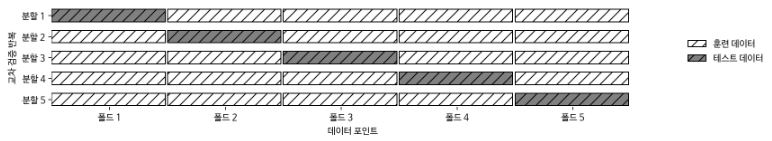
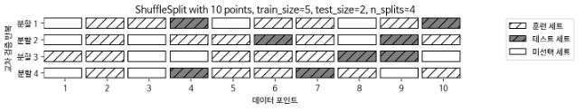
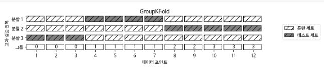

# 교차 검증

**교차 검증(Cross-validation)** 에서는 데이터를 여러 번 반복해서 나누고 여러 모델을 학습한다. 가장 널리 사용되는 교차 검증 방법은 ***k*-겹 교차 검증(*k* -fold cross-validation) ** 으로 *k* 는 특정 숫자인데 보통 5 또는 10을 사용한다. 예를 들어 5-겹 교차 검증을 하려면 데이터를 먼저 **폴드(Fold)** 라고 하는 비슷한 크기의 부분 집합 다섯 개로 나눈다. 그 다음 일련의 모델을 만드는데 첫 번째 모델은 첫 번째 폴드를 테스트 세트로, 두 번째 모델은 두 번째 폴드를 테스트 세트로 사용하는 식으로 5개의 모델의 학습 시킨다. 이렇게 결국 다섯 개의 정확도 값을 얻게 된다. 




##### 5.1.1 scikit-learn의 교차 검증

```python 
In:
from sklearn.model_selection import cross_val_score
from sklearn.datasets import load_iris
from sklearn.linear_model import LogisticRegression

iris = load_iris()
logreg = LogisticRegression()

scores = cross_val_score(logreg, iris.data, iris.target, cv=3)
scores = list(map(lambda x:float(f"{x:.3f}"), scores))
print(f"교차 검증 점수: {scores}")
```

```python 
Out:
교차 검증 점수: [0.98, 0.96, 0.98]
```

```python 
In:
scores = cross_val_score(logreg, iris.data, iris.target, cv=5)
scores = list(map(lambda x:float(f"{x:.3f}"), scores))
print(f"교차 검증 점수: {scores}")
```

```python 
Out:
교차 검증 점수: [0.967, 1.0, 0.933, 0.967, 1.0]
```

```python 
In:
print(f"교차 검증 평균 점수: {np.array(scores).mean():.3f}")
```

```python 
Out:
교차 검증 평균 점수: 0.973
```

5-겹 교차 검증이 만든 다섯 개의 값을 보면 100%에서 90%까지 폴드에 따라 비교적 차이가 큰데 이는 모델이 훈련에 사용한 폴드에 매우 의존적이거나 데이터셋이 작기 때문일 수 있다.


##### 5.1.2 교차 검증의 장점

- 장점 
  - 모든 샘플은 테스트 세트에 각 샘플이 한 번씩 들어가게 되므로 분류하기 쉽거나 반대로 어려운 샘플이 적어도 한 번씩 샘플에 들어가게 된다. 이를 통해서 모델을 잘 일반화 할 수 있도록 조정할 수 있다. 
  - 모델이 훈련 데이터에 얼마나 민감한지 알 수 있다. 최악의 경우와 최선의 경우를 짐작할 수 있게 한다.
- 단점 : 모델을 *k*개 만들어야 하므로 데이터를 한 번 나눴을 때보다 대략 *k*배 더 느리다.
- 주의: 교차 검증은 모델을 반환하지 않는다. 즉, 새로운 데이터 적용할 모델을 만드는 방법이 아니다. 다만 주어진 데이셋에 학습된 알고리즘이 얼마나 잘 일반화될지 평가하는 것이다(sklearn.model_selection.cross_val_predict 함수를 사용하면 교차 검증으로 만든 예측값을 구할 수는 있다).


##### 교차 검증 상세 옵션

cross_val_score를 사용할 때 cv 매개변수에 **교차 검증 분할기(Cross-validation splitter)** 를 전달함으로써 데이터를 분할할 때 더 세밀하게 제어 할 수 있다. 

```python 
In:
from sklearn.model_selection import KFold

kfold = KFold(n_splits=5)
scores = cross_val_score(logreg, iris.data, iris.target, cv=kfold)
scores = list(map(lambda x:float(f"{x:.3f}"), scores))
print(f"교차 검증 점수:\n{scores}")
```

```python 
Out:
교차 검증 점수:
[1.0, 1.0, 0.867, 0.933, 0.833]
```


```python 
In:
kfold = KFold(n_splits=3)
scores = cross_val_score(logreg, iris.data, iris.target, cv=kfold)
scores = list(map(lambda x:float(f"{x:.3f}"), scores))
print(f"교차 검증 점수:\n{scores}")
```

```python 
Out:
교차 검증 점수:
[0.0, 0.0, 0.0]
```

위와 같이 데이터가 클래스별로 정렬되어 있을 때 클래스의 갯수만큼 폴드를 생성하면 각 폴드는 데이터셋의 클래스 중 하나에 대응하므로 아무것도 학습할 수 없게 된다.


계층별 폴드를 만드는 대신 이 문제를 해결하는 다른 방법은 데이터를 섞어서 샘플의 순서를 뒤죽박죽으로 만드는 것이다. 이때 random_state를 고정해서 똑같은 작업을 재현할 수 있다. 데이터를 분할하기 전에 섞어주면 결과를 더 좋게 만든다.

```python 
In:
kfold = KFold(n_splits=3, shuffle=True, random_state=0)
scores = cross_val_score(logreg, iris.data, iris.target, cv=kfold)
scores = list(map(lambda x:float(f"{x:.3f}"), scores))
print(f"교차 검증 점수:\n{scores}")
```

```python 
Out:
교차 검증 점수:
[0.98, 0.96, 0.96]
```


##### LOOCV

**LOOCV(Leave-one-out cross-validation)** 교차 검증은 폴드 하나에 샘플 하나만 들어 있는 *k*-겹 교차 검증으로 생각할 수 있다. 각 반복에서 하나의 데이터 포인트를 선택해 테스트 세트로 사용한다. 데이터셋이 클 때는 시간이 오래 걸리지만 작은 데이터에는 더 좋은 결과를 만들어내기도 한다.

```python 
In:
from sklearn.model_selection import LeaveOneOut

loo = LeaveOneOut()
scores = cross_val_score(logreg, iris.data, iris.target, cv=loo)
scores = list(map(lambda x:float(f"{x:.3f}"), scores))
print("교차 검증 분할 횟수: ", len(scores))
print(f"평균 정확도: {np.array(scores).mean():.3f}")
```

```python 
Out:
교차 검증 분할 횟수:  150
평균 정확도: 0.967   
```


##### 임의 분할 교차 검증

**임의 분할 교차 검증(Shuffle-split cross-validation)** 은 train_size만큼의 포인트로 훈련 세트를 만들고, test_size 만큼의 (훈련 세트와 중첩되지 않는) 포인트로 테스트 세트를 만들도록 분할한다. 이 분할은 n_splits 횟수만큼 반복된다.


샘플이 10개인 데이터셋을 5개의 포인트의 훈련세트, 2개의 포인트의 테스트 세트로 4번 반복하여 나누는 예




train_size와 test_size에 정수를 입력하면 데이터 포인트의 절대 개수를 의미하며, 실수를 입력하면 전체 데이터에서의 비율을 나타낸다.

```python 
In:
from sklearn.model_selection import ShuffleSplit

shuffle_split = ShuffleSplit(test_size=.5, train_size=.5, n_splits=10)
scores = cross_val_score(logreg, iris.data, iris.target, cv=shuffle_split)
scores = list(map(lambda x: float(f"{x:.3f}"), scores))
print(f"교차 검증 점수:\n{scores}")
```

```python 
Out:
교차 검증 점수:
[0.973, 0.96, 0.96, 0.973, 1.0, 0.947, 0.973, 0.947, 0.987, 0.947]
```

임의 분할 교차 검증은 반복 횟수를 훈련 세트나 테스트 세트의 크기와 독립적으로 조절해야 할 때 유용하다. 또한 train_size와 test_size의 합을 전체와 다르게 함으로써 전체 데이터의 일부만 사용할 수 있는데 이렇게 데이터를 부분 샘플링(Subsampling)하는 방식은 대규모 데이터셋으로 작업할 때 도움이 된다.

ShuffleSplit의 계층별 버전으로 분류 작업에 더 적합한 StratifiedShuffleSplit도 있다.


##### 그룹별 교차 검증

훈련 세트와 테스트 세트를 만들 때 분리되지 않아야 할 그룹을 지정할 필요가 있는데 이때 그룹을 지정하는 매개변수 groups를 인자로 넘겨받을 수 있는 GroupKFold를 사용할 수 있다. 여기서 주의할 점은 분리되지 않아야할 그룹을 지정한다는 점이며 클래스 레이블과 혼동해서는 안된다.


다음의 데이터셋은 12개로 이루어져 있고 groups는 각 데이터 포인트에 대해 각 포인트가 어떤 그룹에 속하는지를 나타낸다.  처음 3개의 샘플이 첫 번째 그룹, 다음 4개의 샘플은 두 번째 그룹을 나타내는 식이다. 샘플 데이터를 그룹별로 정렬할 필요는 없다.

```python 
In:
from sklearn.model_selection import GroupKFold

X, y = make_blobs(n_samples=12, random_state=0)
groups = [0, 0, 0, 1, 1, 1, 1, 2, 2, 3, 3, 3]
scores = cross_val_score(logreg, X, y, groups, cv=GroupKFold(n_splits=3))
scores = list(map(lambda x: float(f"{x:.3f}"), scores))
print(f"교차 검증 점수:\n{scores}") 
```

```python 
Out:
교차 검증 점수:
[0.75, 0.6, 0.667]
```

