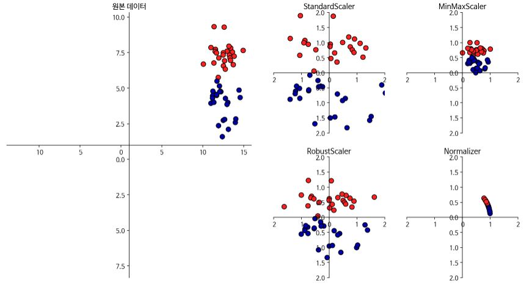
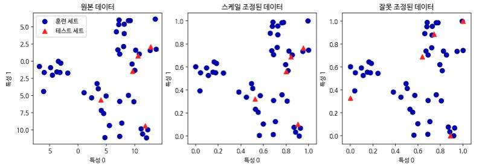

# 데이터 전처리와 스케일 조정

지도학습에서의 신경망과 SVM 같은 알고리즘은 데이터 스케일에 매우 민감하므로 조정이 필요하다.



1. StandardScaler는 각 특성의 평균을 0, 분산으로 1로 변경하여 모든 특성이 같은 크기를 가지게 한다. 그러나 각 특성의 최솟값과 최댓값의 크기를 제한하지는 않는다(x - x_bar / σ, 여기서 x_bar는 평균,  σ는 분산)
2. RobustScaler는 특성들이 같은 스케일을 갖는 다는 점에서는 1번과 유사하나 평균과 분산 대신 중간 값(Median)과 사분위 값(Quartile)을 사용한다. 이런 방식 때문에 **이상치(Outlier)** 에 큰 영향을 받지 않는다(x - q2 / q3 - q1, 여기서 qi는 i사분위 값).
3. MinMaxScaler는 모든 특성이 정확하게 0과 1 사이에 위치하도록 데이터를 변경한다(x - x_min / x_max - x_min, 여기서 x_min은 최솟값, x_max는 최댓값).
4. Normalizer는 특성 벡터의 유클리디안 길이가 1이 되도록 데이터 포인트를 조정한다. Normalizer의 norm 매개변수는 l1, l2, max 세가 옵션을 제공하며 유클리디안 거리를 의미하는 l2가 기본 값이다. 앞의 3가지 방식에서는 각 열(특성)의 통계치를 이용한다면 Normalizer는 행(데이터 포인트)마다 각기 정규화된다. 다른말로 하면 2차원에서는 지름이 1인 원, 3차원에서는 지름이 1인 구에 데이터 포인트를 사영(Projection)한다. 이는 특성 벡터의 길이와 상관 없이 데이터의 방향 또는 각도가 중요할 때 많이 사용한다.


##### 3.3.2 데이터 변환 적용하기

sklearn의 유방암 데이터를 MinMaxScaler를 사용하여 전처리한 결과는 다음과 같다.

```python 
In:
from sklearn.datasets import load_breast_cancer
from sklearn.model_selection import train_test_split

cancer = load_breast_cancer()
X_train, X_test, y_train, y_test = train_test_split(cancer.data, cancer.target, random_state=1)
print(X_train.shape, X_test.shape)
```

```python 
Out:
(426, 30) (143, 30)
```

```python 
In:
from sklearn.preprocessing import MinMaxScaler

scaler = MinMaxScaler()
scaler.fit(X_train)
```

```python 
Out:
MinMaxScaler(copy=True, feature_range=(0, 1))
```

```python 
In:
X_train_scaled = scaler.transform(X_train)
print(f"변환된 후 크기: {X_train_scaled.shape}")
print(f"스케일 조정 전 특성별 최솟값:")
print(np.array(list(map(lambda x:f"{x:.3f}", X_train.min(axis=0))), dtype="float"))
print(f"스케일 조정 전 특성별 최댓값:")
print(np.array(list(map(lambda x:f"{x:.3f}", X_train.max(axis=0))), dtype="float"))
print(f"스케일 조정 후 특성별 최솟값:\n {X_train_scaled.min(axis=0)}")
print(f"스케일 조정 후 특성별 최댓값:\n {X_train_scaled.max(axis=0)}")
```

```python 
In:
변환된 후 크기: (426, 30)
스케일 조정 전 특성별 최솟값:
[6.981e+00 9.710e+00 4.379e+01 1.435e+02 5.300e-02 1.900e-02 0.000e+00
 0.000e+00 1.060e-01 5.000e-02 1.150e-01 3.600e-01 7.570e-01 6.802e+00
 2.000e-03 2.000e-03 0.000e+00 0.000e+00 1.000e-02 1.000e-03 7.930e+00
 1.202e+01 5.041e+01 1.852e+02 7.100e-02 2.700e-02 0.000e+00 0.000e+00
 1.570e-01 5.500e-02]
스케일 조정 전 특성별 최댓값:
[2.811e+01 3.928e+01 1.885e+02 2.501e+03 1.630e-01 2.870e-01 4.270e-01
 2.010e-01 3.040e-01 9.600e-02 2.873e+00 4.885e+00 2.198e+01 5.422e+02
 3.100e-02 1.350e-01 3.960e-01 5.300e-02 6.100e-02 3.000e-02 3.604e+01
 4.954e+01 2.512e+02 4.254e+03 2.230e-01 9.380e-01 1.170e+00 2.910e-01
 5.770e-01 1.490e-01]
스케일 조정 후 특성별 최솟값:
 [0. 0. 0. 0. 0. 0. 0. 0. 0. 0. 0. 0. 0. 0. 0. 0. 0. 0. 0. 0. 0. 0. 0. 0.
 0. 0. 0. 0. 0. 0.]
스케일 조정 후 특성별 최댓값:
 [1. 1. 1. 1. 1. 1. 1. 1. 1. 1. 1. 1. 1. 1. 1. 1. 1. 1. 1. 1. 1. 1. 1. 1.
 1. 1. 1. 1. 1. 1.]
```

```python 
In:
X_test_scaled = scaler.transform(X_test)
print(f"스케일 조정 후 특성별 최솟값:")
print(np.array(list(map(lambda x:f"{x:.3f}", X_test_scaled.min(axis=0))), dtype="float"))
print(f"스케일 조정 후 특성별 최댓값:")
print(np.array(list(map(lambda x:f"{x:.3f}", X_test_scaled.max(axis=0))), dtype="float"))
```

```python 
Out:
스케일 조정 후 특성별 최솟값:
[ 0.034  0.023  0.031  0.011  0.141  0.044  0.     0.     0.154 -0.006
 -0.001  0.006  0.004  0.001  0.039  0.011  0.     0.    -0.032  0.007
  0.027  0.058  0.02   0.009  0.109  0.026  0.     0.    -0.    -0.002]
스케일 조정 후 특성별 최댓값:
[0.958 0.815 0.956 0.894 0.811 1.22  0.88  0.933 0.932 1.037 0.427 0.498
 0.441 0.284 0.487 0.739 0.767 0.629 1.337 0.391 0.896 0.793 0.849 0.745
 0.915 1.132 1.07  0.924 1.205 1.631]
```

참고로 테스트 데이터를 조정할 때는 훈련 데이터의 통계치를 사용해야 한다. 


##### 3.3.3 훈련 데이터와 테스트 데이터의 스케일을 같은 방법으로 조정하기

```python 
from sklearn.datasets import make_blobs

X, _ = make_blobs(n_samples=50, centers=5, random_state=4, cluster_std=2)
X_train, X_test = train_test_split(X, random_state=5, test_size=.1)

fig, axes = plt.subplots(1, 3, figsize=(13, 4))
axes[0].scatter(X_train[:, 0], X_train[:, 1], c=mglearn.cm2(0), label="훈련 세트", s =60)
axes[0].scatter(X_test[:, 0], X_test[:, 1],marker='^', c=mglearn.cm2(1), label="테스트 세트", s =60)
axes[0].legend(loc='upper left')
axes[0].set_title("원본 데이터")

scaler = MinMaxScaler()
scaler.fit(X_train)
X_train_scaled = scaler.transform(X_train)
X_test_scaled = scaler.transform(X_test)

axes[1].scatter(X_train_scaled[:, 0], X_train_scaled[:, 1], c=mglearn.cm2(0), label="훈련 세트", s =60)
axes[1].scatter(X_test_scaled[:, 0], X_test_scaled[:, 1],marker='^', c=mglearn.cm2(1), label="테스트 세트", s =60)
axes[1].set_title("스케일 조정된 데이터")

test_scaler = MinMaxScaler()
test_scaler.fit(X_test)
X_test_scaled_badly = test_scaler.transform(X_test)

axes[2].scatter(X_train_scaled[:, 0], X_train_scaled[:, 1], c=mglearn.cm2(0), label="훈련 세트", s =60)
axes[2].scatter(X_test_scaled_badly[:, 0], X_test_scaled_badly[:, 1],marker='^', c=mglearn.cm2(1), label="테스트 세트", s =60)
axes[2].set_title("잘못 조정된 데이터")

for ax in axes:
  ax.set_xlabel("특성 0")
  ax.set_ylabel("특성 1")
```



위와 같이 테스트 데이터의 통계치를 사용하여 전처리 했을 경우, 데이터 분포가 달라져 버리는 결과를 초래할 수 있다. 또한 훈련과 테스트 데이터를 분리하기 전에 합쳤을 때의 통계치를 사용해도 문제가 되는데, 그 이유는 모델에 테스트 데이터에 대한 **정보 유출(Information leak)** 이 발생할 수 있기 때문이다.


#####  3.3.4 지도 학습에서 데이터 전처리 효과

```python 
In:
from sklearn.svm import SVC

X_train , X_test, y_train, y_test = train_test_split(cancer.data, cancer.target, random_state=0)
svm = SVC(C=100)
svm.fit(X_train, y_train)
print(f"테스트 세트 정확도: {svm.score(X_test, y_test):.2f}")
```

```python 
Out:
테스트 세트 정확도: 0.94
```

```python 
In:
scaler = MinMaxScaler()
scaler.fit(X_train)
X_train_scaled = scaler.transform(X_train)
X_test_sacled = scaler.transform(X_test)

svm.fit(X_train_scaled, y_train)

print(f"스케일 조정된 테스트 세트의 정확도: {svm.score(X_test_sacled, y_test):.2f}")
```

```python 
Out:
스케일 조정된 테스트 세트의 정확도: 0.97
```

```python 
In:
from sklearn.preprocessing import StandardScaler

scaler = StandardScaler()
scaler.fit(X_train)
X_train_scaled = scaler.transform(X_train)
X_test_scaled = scaler.transform(X_test)

svm.fit(X_train_scaled, y_train)

print(f"SVM 테스트 정확도: {svm.score(X_test_sacled, y_test):.2f}")
```

```python 
Out:
SVM 테스트 정확도: 0.37
```