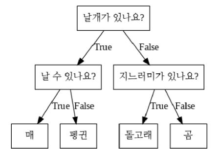
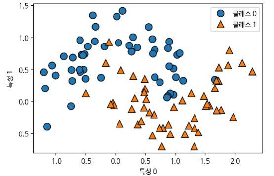
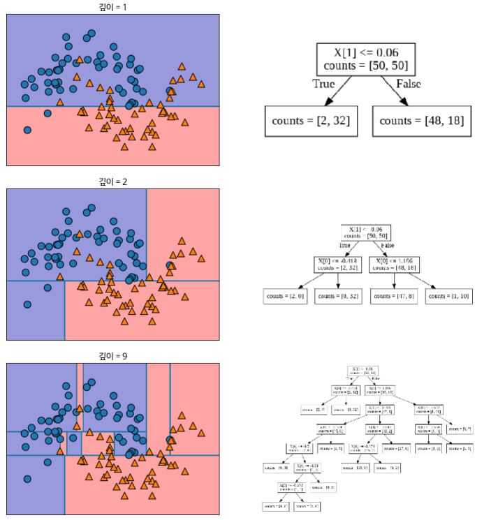
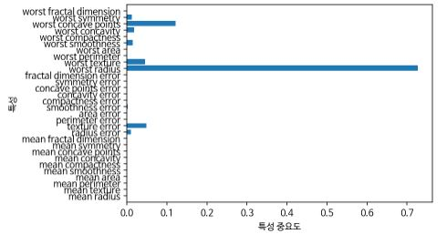
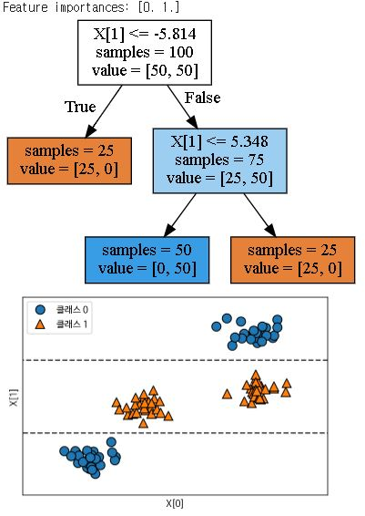
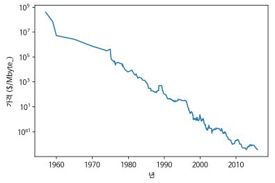
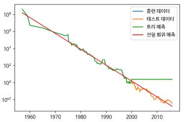

# 결정 트리

**결정트리(Decision tree)** 는 분류와 회귀 문제에 널리 사용하는 모델로서 기본적으로 결정에 다다르기 위해 예/아니오 질문이을 이어 나간다.



위의 트리에서 노드는 질문이나 정답을 담고 있고 에지는 질문의 답과 다음 질문을 연결하고 있다.


##### 결정 트리 만들기

결정 트리를 학습한다는 것은 정답에 가장 빨리 도달하는 예/아니오 질문 목록을 학습한다는 것이다. 





트리를 만들 때 알고리즘은 가능한 모든 테스트에서 타깃 값에 대해 가장 많은 정보를 가진 것을 고른다.  루트 노드에서 클래스를 가장 많이 나눌 수 있는(많은 정보를 소유하고 있는) 질문에 따라서 분기가 일어나고 있다. 반복되는 분할 프로세스는 각 분할된 영어이 한 개의 타깃값(하나의 클래스나 회귀 분석 결과)을 가질 때까지 반복된다. 타깃 하나로만 이뤄진 리프노드를 **순수노드(Pure node)** 라고 한다. 이렇게 학습된 결정 트리 모델에 새로운 데이터 포인트에 대한 예측은 새로운 데이터의 특성이 분할된 영역 중 어디에 놓이는 지를 확인한다. 회귀 문제에서는 트리를 탐색해 나가다가 새로운 데이터 포인트에 해당하는 리프노드를 찾아 찾은 리프 노드의 훈련 데이터 평균 값을 이 데이터 포인트의 출력이 되게 한다.


##### 결정 트리의 복잡도 제어하기

일반적으로 모든 리프노드가 순수 노드가 될 때까지 트리를 만들면 모델이 매우 복잡해진다(과대적합 발생). 이때 클래스 포인트들에서 멀리 떨어진 이상치(Outlier)에 민감해져 결정 경계의 모습이 복잡해진다. 결정 트리의 과대 적합을 막는 전략은 두 가지이다.

- **사전 가지치기(Pre-pruning)** - 트리 생성을 일찍 중단한다.
- **사후 가지치기 혹은 가지치기(Post-pruning or Pruning)** - 트리를 만들고 나서 데이터 포인트가 적은 노드를 삭제 혹은 병합한다.

scikit-learn에서 결정 트리는 DecisionTreeRegressor나 DecisionTreeClassifier에 구현되어 있다. 

가지치기는 사전 가지치기만 지원한다.

```python 
In:
from sklearn.tree import DecisionTreeClassifier
from sklearn.datasets import load_breast_cancer
from sklearn.model_selection import train_test_split

cancer = load_breast_cancer()
X_train, X_test, y_train, y_test = train_test_split(cancer.data, cancer.target, stratify=cancer.target, random_state=42)
tree = DecisionTreeClassifier(random_state=0)
tree.fit(X_train, y_train)
print(f"훈련 세트 정확도: {tree.score(X_train, y_train):.3f}")
print(f"테스트 세트 정확도: {tree.score(X_test, y_test):.3f}")
```

```python 
Out:
훈련 세트 정확도: 1.000
테스트 세트 정확도: 0.937    
```

위 결과를 보면 사전 가지치기를 하지 않을 때 훈련 세트 정확도가 1.0, 테스트 세트 정확도가 0.93로 선형 모델에서의 정확도가 약 0.95 인것을 상기하면 과대 적합이 발생했음을 확인 할 수 있다.


```python 
In:
tree = DecisionTreeClassifier(max_depth=4, random_state=0)
tree.fit(X_train, y_train)
print(f"훈련 세트 정확도: {tree.score(X_train, y_train):.3f}")
print(f"테스트 세트 정확도: {tree.score(X_test, y_test):.3f}")
```

```python 
Out:
훈련 세트 정확도: 0.988
테스트 세트 정확도: 0.951
```

트리 모델을 만들때, max_depth=4로 설정하면 트리 깊이(연속된 질문)를 최대 4개로 제한 할 수 있다. 결과는 테스트 세트의 정확도가 약 0.95로 나아진 것을 확인할 수 있다.


##### 결정 트리 분석

다음과 같이 만들어진 트리를 이미지로 저장하고 읽어들여 시각화 할 수 있다.

```python 
from sklearn.tree import export_graphviz

export_graphviz(tree, out_file="tree.dot", class_names=["악성", "양성"], 
                feature_names=cancer.feature_names, impurity=False, filled=True)
```

```python 
import graphviz

with open("tree.dot") as f:
    dot_graph = f.read()
display(graphviz.Source(dot_graph))
```


##### 트리의 특성 중요도

트리를 만드는 결정에 각 특성이 얼마나 중요한지를 평가하여 나타낸 것을 **특성 중요도(Feature importance)** 라고 한다. 이 값은 0과 1 사이의 값으로 각 특성에 대해 0은 전혀 사용되지 않았고 1은 완벽하게 타깃 클래스를 예측했다는 뜻이다. 특성 중요도의 전체 합은 1이다.

```python 
In:
print(f"특성 중요도:\n{tree.feature_importances_}")
```

```python 
Out:
특성 중요도:
[0.         0.         0.         0.         0.         0.
 0.         0.         0.         0.         0.01019737 0.04839825
 0.         0.         0.0024156  0.         0.         0.
 0.         0.         0.72682851 0.0458159  0.         0.
 0.0141577  0.         0.018188   0.1221132  0.01188548 0.        ]
```

```python 
def plot_feature_importances_cancer(model):
  n_features = cancer.data.shape[1]
  plt.barh(range(n_features), model.feature_importances_, align='center')
  plt.yticks(np.arange(n_features), cancer.feature_names)
  plt.xlabel("특성 중요도")
  plt.ylabel("특성")
  plt.ylim(-1, n_features)
plot_feature_importances_cancer(tree)  
```



첫 번째 노드에서 "worst_radius"이 가장 중요한 특성으로 나타낸다. 

그러나 feature_importance_ 값이 낮다고 해서 이 특성이 유용하지 않다는 것은 아니다. 단지 트리가 그 특성을 선택하지 않을 뿐이며 다른 특성이 동일한 정보를 가지고 있을 수도 있다.

특성 중요도는 항상 양수이고 특성이 어떤 클래스를 지지하는지는 알 수 없다. 

```python 
tree = mglearn.plots.plot_tree_not_monotone()
display(tree)
```



특성 중요도의 값이 X[1]의 값이 높지만 그렇다고 해서 X[1]이 높으면 클래스 0이고 낮으면 1이라고 할 수 없다.


DecisionTreeRegressor로 구현된 회귀 결정 트리는 분류 트리와 매우 비슷하지만 주의해야할 점은 이 모델의 경우 외삽(Extrapolation), 즉 훈련 데이터의 범위 밖의 포인트에 대해서는 예측을 할 수 없다는 점이다. 

```python 
import pandas as pd
import os

ram_prices = pd.read_csv(os.path.join(mglearn.datasets.DATA_PATH, "ram_price.csv"))

plt.semilogy(ram_prices.date, ram_prices.price)
plt.xlabel("년")
plt.ylabel("가격 ($/Mbyte_)")
```



(그래프를 로그 스케일로 그리면 약간의 굴곡을 제외하고는 선형적으로 나타나서 비교적 예측하기가 쉬워진다.)

```python 
from sklearn.tree import DecisionTreeRegressor
from sklearn.linear_model import LinearRegression

data_train = ram_prices[ram_prices.date < 2000]
data_test = ram_prices[ram_prices.date >= 2000]

X_train = data_train.date[:, np.newaxis]
y_train = np.log(data_train.price)

tree = DecisionTreeRegressor().fit(X_train, y_train)
linear_reg = LinearRegression().fit(X_train, y_train)

X_all = ram_prices.date[:, np.newaxis]

pred_tree = tree.predict(X_all)
pred_lr = linear_reg.predict(X_all)

price_tree = np.exp(pred_tree)
price_lr = np.exp(pred_lr)
```

```python 
plt.semilogy(data_train.date, data_train.price, label="훈련 데이터")
plt.semilogy(data_test.date, data_test.price, label="테스트 데이터")
plt.semilogy(ram_prices.date, price_tree, label="트리 예측")
plt.semilogy(ram_prices.date, price_lr, label="선형 회귀 예측")
plt.legend()
```



선형 모델은 데이터를 직선으로 근사하여 테스트 데이터를 비교적 정확히 예측할 수 있으나 트리 모델은 훈련 데이터를 완벽하게 예측하지만 모델이 가진 범위 밖(테스트 데이터)에서는 예측이 불가함을 알 수 있다. 트리 모델은 시계열 데이터의 예측에는 잘 맞지 않는다.


##### 장단점과 매개변수

결정 트리에서 모델 복잡도를 조절하는 매개변수는 사전 가지치기 매개변수이다. max_depth, max_leaf_nodes(리프 노드의 최대 개수), min_samples_leaf(리프 노드가 되기 위한 최소한의 샘플 개수), min_samples_split(노드가 분기할 수 있는 최소 샘플 개수) 등이 있다.

결정트리는 비교적 작은 트리 일때 모델을 쉽게 시각화 할 수 있다. 또 데이터의 스케일에 구애받지 않으므로 특성의 정규화나 표준화 같은 전처리 과정이 필요 없다. 특히 특성의 스케일이 서로 다르거나 이진 특성과 연속 특성이 혼합되어 있을때도 잘 작동한다.

단일 결정 트리의 단점은 사전 가지치기에도 불구하고 과대적합하는 경향이 있어 일반화 성능이 좋지 않다는 점이다.