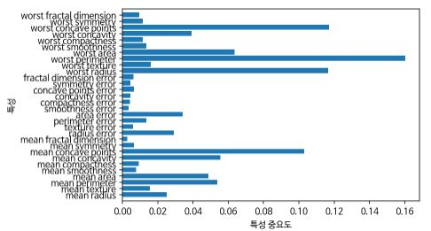

# 결정 트리의 앙상블

**앙상블(Ensemble)** 은 여러 머신러닝 모델을 연결하여 더 강력한 모델을 만드는 기법이다. 그 중 분류와 회귀 문제의 다양한 데이터 세트에서 효과적이라고 입증 된 **랜덤 포레스트(Random forest)** 와 **그래디언트 부스팅(Gradient boosting)** 결정 트리는 모델을 구성하는 기본 요소로 결정 트리를 사용한다.


##### 랜덤 포레스트

랜덤 포레스트는 단일 결정 트리의 묶음이다. 잘 작동하되 서로 다른 방향으로 과대적합된 트리를 많이 만들고 그 결과를 평균내면 과대적합 효과를 줄일 수 있다. 이런 전략을 구현하려면 각각의 타깃 예측을 잘하며 다른 트리와는 구별되는 트리를 많이 만들어야 하는데 이를 위해서 데이터 포인트를 무작위로 선택하는 방법과 분할 테스트에서 특성을 무작위로 선택하는 방법을 사용해서 트리를 만든다.


##### 랜덤 포레스트 구축

랜덤 포레스트 모델을 만드려면 생성할 트리의 개수를 정해야한다(RandomForestRegressor, RandomForestClassifier의 n_estimators 매개변수). 트리들은 완전히 독립적으로 만들어져야 하므로 알고리즘이 각 트리가 고유하게 만들어 질 수 있도록 무작위한 선택을 한다. 트리를 만들기 위해서 먼저 **부트스트랩 샘플(Bootstrap sample)** 을 생성한다. 즉, n_smaples개의 데이터에서 무작위로 데이터를 n_samples 횟수만큼 반복 추출한다. 이 데이터셋은 원래 데이터셋과 크기가 같지만 어떤 데이터는 누락될 수도 있고 어떤 데이터는 중복되어 들어 있을 수 있다. 특성 부분에서는 알고리즘이 각 노드에서 후보 특성을 무작위로 선택한 후 이 후보들 중에서 최선의 질문을 찾는다. 몇 개의 특성을 고를지는 max_features 매개변수로 조정할 수 있다.  정리하면 부트스트랩 샘플링은 1. 트리가 조금씩 다른 데이터 셋을 사용하여 만들어지도록 하고 2. 트리의 각 분기가 각기 다른 특성 부분집합을 사용하도록 한다.

이 방식에서 핵심 매개변수는 max_features인데, max_features 값을 크게 하면 트리들이 매우 비슷해지고 가장 두드러진 특성을 이용해 데이터에 잘 맞춰질 것이다. 반대로 max_features 값을 낮추면 트리들이 많이 달라지고 각 트리는 데이터에 맞추기 위해 깊이가 깊어지게 된다.

예측을 진행할때는 모델에 있는 모든 트리의 예측을 만들고 회귀의 경우에는 이 예측들을 평균으로 하여 예측을 하고 분류는 각 트리들이 예측한 확률을 평균내어 가장 높은 확률을 가진 클래스를 예측 값으로 한다.


##### 랜덤 포레스트 분석

```python 
In:
from sklearn.ensemble import RandomForestClassifier
from sklearn.datasets import make_moons

X, y = make_moons(n_samples=100, noise=0.25, random_state=3)
X_train, X_test, y_train, y_test = train_test_split(X, y, stratify=y, random_state=42)
forest = RandomForestClassifier(n_estimators=5, random_state=2)
forest.fit(X_train, y_train)
```

```python 
Out:
RandomForestClassifier(bootstrap=True, ccp_alpha=0.0, class_weight=None,
                       criterion='gini', max_depth=None, max_features='auto',
                       max_leaf_nodes=None, max_samples=None,
                       min_impurity_decrease=0.0, min_impurity_split=None,
                       min_samples_leaf=1, min_samples_split=2,
                       min_weight_fraction_leaf=0.0, n_estimators=5,
                       n_jobs=None, oob_score=False, random_state=2, verbose=0,
                       warm_start=False)    
```

랜덤 포레스트 안에서 만들어진 트리는 estimator_ 속성에 저장된다.

```python 
fig, axes = plt.subplots(2, 3, figsize=(20, 10))
for i, (ax, tree) in enumerate(zip(axes.ravel(), forest.estimators_)):
  ax.set_title(f"트리 {i}")
  mglearn.plots.plot_tree_partition(X, y, tree, ax=ax)

mglearn.plots.plot_2d_separator(forest, X, fill=True, ax=axes[-1, -1], alpha=.4)
axes[-1, -1].set_title("랜덤 포레스트")
mglearn.discrete_scatter(X[:, 0], X[:, 1], y)
```


```python 
In:
X_train, X_test, y_train, y_test = train_test_split(cancer.data, cancer.target, random_state=0)
forest = RandomForestClassifier(n_estimators=100, random_state=0)
forest.fit(X_train, y_train)

print(f"훈련 데이터 정확도: {forest.score(X_train, y_train):.3f}")
print(f"테스트 데이터 정확도: {forest.score(X_test, y_test):.3f}")
```

```python 
Out:
훈련 데이터 정확도: 1.000
테스트 데이터 정확도: 0.972
```

랜덤 포레스트도 특성 중요도를 제공하는데 각 트리의 특성 중요도를 취합하여 계산한 것이다. 

```python 
plot_feature_importances_cancer(forest)
```




##### 장단점과 매개변수

랜덤 포레스트는 성능이 매우 뛰어나고 매개변수 튜닝을 많이 하지 않아도 잘 작동하며 데이터의 스케일을 맞출 필요도 없으므로 널리 사용되는 머신러닝 알고리즘이다.

n_jobs 매개변수를 통해 멀티 코어로 병렬 처리가 가능하다(1은 기본, -1은 컴퓨터의 모든 코어).

random_state마다 다른 결과를 만들어 낸다.

텍스트 데이터와 같이 매우 차원이 높고 희소한 데이터에는 잘 작동하지 않는다. 이런 모델은 선형 모델이 더 적합하다. 매우 큰 데이터셋에도 잘 작동하긴하나 선형 모델보다 많은 메모리를 사용하며 훈련과 예측이 느리다.

n_estimators는 클수록 좋으나 더 많은 메모리와 긴 훈련시간을 요구한다. 따라서 가용한 시간과 메모리 만큼 트리를 많이 만드는 것이 좋다. 단일 결정 트리와 같은 사전가지치기 옵션도 제공한다.

max_features는 트리가 얼마나 무작위가 될지를 결정하며 작을 수록 과대적합을 줄여준다. 기본 값은

회귀의 경우 sqrt(n_features)이고 분류는 n_features이다.


##### 그래디언트 부스팅 회귀 트리

GradientBoostingClassifier와 GradientBoostingRegressorsms는 모두 DecisionTreeRegressor를 사용하여 구현되어 있다. 랜덤포레스트와는 달리 이전 트리의 오차를 보완하는 방식으로 순차적으로 트리를 만든다.  랜덤포레스트에서와 같은 무작위성이 없는 대신 강력한 사전 가지치기가 사용된다. 보통 하나에서 다섯 정도의 깊지 않은 트리(**약한 학습기(weak learner)** )를 사용하므로 메모리를 적게 사용하고 예측도 빠르다. 각가의 트리는 데이터 일부에 대해서만 예측을 잘 수행하는데 이런 트리가 많이 추가될수록 성능이 좋아진다. 오차를 보완하여 새로운 트리를 보정할 때 손실함수를 정의하고 경사 하강법을 사용하게 된다. 사전 가지치기나 트리 개수외에 중요한 매개변수로는 오차를 얼마나 강하게 보정할지를 제어하는 learning_rate가 있다. 학습률이 크면 트리 보정을 강하게 해서 복잡한 모델을 만든다. 

```python 
In:
from sklearn.ensemble import GradientBoostingClassifier
from sklearn.datasets import load_breast_cancer
from sklearn.model_selection import train_test_split

cancer = load_breast_cancer()
X_train, X_test, y_train, y_test = train_test_split(cancer.data, cancer.target, random_state=0)
gbrt = GradientBoostingClassifier(random_state=0)
gbrt.fit(X_train, y_train)

print(f"훈련 세트 정확도: {gbrt.score(X_train, y_train):.3f}")
print(f"테스트 세트 정확도: {gbrt.score(X_test, y_test):.3f}")
```

```python 
Out:
훈련 세트 정확도: 1.000
테스트 세트 정확도: 0.965
```


훈련세트가 1.0의 정확도를 가지므로 과대 적합됨을 추측할 수 있다. 이를 개선하기 위해서 트리의 최대 깊이를 줄여 사전 가지치기를 하거나 학습률을 낮출 수 있다. 

```python 
In:
gbrt = GradientBoostingClassifier(random_state=0, max_depth=1)
gbrt.fit(X_train, y_train)

print(f"훈련 세트 정확도: {gbrt.score(X_train, y_train):.3f}")
print(f"테스트 세트 정확도: {gbrt.score(X_test, y_test):.3f}")
```

```python 
Out:
훈련 세트 정확도: 0.991
테스트 세트 정확도: 0.972
```

```python 
In:
gbrt = GradientBoostingClassifier(random_state=0, learning_rate=.01)
gbrt.fit(X_train, y_train)

print(f"훈련 세트 정확도: {gbrt.score(X_train, y_train):.3f}")
print(f"테스트 세트 정확도: {gbrt.score(X_test, y_test):.3f}")
```

```python 
Out:
훈련 세트 정확도: 0.988
테스트 세트 정확도: 0.965
```


다음은 그래디언트 부스팅 회귀 모델의 특성 중요도를 시각화 한 것이다.

```python 
def plot_feature_importances_cancer(model):
  n_features = cancer.data.shape[1]
  plt.barh(range(n_features), model.feature_importances_, align='center')
  plt.yticks(np.arange(n_features), cancer.feature_names)
  plt.xlabel("특성 중요도")
  plt.ylabel("특성")
  plt.ylim(-1, n_features)

gbrt = GradientBoostingClassifier(random_state=0, max_depth=1)
gbrt.fit(X_train, y_train)

plot_feature_importances_cancer(gbrt)
```


대규모 머신러닝 문제에 그래디언트 부스팅을 적용하려면 xgboost 패키지를 고려해보자.

[xgboost]: https://xgboost.readthedocs.io/en/latest/


##### 장단점과 매개변수

그래디언트 부스팅 결정 트리의 가장 큰 단점은 매개변수를 잘 조정해야한다는 것과 훈련 시간이 길다는 것이다. 그러나 트리 기반 모델의 특성 상 특성의 스케일을 조정하지 않아도 되고 이진 특성이나 연속적인 특성에 상관 없이 잘 동작한다. 희소한 고차원 데이터에는 잘 동작 하지 않는다.

보통 learning_rate를 낮추면 비슷한 복잡도의 모델을 만들기 위해서 더 많은 트리를 추가해야 한다. 랜덤 포레스트와는 달리 n_estimators를 크게 하면 모델이 복잡해지고 과대적합할 가능성이 커지므로 가능한 시간과 메모리 한도에서 n_estimators를 맞추고 learning_rate를 찾는 것이 좋다.

그 밖에 max_depth, max_leaf_nodes 등의 사전 가지치기 매개변수를 조정하는 것이 필요하고 max_depth를 작게 설정하여 트리의 깊이가 5보다 깊어지지 않게 하는 것이 필요하다. 