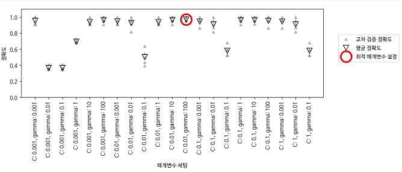
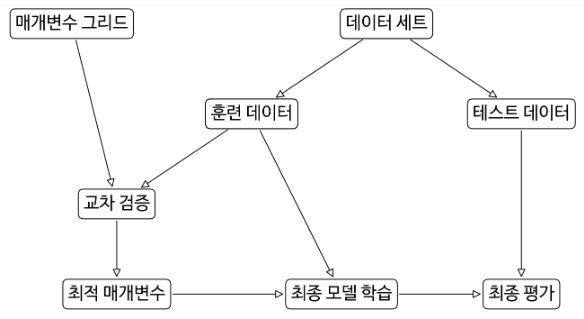
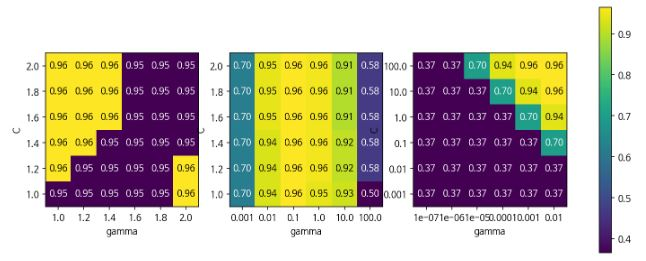

# 그리드 서치

모델에서 중요한 매개변수의 (일반화 성능을 최대로 높여주는) 값을 찾는 일은 어려운 작업이지만, 모든 모델과 데이터셋에서 해야하는 필수적인 일이다.  scikit-learn에서는 **그리드 서치(Grid search)** 로 관심 있는 매개변수들을 대상으로 가능한 모든 조합을 시도해 본다.


##### 5.2.1 간단한 그리드 서치

```python 
In:
from sklearn.datasets import load_iris
from sklearn.model_selection import train_test_split
from sklearn.svm import SVC

iris = load_iris()
X_train, X_test, y_train, y_test = train_test_split(iris.data, iris.target, random_state=0)
print(f"훈련 세트의 크기: {X_train.shape[0]} 테스트 세트의 크기: {X_test.shape[0]}")

best_score = 0

for gamma in [10**i for i in range(-3, 3)]:
  for C in [10**j for j in range(-3, 3)]:
    svm = SVC(gamma=gamma, C=C)
    svm.fit(X_train, y_train)
    score = svm.score(X_test, y_test)
    if score > best_score:
      best_score = score
      best_parameter = {'C': C, 'gamma' : gamma}

print(f"최고 점수: {best_score:.2f}")
print(f"최적 매개변수: {best_parameter}")
```

```python 
Out:
훈련 세트의 크기: 112 테스트 세트의 크기: 38
최고 점수: 0.97
최적 매개변수: {'C': 100, 'gamma': 0.001}
```


##### 5.2.2 매개변수 과대적합과 검증 세트

앞에서 여러 가지 매개변수 값으로 많이 시도해보고 테스트 세트 정확도가 높은 조합을 선택했는데 이 정확도는 새로운 데이터까지 이어지지 않을 수 있다. 왜냐하면 매개변수를 조정하기 위해 테스트 세트를 이미 사용했기 때문이다. 평가를 위해서는 모델을 만들 때 사용하지 않는 독립된 테스트 셋이 필요하다.


모델을 생성할 때는 세 개의 세트로 나누어 훈련 세트로는 모델을 만들고, 검증 세트로는 모델의 매개변수를 선택하고, 테스트 세트로는 선택된 매개변수의 성능을 평가한다.


```python 
In:
from sklearn.datasets import load_iris
from sklearn.model_selection import train_test_split
from sklearn.svm import SVC

iris = load_iris()
X_trainval, X_test, y_trainval, y_test = train_test_split(iris.data, iris.target, random_state=0)
X_train, X_valid, y_train, y_valid = train_test_split(X_trainval, y_trainval, random_state=1)
print(f"훈련 세트의 크기: {X_train.shape[0]}  검증 세트의 크기: {X_valid.shape[0]}  \
테스트 세트의 크기: {X_test.shape[0]}\n")

best_score = 0

for gamma in [10**i for i in range(-3, 3)]:
  for C in [10**j for j in range(-3, 3)]:
    svm = SVC(gamma=gamma, C=C)
    svm.fit(X_train, y_train)
    score = svm.score(X_valid, y_valid)
    if score > best_score:
      best_score = score
      best_parameters = {'C': C, 'gamma' : gamma}

svm = SVC(**best_parameters)
svm.fit(X_trainval, y_trainval)
test_score = svm.score(X_test, y_test)
print(f"검증 세트에서 최고 점수: {best_score:.2f}")
print(f"최적 매개변수: ", best_parameters)
print(f"최적 매개변수에서 테스트 세트 점수: {test_score:.2f}")
```

```python 
Out:
훈련 세트의 크기: 84  검증 세트의 크기: 28  테스트 세트의 크기: 38

검증 세트에서 최고 점수: 0.96
최적 매개변수:  {'C': 10, 'gamma': 0.001}
최적 매개변수에서 테스트 세트 점수: 0.92
```

훈련 세트, 검증 세트, 테스트 세트의 구분은 실제 머신러닝 알고리즘을 적용하는 데 아주 중요하다. 테스트 세트 정확도에 기초해 어떤 선택을 했다면 테스트 세트의 정보를 모델에 누설하는 것이다. 그렇기 때문에 최종 평가에만 사용하도록 테스트 세트를 분리해 유지하는 것이 중요하다.


##### 5.2.3 교차 검증을 사용한 그리드 서치

일반화 성능을 더 잘 평가하려면 훈련 세트와 검증 세트를 한 번만 나누지 않고, 교차 검증을 사용해서 각 매개변수 조합의 성능을 평가할 수 있다. 

```python 
In:
from sklearn.model_selection import cross_val_score

best_score = 0

for gamma in [10**i for i in range(-3, 3)]:
  for C in [10**j for j in range(-3, 3)]:
    svm = SVC(gamma=gamma, C=C)
    scores = cross_val_score(svm, X_trainval, y_trainval, cv=5)
    score = np.mean(scores)
    if score > best_score:
      best_score = score
      best_parameters = {'C': C, 'gamma' : gamma}

svm = SVC(**best_parameters)
svm.fit(X_trainval, y_trainval)
```

```python 
Out:
SVC(C=10, break_ties=False, cache_size=200, class_weight=None, coef0=0.0,
    decision_function_shape='ovr', degree=3, gamma=0.1, kernel='rbf',
    max_iter=-1, probability=False, random_state=None, shrinking=True,
    tol=0.001, verbose=False)
```




데이터를 나누고 그리드 서치를 적용하여 최종 매개변수를 평가하는 전체과정은 다음과 같다.




교차 검증을 사용한 그리드 서치는 scikit-learn에서 GridSearchCV로 제공하고 있다. GridSearchCV에서 분류에는 StratifiedKFold를, 회귀에서는 KFold를 기본 값으로 사용한다. 다른 추정기를 사용해 만든 추정기를 scikit-learn에서는 메타 추정기(Meta-estimator)라고 한다(MetaEstimatorMixin 클래스를 상속한 모델로 랜덤 포레스트, 그래디언트 부스팅, RFE 등이 있다). GridSearchCV는 가장 널리 사용되는 메타 추정기 중 하나이다. GridSearchCV는 전체 데이터로 학습한 모델에 접근할 수 있도록 predict, score, predict_proba, decision_function 같은 메소드를 제공한다.

```python 
In:
from sklearn.model_selection import GridSearchCV
from sklearn.svm import SVC

param_grid = {'C' : [10**i for i in range(-3, 3)],
              'gamma' : [10**j for j in range(-3, 3)]}
grid_search = GridSearchCV(SVC(), param_grid, cv=5)
X_train, X_test, y_train, y_test = train_test_split(iris.data, iris.target, random_state=0)
grid_search.fit(X_train, y_train)
print(f"테스트 세트 점수: {grid_search.score(X_test, y_test):.2f}")
print(f"최적 매개변수: {grid_search.best_params_}")
print(f"최상 교차 검증 점수: {grid_search.best_score_:.2f}")
print(f"최고 성능 모델:\n{grid_search.best_estimator_}")
```

```python 
Out:
테스트 세트 점수: 0.97
최적 매개변수: {'C': 10, 'gamma': 0.1}
최상 교차 검증 점수: 0.97
최고 성능 모델:
SVC(C=10, break_ties=False, cache_size=200, class_weight=None, coef0=0.0,
    decision_function_shape='ovr', degree=3, gamma=0.1, kernel='rbf',
    max_iter=-1, probability=False, random_state=None, shrinking=True,
    tol=0.001, verbose=False)
```


##### 교차 검증 결과 분석

교차 검증의 결과를 시각화하면 검색 대생 매개변수가 모델의 일반화에 영향을 얼마나 주는지 이해하는 데 도움이 된다. 그리드 서치는 연산 비용이 매우 크므로 비교적 간격을 넓게 하여 적은 수의 그리드로 시작하는 것이 좋다. 그런 다음 교차 검증된 그리드 서치의 결과를 분석하여 검색을 확장해나갈 수 있다(GridSearchCV외 에도 널리 사용하는 또 하나의 방법으로, 주어진 범위에서 매개변수를 무작위로 선택하여 조사하는 RandomizedSearchCV가 있다. GridSearchCV와 비교하여 결과가 크게 뒤지지 않고 검색이 빠르기 때문에 매개변수의 조합이 매우 많거나 규제 매개변수와 같이 연속형 값을 조정해야할 때 널리 사용한다). 그리드 서치의 결과는 검색과 관련한 여러 정보가 cv_results_ 딕셔너리 속성에 담겨있다. 

```python 
import pandas as pd

results = pd.DataFrame(grid_search.cv_results_)
display(results.head())
```


results 행 하나는 특정한 하나의 매개변수 설정에 대응한다. 각 설정에 대해 교차 검증의 모든 분할의 평균값, 표준편차를 포함한 결과가 기록되어 있다. 

```python 
scores = np.array(results.mean_test_score).reshape(6, 6)
mglearn.tools.heatmap(scores, xlabel='gamma', xticklabels=param_grid['gamma'],
                      ylabel='C', yticklabels=param_grid['C'], cmap='viridis')
```


다음은 검색 범위가 적절하게 선택되지 않아서 바람직하지 못한 결과를 내는 그래프의 예이다.

```python 
fig, axes = plt.subplots(1, 3, figsize=(13, 5))
param_grid_linear = {'C': np.linspace(1, 2, 6),
                     'gamma': np.linspace(1, 2, 6)}

param_grid_one_log = {'C': np.linspace(1, 2, 6),
                      'gamma': np.logspace(-3, 2, 6)}

param_grid_range = {'C': np.logspace(-3, 2, 6),
                    'gamma' : np.logspace(-7, -2, 6)}

for param_grid, ax in zip([param_grid_linear, param_grid_one_log,
                           param_grid_range], axes):
  grid_search = GridSearchCV(SVC(), param_grid, cv=5)
  grid_search.fit(X_train, y_train)
  scores = grid_search.cv_results_['mean_test_score'].reshape(6, 6)

  scores_image = mglearn.tools.heatmap(
      scores, xlabel="gamma", ylabel='C', xticklabels = param_grid['gamma'],
      yticklabels=param_grid['C'], cmap='viridis', ax=ax
  )

plt.colorbar(scores_image, ax=axes.tolist())
```



첫번째 그래프는 점수 변화가 전혀 없는데 이런 결과는 매개변수의 스케일과 점위가 부적절할 때 발생한다. 매개변수의 설정이 바뀌어도 정확도에 아무런 변화가 없다면 그 매개변수가 전혀 중요하지 않은 것일 수도 있다. 처음에 매우 극단적인 값을 적용해보고, 매개변수를 바꿔가며 정확도가 변하는지 살펴보는 것이 좋다. 

두번째 그래프에서는 gamma 매개변수는 적절한 범위를 탐색하고 있지만 C 매개변수는 그렇지 못든지, 아니면 중요한 매개변수가 아닐 수도 있다. 

세번째 그래프에서는 다음 번 검색 땐 매개변수 그리드에서 매우 작은 단위는 제외할 수 있을 것이다.

교차검증 점수를 토대로 매개변수 그리드를 튜닝하는 것은 아주 안전한 방법이며, 매개변수들의 중요도를 확인하는 데도 좋다.


##### 비대칭 매개변수 그리드 탐색

GridSearchCV에 전달할 param_grid를 딕셔너리의 리스트로 만들면 리스트에 있는 각 딕셔너리는 독립적인 그리드로 적용된다. 

```python 
In:
from sklearn.model_selection import GridSearchCV, train_test_split
from sklearn.datasets import load_iris
from sklearn.svm import SVC

iris = load_iris()
X_train, X_test, y_train, y_test = train_test_split(iris.data, iris.target, random_state=0)

param_grid = [{'kernel': ['rbf'], 
               'C': [10**i for i in range(-3, 3)],
               'gamma': [10**i for i in range(-3, 3)]},
              {'kernel': ['linear'],
               'C': [10**i for i in range(-3, 3)]}]
grid_search = GridSearchCV(SVC(), param_grid, cv=5)
grid_search.fit(X_train, y_train)
print(f"최적 매개변수: {grid_search.best_params_}")
print(f"최고 교차 검증 점수: {grid_search.best_score_:.2f}")
```

```python 
Out:
최적 매개변수: {'C': 10, 'gamma': 0.1, 'kernel': 'rbf'}
최고 교차 검증 점수: 0.97
```

```python 
import pandas as pd

results = pd.DataFrame(grid_search.cv_results_)
display(results.T)
```


##### 그리드 서치에 다양한 교차 검증 적용

GridSearchCV의 분류에서는 기본적으로 계층형 *k*-겹 교차 검증을 사용하고 회귀에는 *k*-겹 교차 검증을 사용한다. 그러나 cv 매개변수를 통해 다른 교차 검증 분할기를 사용할 수도 있다. ShuffleSplit이나 StratifiedShuffleSplit의 n_splits=1로 하면 훈련 세트와 검증 세트를 1번만 분할하는데 이런 방법은 데이터 셋이 매우 크거나 모델 구축에 시간이 오래 걸릴 때 유용하다.


##### 중첩 교차 검증

원본 데이터를 훈련 세트와 테스트 세트로 한 번만 나누는 방식 대신 더 나아가 교차 검증 분할 방식을 사용할 수 있다. **중첩 교차 검증(Nested cross-validation)** 은 바깥쪽 루프에서 데이터를 훈련 세트와 테스트 세트로 나눈다. 그리고 각 훈련 세트에 대해 그리드 서치를 실행한다(바깥쪽 루프에서 분할된 훈련 세트마다 최적의 매개변수가 다를 수 있음). 그런 다음 바깥쪽에서 분할된 테스트 세트의 점수를 최적의 매개변수 설정을 사용해 각각 측정한다. 

이 방법은 모델이나 매개변수 설정이 아닌 테스트 점수의 목록을 만들어준다. 이 점수들은 그리드 서치를 통해 찾은 최적 매개변수가 모델을 얼마나 잘 일반화시키는지 알려준다. 새로운 데이터에 적용할 모델을 만드는 것이 아니니, 중첩 교차 검증은 새로운 데이터에 적용하기위한 예측 모델을 찾는데는 사용하지 않는다. 

```python 
In:
from sklearn.model_selection import cross_val_score

param_grid = {'C' : [10**i for i in range(-3, 3)],
              'gamma' : [10**i for i in range(-3, 3)]}
scores = cross_val_score(GridSearchCV(SVC(), param_grid, cv=5), iris.data, iris.target, cv=5)

scores = list(map(lambda x: float(f"{x:.3f}"), scores))
print("교차 검증 점수: ", scores)
print(f"교차 검증 평균 점수: {np.array(scores).mean():.3f}") 
```

```python 
Out:
교차 검증 점수:  [0.967, 1.0, 0.967, 0.967, 1.0]
교차 검증 평균 점수: 0.980
```

이를 직접 간단하게 구현해보면 아래와 같다.

```python 
In:
from sklearn.model_selection import ParameterGrid, StratifiedKFold

def nested_cv(X, y, inner_cv, outer_cv, Classifier, parameter_grid):
    outer_scores = []
    # split 메소드는 훈련과 테스트 세트에 해당하는 인덱스를 리턴
    for training_samples, test_samples in outer_cv.split(X, y):
        best_parms = {}
        best_score = -np.inf
        for parameters in parameter_grid:
            cv_scores = []
            for inner_train, inner_test in inner_cv.split(
                    X[training_samples], y[training_samples]):
                clf = Classifier(**parameters)
                clf.fit(X[inner_train], y[inner_train])
                score = clf.score(X[inner_test], y[inner_test])
                cv_scores.append(score)
            mean_score = np.mean(cv_scores)
            if mean_score > best_score:
                best_score = mean_score
                best_params = parameters
        clf = Classifier(**best_params)
        clf.fit(X[training_samples], y[training_samples])
        outer_scores.append(clf.score(X[test_samples], y[test_samples]))
    outer_scores = list(map(lambda x: float(f"{x:.3f}"), outer_scores))
    return np.array(outer_scores)

scores = nested_cv(iris.data, iris.target, StratifiedKFold(5), StratifiedKFold(5),
                   SVC, ParameterGrid(param_grid))
print(f"교차 검증 점수: {scores}")
```

```python 
Out:
교차 검증 점수: [0.967 1.    0.967 0.967 1.   ]
```


##### 교차 검증과 그리드 서치 병렬화

그리드 서치는 쉽게 병렬화할 수 있다. 하나의 교차 검증 분할에서 특정 매개변수 설정을 사용해 모델을 만드는 일이 매개변수 설정이나 모델과 상관없이 진행할 수 있기 때문이다. GridSearchCV와 cross_val_score에서 n_jobs 매개변수에 사용할 CPU 코어수를 지정할 수 있다. -1이면 가능한 모든 코어를 사용한다.

scikit-learn에서는 병렬화를 중첩해서 사용할 수 없기 때문에 예컨대 모델에서 n_jobs 옵션을 사용하면 이 모델을 사용하는 GridSearchCV에서는 병렬화 옵션을 사용할 수 없다(scikit-learn에서는 병렬화를 위해 joblib.Parallel 라이브러리를 사용하는데 이 라이브러리가 사용하는 파이썬의 multiprocessing 모듈은 작업 프로세스가 고아 프로세스(또는 데몬)가 되는 것을 방지하기 위해서, 포크된 프로세스가 다시 자식 프로세스를 포크하지 못하게 막는다. 그래고 병렬화 옵션을 중첩해서 사용할 경우 경고 메세지와 함꼐 n_jobs 매개변수를 1로 변경한다). 또 데이터셋과 모델이 매우 클 때는 여러 코어를 사용하면 너무 많은 메모리를 차지한다. 