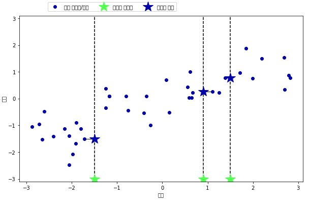

#  K-최근접 이웃


***K*-NN(*K*-Nearest Neighbors)** 알고리즘은 어떤 포인트 하나에 대하여 k개의 이웃을 찾아서 그 중에 가장 많은 레이블을 그 데이터 포인트의 레이블로 지정하는 알고리즘이다.


##### k-최근접 이웃 분류


- 이웃의 숫자가 1개일 때

  

- 이웃의 숫자가 3개일 때

  


실제로 scikit-learn에서 k-최근접 이웃 알고리즘을 적용하는 방법은 다음과 같다.


```python 
from sklearn.model_selection import train_test_split
from introduction_to_ml_with_python import mglearn

X, y = mglearn.datasets.make_forge()
X_train, X_test, y_train, y_test = train_test_split(X, y, random_state=0)
```

먼저 데이터를 훈련 세트와 테스트 세트로 나눈다.


```python 
In:
from sklearn.neighbors import KNeighborsClassifier

clf = KNeighborsClassifier(n_neighbors=3)    
```

scikit-learn에서 KNeighborsClassfier를 Import하고 이웃의 숫자를 지정한다.


```python 
In:
clf.fit(X_train, y_train)    
```

```python 
Out:
KNeighborsClassifier(algorithm='auto', leaf_size=30, metric='minkowski',
                     metric_params=None, n_jobs=None, n_neighbors=3, p=2,
                     weights='uniform')    
```

알고리즘 모델 객체의 fit메소드를 호출하면 입력으로 받은 데이터로 모델을 훈련시킨다. 여기서는 우리가 지정한 이웃의 숫자를 제외하고 기본적인 몇가지 매개변수들을 미리 셋팅이 되어 있음을 확인할 수 있다.


```python 
In:
print(f"Test set prediction: {clf.predict(X_test)}")    
```

```python 
Out:
Test set prediction: [1 0 1 0 1 0 0]    
```

테스트 데이터로 예측을 진행하고자 할 때는 알고리즘 모델 객체의 predict 메소드를 호출한다. 결과의 각 원소들은 예측 레이블을 뜻한다.


```python 
In:
print(f"Test set prediction score: {clf.score(X_test, y_test):.2f}")
```

```python 
Out:
Test set prediction score: 0.86
```

모델이 얼마나 잘 일반화 되었는지 확인하기 위해서 score 메소드를 호출할 수 있다.


##### KNeighborsClassifier 분석


다음은 이웃이 하나, 셋, 아홉  개일 때의 **결정 경계(Decision boundary)** 를 보여준다. 결정 경계란 클래스 별로 각 데이터 포인트가 속한 영역에 색을 칠했을 때 나뉘는 경계를 말한다.

```python 
In:
fig, axes = plt.subplots(1, 3, figsize=(10, 3))

for n_neighbors, ax in zip([3**i for i in range(3)], axes):
  clf = KNeighborsClassifier(n_neighbors=n_neighbors).fit(X, y)
  mglearn.plots.plot_2d_separator(clf, X, fill=True, eps=.5, ax=ax, alpha=.4)
  mglearn.discrete_scatter(X[:, 0], X[:, 1], y, ax=ax)
  ax.set_title(f"{n_neighbors} Neighbors")
  ax.set_xlabel("Feature 0")
  ax.set_ylabel("Feature 1")
axes[0].legend(loc=3)
```


위를 보면 이웃의 숫자가 늘어날수록 결정경계가 부드러워짐을 확인할 수 있다. 다시 말해서 이웃의 숫자가 늘어날수록 모델의 복잡도(과대적합할 확률)이 줄어들고 있음을 알 수 있다. 


```python 
In:
from sklearn.datasets import load_breast_cancer

cancer = load_breast_cancer()
X_train, X_test, y_train, y_test = train_test_split(cancer.data, cancer.target, stratify=cancer.target, random_state=66)
training_accuracy = []
test_accuracy = []
neighbors_settings = range(1, 11)

for n_neighbors in neighbors_settings:
  clf = KNeighborsClassifier(n_neighbors=n_neighbors)
  clf.fit(X_train, y_train)
  training_accuracy.append(clf.score(X_train, y_train))
  test_accuracy.append(clf.score(X_test, y_test))

plt.plot(neighbors_settings, training_accuracy, label="Train acc")
plt.plot(neighbors_settings, test_accuracy, label="Test acc")
plt.ylabel("Acc")
plt.xlabel("n_neighbors")
plt.legend()
```


이웃의 숫자가 매우 작을때는 과대적합이 일어나고 반대로 매우 많을 때는 과소적합이 일어난다. 따라서 적당한 수의 이웃을 설정하는 것이 중요하다.


##### k-최근접 이웃 회귀


k-최근접 이웃 알고리즘은 다음과 같이 회귀 분석에도 쓰일 수 있다.


- 이웃의 숫자가 1일 때

  

- 이웃의 숫자가 3일 때

  

여러개의 최근접 이웃을 사용하게 되면 이웃 간의 평균이 예측이 된다(KNeighborsRegression의 weights 매개변수가 'uniform'일 때는 np.mean 함수를 사용한 단순 평균을, 'distance'일 때는 거리를 고려한 가중치 평균을 계산한다).


scikit-learn에서 회귀를 위한 k-최근접 이웃 알고리즘은 KNeighborsRegressor에 구현되어 있다.

```python 
In:
from sklearn.neighbors import KNeighborsRegressor

X, y = mglearn.datasets.make_wave(n_samples=40)
X_train, X_test, y_train, y_test = train_test_split(X, y, random_state=0)
reg = KNeighborsRegressor(n_neighbors=3)
reg.fit(X_train, y_train)
```

```python 
Out:
KNeighborsRegressor(algorithm='auto', leaf_size=30, metric='minkowski',
                    metric_params=None, n_jobs=None, n_neighbors=3, p=2,
                    weights='uniform')
```


```python 
In:
print(f"Test set prediction:\n{reg.predict(X_test)}")
```

```python 
Out:
Test set prediction:
[-0.05396539  0.35686046  1.13671923 -1.89415682 -1.13881398 -1.63113382
  0.35686046  0.91241374 -0.44680446 -1.13881398]
```


```python 
In:
print(f"Test set prediction:\n{reg.predict(X_test)}")
```

```python 
Out:
Test set R^2: 0.83
```

마찬가지로 score 메소드를 통해서 모델을 평가 할 수 있는데 회귀에서는 R^2 값을 반환한다. R^2 값은 회귀 모델에서 예측의 적합 정도를 0과 1사이의 값으로 계산한 것인데, 1은 예측이 완벽한 것이고 0은 훈련 세트의 출력값의 평균으로만 예측하는 것이다.  y 값은 타깃 값이다.
$$
R^2 = 1- \frac{Σ(y -y(예측))^2}{Σ(y -y(평균))^2}
$$


##### 장단점과 매개변수

KNeighbors 분류기의 주요 매개변수는 두 가지이다. 하나는 데이터 포인트의 이웃의 수이고 다른 하나는 데이터 포인트 간의 거리를 재는 방법이다. KNeighborsClassifier와 KNeighborsRegressor 객체를 생성할 때, metric 매개변수를 사용하여 거리 측정 방식을 변경 할 수 있다. 기본 값은 민코프스키 거리를 의미하는 "minkowski"이며 매개변수 p가 기본값 2일 때 유클리디안 거리와 같다.

KNeighbors의 장단점은 다음과 같다.

- 장점: 이해하기 쉽다, 모델을 빠르게 구축할 수 있다, 모델을 많이 조정하지 않아도 된다.
- 단점: 훈련 세트의 수가 많으면 느려진다, 데이터의 특성이 많으면 잘 동작하지 않는다(특히 특성 값 대두분이 0인 **희소 행렬(Sparse matrix)** )
- 주의: 이웃 간의 거리를 계산할때 범위가 작은 특성에 큰 영향을 받으므로 특성들이 같은 스케일을 갖도록 정규화 하는 것이 필요하다.