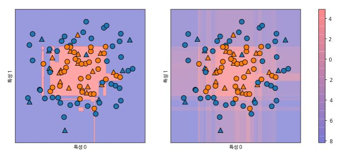
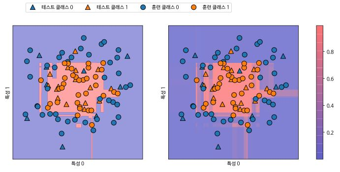

# 분류 예측의 불확실성 추정

scikit-learn에서 많이 사용하는 인터 페이스 중 하나는 분류기에 예측의 불확실성을 추정 할 수 있는 기능이다. 이는 어떤 테스트 포인트에 대해 분류기가 예측한 클래스가 정확한 클래스임을 얼마나 확실하는 지를 보여준다. scikit-learn에서는 불확실성을 추정하는 함수가 두 개 있다. decision_function과 predict_proba이다.

```python 
In:
from sklearn.ensemble import GradientBoostingClassifier
from sklearn.datasets import make_circles
from sklearn.model_selection import train_test_split

X, y = make_circles(noise=.25, factor=.5, random_state=1)
y_named = np.array(['blue', 'red'])[y]
X_train, X_test, y_train_named, y_test_named, y_train, y_test = train_test_split(X, y_named, y, random_state=0)

gbrt = GradientBoostingClassifier(random_state=0)
gbrt.fit(X_train, y_train_named)
```

```python 
Out:
GradientBoostingClassifier(ccp_alpha=0.0, criterion='friedman_mse', init=None,
                           learning_rate=0.1, loss='deviance', max_depth=3,
                           max_features=None, max_leaf_nodes=None,
                           min_impurity_decrease=0.0, min_impurity_split=None,
                           min_samples_leaf=1, min_samples_split=2,
                           min_weight_fraction_leaf=0.0, n_estimators=100,
                           n_iter_no_change=None, presort='deprecated',
                           random_state=0, subsample=1.0, tol=0.0001,
                           validation_fraction=0.1, verbose=0,
                           warm_start=False)
```


##### 2.4.1 결정 함수

이진 분류에서 decision_function 반환 값의 크기는 (n_samples)이며 각 샘플의 실수 값은 모델이 데이터 포인트가 양성 클래스인 클래스 1에 속한다고 믿는 정도를 뜻한다. 양수는 양성 클래스, 음수는 음성 클래스를 의미한다.

```python 
In:
print(f"X_test.shape: {X_test.shape}")
print(f"결정 함수 결과 형태: {gbrt.decision_function(X_test).shape}")
```

```python 
Out:
X_test.shape: (25, 2)
결정 함수 결과 형태: (25,)
```

```python 
In:
print(f"결정 함수:\n{gbrt.decision_function(X_test)[:6]}")
```

```python 
Out:
결정 함수:
[ 4.13592629 -1.7016989  -3.95106099 -3.62599351  4.28986668  3.66166106]
```

```python 
In:
print(f"임계치와 결정 함수 결과 비교:\n{gbrt.decision_function(X_test) > 0}")
print(f"예측:\n{gbrt.predict(X_test)}")
```

```python 
Out:
임계치와 결정 함수 결과 비교:
[ True False False False  True  True False  True  True  True False  True
  True False  True False False False  True  True  True  True  True False
 False]
예측:
['red' 'blue' 'blue' 'blue' 'red' 'red' 'blue' 'red' 'red' 'red' 'blue'
 'red' 'red' 'blue' 'red' 'blue' 'blue' 'blue' 'red' 'red' 'red' 'red'
 'red' 'blue' 'blue']
```


이진 분류에서 음성 클래스는 항상 classes_ 속성의 첫 번째 원소이고 양성 클래스는 classes_의 두 번째 원소이다. 그래서 predict 함수의 결과를 재현하려면 classes 속성을 사용하면 된다.

```python 
In:
greater_zero = (gbrt.decision_function(X_test) > 0).astype(int)
pred = gbrt.classes_[greater_zero]
print(f"pred는 예측 결과와 같다: {np.all(pred == gbrt.predict(X_test))}")
```

```python 
Out:
pred는 예측 결과와 같다: True
```


decision_function 값의 범위는 데이터와 모델 파라미터에 따라 달라진다.

```python 
In:
decision_function = gbrt.decision_function(X_test)
print(f"결정 함수 최솟값: {np.min(decision_function):.2f} 최댓값: {np.max(decision_function):.2f}")
```

```python 
Out:
결정 함수 최솟값: -7.69 최댓값: 4.29
```

```python 
fig, axes = plt.subplots(1, 2, figsize=(13, 5))
mglearn.tools.plot_2d_separator(gbrt, X, ax=axes[0], alpha=.4, fill=True, cm=mglearn.cm2)
scores_image = mglearn.tools.plot_2d_scores(gbrt, X, ax=axes[1], alpha=.4, cm=mglearn.ReBl)

for ax in axes:
  mglearn.discrete_scatter(X_test[:, 0], X_test[:, 1], y_test, markers="^", ax=ax)
  mglearn.discrete_scatter(X_train[:, 0], X_train[:, 1], y_train, markers="o", ax=ax)

  ax.set_xlabel("특성 0")
  ax.set_ylabel("특성 1")

cbar = plt.colorbar(scores_image, ax=axes.tolist())
axes[0].legend(["테스트 클래스 0", "테스트 클래스 1", "훈련 클래스 0", "훈련 클래스 1"], ncol=4, loc=(.1, 1.1))
```




##### 2.4.2 예측 확률

predict_proba의 출력은 각 클래스에 대한 확률이다. 이 값의 크기는 이진 분류에서 항상(n_samples, 2)인데 첫 번째 원소는 첫 번째 클래스의 예측 확률이고 두 번째 원소는 두 번째 클래스의 예측 확률이다.  두 원소의 합은 항상 1이고 두 클래스의 확률 중 높은 쪽이 예측 값이 된다. 데이터에 있는 불확실성이 얼마나 이 값에 잘 반영되는지는 모델과 매개변수 설정에 따라 다르다. 일반적으로 복잡도가 낮은 모델은 예측에 불확실성이 더 많다. 이런 불확실성과 모델의 정확도가 동등하다면 이 모델은 **보정(Calibration)** 되었다고 한다.

```python 
In:
print(f"확률 값의 형태: {gbrt.predict_proba(X_test).shape}")
```

```python 
Out:
확률 값의 형태: (25, 2)
```

```python 
In:
print(f"예측 확률:\n{gbrt.predict_proba(X_test[:6])}")
```

```python 
Out:
예측 확률:
[[0.01573626 0.98426374]
 [0.84575649 0.15424351]
 [0.98112869 0.01887131]
 [0.97406775 0.02593225]
 [0.01352142 0.98647858]
 [0.02504637 0.97495363]]
```

```python 
fig, axes = plt.subplots(1, 2, figsize=(13, 5))

mglearn.tools.plot_2d_separator(gbrt, X, ax=axes[0], alpha=.4, fill=True, cm=mglearn.cm2)
scores_image = mglearn.tools.plot_2d_scores(gbrt, X, ax=axes[1], alpha=.5, cm=mglearn.ReBl, function='predict_proba')

for ax in axes:
  mglearn.discrete_scatter(X_test[:, 0], X_test[:, 1], y_test, markers='^', ax=ax)
  mglearn.discrete_scatter(X_train[:, 0], X_train[:, 1], y_train, markers='o', ax=ax)
  ax.set_xlabel('특성 0')
  ax.set_ylabel('특성 1')

cbar = plt.colorbar(scores_image, ax=axes.tolist())
axes[0].legend(["테스트 클래스 0", "테스트 클래스 1", "훈련 클래스 0", "훈련 클래스 1"], ncol=4, loc=(.1, 1.1))
```

