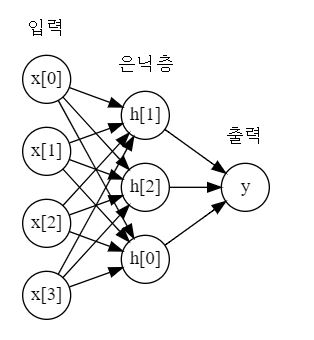
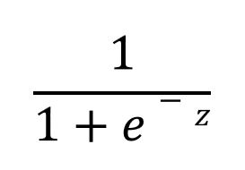
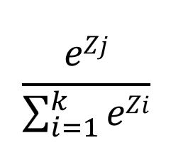
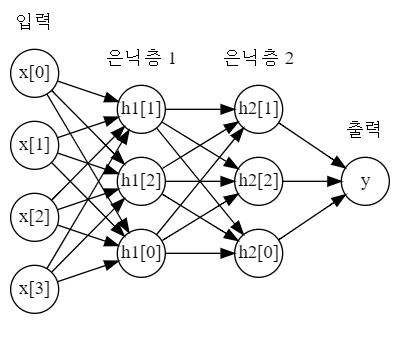
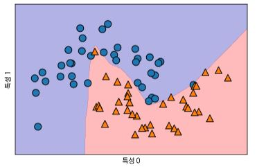
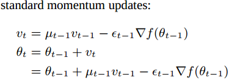

# 신경망(딥러닝)

**다층 퍼셉트론(Multilayer perceptrons, MLP)** 는 (기본) 피드포워드(Feed-forward) 신경망 또는 종종 신경망이라고도 한다.


##### 신경망 모델

MLP는 여러 단계를 거쳐 결과 값을 만들어 내는 선형 모델의 일반화된 모습이다. 선형 회귀 모델의 예측 공식은 다음과 같다.


y_hat은 x[0]에서 x[p]까지의 입력과 w[0]에서 w[p]까지 학습된 가중치의 곱셈의 합이다. 이를 그래프로 나타내면 다음과 같다.


왼쪽 노드는 입력을 나타내고 오른쪽 노드는 입력과 가중치들의 곱셈의 합, 즉 출력을 나타낸다. 엣지는 학습된 가중치들을 나타낸다.


MLP에서는 가중치 합을 만드는 과정이 여러번 반복되며, 입력과 출력의 중간 단계에서 가중치들의 여러 후보군을 두고 가중치 합을 계산해 놓는 **은닉 유닛(Hidden unit)** 을  이용하여 최종 결과를 산출하기도 한다.



이런 은닉유닛이 존재하는 층을 **은닉층(Hidden layer)** 라고 하며 은닉층은 여러개가 있을 수 있다.

여러 개의 가중치 합을 계산하는 것은 수학적으로 보면 하나의 가중치 합을 계산하는 것과 같다(단순 선형 함수만을 사용하면 하나의 가중치를 여러 개로 분할하는 역할만 한다). 그래서 선형 모델보다 강력하게 만드려면 다른 기교가 필요하다. 각 은닉 유닛의 가중치 합을 계산하 뒤 그 결과에 비선형 함수인 **렐루(Rectified linear unit, ReLU)** 나 **하이퍼볼릭 탄젠트(hyperbolic tangent, tanh)** 를 적용한다(이런 함수들을 **활성화 함수(Activation function)** 이라고 하며 렐루나 하이퍼볼릭 탄젠트 외에도 **시그모이드(Sigmoid)** 함수가 있다). 렐루 함수는 양수는 그대로, 0 이하는 0으로 출력 값을 산출하고 tanh 함수는 큰 양수 값에 대해서는 +1, 큰 음수 값에 대해서는 -1로 수렴한다.

(시그모이드 함수는 로지스틱 함수로도 불리우며 수식은 아래와 같다. z는 유닛의 출력 값(가중치와 입력의 곱의 합)이다.)



```python 
line = np.linspace(-3, 3, 100)
plt.plot(line, np.tanh(line), label='tanh')
plt.plot(line, np.maximum(line, 0), label='relu')
plt.legend(loc='best')
plt.xlabel("x")
plt.ylabel("relu(x), tanh(x)")
```


이를 식으로 나타내면 다음과 같은 형태를 띈다.


w[0, 1]은 맨 처음의 은닉층의 1번째 은닉 유닛으로 귀속되는 첫번째 입력 요소에 대한 가중치를 의미한다. v[0]는 출력 y_hat으로 귀속되는 1번째 은닉 노드의 가중치를 의미한다. v, w는 훈련 데이터에서 학습되며 갱신되어 진다. x는 입력 특성, h는 중간 계산 값이고 y_hat은 계산된 출력이다. 

(보통 분류를 위한 y_hat의 경우, 이진 분류는 시그모이드를, 다중 분류에는 소프트맥스 함수를 적용하여 최종 출력 y_hat을 게산한다. 소프트 함수는 여러 유닛의 출력 값을 정규화 하기 위한 것으로 함수의 수식은 아래와 같다. z는 각 유닛의 출력 값이고 k는 유닛의 갯수이다. )





위와 같이 은닉 층을 추가할 수도 있다. 위와 같이 많은 은닉층으로 구성된 신경망을 딥러닝이라고 한다.


##### 신경망 튜닝

```python 
from sklearn.neural_network import MLPClassifier
from sklearn.model_selection import train_test_split
from sklearn.datasets import make_moons

X, y = make_moons(n_samples=100, noise=.25, random_state=3)
X_train, X_test, y_train, y_test = train_test_split(X, y, stratify=y, random_state=42)
mlp = MLPClassifier(solver='lbfgs', random_state=0).fit(X_train, y_train)
mglearn.plots.plot_2d_separator(mlp, X_train, fill=True, alpha=.3)
mglearn.discrete_scatter(X_train[:, 0], X_train[:, 1], y_train)
plt.xlabel("특성 0")
plt.ylabel("특성 1")
```



#은닉 유닛의 갯수를 조정했을때(100 -> 10)

```python 
mlp = MLPClassifier(solver='lbfgs', random_state=0, hidden_layer_sizes=[10])
mlp.fit(X_train, y_train)
mglearn.plots.plot_2d_separator(mlp, X_train, fill=True, alpha=.3)
mglearn.discrete_scatter(X_train[:, 0], X_train[:, 1], y_train)
plt.xlabel("특성 0")
plt.ylabel("특성 1")
```


#은닉 층의 개수를 추가했을때

```python 
mlp = MLPClassifier(solver='lbfgs', random_state=0, hidden_layer_sizes=[10, 10])
mlp.fit(X_train, y_train)
mglearn.plots.plot_2d_separator(mlp, X_train, fill=True, alpha=.3)
mglearn.discrete_scatter(X_train[:, 0], X_train[:, 1], y_train)
plt.xlabel("특성 0")
plt.ylabel("특성 1")
```


#activation function을 tanh로 바꿨을때

```python 
mlp = MLPClassifier(solver='lbfgs', random_state=0, hidden_layer_sizes=[10, 10], activation='tanh')
mlp.fit(X_train, y_train)
mglearn.plots.plot_2d_separator(mlp, X_train, fill=True, alpha=.3)
mglearn.discrete_scatter(X_train[:, 0], X_train[:, 1], y_train)
plt.xlabel("특성 0")
plt.ylabel("특성 1")
```


#alpha로 L2 패널티를 조정했을때

```python 
fig, axes = plt.subplots(2, 4, figsize=(20, 8))
for axx, n_hidden_nodes in zip(axes, [10, 100]):
  for ax, alpha in zip(axx, [10**i for i in range(-4, 2)]):
    mlp = MLPClassifier(solver='lbfgs', random_state=0,
                        hidden_layer_sizes=[n_hidden_nodes, n_hidden_nodes],
                        alpha=alpha)
    mlp.fit(X_train, y_train)
    mglearn.plots.plot_2d_separator(mlp, X_train, fill=True, alpha=.3, ax=ax)
    mglearn.discrete_scatter(X_train[:, 0], X_train[:, 1], y_train, ax=ax)
    ax.set_title(f"n_hidden[{n_hidden_nodes}, {n_hidden_nodes}]\nalpha={alpha:.4f}")
```


#가중치 무작위 초깃값

```python 
fig, axes = plt.subplots(2, 4, figsize=(20, 8))
for i, ax in enumerate(axes.ravel()):
  mlp = MLPClassifier(solver='lbfgs', random_state=i, 
                      hidden_layer_sizes=[100, 100])
  mlp.fit(X_train, y_train)
  mglearn.plots.plot_2d_separator(mlp, X_train, fill=True, alpha=.3, ax=ax)
  mglearn.discrete_scatter(X_train[:, 0], X_train[:, 1], y_train, ax=ax)
```


#유방암 데이터를 적용한 예

```python 
In:
from sklearn.datasets import load_breast_cancer

cancer = load_breast_cancer()
print(f"유방암 데이터의 특성별 최댓값:\n{cancer.data.max(axis=0)}")
```

```python 
Out:
유방암 데이터의 특성별 최댓값:
[2.811e+01 3.928e+01 1.885e+02 2.501e+03 1.634e-01 3.454e-01 4.268e-01
 2.012e-01 3.040e-01 9.744e-02 2.873e+00 4.885e+00 2.198e+01 5.422e+02
 3.113e-02 1.354e-01 3.960e-01 5.279e-02 7.895e-02 2.984e-02 3.604e+01
 4.954e+01 2.512e+02 4.254e+03 2.226e-01 1.058e+00 1.252e+00 2.910e-01
 6.638e-01 2.075e-01]
```

```python 
In:
X_train, X_test, y_train, y_test = train_test_split(cancer.data, cancer.target, random_state=0)

mlp = MLPClassifier(random_state=42)
mlp.fit(X_train, y_train)

print(f"훈련 세트 정확도: {mlp.score(X_train, y_train):.3f}")
print(f"테스트 세트 정확도: {mlp.score(X_test, y_test):.3f}")
```

```python 
Out:
훈련 세트 정확도: 0.939
테스트 세트 정확도: 0.916
```


신경망 또한 SVC의 경우처럼 데이터 스케일이 영향을 끼친다. 신경망에서 데이터 스케일에 대한 전처리를 할 때는 모든 입력 특성의 평균은 0, 분산은 1이 되도록 변형하는 것이 좋다(이를 **z-점수(z-score)** 또는 **포준 점수(Standard score)** 라고 한다. z-점수는 평균이 0, 분산이 1인 표준정규분포를 따른다).

```python 
In:
mean_on_train = X_train.mean(axis=0)
std_on_train = X_train.std(axis=0)

X_train_scaled = (X_train - mean_on_train) / std_on_train
X_test_scaled = (X_test - mean_on_train) / std_on_train

mlp = MLPClassifier(random_state=0)
mlp.fit(X_train_scaled, y_train)

print(f"훈련 세트 정확도: {mlp.score(X_train_scaled, y_train):.3f}")
print(f"테스트 세트 정확도: {mlp.score(X_test_scaled, y_test):.3f}")
```

```python 
Out:
훈련 세트 정확도: 0.991
테스트 세트 정확도: 0.965
```


MLPClassifier와 MLPRegressor의 solver 매개변수 기본 값은 adam이고 **Adam(Adaptive Moment Estimation)** 알고리즘은 경사 하강법의 학습률 매개변수를 학습이 반복됨에 따라 조정해 가는 알고리즘이다. 따라서 MLPClassifier와 MLPRegressor의 최대 반복 횟수에 대한 경고가 나올 시 mat_iter 매개변수를 조정할 필요가 있다(기본 값은 200).

```python 
In:
mlp = MLPClassifier(random_state=0, max_iter=1000)
mlp.fit(X_train_scaled, y_train)

print(f"훈련 세트 정확도: {mlp.score(X_train_scaled, y_train):.3f}")
print(f"테스트 세트 정확도: {mlp.score(X_test_scaled, y_test):.3f}")
```

```python 
Out:
훈련 세트 정확도: 1.000
테스트 세트 정확도: 0.972
```


#가중치 규제를 더 강하게 했을때(alpha 값을 늘렸을때)

```python 
In:
mlp = MLPClassifier(random_state=0, max_iter=1000, alpha=1)
mlp.fit(X_train_scaled, y_train)

print(f"훈련 세트 정확도: {mlp.score(X_train_scaled, y_train):.3f}")
print(f"테스트 세트 정확도: {mlp.score(X_test_scaled, y_test):.3f}")
```

```python 
Out:
훈련 세트 정확도: 0.988
테스트 세트 정확도: 0.972
```


다음은 유방암 데이터 학습시킨 신경망 모델의 입력과 첫 번째 은닉 층 사이의 학습된 가중치를 시각화 한 것이다.

```python 
plt.figure(figsize=(20, 5))
plt.imshow(mlp.coefs_[0], interpolation='none', cmap='viridis')
plt.yticks(range(30), cancer.feature_names)
plt.xlabel("은닉 유닛")
plt.ylabel("입력 특성")
plt.colorbar()
```


##### 장단점과 매개변수

신경망의 주요 장점은 대량의 데이터에 내재된 정보를 잡아내고 매우 복잡한 모델을 만들 수 있다는 점이다(충분한 연산 시간과 데이터를 주고 매개변수를 세심하게 조정했을 때).

단점은 크고 강력한 모델에서 학습이 오래 걸린다는 점과 데이터 전처리에 주의해야 한다는 점이다. 신경망은 SVM과 같이 모든 특성이 같은 의미를 가진 동질의 데이터에서 잘 작동한다. 다른 종류의 특성을 가진 데이터라면 트리 기반 모델이 더 작동할 수 있다.


##### 신경망의 복잡도 추정

신경망에서 가장 중요한 매개변수는 은닉층의 개수와 각 은닉층의 유닛 수이다.

신경망의 모델 복잡도에 관해 도움이 될 만한 측정치는 학습된 가중치 또는 계수의 수이다.

신경망의 매개변수를 조정하는 일반적인 방법은 먼저 충분히 과대적합되어서 문제를 해결할만한 큰 모델을 만들고 훈련 데이터가 충분히 학습될 수 있는 범위 내에서 신경망의 구조를 줄이거나 규제를 강화하여 일반화 성능을 향상 시킨다.

solver 매개변수를 사용해 모델을 학습시키는 방법 또는 매개변수 학습에 사용하는 알고리즘을 지정할 수 있다(기본 값은 adam이지만 데이터 스케일에 민감하므로 표준 정규화로 전처리 하는 것이 중요). adam 이외에 지정할 수 있는 다른 알고리즘으로 **L-BFGS(Limited-memory BFGS)** 가 안정적이지만 규모가 큰 모델이나 대량의 데이터 셋에는 시간이 오래 걸린다(**BFGS(Broyden-Fletcher-Goldfarb-Shanno)** 알고리즘은 의사 뉴턴 메소드(Newton Method) 중 하나이고 L-BFGS는 알고리즘을 제한된 메모리 공간에서 구현한다). **SGD(Stochastic Gradient Decent)** 가 옵션일 때는 momentum과 nesterovs_momentum이 중요한 매개변수이다. 모멘텀 방식은 이전의 그래디언트를 momentum 매개변수 비율만큼 현재 계산된 그래디언트에 반영하여 갱신할 그래디언트를 구한다. 이전의 그래디언트를 속도라고도 하며, 일정 비율의 과거 그래디언트를 모두 포함하고 있어 마치 관성 같은 효과를 줄 수 있다. 네스테로프 모멘텀은 모멘텀에서 구한 그래디언트를 이전 그래디언트로 가정하고 한 번 더 모멘텀 방식을 적용하여 갱신할 그래디언트를 계산한다.

| standard_momentum_updates                               | Simplified Nesterov momentum updates                         |
| ------------------------------------------------------- | ------------------------------------------------------------ |
|  |  |

(solver 매개변수를 adam 또는 sgd로 두고 전체 데이터를 일정 크기로 나눈 미니 배치(mini-batch)를 사용하여 모델을 점진적으로 학습 시킬 때는 fit 메소드 대신 학습된 것을 유지하면서 반복하여 학습할 수 있는 partial_fit 메소드를 사용한다.)