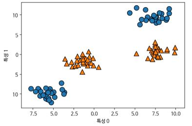
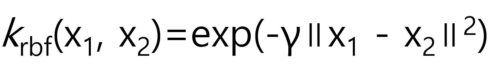
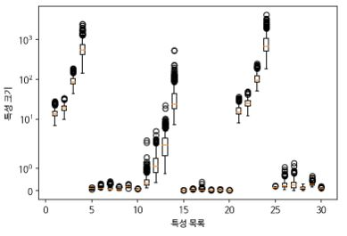

# 커널 서포트 벡터 머신

**커널 서포트 벡터 머신(Kernelized support vector machines)** 의 수학적 정의는 다음을 참조.

[The Elements of Statistical Learning 12장]: https://web.stanford.edu/~hastie/ElemStatLearn//


##### 선형 모델과 비선형 특성

직선과 초평면은 유연하지 못하여 저차원 데이터 세트에서는 선형 모델이 제한적이다.  선형 모델을 유연하게 만드는 한 가지 방법은 특성끼리 곱하거나 거듭제곱하는 방식으로 새로운 특성을 추가 하는 것이다.


``````python
from sklearn.datasets import make_blobs

X, y = make_blobs(centers=4, random_state=8)
y = y % 2

mglearn.discrete_scatter(X[:, 0], X[:, 1], y)
plt.xlabel("특성 0")
plt.ylabel("특성 1")
``````



```python 
from sklearn.svm import LinearSVC

linear_svm = LinearSVC().fit(X, y)
mglearn.plots.plot_2d_separator(linear_svm, X)
mglearn.discrete_scatter(X[:, 0], X[:, 1], y)
plt.xlabel("특성 0")
plt.ylabel("특성 1")
```


분류를 위한 선형 모델은 직선으로만 데이터를 나눌 수 있기 때문에 위와 같은 데이터 세트에는 잘 맞지 않는다.  앞에서 언급한대로 두 번째 특성을 제곱한 특성1 ** 2를 새로운 특성으로 추가하면 이 데이터는 특성이 3개이므로 3차원 데이터 포인트로 표현될 수 있다. 

```python 
from mpl_toolkits.mplot3d import Axes3D, axes3d

X_new = np.hstack([X, X[:, 1:] ** 2])

figure = plt.figure()
ax = Axes3D(figure, elev=-152, azim=-26)
mask = y == 0
ax.scatter(X_new[mask, 0], X_new[mask, 1], X_new[mask, 2], c='b', cmap=mglearn.cm2, s=60, edgecolor='k')
ax.scatter(X_new[~mask, 0], X_new[~mask, 1], X_new[~mask, 2], c='r', marker='^', cmap=mglearn.cm2, s=60, edgecolor='k')
ax.set_xlabel("특성0")
ax.set_ylabel("특성1")
ax.set_zlabel("특성1 ** 2")
```


새로운 데이터세트에서는 선형 모델과 3차원 공간의 평면을 사용해 두 클래스를 구분할 수 있게 된다.

```python 
linear_svm_3d = LinearSVC().fit(X_new, y)
coef, intercept = linear_svm_3d.coef_.ravel(), linear_svm_3d.intercept_

figure = plt.figure()
ax = Axes3D(figure, elev=-152, azim=-26)
xx = np.linspace(X_new[:, 0].min() - 2, X_new[:, 0].max() + 2, 50)
yy = np.linspace(X_new[:, 1].min() - 2, X_new[:, 1].max() + 2, 50)

XX, YY = np.meshgrid(xx, yy)
ZZ = (coef[0]*XX + coef[1]*YY +intercept) / -coef[2]
ax.plot_surface(XX, YY, ZZ, rstride=8, cstride=8, alpha=.3)
ax.scatter(X_new[mask, 0], X_new[mask, 1], X_new[mask, 2], c='b', cmap=mglearn.cm2, s=60, edgecolor='k')
ax.scatter(X_new[~mask, 0], X_new[~mask, 1], X_new[~mask, 2], c='r', marker='^', cmap=mglearn.cm2, s=60, edgecolor='k')
ax.set_xlabel("특성0")
ax.set_ylabel("특성1")
ax.set_zlabel("특성1 ** 2")
```


이를 원래 특성으로 투영해보면 선형 SVM 모델은 더 이상 선형이 아니게 된다. 

```python 
ZZ = YY ** 2
dec = linear_svm_3d.decision_function(np.c_[XX.ravel(), YY.ravel(), ZZ.ravel()])
plt.contourf(XX, YY, dec.reshape(XX.shape), levels = [dec.min(), 0, dec.max()], cmap=mglearn.cm2, alpha=.5)
mglearn.discrete_scatter(X[:, 0], X[:, 1], y)
plt.xlabel("특성 0")
plt.ylabel("특성 1")
```


##### 커널 기법

수학적 기교를 사용하여 앞에서와 같은 새로운 특성을 많이 만들지 않고도 고차원에서 분류기를 학습 시킬 수 있는 방법이 있는데 이를 **커널 기법(Kernel trick)** 이라고 한다. 실제로 데이터를 확장하지 않고도 확장된 특성에 대한 데이터 포인트들의 거리(스칼라 곱)를 계산한다.

서포트 벡터 머신에서 데이터를 고차원 공간에 매핑하는데 주로 사용되는 방법은 두 가지이다. 

- 다항식 커널 - 원래 특성의 가능한 조합을 지정된 차수까지 모두 계산
- RBF(Radial basis function) or 가우시안(Gaussian) 커널 - 지수 함수의 테일러 전개를 이용하여 무한한 다항식 차원으로 매핑하는 것으로 모든 차수의 모든 다항식을 고려한다. 특성의 중요도는 고차항이 될수록 줄어든다.


##### SVM 이해하기

학습이 진행되는 동안 SVM은 두 클래스 사이의 경계에 위치한 데이터 포인트들을 참고하여 결정 경계를 만드는데 이 데이터 포인트들을 **서포트 벡터(Support vector)** 라고 한다.  새로운 데이터 포인트에 대해 예측할때, 분류의 경우 이 포인트와 서포트 벡터까지의 거리에 기반하여 중요도를 훈련 과정에서 학습하게 된다(SVC 객체의 dual_coef_ 속성). 

데이터 포인트 사이의 거리는 가우시안(RBF) 커널에 의해 계산된다.



(X1, X2는 데이터 포인트,  ∥x1 – x2∥^2는 유클리디안 거리, γ감마(gamma)는 가우시안 커널의 폭을 제어하는 매개 변수)


```python 
from sklearn.svm import SVC

X, y = mglearn.tools.make_handcrafted_dataset()
svm = SVC(kernel='rbf', C=10, gamma=.1).fit(X, y)
mglearn.plots.plot_2d_separator(svm, X, eps=.5)
mglearn.discrete_scatter(X[:, 0], X[:, 1], y)
sv = svm.support_vectors_
sv_labels = svm.dual_coef_.ravel() > 0
mglearn.discrete_scatter(sv[:, 0], sv[:, 1], sv_labels, s=15, markeredgewidth=3)
plt.xlabel("특성0")
plt.ylabel("특성1")
```


위에서 결정 경계는 검은 실선, 서포트 벡터는 굵은 테두리의 데이터 포인트들이다.


##### SVM 매개변수 튜닝

gamma 매개변수는 가우시안 커널 폭의 역수로, 하나의 훈련 샘플이 미치는 영향의 범위를 결정한다. 작은 값은 넓은 영역, 큰 값이면 영향이 미치는 범위가 제한된다. 즉, 가우시안 커널의 반경이 클수록 훈련 샘플의 영향 범위가 커진다(가우시안 커널 함수 값의 범위는 e^0~e^-∞). C 매개변수는 규제 매개변수로 각 포인트의 중요도(dual_coef_ 값)를 제한한다.


```python 
fig, axes = plt.subplots(3, 3, figsize=(15, 10))
for ax, C  in zip(axes, [-1, 0, 3]):
  for a, gamma in zip(ax, range(-1, 2)):
    mglearn.plots.plot_svm(log_C=C, log_gamma=gamma, ax=a)

axes[0, 0].legend(["클래스 0", "클래스 1", "클래스 0 서포트 벡터", "클래스 1 서포트 벡터"], ncol=4, loc=(.9, 1.2))
```


작은 gamma 값은 카우시안 카널의 반경을 크게하여 많은 포인트들이 가까이 있는 것으로 고려되므로 왼쪽에서 오른쪽로 갈수록 결정 경계가 하나의 포인트에 더 민감해짐을 알 수 있다. 작은 gamma 값은 결정 경계를 천천히 바뀌게 하므로 모델의 복잡도를 낮추고 큰 gamma 값은 더 복잡한 모델을 만든다.

작은C는 매우 제약이 큰 모델을 만들어 각 데이터 포인트의 영향력이 작다. 왼쪽 위의 결정 경계는 선형에 가깝고 잘못 분류된 데이터 포인트가 경계에 거의 영향을 주지 않는다. C를 증가시키면 이 포인트들이 모델에 큰 영향을 주며 경계를 휘게하여 정확하게 분류하게 만든다.


```python 
In:
from sklearn.model_selection import train_test_split
from sklearn.datasets import load_breast_cancer
from sklearn.svm import SVC

cancer = load_breast_cancer()
X_train, X_test, y_train, y_test = train_test_split(cancer.data, cancer.target, random_state=0)

#sklearn 0.22 버전부터 'scale'이 default로 설정되어 1 / (n_features * X.var()) 값을 gamma 값으로 사용.
svc = SVC()
svc.fit(X_train, y_train)

print(f"훈련 세트 정확도: {svc.score(X_train, y_train):.2f}")
print(f"테스트 세트 정확도: {svc.score(X_test, y_test):.2f}")
```

```python 
Out:
훈련 세트 정확도: 0.90
테스트 세트 정확도: 0.94
```

SVM은 대체로 잘 작동하지만 매개변수 설정과 데이터 스케일에 매우 민감하다. 따라서 입력 특성의 범위가 비슷해야 한다.

```python 
plt.boxplot(X_train, manage_ticks=False)
plt.yscale("symlog")
plt.xlabel("특성 목록")
plt.ylabel("특성 크기")
```




##### SVM을 위한 데이터 전처리

특성 값의 범위가 비슷해지도록 조정하는 방법은 여러가지 있는데 커널 SVM에서는 모든 특성 값을 0과 1사이로 맞추는 방법을 많이 사용한다. 

```python 
In:
min_on_training = X_train.min(axis=0)
range_on_training = (X_train - min_on_training).max(axis=0)

X_train_scaled = (X_train - min_on_training) / range_on_training
print(f"특성별 최소 값\n{X_train_scaled.min(axis=0)}")
print(f"특성별 최대 값\n{X_train_scaled.max(axis=0)}")
```

```python 
Out:
특성별 최소 값
[0. 0. 0. 0. 0. 0. 0. 0. 0. 0. 0. 0. 0. 0. 0. 0. 0. 0. 0. 0. 0. 0. 0. 0.
 0. 0. 0. 0. 0. 0.]
특성별 최대 값
[1. 1. 1. 1. 1. 1. 1. 1. 1. 1. 1. 1. 1. 1. 1. 1. 1. 1. 1. 1. 1. 1. 1. 1.
 1. 1. 1. 1. 1. 1.]
```

```python 
In:
X_test_scaled = (X_test - min_on_training) / range_on_training

svc = SVC()
svc.fit(X_train_scaled, y_train)
print(f"훈련 세트 정확도: {svc.score(X_train_scaled, y_train):.3f}")
print(f"테스트 세트 정확도: {svc.score(X_test_scaled, y_test):.3f}")
```

```python 
Out:
훈련 세트 정확도: 0.984
테스트 세트 정확도: 0.972
```

```python 
In:
svc = SVC(C=1000)
svc.fit(X_train_scaled, y_train)
print(f"훈련 세트 정확도: {svc.score(X_train_scaled, y_train):.3f}")
print(f"테스트 세트 정확도: {svc.score(X_test_scaled, y_test):.3f}")
```

```python 
Out:
훈련 세트 정확도: 1.000
테스트 세트 정확도: 0.958
```


##### 장단점과 매개변수

커널 서포트 벡터 머신은 다양한 데이터셋에서 잘 작동한다. 데이터의 특성이 몇 개 안되도 복잡한 결정 경계를 만들 수 있기 때문에 저차원과 고차원의 데이터에 모두 잘 작동한다. 하지만 샘플이 많을 때는 잘 작동하지 않을뿐더라 속도와 메모리를 많이 잡아 먹는다.

SVM의 다른 단점은 데이터 전처리와 매개변수 설정에 신경을 많이 써야 한다는 것이다. 그리고 분석하기 어렵기 때문에 예측이 어떻게 결정되었는지 이해하기 어렵고 비전문가에게 설명하기가 난해하다.

중요한 매개변수는 규제 매개변수 C와 각 커널에 따른 매개변수이다. RBF는 가우시안 커널 폭의 역수인 gamma 매개변수 설정이 중요하다.