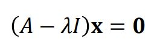
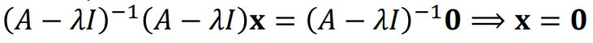
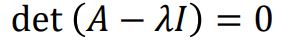
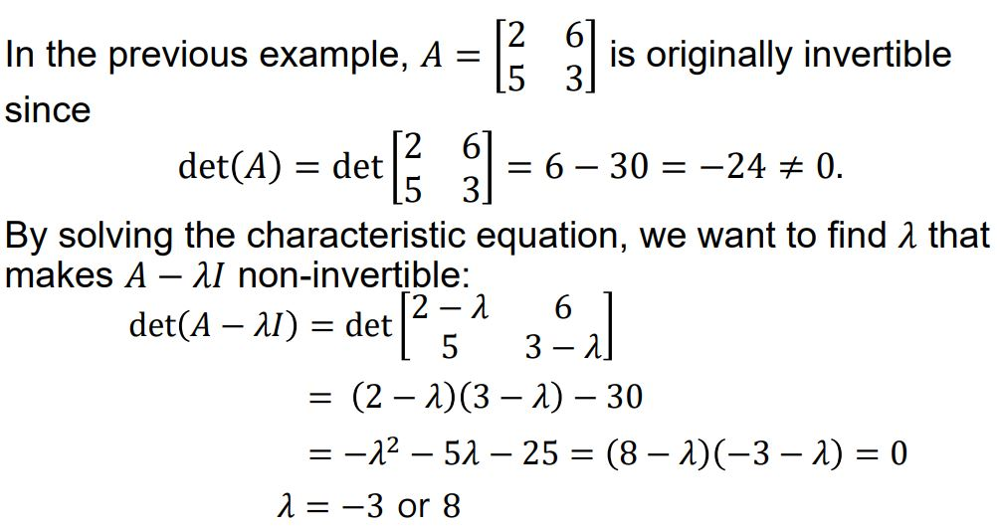
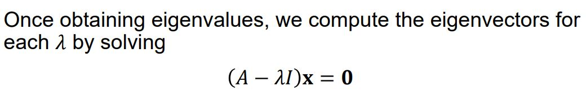
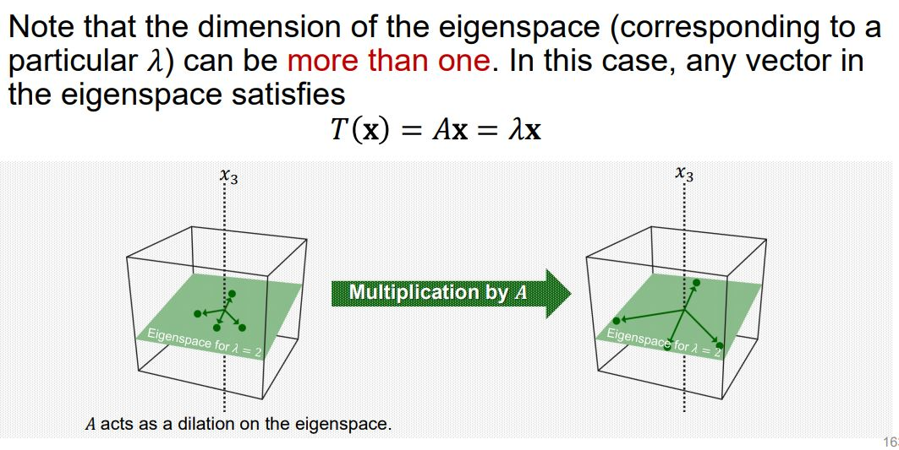
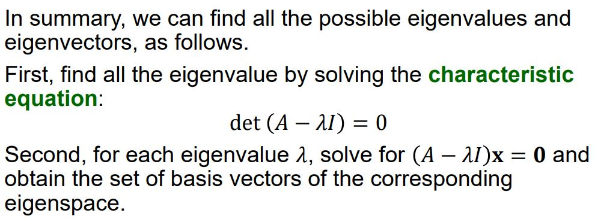

# Characteristic Equation

## Eigenvectors and Eigenvalues

위의 식을 만족시키는 모든 해의 집합을 행렬  (𝐴 − 𝜆𝐼 )의 영공간이라고 하고, 고윳값 𝝀에 대한 행렬 A의 고유 공간이라고 부른다. 즉, 고유 공간은 영 벡터와 함께, 위의 식을 만족 시키면서 𝝀에 대응하는 고유 벡터들로 구성되어 있다. 

## Characteristic Equation

위에 따르면 고윳값 𝝀를 구했을 때, 그에 따른 고유 벡터들의 집합을 구할 수 있었다. 그렇다면 고윳값 𝝀를 구하는 방법은 무엇일까? 

만약에 (𝐴 − 𝜆𝐼) 𝐱 = 𝟎가 Nontrivial solution을 가진다면 (𝐴 − 𝜆𝐼)는 역행렬을 가질 수 없다. 왜냐하면 만약에 역행렬을 가진다면 다음의 식에 의해서 0 이외의 다른 벡터를 가질 수 없기 때문이다. 

그렇기 때문에 행렬식(판별식) det(𝐴 − 𝜆𝐼) = 0이 되어야 한다(보통 이를 만족하려면 해가 유일하지 않으므로 선형 종속적인 열을 가진다).  

위의 방정식을 특성 방정식이라고 한다. 

## Example: Characteristic Equation

## Eigenspace

어떤 고윳값 𝜆에 대응하는 고유공간의 차원은 1이상이고, 행렬 A를 통한 선형변환을 수행했을 때, 결과는 원본 벡터와 방향은 유지하되 크기만 고윳값 𝜆만큼 변하는 벡터가 도출된다. 즉, 고유 공간 안에 그 어떤 벡터를 뽑아서 행렬A를 곱해도 방향이 유지되고 𝜆만큼 크기만 변하기 때문에 계산량이 확실하게 줄어들게 된다. 

## Finding all eigenvalues and eigenvectors

