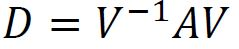
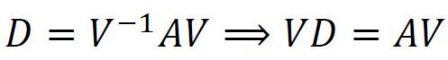
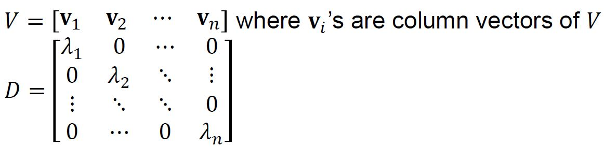
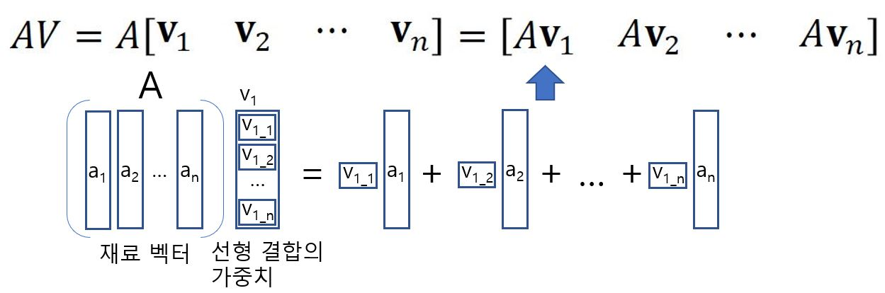
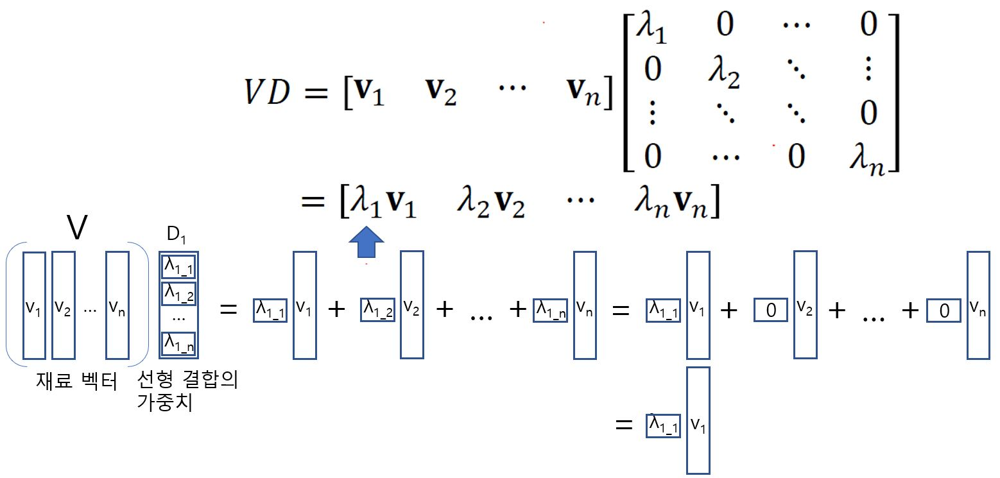
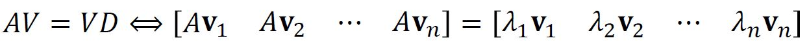
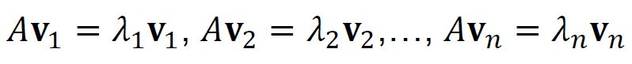
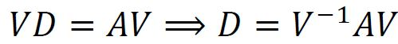
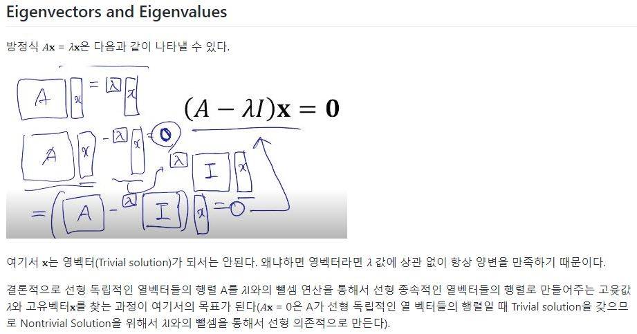

# Diagonalization

## Diagonalization

하려는 것 : 행렬 𝐴∈ℝ^(𝑛×𝑛)을 다음과 같은 형태를 띄는 대각행렬(Diagonal matrix)로 바꾸는 것.

여기서 행렬 𝑉∈ℝ^(𝑛×𝑛)는 역행렬이 존재하고 행렬 𝐷∈ℝ^(𝑛×𝑛)는 대각 행렬이다. 이런 과정을 행렬 A의 대각화(Diagonalization)라고 한다. 

모든 행렬의 대각화가 가능한 것은 아니다. 우선 행렬 A는 정방행렬(Square matrix)여야 하고, 행렬 V의 역행렬이 존재해야 한다. 

## Finding V and D

대각화를 하는 과정은 다음과 같다.

왼쪽 식이 성립하면 오른쪽 식이 가능하지만 반대는 다르다. 오른쪽 식에서 왼쪽 식이 되려면 행렬 V의 역행렬이 존재한다는 가정이 추가되어야 한다. 

행렬 V와 D를 다음과 같이 나타낸다.

위에서 다음의 결론을 얻을 수 있다.

위의 결론에 의거하여 (𝐯1, 𝐯2, …, 𝐯𝑛)는 고유벡터가 되고, (𝜆1, 𝜆2, …, 𝜆𝑛)는 고유값이 됨을 알 수 있다. 즉 V의 역행렬이 존재하여 다음이 성립한다면

대각 행렬 D의 0이 아닌 원소들은 모두 행렬 A에 대한 고유 값이 된다는 뜻이다.

행렬 V의 역행렬이 존재하려면 정사각행렬이어야 하고, 행렬식이 0이 아니어야 하므로 행렬 V의 열 벡터들은 서로 선형 독립이어야 한다. 

어떤 행렬 A가 Diagonalizable 한가? => det(A - 𝜆I) = 0으로 부터 𝜆를 찾아내고 그에 대응하는 고유 벡터를 찾아내어 이 고유 벡터를 모아 놓은 행렬 V의 열 벡터들이 선형 독립적인가 아닌가를 판단하면 된다. 

위에 의거하여 A의 열 벡터들은 선형 독립이어야 한다.

