# Eigendecomposition

A의 대각화가 가능하여 다음이 성립할 때,

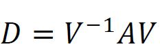

우리는 다음과 같은 식을 얻을 수 있다.

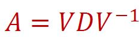

이때 VDV^-1을 A의 고유값 분해(Eigendecomposition)라고 한다.  A가 대각화가 가능하다는 뜻은 A를 고유값 분해로 나타낼 수 있다는 뜻이다(V는 고유 벡터들의 행렬, D는 대각 원소가 고유 값인 대각 행렬. V는 역행렬이 존재해야 한다).

## Linear Transformation via Eigendecomposition

A가 대각화가 가능하여 Eigendecomposition을 수행할 수 있다고 가정하자.

이때 어떤 벡터 x를 선형 변환 시키는 T(x) = Ax는 다음과 같이 나타낼 수 있다. 

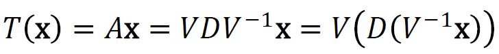

행렬 A를 위와 같이 나타내는 이유는 다음과 같다. 예를 들어서 [1 2] [3 4] 라는 벡터가 고유 벡터이고 고유 값이 각각 a, b라고 하자. [4 6]이라는 벡터는 고유 벡터가 아니기 때문에 Ax라는 연산을 할 경우에 A의 벡터들과 x벡터를 각각 내적하는 연산을 진행해야 한다. 그런데 Ax가 선형 변환이라고 할 경우 T([4 6]) = A[4 6] = A([1 2] + [3 4])로 바꿀 수 있고 이때 [1 2], [3 4]는 고유 벡터이므로 A[1 2] + A[3 4]는 간단하게 a[1 2] + b[3 4]로 바꿀 수 있다. 

## Change of Basis

위에서의 첫 번째 변환 V^-1x의 의미를 설명하면 다음과 같다.

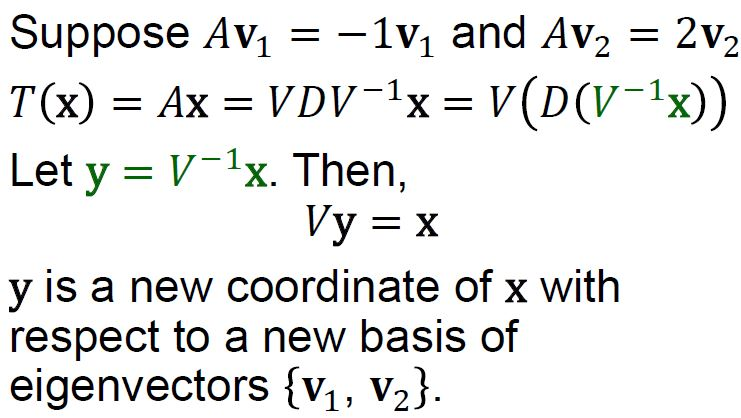

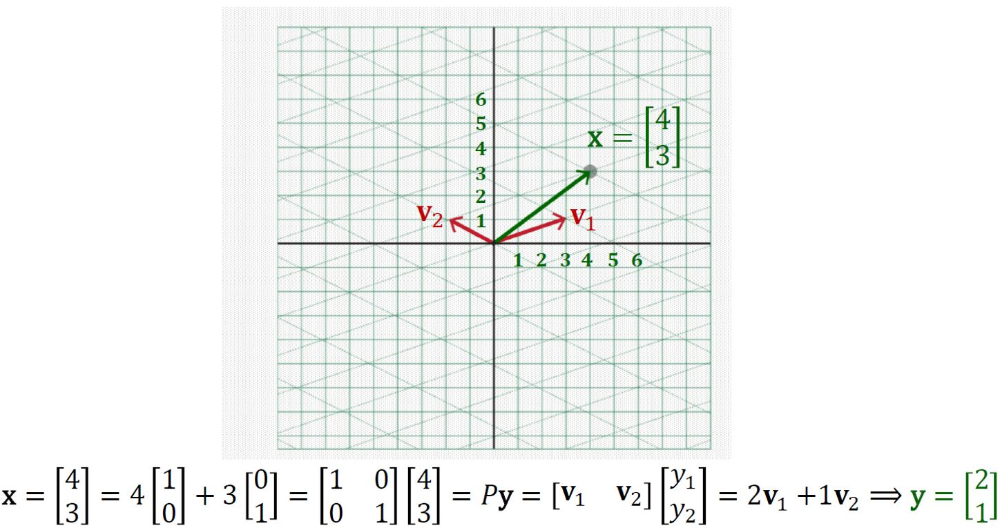

## Element-wise Scaling

두 번째 변환 D(y = V^-1x)에 대해 설명하면 다음과 같다.

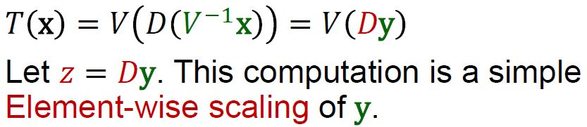

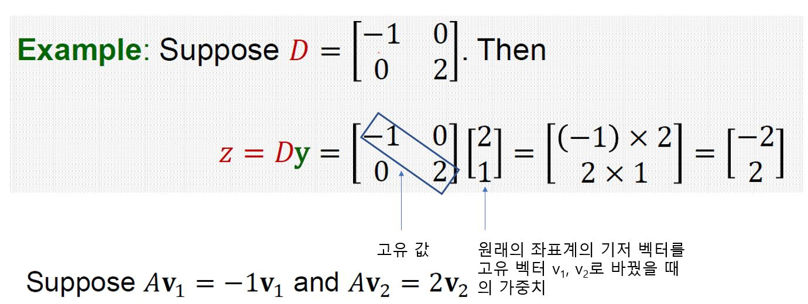

## Dimension-wise Scaling

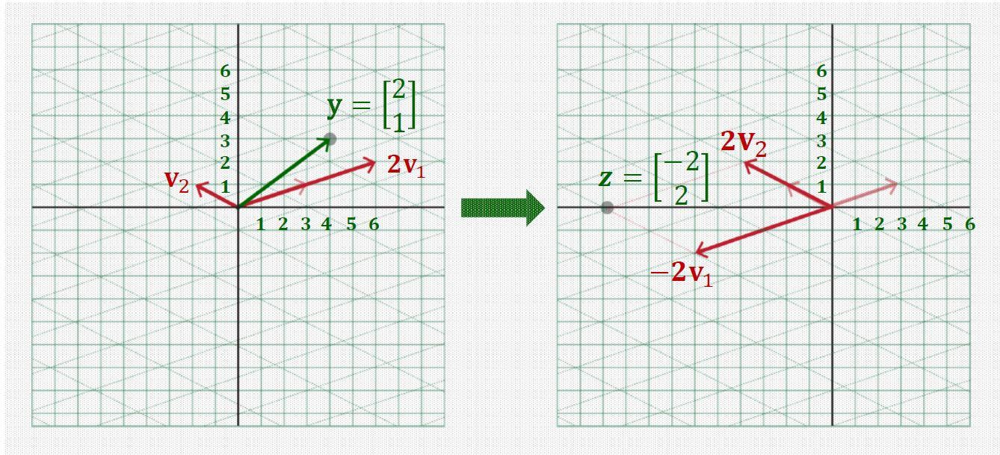

## Back to Original Basis

마지막 변환인 V(z = Dy)의 의미는 다음과 같다. 

z는 고유 벡터를 기저 벡터로 하는 좌표계에서의 가중치이고 Vz 변환을 통해서 변환된 좌표계를 원래의 표준 기저 벡터의 좌표계로 되돌린다. v1과 v2의 선형 결합으로 결과를 계산한 값을 표준 기저 벡터의 선형 결합으로 나타낼 수 있다. 

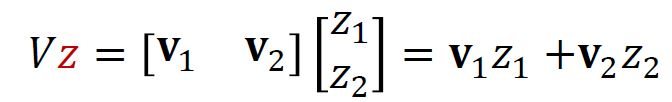

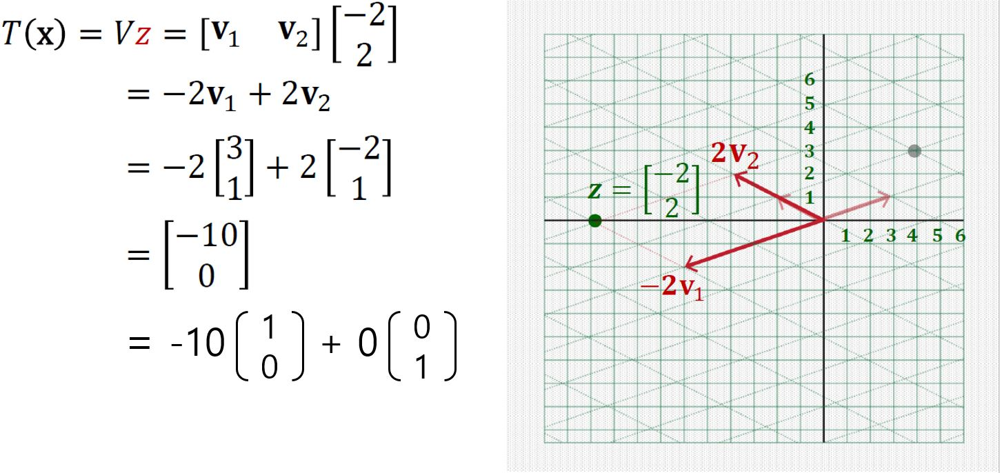

## Overview of Transformation using Eigendecomposition

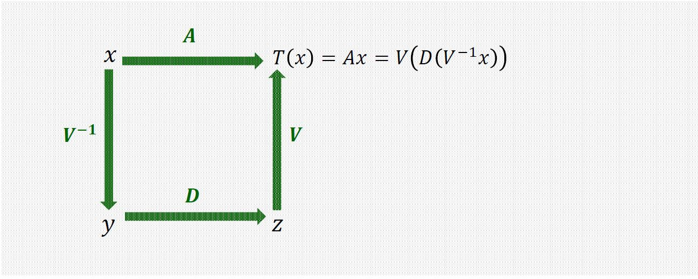

## Linear Transformation via A^k

행렬 A를 k번 곱하는 연산은, 만약에 A가 고윳값 분해가 가능하다면, A를 곧이 곧대로 k번 곱하는 것보다 고윳값 분해를 통해서 연산을 진행하면 훨씬 간단하게 연산 할 수 있다.

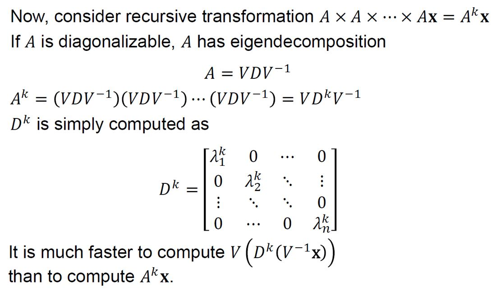