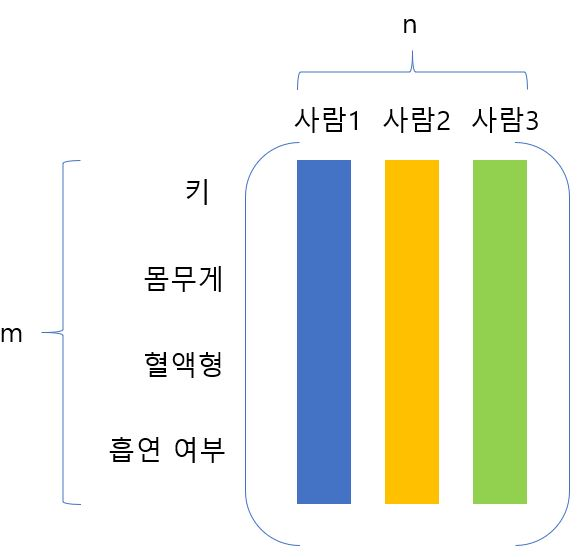
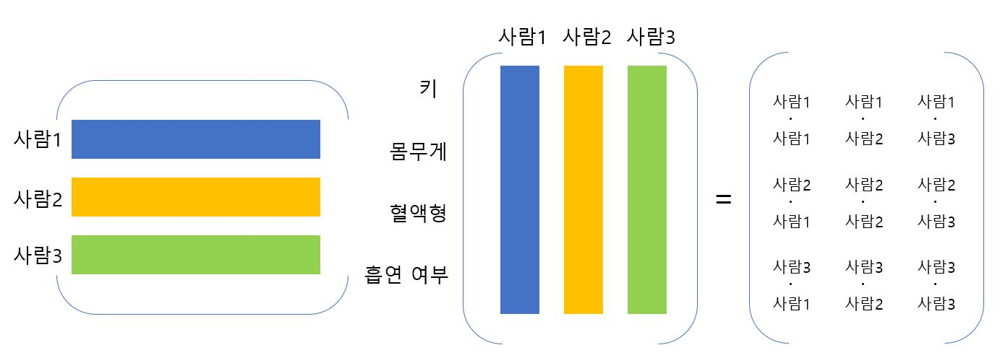

# Eigendecomposition in Machine Learning

머신러닝 문제에서는 주로 Symmetric Positive(semi-)definite한 행렬을 다루게 된다. 

다음과 같은 Feature-by-data item의 행렬 𝐴 ∈ ℝ^(𝑚×𝑛)가 있다고 가정하자.

A^TA는 다음과 같이 사람 데이터 간의 내적으로 사람 데이터 사이의 유사도를 표현하게 된다.

마찬가지로 AA^T는 특징으로 묶은 벡터들의 내적으로 계산하여 특징 간의 상관 관계를 표현하게 된다. 

이런식으로 머신러닝에서 고윳값 분해를 사용하는 영역은 주성분 분석에서 공분산 행렬을 구할 때, 스타일 트랜스퍼에서 그람 행렬을 구할 때 등의 경우가 있다. 

- 참고 자료

  [Principal component analysis1](http://www.math.union.edu/~jaureguj/PCA.pdf)
  [Principal component analysis2]( http://pages.cs.wisc.edu/~jerryzhu/cs540/handouts/PCA.pdf)
  [Lecture on gram matrix in style transfer](https://www.youtube.com/watch?v=VC-YFRSp7lM&amp;feature=youtu.be)

  

