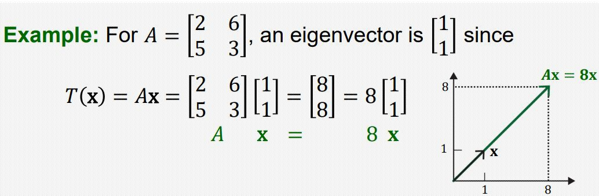
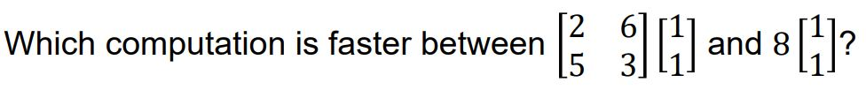
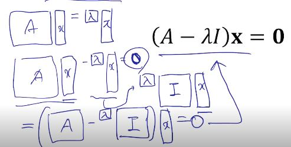
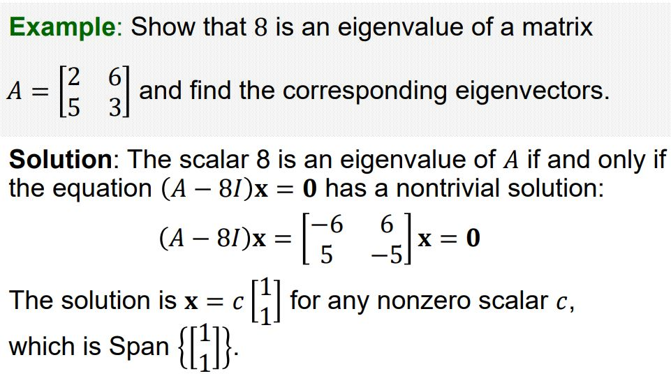
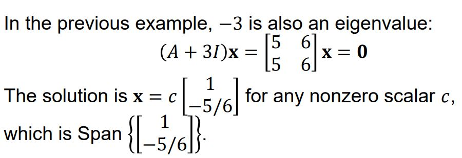

# Eigenvectors and Eigenvalues

## Eigenvectors and Eigenvalues

어떤 정사각행렬 𝐴 ∈ ℝ^𝑛×𝑛이 있고, 영 벡터가 아닌 벡터𝐱 ∈ ℝ^𝑛가 있을 때, 어떤 스칼라 𝜆에 대하여 𝐴𝐱 = 𝜆𝐱 를 만족할 때,  𝜆를 행렬 A의 고윳값, 𝐱를 고윳값 𝜆에 대응하는 고유벡터라고 한다. 

## Transformation Perspective 

어떤 선형 변환 𝑇(x) = 𝐴x가 있다고 할 때, 𝑇(x) = 𝐴x = 𝜆𝐱라고 한다면 x는 고유벡터라고 할 수 있는데, 이것은 이 선형 변환에 의한 결과 벡터가 원래 벡터와 방향은 같고 크기만  𝜆에 의해 변하게 되는 것을 의미한다. 

## Computational Advantage

고윳값과 고유벡터에 의한 연산이 갖는 계산적인 측면의 장점은 원래 행렬과 벡터의 곱으로 나타난 연산을 할 때보다, 스칼라와 벡터의 곱의 연산을 진행함으로서 계산량을 줄일수 있다는 데 있다.  

## Eigenvectors and Eigenvalues

방정식 𝐴𝐱 = 𝜆𝐱은 다음과 같이 나타낼 수 있다.

여기서 𝐱는 영벡터(Trivial solution)가 되서는 안된다. 왜냐하면 영벡터라면 𝜆 값에 상관 없이 항상 양변을 만족하기 때문이다. 

결론적으로 선형 독립적인 열벡터들의 행렬 A를 𝜆I와의 뺄셈 연산을 통해서 선형 종속적인 열벡터들의 행렬로 만들어주는 고윳값 𝜆와 고유벡터𝐱를 찾는 과정이 여기서의 목표가 된다(𝐴𝐱 = 0은 A가 선형 독립적인 열 벡터들의 행렬일 때 Trivial solution을 갖으므로 Nontrivial Solution을 위해서 𝜆I와의 뺄셈을 통해서 선형 의존적으로 만든다). 

## Example: Eigenvalues and Eigenvectors

위에서 행렬 [[-6 6] [5 -5]]의 열벡터들이 선형 종속적이므로 벡터x가 Nontrivial solution을 갖게 된다. 따라서 8이 행렬 A의 고윳값이 되게 되고 Span{[1 1]}이 고유벡터의 집합이 된다. 

