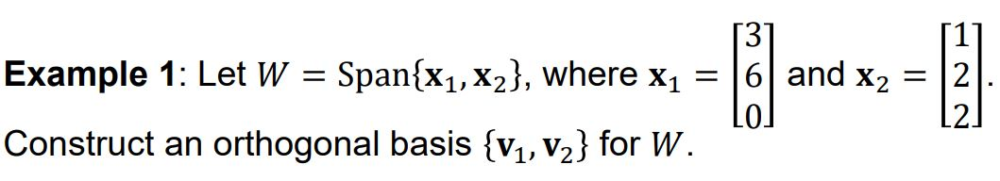
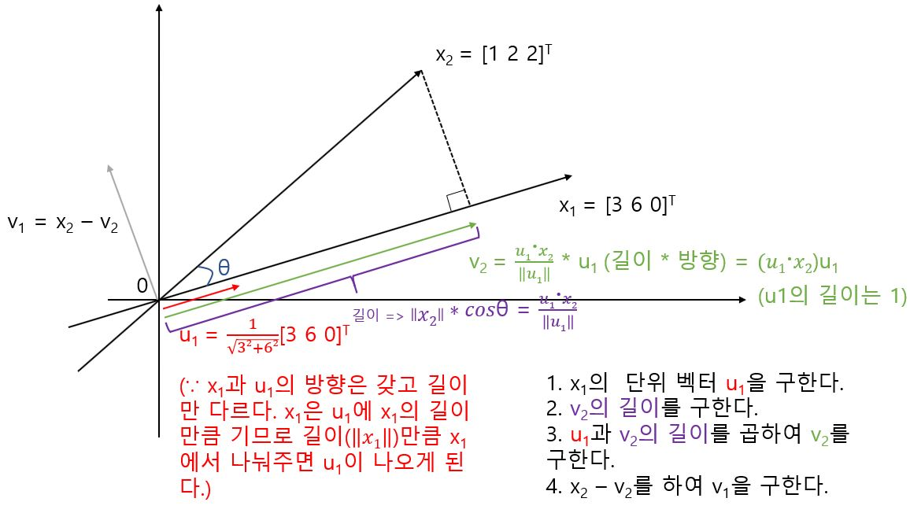
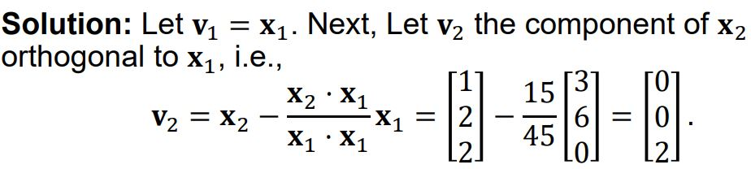
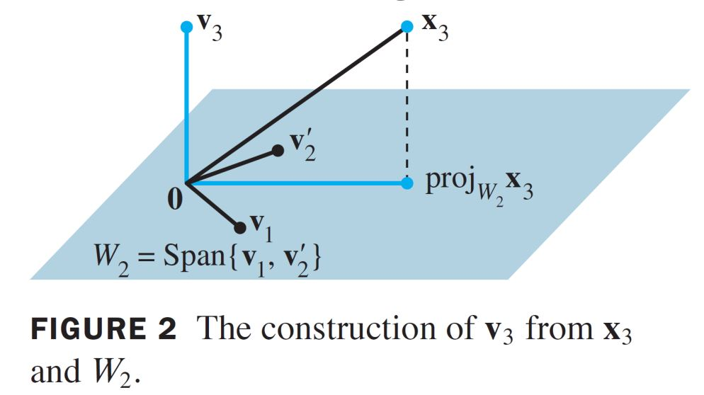
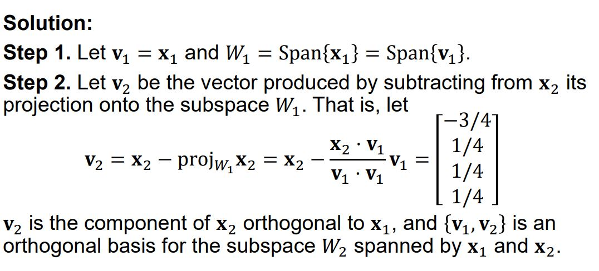
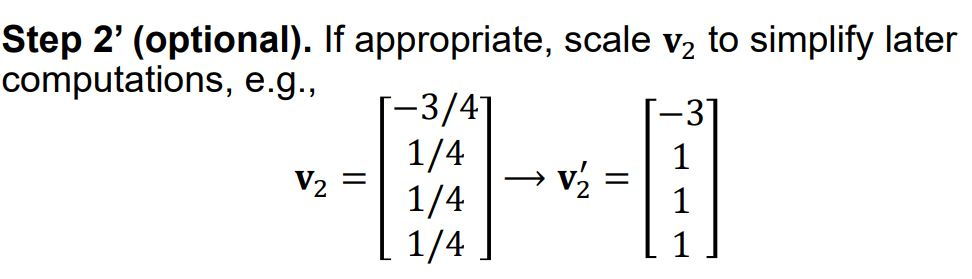
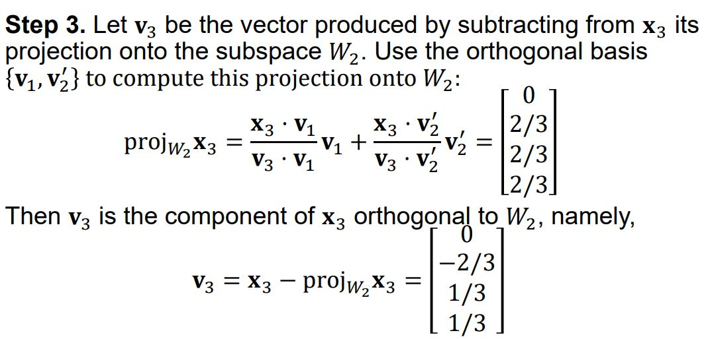
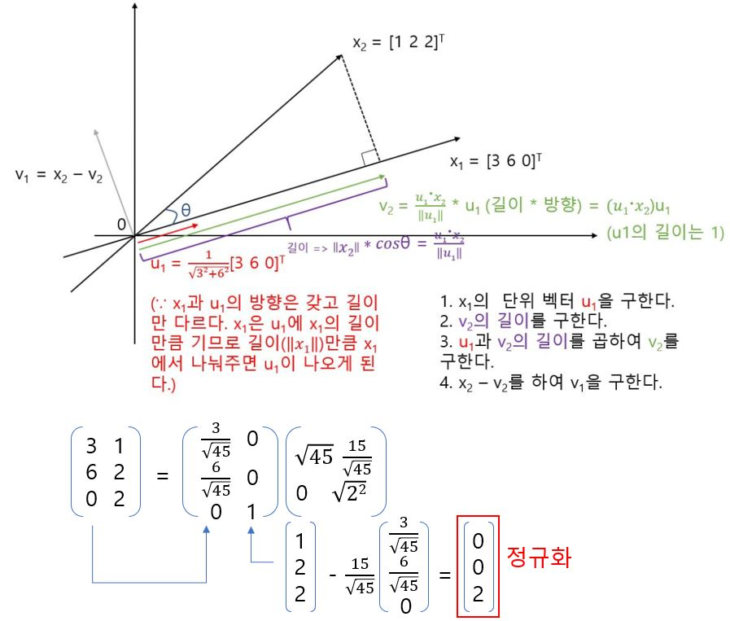

# Gram-Schmidt Orthogonalization and QR Factorization

## Gram-Schmidt Orthogonalization

다음과 같은 문제가 주어졌다고 가정한다.

즉 부분공간 W가 기저 벡터 x1과 x2의 Span일때 이 W를 Span할 수 있는 Orthogonal한 기저 벡터 v1, v2를 구하는 것이다. 

실제로 답을 구하면 다음과 같다.

특별히 [0 0 2]T를 이 벡터의 Norm으로 나누면 Orthonormal한 벡터를 도출할 수 있다. 

## Gram-Schmidt Orthogonalization

x3에서 v3를 추출하는 과정은 기본원리는 위에서 설명한 바와 같다. 해답은 밑 참조(x3를 Span{x1의 단위 벡터 v1}으로 투영했을 때 ).

## QR Factorization

어떤 선형 독립적인 열들로 이루어진 mxn 행렬 A가 있다고 할 때, A = QR로 인수분해(Factorization)이 가능하다. 여기서 Q는 mxn 크기의, 열공간 A를 구성하는 Orthonormal한 기저 벡터들이고, Q는 n x n 크기의, 대각 원소가 양수인 상삼각행렬이다. 

