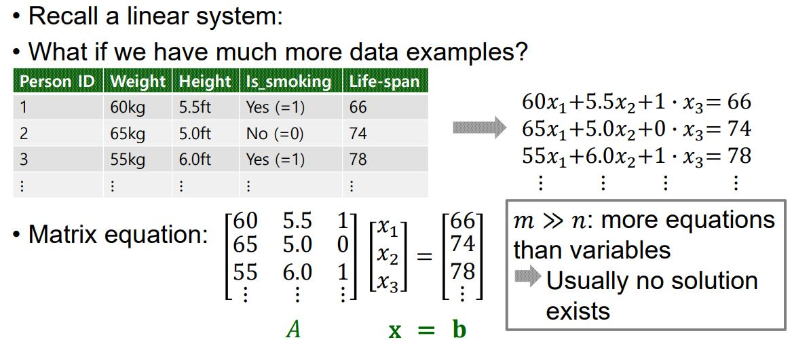
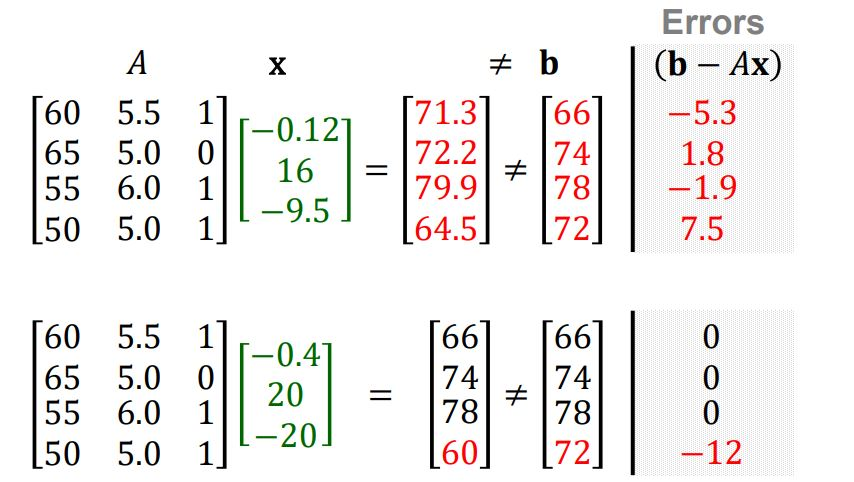

# Least Squares Problem Overview

## Over-determined Linear Systems

방정식의 갯수가 특징(변수)의 갯수보다 많을 경우 해가 존재하지 않을 확률이 크다. 

## Vector Equation Perspective

그 이유는 원래 전체 공간,  𝐚1, 𝐚2, 𝐚3, 𝐛 ∈ ℝ^n인 ℝ^n에 비해서 Span{ 𝐚1, 𝐚2, 𝐚3}은 매우 얇은 초평면이 되기 떄문이다. 그래서 b가 Span{ 𝐚1, 𝐚2, 𝐚3}에 포함될(선형 결합의 결과 벡터가 열 벡터들의 Span에 포함되어 있어야 해가 존재한다) 확률이 적다. 

## Motivation for Least Squares

Over-determined system의 해가 존재 하지 않더라도, 근사적으로 해를 구할 수 있다면 최적의 근사해를 구하는 방법은 무엇인지 생각해 볼 수 있다. 

## Inner Product

𝐮, 𝐯 ∈ ℝ^n인 n x 1 사이즈의 벡터에 대해서 𝐮^T는 1 x n인 벡터이고, 𝐮^T 𝐯 는 1 x 1의 스칼라이다. 이때 이 연산을 𝐮, 𝐯에 대한 내적(Inner product or Dot product)이라고 하고 𝐮 ∙ 𝐯 로 쓴다. 

## Properties of Inner Product

𝐮, 𝐯, w가 ℝ^n 공간에서의 벡터이고 c는 어떤 스칼라라고 할 때 위의 정리가 성립한다. 

a)내적의 교환 법칙, b)내적의 분배법칙, c)내적의 결합법칙 d) 같은 벡터를 내적시키면 0보다 크거나 같으며, 0이 되는 조건의 오직 그 벡터가 영 벡터일 때 뿐이다.

b)와 c)를 결합한 위와 같은 규칙은 선형 변환의 성질을 따른다. 즉, 선형 결합의 결과와 내적을 한 것과 각각을 선형 결합을 하고 나서 선형 결합을 한 결과는 같다. 

## Vector Norm

𝐯 ∈ ℝ^n과 이 벡터의 각 항목 𝑣1, … , 𝑣n에 대하여 벡터 𝐯의 길이(Length or Norm)은 비음수이고 다음과 같이 정의 될 수 있다. 

## Geometric Meaning of Vector Norm

𝐯 ∈ ℝ2, v= [a b]^T에 대하여 기하학적으로 다음과 같은 성질을 만족한다.

## Unit Vector

길이가 1인 벡터를 단위 벡터(Unit vector)라고 한다.  어떤 벡터를 정규화(Normalizing)한다는 것은 길이가 1인 단위 벡터로 만드는 과정이고 이는 이 벡터의 각 원소에 Norm만큼 스칼라를 곱해주면 된다. 

u는 v와 방향이 같지만 길이가 1인 벡터이다. 

## Distance between Vectors in ℝ^n

u, v가 ℝ^n 공간 상의 벡터라고 했을 때, 이 두 벡터 사이의 거리는 다음과 같이 쓸 수 있다. 

이에 대해서 기하학적으로 표현하면 아래와 같다.

## Inner Product and Angle Between Vectors

어떤 벡터 u와 v의 내적은 이 두 벡터의 Norm과 그 사이의 각도로 다음과 같이 표현할 수 있다. 

## Orthogonal Vectors

ℝ^n 공간 상의 두 벡터 u, v가 서로 직교한다는 것은 내적 값이 0이라는 뜻이다. 그 이유는 Cosine 90도가 0이기 때문에 두 벡터의 Norm과 상관 없이 0이 나오기 때문이다. 

## Back to Over-Determined System

위의 식에서 첫 3개의 데이터 포인트의 경우 주어진 가중치를 사용했을 때 오차가 발생하지 않지만 만약에 새로운 데이터 포인트가 추가 될 경우, 오차가 12만큼 발생하게 된다. 

## Which One is Better Solution?

만약에 처음의 가중치 말고 다른 가중치를 사용했을 때의 오차는 위와 같다.

처음과 비교했을 때, 더 나은 해는 어떤 것인지 비교해볼 필요가 있다. 

## Least Squares: Best Approximation Criterion

한 가지 방법은 각 오차에 제곱을 해주고(음수와 양수의 상쇄 효과를 없애기 위해서), 이를 다 더해 주는 것이다. 이렇게 비교했을 때는 바뀐 가중치(해)가 더 나은 것임을 확인할 수 있다. 

## Least Squares Problem

오차를 최소화 하는 해가 근사적인 최적의 해가 될 수 있고 이를 찾아내는 문제가 Least Squares Problem이다. 