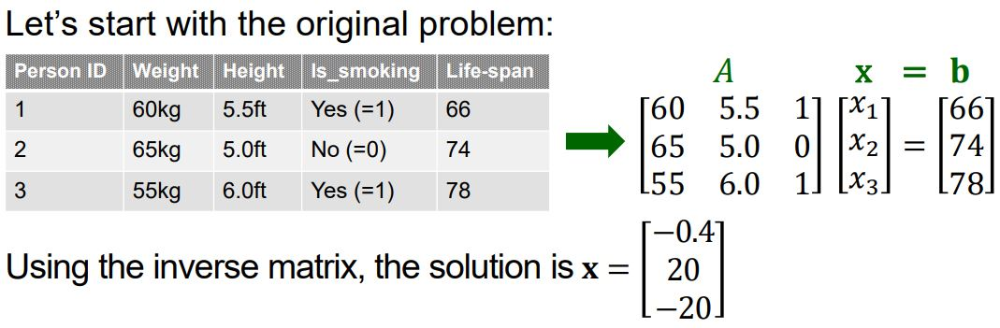
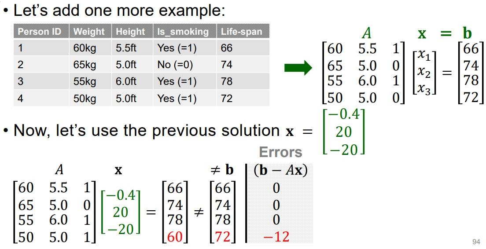
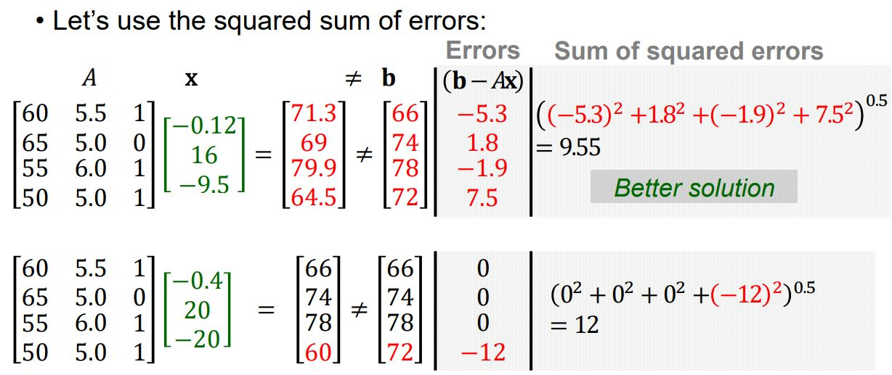
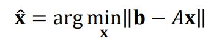
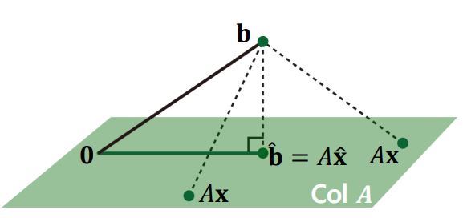
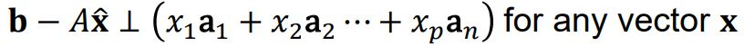
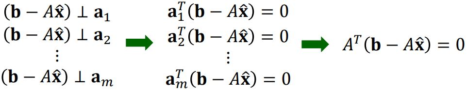

# Least squares problem with geometry

## Back to Over-Determined System

Least squares problem의 개관에서 방정식의 갯수가 특징(가중치)의 계수보다 많은 Over-Determined  System에서 근사적인 해를 구하는 방법에 대해서 생각해본 적이 있다. 

## Least Squares Problem

행렬 𝐴 ∈ ℝ^𝑚×𝑛이고, 벡터 𝐛 ∈ ℝ^𝑛이며 행의 수가 열의 수보다 큰 (𝑚 ≫ 𝑛) 𝐴𝐱 ≃ 𝐛에 대하여 최적 해(결과 값이 실제 b와의 에러를 최소화 하는 해, Least squares solution) 𝐱_hat은 다음과 같이 정의될 수 있다. 

여기서 b 벡터는 Column space A에 포함되지 않기 때문에, A의 열 벡터들의 선형결합으로 표현할 수 없다. 따라서 Column space A에 포함되면서 b와의 오차를 최소화 하는 x_hat을 찾아내야 한다. 

## Geometric Interpretation of Least Squares

행렬 A의 Column space위의 한 벡터 Ax가 이 공간 위에 있지 않은 벡터 b에 가장 가깝다는 것은 b에서 Column space로의 수선의 발이 이 벡터라는 뜻이다. 이를 만족하기 위해서는 b-b_hat이라는 벡터는 Col A에 Orthogonal해야 한다. 이것은 Col A의 그 어떤 벡터와도 b-b_hat이 Orthogonal해야 한다는 것을 뜻한다. 

- Col A의 모든 벡터들은 기저 벡터들의 선형 결합으로 나타낼 수 있으므로 이 기저 벡터들이 b-b_hat과 orthogonal하면 Col A의 모든 벡터들은 b-b_hat과 orthogonal하다. 
- 벡터의 내적은 분배 법칙이 성립한다.

위의 두 가지 사실로 인해 다음이 성립한다. 

u, v의 Dot product는 u와 v의 Transpose의 곱으로 나타낼 수 있었다. 위에서 a 벡터들의 Transpose를 모으면 행렬 A의 transpose가 되므로 최종적으로 행렬의 Transpose와 벡터의 곱으로 표현할 수 있다. 두 벡터가 Orthogonal하면 영 벡터가 되는 이유는 벡터의 내적이 각 벡터의 Norm과 Cosine 90도의 곱으로 나타낼 수 있는데 Cosine 90이 0이기 때문이다. 

