# Linear transformation

## Transformation

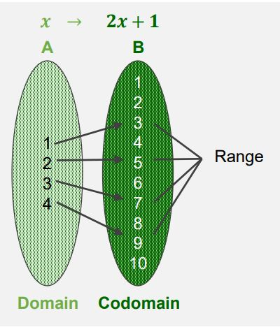

매핑, 함수, 변환이라는 것은 입력 x에 대해서 출력 y를 대응시키는 것이다. 수학적으로 T: x -> y 라고 표기한다. 

- 정의역(Domain): 모든 가능한 입력 x 값들의 집합
- 공역(Co-domain): 모든 가능한 출력 y 값들의 집합
- 함수의 상(Image): 주어진 입력 x에 대응하는 출력 값 y
- 치역(Range): 정의역에 있는 입력 x에 대응한 모든 출력 값들의 집합

특정한 입력 x에 대응하는 출력은 반드시 유일하게 정해져야 한다(없거나 두 개이상 존재 할 수 없다).

## Linear Transformation

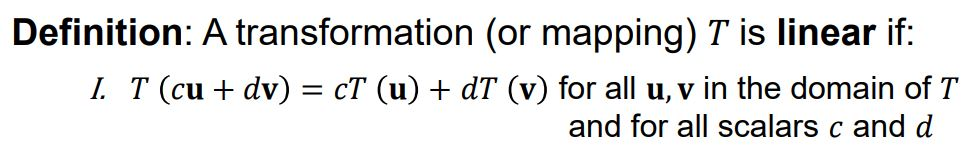

어떤 함수(변환, 매핑) T에 대하여 T의 정의역에 해당하는 벡터 u, v를 뽑아서 어떤 스칼라 c, d에 의한 선형 결합을 입력으로 했을 때 출력 값과 u, v를 각각 입력으로 하고 그에 대응하는 출력 값에 c, d에 의해 선형 결합의 형태를 띈 출력이 같을 때 T는 선형적이라고 말할 수 있다. 

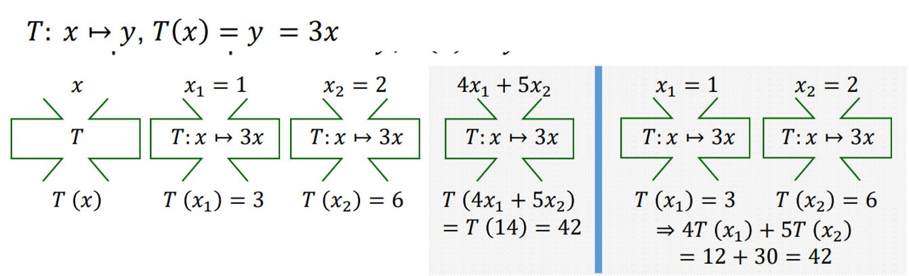

그런데 일반적으로 y 절편(bias)가 들어간 1차식의 경우, 선형 변환이 정의되지 않는다. 

그런데 이를 벡터를 나타내서 R^2 공간에서 R^1 공간으로의 변환으로 이해하면 가능해진다.

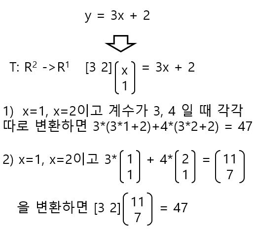

## Transformations between Vectors

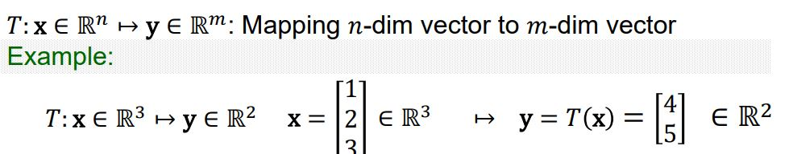

선형 변환에 의해서 n차원의 벡터가 m차원의 벡터로 변형될 수 있다.

## Matrix of Linear Transformation

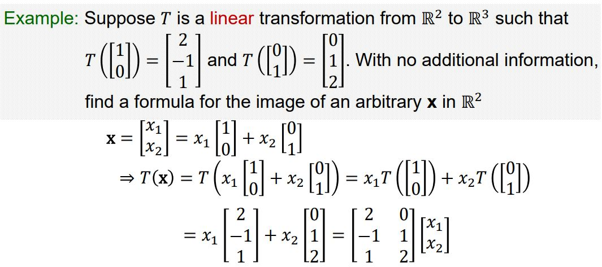

어떤 변환이 선형성을 만족하는 변환이라고 할 때 이 변환을 구하는 방법은 위와 같다. 어떤 계수가 주어질 때 이 계수를 Standard basis의 선형 결합으로 나타낸 뒤에 선형 변환의 성질을 이용하여 재료 벡터와 계수의 곱 형태를 유도할 수 있는데 이때의 재료 벡터를 모아서 행렬과 계수의 곱으로 나타낼 수 있다.  

## Matrix of Linear Transformation

일반적으로 T:R^n -> R^m인 변환 선형 변환이라고 하면 T는 다음과 같이 행렬과 벡터의 곱으로 표현될 수 있다. 

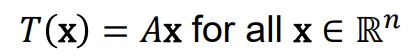

위의 행렬 A ∈ R^(mxn)의 j번째 열은 R^(nxn)에 속하는 단위 행렬의 j번째 열의 변환 결과와 같다. 

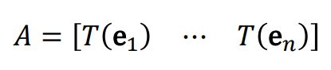

여기서 행렬 A를 선형변환 T의 Standard matrix라고 부른다. 

## Matrix of Linear Transformation

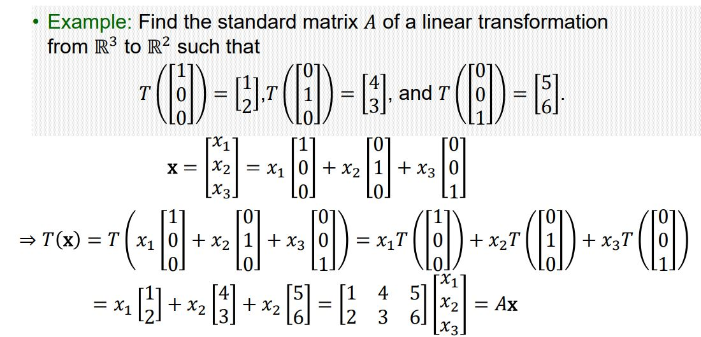

## Linear Transformation in Neural Networks

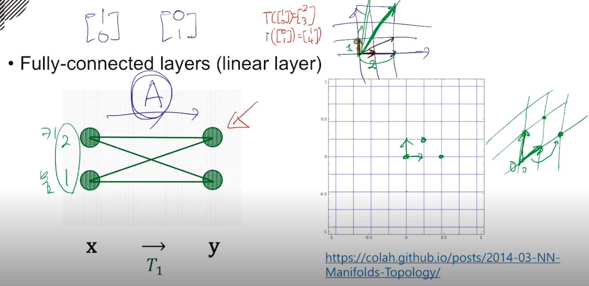

선형 변환은 원래 Standard basis로 표현되는 좌표 공간을 왜곡시키는 기하학적인 의미를 가지고 있다. 

## Affine Layer in Neural Networks

완전 연결 계층은 보통 Bias 항을 포함하고 있기 때문에 Affine 계층이라고 부르지만 Linear 계층이라고는 하지 않는다. 그런데 이를 아래와 같이 선형 결합으로 이루어진 선형 변환으로 변형 시킬 수 있다. 

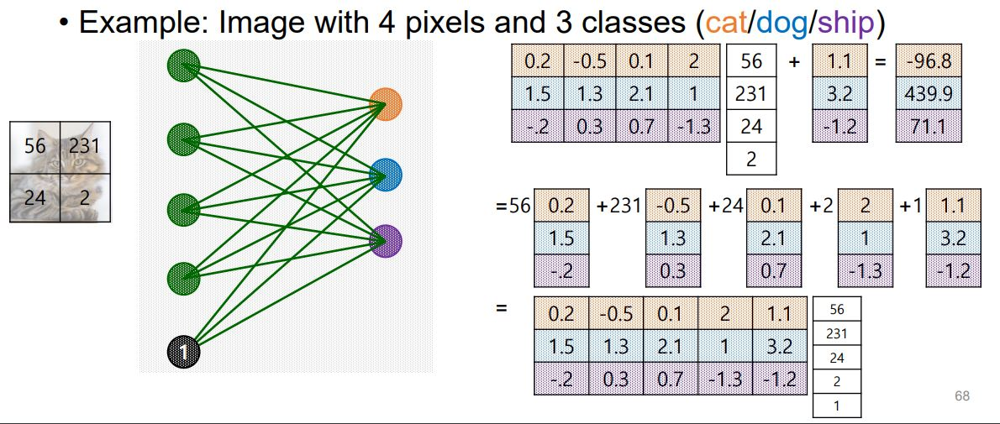
