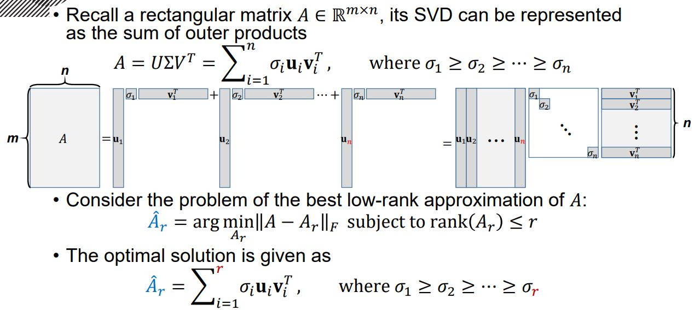
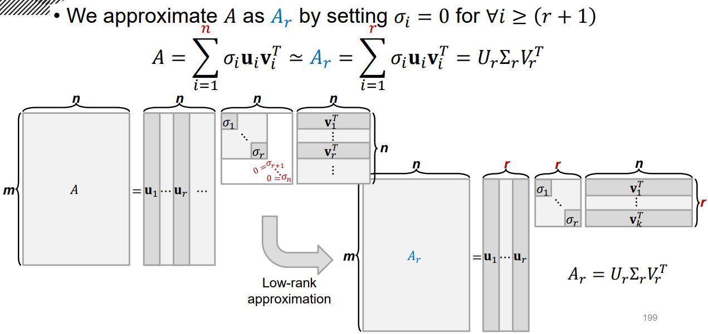

# Low-Rank Approximation of Matrix

어떤 직사각행렬 𝐴 ∈ ℝ^(𝑚×𝑛)을 SVD를 통해서 외적의 합의 형태로 표현이 가능했다.  이때 특이값의 내림차 순으로 외적을 정렬하여 원하는 성분 갯수만큼 잘랐을 때, 원래의 입력 행렬과의 행렬 놈(Frobenius Norm)이 가장 작은 근사치 행렬을 찾는 문제이다. 

원하는 성분 갯수만큼 자를때는 남겨둘 성분 외의 성분의 특이 값을 모두 0으로 만든다. 

- 참고 사항

  [Lectures on low-rank matrix factorization for topic modeling and](https://www.youtube.com/playlist?list=PLep-kTP3NkcNqn2MtzkscRlTDYTiqKjzD)

  
