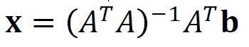

# Normal Equation

위의 최종적으로 행렬과 벡터의 곱으로 이어진 형태에서 다음과 같은 방정식을 유도해 낼 수 있다. 

주어진 Least squares problem, 𝐴𝐱≃𝐛에 대해서 위에서 유도한 방정식을 정규 방정식(Normal equation)이라고 한다.  이것을 하나의 새로운 선형 시스템으로 본다면, 𝐶𝐱=𝐝이고, 여기서 𝐶=𝐴^𝑇𝐴∈ℝ^𝑛×𝑛, 𝐝=𝐴^𝑇𝐛∈ℝ^𝑛 라고 볼 수 있다. 만약에 C의 역행렬이 존재(Invertible)한다면 이 방정식의 해인 x_hat은 다음과 같이 나타낼 수 있다. 

## Another Derivation of Normal Equation

어떤 벡터(여기서는 𝐛−𝐴𝐱)의 길이의 최솟값을 찾는 문제는 이 벡터의 제곱의 최솟 값을 찾는 문제와 같다. 왜냐하면 어떤 길이가 최소인 벡터가 있을 때, 이 벡터를 제곱해도 여전히 최소이기 때문이다. 벡터의 제곱은 위와 같이 벡터의 Transpose와의 내적으로 나타낼 수 있고 전개하면 위와 같다. 최솟값을 찾기 위해서 벡터 x에 대하여 위의 방정식을 미분한 값이 영 벡터가 되어야 한다. 벡터에 대한 미분의 기본 아이디어는 다음과 같다. 

이를 토대로 위에서 전개한 방정식을 x벡터에 대해 미분하면 다음과 같다.

만약에 A^A가 역행렬이 존재한다면 최적해는 다음과 같이 계산할 수 있다.

## Life-Span Example

## What If C = A^TA is NOT Invertible?

만약에 정규 방정식에서 A^TA의 역행렬이 존재하지 않는다면 이때는 해가 없거나 무한히 많을 수 밖에 없다. 

Ex) [[x + 2y] [2x + 4y]] = [2 4] (해가 무수히 많다), [[x + 2y] [2x + 4y]] = [2 5] (해가 없다)

그런데 정규 방정식에서는 해가 없을 수 밖에 없다. 왜냐하면 한 벡터에서 초평면으로 수선의 발을 내리면 적어도 하나의 수선의 발이 존재하기 때문이다. 따라서 역행렬이 존재하지 않는다면 해가 무수히 많은 경우 밖에 없다. 이 때는 행렬 A의 열벡터들이 선형 종속이기 때문에 같은 수선의 발을 표현하는 여러가지 계수 값이 존재할 수 밖에 없고 정규 방정식의 관점에서는 해가 무수히 많은 경우이다. 

보통은 A^TA는 역행렬이 존재한다. 그 이유는 다음과 같다. 

 

예를 들어서 위의 Weight와 Height가 선형 종속의 관계이기 때문에 Weight 값의 변화율과 Height 값의 변화율이 같다고 한다(데이터가 매우 적어서). 이 상태에서 하나라도 변화율이 같지 않은 데이터가 들어올 경우 선형 독립이 되어 버린다. 이런 이유로 정규 방정식에서의  A^TA는 역행렬이 존재할 수 밖에 없다. 