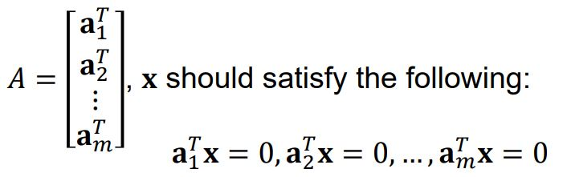
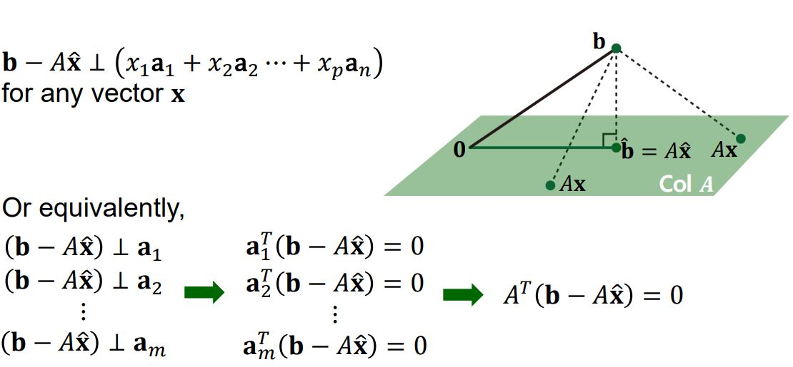
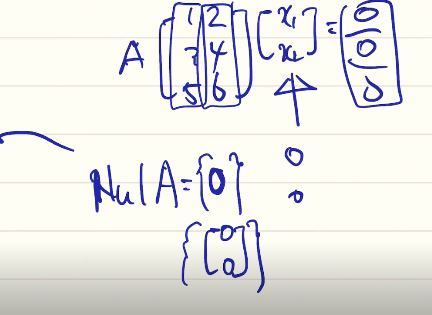
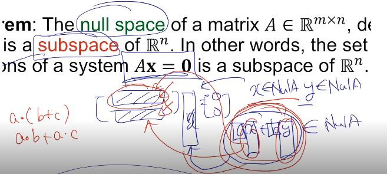
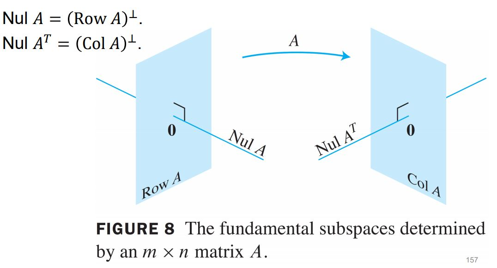
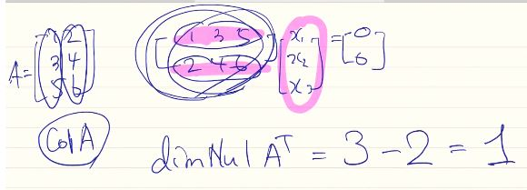

# Null space and Orthogonal Complement

## Null Space

행렬 𝐴 ∈ ℝ^𝑚×𝑛의 영공간은  𝐴𝐱 = 𝟎의 Homogeneous linear system의 모든 해들의 집합이다. Nul 𝐴로 나타내며 다음을 만족한다. 

즉 x벡터는 행렬 A의 모든 행 벡터들과 수직이어야 한다. 어떤 벡터가 어떤 행렬의 열 또는 행 벡터들의 Span으로 만들어지는 부분공간에 수직이라고 하는 것은 그 부분 공간을 만드는 기저 벡터들과 모두 수직이면 된다(그 부분공간의 기저벡터 외의 다른 벡터들은 기저 벡터들의 선형 결합으로 나타낼 수 있으므로).

위와 같은 행 벡터의 영공간은 해가 Trivial solution 밖에 없으므로 [0 0] 밖에 없다.

## Null Space is a Subspace

행렬 𝐴 ∈ ℝ𝑚×𝑛의 영공간은 ℝ^n 크기의 부분공간이다. 즉, 𝐴𝐱 = 𝟎을 만족하는 모든 해의 집합은 ℝ^n크기의 부분공간이라고 할 수 있다. 그러므로 (A- λI)x = 0을 만족하는 x의 해의 집합인 고유공간도 특정한 차원의 기적 벡터들을 갖을 수 있다. 

증명은 다음과 같이 할 수 있다. 

x ∈ Nul A, y ∈ Nul A then, ax + by ∈ Nul A? Yes, because a.(b+c)=a.b+a.c

## Orthogonal Complement

어떤 벡터 z가 부분공간 R^n 공간의 부분공간 W의 모든 벡터에 수직하다면 z는 W에 Orthogonal하다고 한다. W에 Orthogonal한 z 벡터들의 집합을 W의 Orthogonal complement라고 부르며 𝑊^⊥로 표기하고 W perpendicular 혹은 W perp이라고 읽는다. 어떤 벡터 𝐱 ∈ ℝ^𝑛는 x가 W를 Span하는 벡터들과 Orthogonal할 때 W^⊥에 속하게 된다. 𝑊^⊥는 ℝ^𝑛의 부분공간이다. 영공간과 관련되 Orthogonal Complement 관련하여 기본적으로 다음이 성립한다. 

  

예를 들어 어떤 Row 벡터 [1 2 3]이 있고[1 2 3] [x1 x2 x3]^T = [0 0 0]을 만족하는 [X1 X2 X3]의 집합이 영공간이다. 여기서 Span{[1 2 3]}의 차원은 1차원이므로 3차원 공간을 채우기 위해서는 2개의 선형 독립적인 벡터가 더 필요하다. 여기서 이 선형독립적인 벡터들을 Gram-Schmidt Orthogonalization을 통해서 [1 2 3] 벡터의 Orthogonal한 형태로 만들어 주면 이것이 바로 영공간에 속하는 벡터의 필요 충분 조건이 된다. 따라서 # of 영공간의 기저 벡터는 3 - 1 = 2가 된다. 만약에 원래의 Row 벡터가 [[1 2 3] [2 2 3]]과 같이 2개가 존재한다면 영공간의 기저 벡터는 3 - 2 = 1이 된다. 

Col A의 경우도 다음과 같이 비슷하다.

