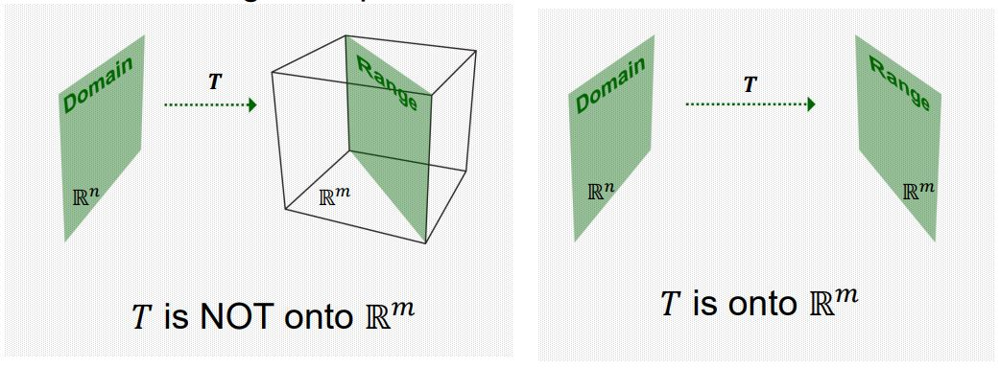
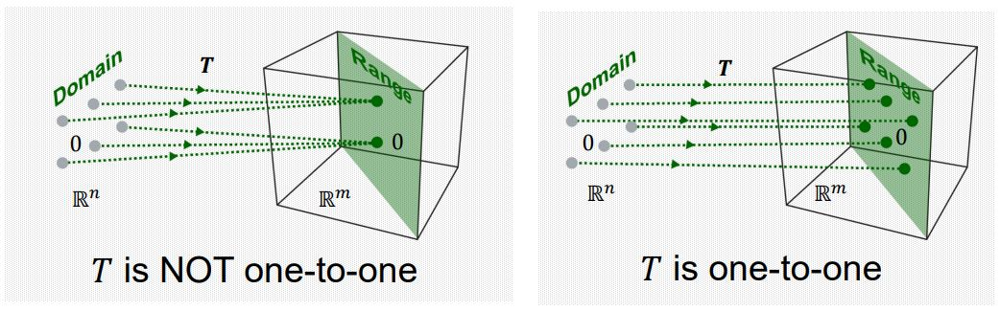
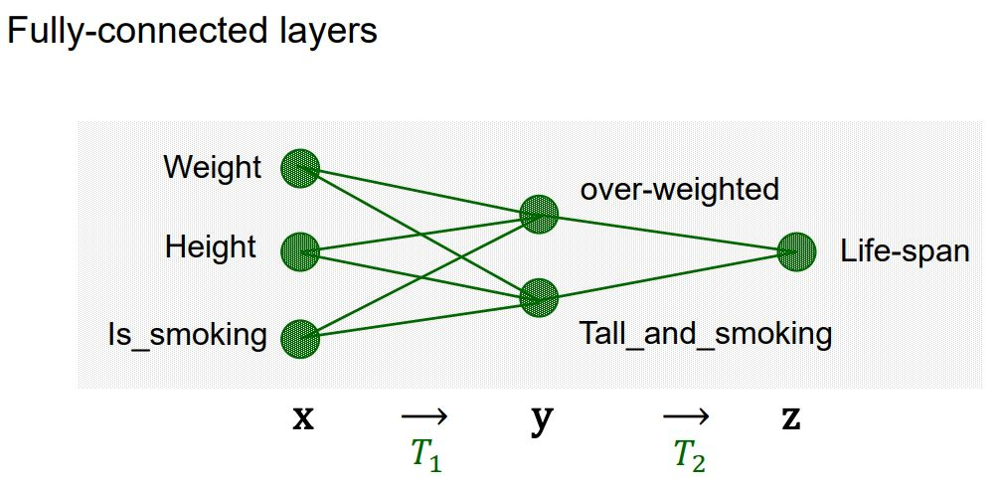
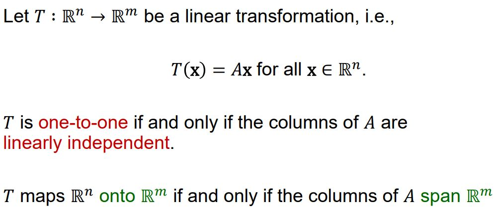

# ONTO and ONE-TO-ONE

## ONTO and ONE-TO-ONE

어떤 선형 함수 T : R^n -> R^m이 있을 때, b ∈ R^m이 적어도 하나의 입력 x ∈ R^n의 상(Image)일 때, 이 선형 변환 T를 전사 함수(A mapping 𝑇 ∶ ℝ𝑛 → ℝ𝑚 is said to be onto ℝ𝑚 if each b ∈ ℝ𝑚 is the image of at least one x ∈ ℝ𝑛) 라고 한다. 즉, 공역과 치역이 같은 경우를 의미한다.  

## ONTO and ONE-TO-ONE

어떤 선형 함수 T : R^n -> R^m이 있을 때, b ∈ R^m이 많아야 하나의 입력 x ∈ R^n의 상(Image)일 때, 이 선형 변환 T를 단사 함수(A mapping 𝑇 ∶ ℝ𝑛 → ℝ𝑚 is said to be one-to-one if each b ∈ ℝ𝑚 is the image of at most one x ∈ ℝ𝑛) 라고 한다. 즉, 치역에 있는 값들이 정확히 하나의 입력에만 매핑되어야 한다는 의미이다. 

## Neural Network Example

다음과 같은 신경망이 있을 때 이 신경망이 ONE-TO-ONE인지 확인 하려면 주어진 몸무게, 키, 흡연 여부의 데이터에 대하여 어떤 사람들의 입력 데이터가 똑같은 (over_weighted, tall_and_smoking)으로 맵핑되는지를 살펴보면 되는데, 여기서는 당연히 정보의 손실이 잃어나므로(차원 축소 발생) ONE-TO-ONE은 될 수가 없다. 즉, 어떤 (over_weighted, tall_and_smoking)에 대하여 이것이 (80kg, 180cm, yes)인 사람인지 (70kg, 170cm, no)의 사람 데이터의 결과인지 알 방법이 없다. 

이 신경망이 ONTO인지 확인 하려면 주어진 몸무게, 키, 흡연 여부의 데이터에 대하여 이 신경망의 구조로는 존재하지 않는(맵핑되지 않는) (over_weighted, tall_and_smoking)이 존재하는지를 살펴보면 되는데, 경우에 따라 다르다. 

## ONTO and ONE-TO-ONE

어떤 선형 변환이 있을 때, 이 선형 변환의 행렬 A의 열 벡터들이 선형 독립이라면 해가 하나 존재하므로 이 선형 변환은 단사함수라고 할 수 있다. 

어떤 선형 변환이 있을 때, 그 해가 모두 행렬 A의 열들의 Span에 포함된다면 이 선형 변환은 전사함수라고 할 수 있다.  

