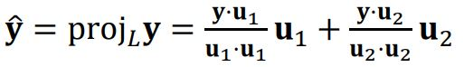

# Orthogonal_Projection

어떤 역행렬이 존재하는 행렬 A에 대해 A의 열공간 위에 떠 있는 한 벡터 b에서 A의 열공간으로 투영을 시켰을 때의 A의 열공간 위의 b의 그림자 같은 벡터의 해는 정규 방정식에 의해서 다음과 같았다. 

여기서 b를 투영시켰을 때 열공간 위에 생기는 벡터 b_hat = Ax_hat 이므로 위의 식의 양변에 A를 곱해주면 다음과 같은 식을 유도할 수있다.

기하학적으로 Orthogonal projection of b onto Col A에서 onto라는 개념을, 어떤 한 벡터를 행렬 A의 열 공간으로 투영시키는 선형 변환 혹은 함수라고 볼 수 있다. 즉, 주어진 입력벡터b와 A(A^TA)^-1A^T라는 행렬의 곱으로 b를 b_hat으로 매핑시키는 선형 변환이라고 할 수 있다. 선형 변환의 특징 때문에 다음과 같은 특징이 여기서도 성립하게 된다. 

어떤 열 공간 위의 두 점이 있을 때, 이 두 점을 선형 결합하여 열 공간으로 투영시킨 결과와 각각을 투영시키고 나서 선형결합시킨 결과가 같다. 

## Orthogonal and Orthonormal Sets

ℝ^n 차원의  어떤 벡터들의 집합 {𝐮1, … , 𝐮𝑝}의 임의의 두 벡터를 내적했을 때 0이라면 이 벡터들은 Orthogonal하다고 할 수 있다. if 𝐮𝑖 ⋅ 𝐮𝑗 = 0 whenever 𝑖 ≠ 𝑗.

Orthogonal한 벡터들의 집합의 각 원소들이 단위 벡터(길이가 1)라면 이 벡터들은 Orthonormal하다고 할 수 있다. 

Orthogonal(or Orthonormal)한 벡터들은 선형 독립일 수 밖에 없다. 왜냐하면 서로 수직이므로 어떤 두 벡터의 Span으로 다른 벡터가 만들어지지 않는다. 

## Orthogonal and Orthonormal Basis

ℝ^n 차원의 부분 공간인 p차원 부분공간 W의 기저 벡터  {𝐯1, … , 𝐯𝑝}에 대해서 우리는 이 기저 벡터를 Gram-Schmidt process, 즉, QR factorization을 통해 Orthogonal(or Orthonormal) 하게 만들 수 있다.  

## Orthogonal Projection y_hat of y onto Line

1차원 부분 공간 L위의 벡터 y를 L위로 사영시키면 y_hat이 생기는데 이를 구하는 방법은 위와 같다. 

1.  벡터 y의 길이를 구할 수 있다.
2. 벡터 y와 L 사이의 예각을 세타라고 한다면 어떤 y_hat의 길이를 구할 수 있다. 
3. y_hat의 방향을 구하기 위해서 L 상에서 길이가 1인 단위 벡터가 있다고 한다면 이 벡터는 u 벡터를 길이로 나눠서 구할 수 있다.
4. 2에서 구한 길이와 3에서 구한 방향을 곱하면 5와 같이 y_hat을 구할 수 있다.

𝐮⋅𝐮 = llull llull cos0 = llull^2 이므로 위 그림에서 5번의 결과는 바로 위와 같이 나타낼 수 있다.

만약에 u가 길이가 1인 단위 벡터라면 llull^2 = 1이 되므로 위와 같이 나타낼 수 있다. y⋅u는 내적이기 때문에 결과가 스칼라 값이 나오게 되고 u는 단위 벡터이다. 위의 그림 3번에 의해서 llull = 1이므로  y⋅u = llyllcosΘ는 y_hat의 방향임을 알 수 있다. 

## Orthogonal Projection y_hat of y onto Plane

2차원 부분공간에 사영시키는 것도 그 원리는 1차원과 유사하다. 다만 2차원 평면을 구성하는 기저 벡터 각각에 독립적으로 투영시켜서 선형 결합을 함으로서 결과를 만들어 낼 수 있다. 여기서 2차원 평면을 구성하는 기저 벡터에 투영을 할 수 있는 이유는 삼수선의 정리에 의해서 수직이 되기 때문이다. 

u1과 u2과 단위 벡터라면 다음과 같다.

## Orthogonal Projection when y ∈ W

다음과 같이 이미 부분공간에 속하는 벡터를 부분공간으로 투영시키게 되면 투영으로 생긴 벡터는 원래의 벡터와 동일해진다.

기저 벡터가 단위 벡터라면 다음과 같다. 

