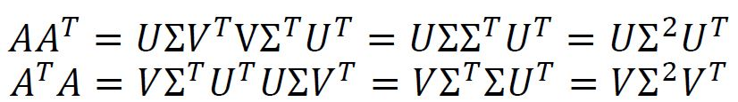
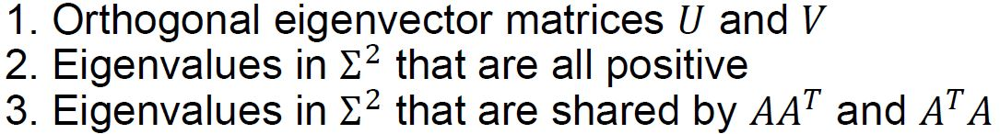
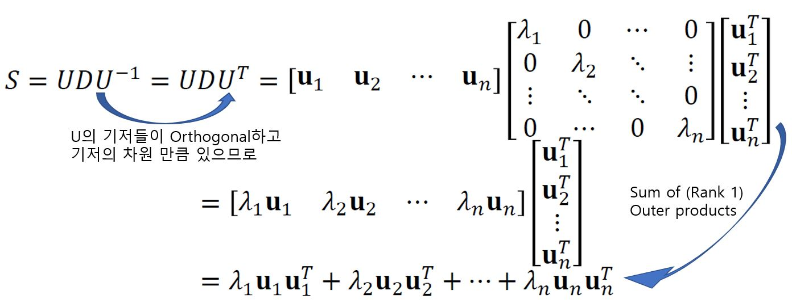
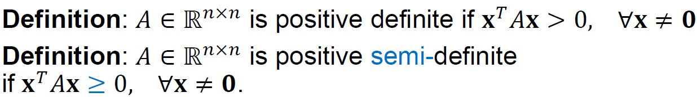
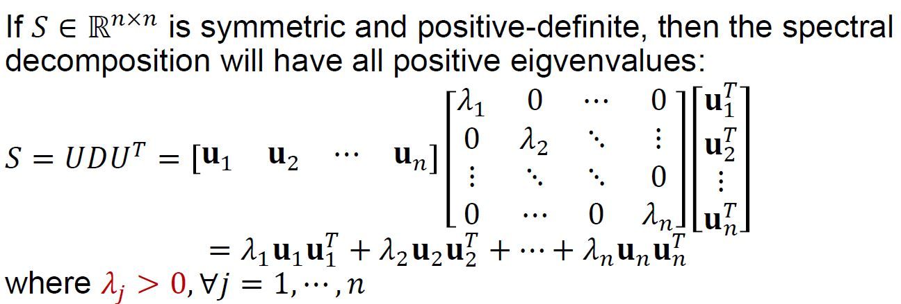
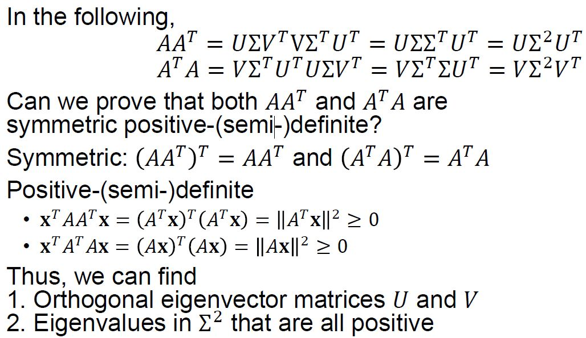
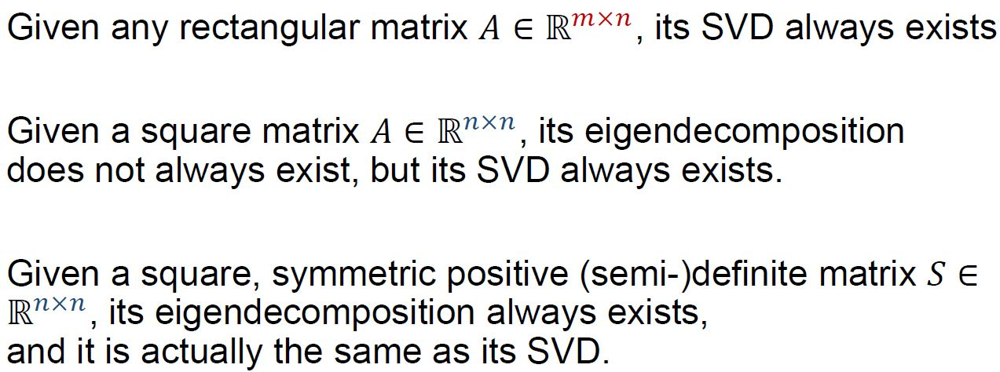
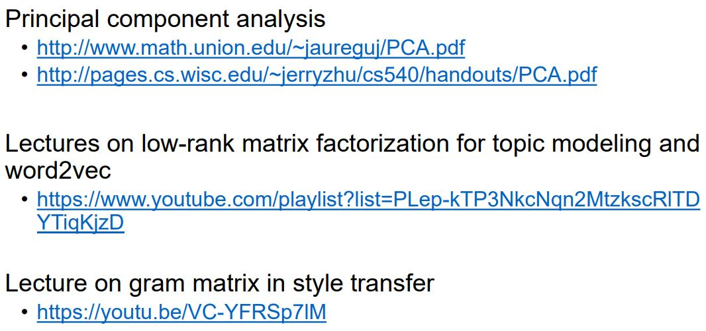

# Singular Value Decomposition

## Singular Value Decomposition(SVD)

 직사각행렬 𝐴 ∈ ℝ^(𝑚×𝑛)가 있고,Orthonormal한 열들로 구성된  𝑈 ∈ ℝ^(𝑚×𝑚), 𝑉 ∈ ℝ^(𝑛×𝑛)가 있어서 각각 A의 열공간과 행공간에 Orthonormal한 기저들을 구성하며  대각 행렬 Σ ∈ ℝ^(𝑚×𝑛)의 0이 아닌 원소들이 내림차 순으로 되어 있을 때  (𝜎1 ≥ 𝜎2 ≥ ⋯ ≥ 𝜎_min (𝑚,𝑛)) SVD는 다음과 같이 쓸 수 있다. 

## Basic Form of SVD  

## SVD as Sum of Outer Products

## Reduced Form of SVD

## Another Perspective of SVD

앞서 언급한 U, V라고 하는 각각이 열공간 A의 기저 벡터 집합 {𝐮1, … , 𝐮𝑛}와 행공간 A의 기저 벡터 집합  {𝐯1, … , 𝐯𝑛}인 행렬은 그람 슈미츠 직교화를 통해서 구할 수 있고 유일하지 않다. 유일 하지 않은 이유는 그람 슈미츠 직교화에서 어떤 벡터를 어떤 벡터에 투영하느냐에 따라 달라질 수 있기 때문이다. 

그렇다면 이 U, V를 따로 구하여 SVD를 하는 것이 아니라 다음의 식을 만족하면서 U, V를 한꺼번에 사용하여 SVD를 할 수 있는 방법이 있는지 생각해 볼 수 있다. 

## Computing SVD

여기서 확인 하고자 하는 것은 A = UΣV^T 라고 할 때, AA^T와 A^TA를 계산해서 고유값 분해 형태로 만든 것이 실제로 AA^T와 A^TA를 고유값 분해 했을 때와 같은 역할을 하는지 여부이다. 

위에서 도출된 가장 오른쪽의 식을 보면 VDV^-1과 유사하게 보인다. U와 V는 Orthogonal하므로 각각의 역행렬은 각각의 Transpose이고 Σ가 대각행렬이므로 Σ^2도 대각행렬이다. 그러나 이 결과가 정말로 고유값 분해를 했을 때 결과와 같다는 것을 증명하려면 다음을 만족해야 한다. 

첫번째로 실제 AA^T와 A^TA를 고유값 분해 했을 때의 나온 고유벡터들이 Orthogonal하고 벡터의 차원 수만큼 있어서 U, V처럼 정사각행렬을 이룰 수 있는가. 

두번째로 고윳값 분해에서 나온 고윳값들이 모두 양수인가. 우리가 하고자 하는 바는 고윳값 분해를 통해서 나온 결과에서 D = Σ^2라고 가정하고 Square_root를 취해서 Σ를 찾는 것이다(UΣV^T가 SVD 이므로) 그런데 고윳값이 음수가 나와 버리면 Square_root를 취하면 허수가 나와 버린다.

세번째로 AA^T와 A^TA를 고유값 분해 했을 때 나온 D_1에서의 고윳 값들과 D_2에서의 고윳 값들이 같은가. 

## Diagonalization of Symmetric Matrices

위의 조건 말고도 근본적으로 해결해야할 조건 중 하나는 애초에 A^T와 A^TA가 Diagonalizable하는가이다. 대각화가 가능해야 고윳값 분해를 진행할 수 있다. 

일반적으로 행렬 𝐴∈ℝ^(𝑛×𝑛)가 대각화가 가능하다는 것은 n가 선형 독립적인 고유 벡터가 존재한다는 뜻이다. 

대칭 행렬(Symmetric)은 무조건 대각화가 가능하고 심지어 n개의 선형 독립적인 고유 벡터는 Orthogonal하다.

(AA^T)^T = AA^T이고, (A^TA)^T = A^TA이므로 이들은 대칭행렬이며 대각화가 가능하고 그래서 고윳값 분해가 가능하다. 그리고 구해진 고유벡터들은 모두 Orthogonal하다. 

## Spectral Theorem of Symmetric Matrices

대칭 행렬 𝑆∈ℝ^(𝑛×𝑛), where 𝑆^𝑇=𝑆에서는 다음을 만족한다.

- det(A-λI=S)의 실근(중근 허용)은 모두 n개이다. 즉, 고윳값은 모두 n개이다.

- 특성방정식에서  λ의 중근의 갯수(Algebraic multiplicity)는 각 고윳값에 해당하는 고유공간의 기저의 갯수(Geometric multiplicity)는 같다. 
- 각각의 고윳값에 해당하는 고유공간은 상호 Orthogonal하다. 즉, 다른 고윳값에 매칭되는 각기 다른 고유 벡터들은 서로 Orthogonal하다. 

결론적으로 S는 Orthogonally Diagonalizable하다. 

## Spectral Decomposition

대칭행렬의 고윳값 분해를 스펙트럼 분해(Spectral Decomposition)라고 하고 다음과 같이 표현한다. 

마지막의 각각의 항들은 u_j에 의해 Span되는 부분공간으로의 투영 행렬로 볼 수 있는데 여기서 λ_j 만큼 스케일링 되었다(내적이 가지는 기하학적인 의미는 한 벡터(u_j)를 다른 벡터(u_j)로 투영시켰을 때 나오는 벡터의 길이와 다른 벡터의 길이의 곱이다. llu_jllxllu_jllxcos0 = llu_jll^2).  

## Positive Definite Matrices

어떤 정사각행렬 A와 모든 0이 아닌 벡터 x에 대하여 x^TAx라는 스칼라 값이 0보다 크면 Positive definite라고 할 수 있고 0 이상이면 Positive semi-definite라고 한다. 

어떤 정사각행렬이 Positive definite이면 이 행렬이 대각화가 가능할 때는 모든 고윳값이 양수이고 대각화가 불가능할 때는 특성 방정식을 통해 찾은 고윳값에 대해서는 양수이다. 

## Symmetric Positive Definite Matrices

대칭 행렬이면 n개의 Orthogonal한 기저벡털르 가지고 Positive Definite하면 모든 λ가 0보다 크다. 

## Back to Computing SVD

다음은 앞서 AA^T와 A^TA가 대칭이고 Positive-(semi-)definite 한지에 대한 증명이다.

## Things to Note

## Futher Study

