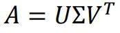
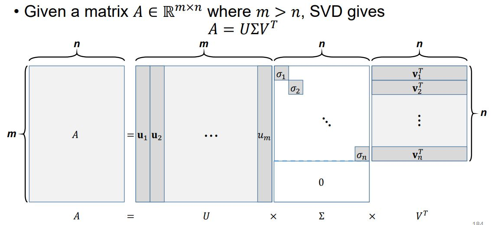
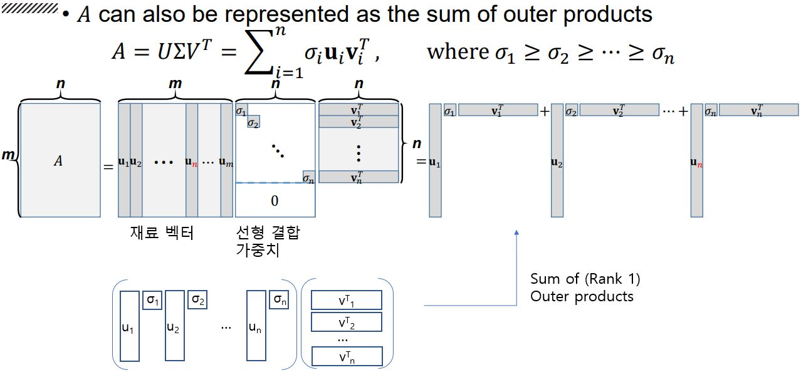
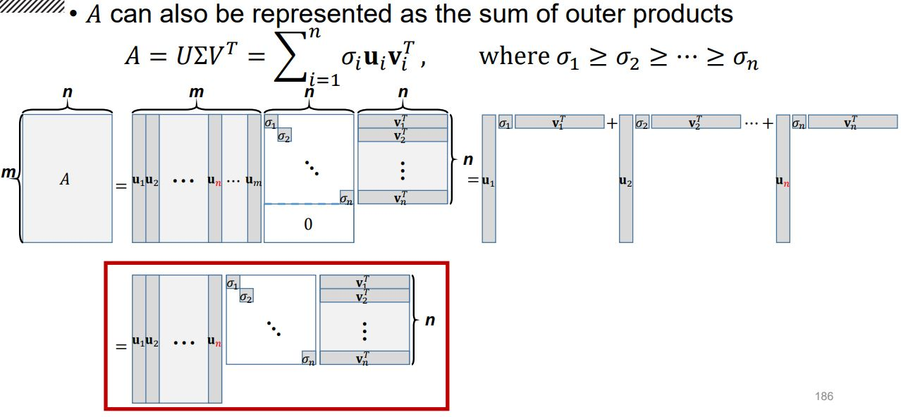
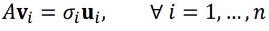
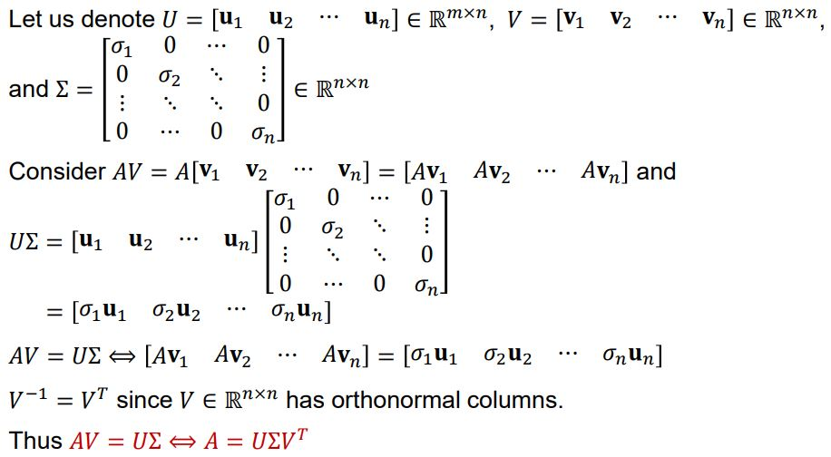

# Singular Value Decomposition

## Singular Value Decomposition(SVD)

 직사각행렬 𝐴 ∈ ℝ^(𝑚×𝑛)가 있고,Orthonormal한 열들로 구성된  𝑈 ∈ ℝ^(𝑚×𝑚), 𝑉 ∈ ℝ^(𝑛×𝑛)가 있어서 각각 A의 열공간과 행공간에 Orthonormal한 기저들을 구성하며  대각 행렬 Σ ∈ ℝ^(𝑚×𝑛)의 0이 아닌 원소들이 내림차 순으로 되어 있을 때  (𝜎1 ≥ 𝜎2 ≥ ⋯ ≥ 𝜎_min (𝑚,𝑛)) SVD는 다음과 같이 쓸 수 있다. 

## Basic Form of SVD  

## SVD as Sum of Outer Products

## Reduced Form of SVD

## Another Perspective of SVD

앞서 언급한 U, V라고 하는 각각이 열공간 A의 기저 벡터 집합 {𝐮1, … , 𝐮𝑛}와 행공간 A의 기저 벡터 집합  {𝐯1, … , 𝐯𝑛}인 행렬은 그람 슈미츠 직교화를 통해서 구할 수 있고 유일하지 않다. 유일 하지 않은 이유는 그람 슈미츠 직교화에서 어떤 벡터를 어떤 벡터에 투영하느냐에 따라 달라질 수 있기 때문이다. 

그렇다면 이 U, V를 따로 구하여 SVD를 하는 것이 아니라 다음의 식을 만족하면서 U, V를 한꺼번에 사용하여 SVD를 할 수 있는 방법이 있는지 생각해 볼 수 있다. 

