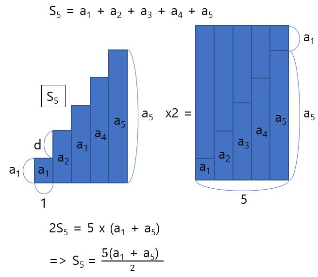

# 등차수열

2, 4, 6, 8, 10, 12, ...과 같이 수를 일렬로 늘어 놓은 것을 수열(Sequence)이라고 한다. 일반항이란 수열의 n번째 수인 an을 n의 식으로 나타낸(n의 함수로 나타낸) 것이다. 일반항을 구하면 n에 구체적인 숫자를 넣어 원하는 숫자를 구할 수 있다. 

a1 - a5까지 같은 간격인 d로 나열되어 있다고 했을 때 즉,

위와 같이 앞의 수와의 차가 일정한 수열을 등차수열이라고 한다. 여기서 일정한 간격 d를 공차(Common difference)라고 한다.

다음으로 등차수열의 a1-a5의 합 s5를 구해보면 다음과 같다. 

