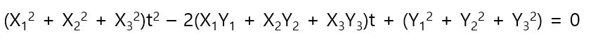

# 상관계수의 이론적 배경

상관계수는 영국에서 활약한 통계학자 프랜시스 골튼(Francis Galton, 1822-1911)이 제창하고, 골튼의 후계자인 칼 피어슨(Karl Pearson, 1857-1936)이 가우스(C.F. Gauss, 1777-1855)의 2차원 정규 분포 이론을 토대로 정리했다. 여기서 증명하고자 하는 것은 다음과 같다.

- 상관계수 r이 반드시 -1 ≤ r ≤ 1 범위에 있음을 증명

상관 계수는 다음과 같이 정의된다.

c_xy, s_x, x_y는 다음과 같다.

n = 3일 때

식을 간단히 하기 위해서 다음과 같이 치환하면

다음과 같이 나타낼 수 있다.

상관계수 r이 반드시 -1 ≤ r ≤ 1 범위에 있음을 증명하기 위해서는 다음을 증명하면 된다. - 8번

8번을 증명하기 위해서 다음과 같은 부등식을 준비한다. - 9번

위의 부등식을 t에 대하여 정리하면 다음과 같다. - 10번

위의 10번식을 t의 2차 함수라고 생각하면 

이는 그래프로 말하면 다음과 같은 상황이 된다.

그러므로 판별식 D에 의해서

위의 8번 식이 증명되었으므로  -1 ≤ r ≤ 1임이 증명되었다. 그런데 9번에서 등호(=)가 성립하면 다음과 같이 나타낼 수 있다.

즉, Y1/X1 = Y2/X2 = Y3/X3 = t일 때 다음의 방정식의 해는 하나뿐이라는 뜻이 된다. - 13번

13번의 방정식을 다음과 같이 변형하면 다음과 같은 t에 대한 2차 방정식의 해와 같다. - 14번

즉 13번 방정식의 해가 하나 <=> 14번 2차 방정식의 해가 하나이다. 이때 14번식의 판별식은 0이 되므로 

즉 8번 식의 등호가 성립하게 된다. 8번 식의 등호가 성립하면 다음이 성립한다. 

9번 식을 일반화 하면 아래와 같다.

위에서 다음의 부등식을 유도해내면 - 16번

부등식에서 등호(=)가 성립하는 때는 

16번식은 이른 바 코시 슈바르츠 부등식(Cauchy-Schwarz's Inequality)이라고 불리는 부등식의 일반형(n으로 나타낸 식)이다. 16번 식을 사용하면 n = 3일때 말고도 반드시 상관 계수 r이  -1 ≤ r ≤ 1임을 증명할 수 있다. 
