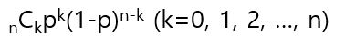
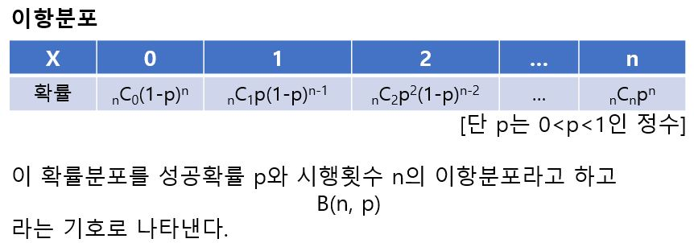
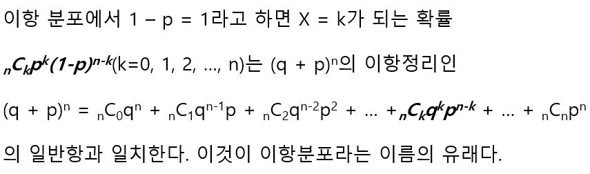
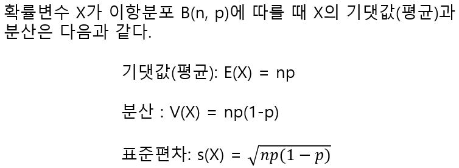
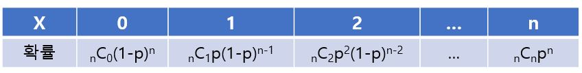
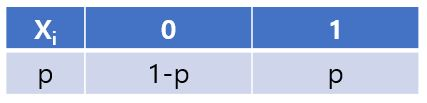
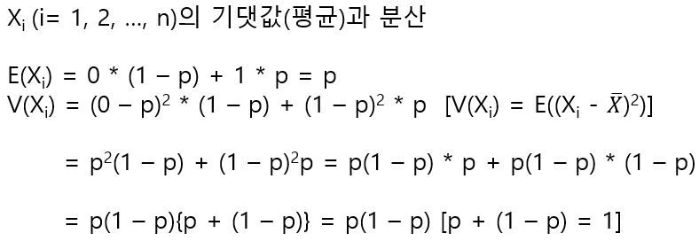
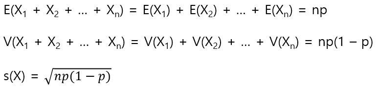

# 이항분포

일반적으로 성공확률 p인 시행을 독립적으로 n회 반복했을 때 성공 횟수 X의 확률분포를, 확률 p에 대한 다음 수 n의 이항분포(Binomial Distribution)라고 한다. 이 때 X = k(k = 0, 1, 2, ..., n)가 될 확률은 n회 중 k회는 성공(확률 p)하고 n - k회는 실패(확률 1 - p)하는 반복시행의 확률이 되므로 다음과 같다.

(일반적으로 어떤 시행에서 결과가 둘 중 하나가 되는 시행을 베르누이 시행(Bernoulli trial)이라고 한다. 베르누이 시행에서 한쪽 사건이 일어날 확률(성공 확률이라고 하는 일이 많다.)을 알고 있을 때 이 시행을 n회 반복했을 때 그 사건이 일어나는 횟수(성공 횟수)는 이항 분포에 따른다.)

이항 분포를 정리하면 다음과 같다.

이항분포에 따르는 확률변수 X의 기댓값(평균)이나 분산, 표준 편차는 다음과 같다.

예를 들어서 다음과 같은 이항분포가 있다고 가정한다.

여기서 X와는 별도로 X1, X2, X3... 라는 각 베르누이 시행에 대한 확률 변수의 확률 분포는 다음과 같다.

이때의 Xi(i = 1, 2, 3, ...)의 기댓값과 분산은 다음과 같다.

여기서 합의 기댓값과 합의 분산은 다음과 같이 유도할 수 있다.

