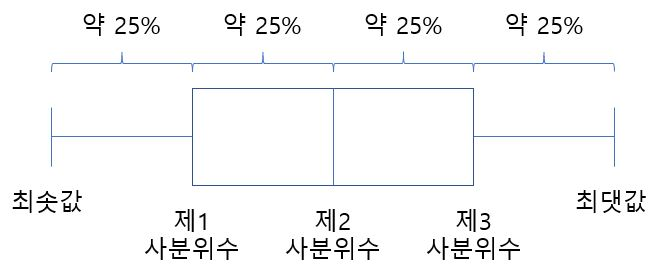
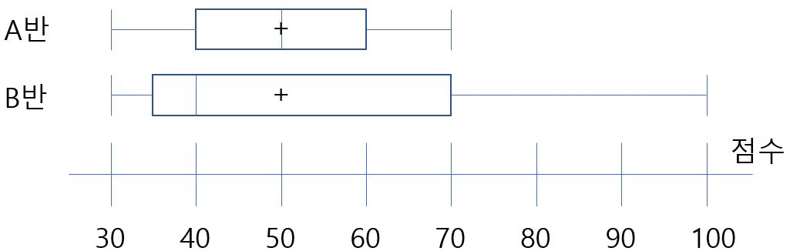
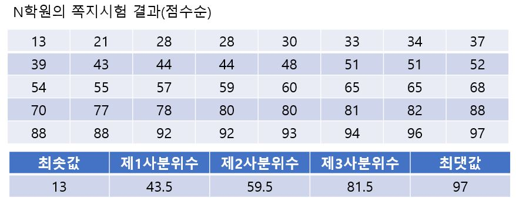
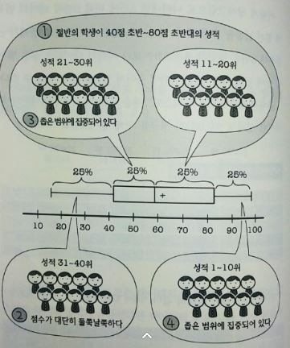
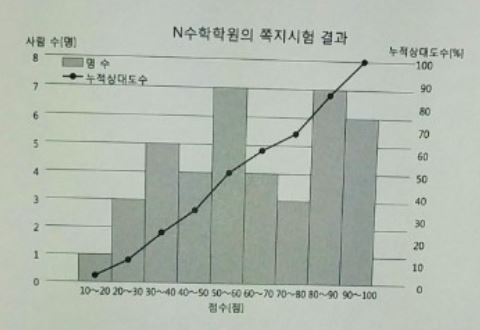

# 상자그림

5수 요약으로 데이터의 분포 상태를 나타내는 그래프를 **상자 그림** 이라고 한다. 

5수요약의 각 구획에는 모든 데이터의 약 25%씩이 포함되어 있으므로 각각의 길이가 균등하다면 데이터의 분포 상태 역시 일률적임을 알 수 있다. 

다음은 A반과 B반의 5수요약을 상자그림으로 나타낸것이다. +는 평균을 나타낸다.

상자그림을 보면 A반에 비해 B반의 데이터 범위가 훨씬 넓음을 알 수 있다. 또 A반의 데이터 분포 상태가 균등한데 B반의 중앙값(제2사분위수)보다 아래의 데이터는 좁은 범위에 모여 있고, 위는 넓은 범위에 있음을 한눈에 알 수 있다.

위의 상자그림에서 알 수 있는 점은 다음과 같다.

- 절반의 학생이 40점 초반~80점 초반대의 성적을 거둠.
- 성적이 하위 25%인 학생은 점수가 대단히 들쭉날쭉함.
- 성적이 하위 25%~50%인 학생의 점수는 좁은 범위에 집중되어 있음.
- 성적이 상위 25%인 학생은 점수가 좁은 범위에 집중되어 있음.

**히스토그램에서 도수가 높은 부분은 상자 그림에서는 간격이 좁아진다는 것** 을 알 수 있다.