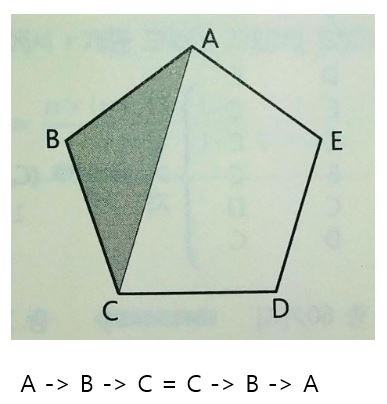

# 조합

아래와 가팅 오각형 ABCDE의 5개의 꼭지점에서 3개의 꼭지점을 골라 삼각형을 만드는 경우를 선택해보자. 이때 A -> B -> C 순으로 선택하든 C -> B -> A 순으로 선택하든 똑같은 삼각형 ABC가 만들어진다. 

이처럼 선택 순서를 고려하지 않고 선택하는 경우의 수를 조합(組合)이라고 한다. 점 A, B, C를 선택하는 경우의 수를 순열과 비교하면 다음과 같다. 

위에서 조합의 총수는 5개에서 3개를 선택하는 순열을 6으로 나눠주면 된다. 

이를 일반화시키면 다음과 같다.

그런데 5개의 점에서 3개의 꼭지점을 고르는 것은 5개의 점에서 2개의 꼭지점이 되지 않을 점을 선택하는 것과 같다. 

이상을 일반화하면 다음과 같다.

위의 일반화된 식에서 r = 0일 때, 다음이 성립한다.

