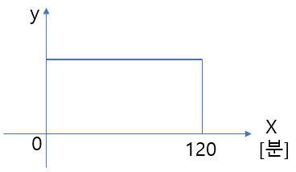
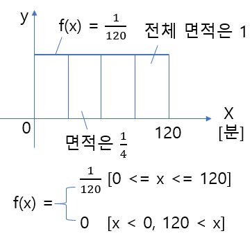
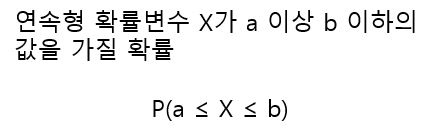
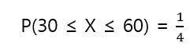
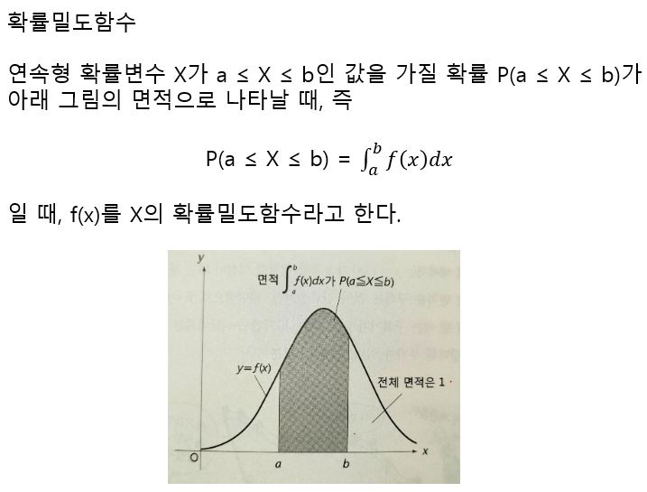
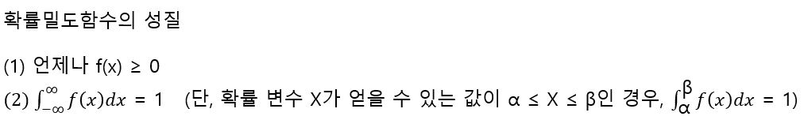

# 연속형 확률변수와 확률밀도함수

12~14시의 시간대에서 희망한 택배가 12:30~13:00의 30분 사이에 배달될 확률을 생각해본다. 12:00보다 X분 후에 택배가 도착한다고 하면 X의 변역은 0<= X <= 120이다. 그런데 택배가 도착하는 것은 12:00보다 10분 후 일지도 모르고 60.5분 후일지도 모른다. X는 연속적으로 변화하므로, 표본공간과 X과 얻을 수 있는 값이 몇 가지인지 생각하는 것은 무리가 있다. 

하지만 X가 0~120 사이를 연속적으로 변화한다. -> 0이상 120이하의 어떤 값도 얻을 수 있다. -> 0이상 120이하의 범위에서 X가 갖는 값에 대한 확률적 메커니즘을 생각할 수 있다.

다시 말해 X는 연속적으로 변화하기는 하지만 어떤 확률분포에 따르는 확률변수라고 할 수 있다. 이와 같이 연속형 값을 얻을 수 있는 확률변수를 연속형 확률변수라고 한다. 택배 도착 가능성이 2시간 중 언제라도 일정하다고 한다면 X의 확률 분포는 아래와 같다.

택배가 12:30~13:00의 30분 사이에 도착할 확률은 120분 중의 30분 사이에 배달될 확률 이므로 30/120 = 1/4이라고 생각할 수 있다. 이는 위의 확률분포의 그래프에서 직사각형의 면적을 1로 해두면 직감적으로 알 수 있다.

연속형 확률변수 X가 a이상 b 이하의 값을 가질 확률을 다음과 같이 나타내기로 한다면

12:30~13:00의 30분 사이에 배달될 확률은 다음과 같이 쓸 수 있다. 

이는 y=f(x)와 x = 30, x = 60 그리고 x축으로 둘러싸인 면적인데, 이와 같은 f(x)를 X의 확률밀도함수라고 한다.

확률밀도함수는 적분을 사용하여 다음과 같이 일반화 할 수 있다.

확률 P는 어떤 경우에도 0<= P <= 1을 만족하므로 확률밀도함수 f(x)는 다음 2가지 성질을 갖는다.

