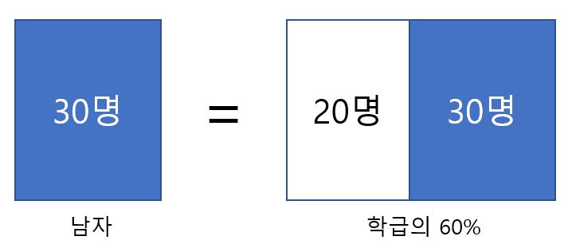
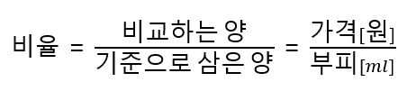
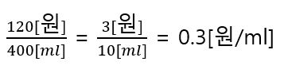
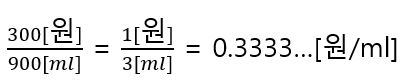

# 비율

전체 50명인 학급이 있고, 이중 남자는 30명일 때, 학급 전체에 대한 남자의 비율을 구하라는 문제의 답은 다음과 같다. 

비교하는 양(남자)이 30명, 기준으로 삼은 양(학급 전체)이 50명이므로 30 / 50 = 0.6이 되어 구하는 비율은 0.6(60%)이다. 

이것을 다음과 같이 두 가지 의미로 해석할 수 있다. 

(A) 같은 단위끼리의 비율은 포함제

같은 단위끼리의 비율은 포함제다. 앞에서 30명은 50명인 학습의 0.6학급 분(60%)라고 했다. 

**같은 단위끼리의 비율, 즉 포함제의 비율은 기준(전체)에 대한 비교하는 양(부분)의 비율을 나타낸다.**

(B) 다른 단위끼리의 비율은 등분제

어떤 가게에서 두 종류의 우유를 팔고 있는데 A는 400ml에 120원, B는 900ml에 300원이다. 어느 쪽이 더 이익일까? 양이 다르므로 가격만 비교해서는 알 수 없다. 이런 상황에서 **비율을 사용하면 같은 단위로 비교할 수있다.**

용량을 기준으로 삼은 양으로 하고 가격을 비교하면 다음과 같이 나타낼 수 있다. 

A의 경우를 적용해보면

B의 경우를 적용해보면

라는 경우를 얻을 수 있고 A와 B의 1ml당 가격은 각각 0.3원, 0.3333...원이라는 것을 알 수 있다. 이렇게 같은 1ml에 대한 가격이 계산되므로 A가 이익임을 알 수 있다. **일반적으로 사용하는 단위끼리의 비율은 등분제** 라고 생각하면 의미가 명확해진다. 즉, **다른 단위끼리의 비율, 즉 등분제의 비율은 기준(단위량)에 대한 수치의 대소를 나타낸다.** 

이상과 같이 똑같은 비율이라도 다음과 같이 그 의미가 다르다.

- 같은 단위끼리의 비율은 포함제
- 다른 단위끼리의 비율은 등분제

