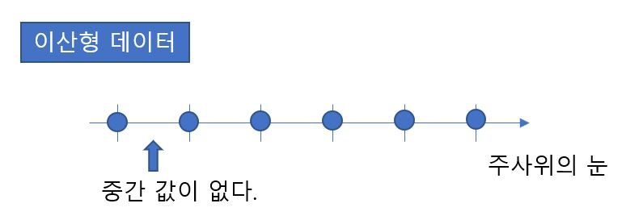
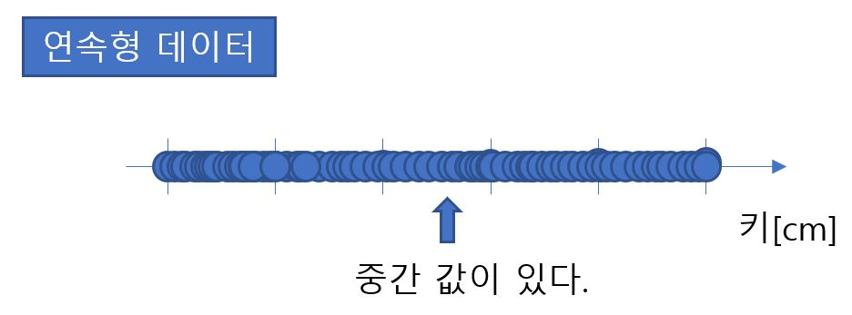
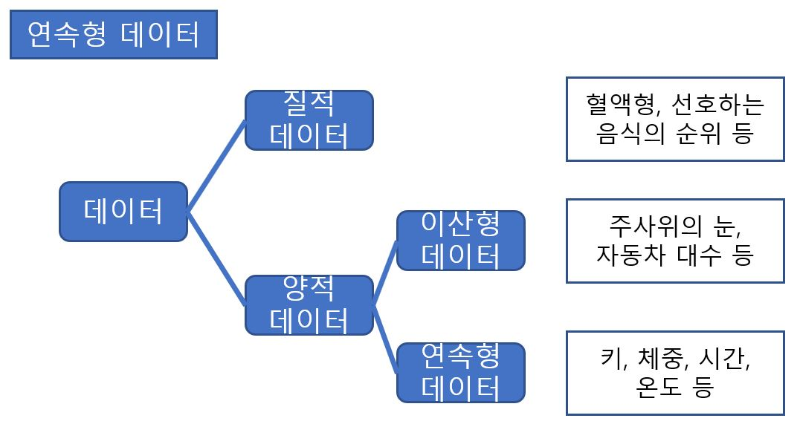

# Definition_of_Data_and_Variate

A반 6명의 수학 시험 점수가 [50 60 40 30 70 50] 이렇게 6개가 있다. 이 6개 값 전체를 **데이터(Data)** 라고 한다. 그리고 조사 대상이 되는 항목(여기서는 수학 시험 점수)이 **변량(Variate)** 이다. 

(변량은 변수(Variable)이라고도 한다. 통계에서는 엄밀히 말하면 변량과 변수가 다른 용어지만 여기서는 같은 의미로 간주한다.)

(A) 질적 데이터

질적 데이터란 **카테고리컬 데이터** 라고도 불린다. 혈액형이나 선호하는 음식, 지지하는 정당 등 헤어릴 수 없는 변량(질적 변량)으로 이루어진 것을 말한다. 질적 데이터는 각 선택 항목에 번호를 붙였을 때 이 숫자를 더하거나 뺴는 일이 무의미하다.

(B) 양적 데이터

숫자를 더하거나 뺴는 것에 의미가 있는 변량(양적 변량)으로 이루어진 데이터를 양적 데이터라고 한다. 양적 데이터는 듬성듬성한 값만 얻을 수 있는 이산형 데이터와 연속하는 값을 얻을 수 있는 연속형 데이터로 나누어진다. 

