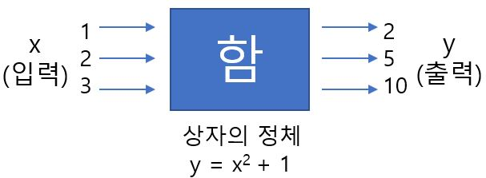

# 함수

함수(函數)의 函은 상자라는 의미다. 어떤 상자에 어떤 값을 입력하면 출력으로 어느 값이 나오는 이미지를 연상할 수 있다.

y는 x의 함수다는 영어로 y is a function of x라고 하는데 이를 줄여서 y = f(x)라고 쓴다. y가 x의 함수이기 위한 필요조건은 다음과 같이 2가지이다.

다음과 같은 상황은 함수라고 인정할 수 없다.

| 하나의 입력에 대해 엉터리로 출력하는 경우             | 입력으로 어떤 경우는 사용 가능하지 않은 경우          |
| ----------------------------------------------------- | ----------------------------------------------------- |
|  |  |

y=f(x)의 그래프란 그 식에 대입할 수 있는 점(그 식을 만족하는 점)을 모은 것(집합)이다. y = f(x)의 x에 a라는 값을 대입했을 때 얻어지는 (a, f(a))라는 점은 반드시 y = f(x)의 그래프 위에 있다.

x를 입력이자 원인, y를 출력이자 결과라고 한다면 함수를 인과 관계와 연관시켜 이해할 수도 있다.  특히 위의 조건 중 하나의 입력에 대해 엉터리로 출력하고 있는지를 확인하는 것이 중요하다. 이는 좋은 인과 관계가 성립하고 있음을 보증하기 때문이다. 

일반적으로 원인과 결과의 대응에는 다음의 4가지 유형이 있다.

|        (i)원인->결과가 하나, 결과->원인이 하나        |       (ii)원인->결과는 하나, 결과->원인은 하나x        |
| :---------------------------------------------------: | :----------------------------------------------------: |
|  |   |
|    **(iii)원인->결과가 하나x, 결과->원인이 하나**     |     **(iv)원인->결과가 하나x, 결과->원인은 하나x**     |
|  |  |

(i)은 하나의 원인에 따른 결과가 완전히 예상 가능하고 이미 얻어진 결과에 대해서도 원인을 특정할 수 있다.

(ii)는 하나의 원이에 대한 결과를 예상할 수있다. 다만 결과의 원인을 특정할 수 없으므로 (i)보다는 불합리한 경우도 있을 수 있다.

(iii)은 이미 일어난 결과에 대해 원인은 특정할 수 없으나 하나의 원인에 대한 결과를 특정할 수 없다.

(iv)는 원인과 결과 사이에 일정한 관계를 발견하는 것이 어렵다.

좋은 인과 관계는 (i)와 (ii)이다. 조건 A는 원인과 결과 사이에 (i) 또는 (ii)의 관계가 성립하기 위한 조건이다.

(한여름 일수를 x, 맥주 매출량을 y라고 했을 때 한여름 일수가 많아지면 맥주 매출량도 늘어난다라는 관계는 엄밀한 함수관계이지는 않지만 통계에서는 y는 x의 함수 + 오차라고 생각함으로써 x와 y 사이의 관계를 이해하거나 y를 예측할 수도 있다.)