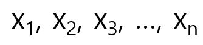
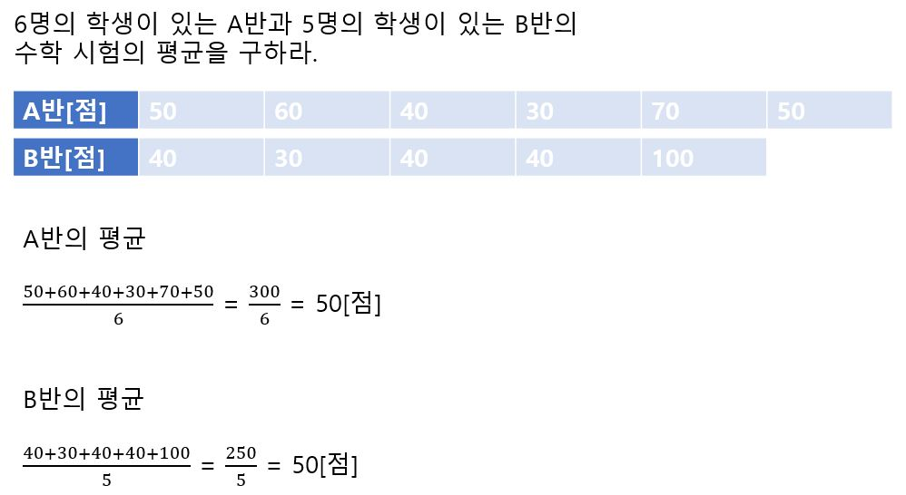

# 평균

평균(Mean)이란 평평하게(평평할 평, 平) 고르는(고를 균, 均) 것이다. 

직사각형의 세로 길이가 평균이며, 가로 길이가 개수, 그리고 면적이 합계가 된다.

​                                                                    평균 x 개수 = 합계

​                                                                    (세로) (가로)  (면적)

이것으로부터 다음을 알 수 있다. 

​                                                                     평균 = 합계/개수

다음과 같이 n개의 데이터가 있다고 하자. 

이들의 합계를 데이터의 개수 n으로 나눈 것이 평균이다. 수학에서는 평균을 문자 위에 가로막대(바)를 붙여서 표시한다.

A반은 점수대가 상대적으로 고르게 분포된 데 비해, B반은 100점인 사람이 전체의 평균을 올려주고 있다.

이처럼 데이터에는 평균으로는 알 수 없는 특징도 있다. 그래서 통계에서는 데이터의 특징을 나타내는 것으

로 중앙값(Median)이나 최빈값(Mode) 등도 사용한다.