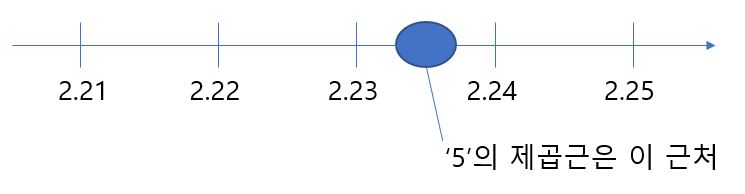

# 제곱근

실제로 다음과 같이 a가 4일 경우, a의 제곱근 양수 2와 음수 2로 2개가 있음을 확인 할 수 있다(+=는 복호(複號)라고 한다).

5의 제곱근은 어림잡아 다음과 같이 예측할 수 있다.

그런데 아무리 소수점 이하를 계속 계산해도 **제곱했을 때 딱 떨어지게 5가 되는 유한 소수를 찾아낼 수 없다.**

일반적으로 4, 16 등과 같이 **어떤 정수의 제곱인 수(제곱수) 이외의 제곱근은 유한의 소수나 분수로는 나타낼 수 없다고 알려져 있다.** 실제로 5의 제곱근은 다음과 같이 소수점 이하가 무한히 계속되는 수다.

(제곱수 이외의 제곱근을 유한한 소수나 유리수로 나타낼 수 없다는 것은 '배리법'으로 증명 가능하다.)

유한한 소수나 분수로는 나타낼 수 없지만 분명 존재하는 제곱수 이외의 수의 제곱근을 나타내기 위해서 √(루트)를 만들어 냈다.

√(루트)를 사용하면 제곱근을 다음과 같이 나타낼 수 있다.

또 다음과 같이 말할 수 있다.

루트 안이 제곱수(어떤 정수의 제곱인 수)일 때 다음과 같이 루트를 벗길 수 있다.

