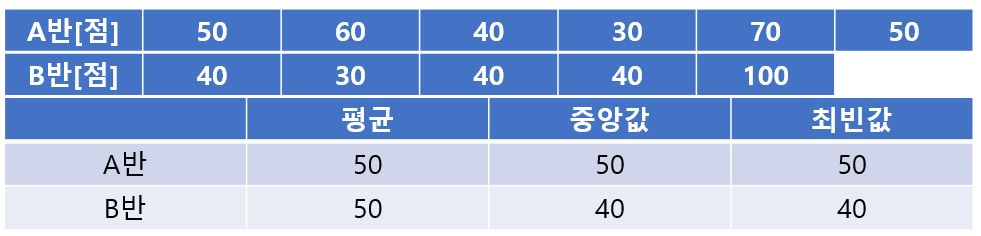
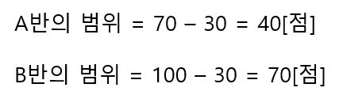
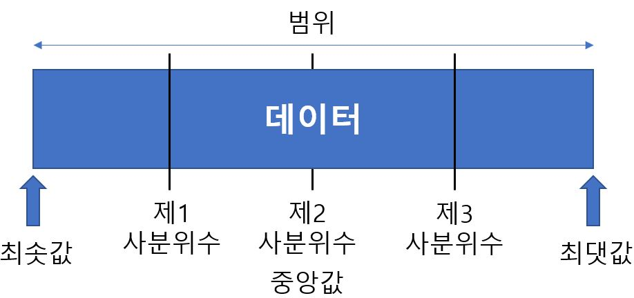
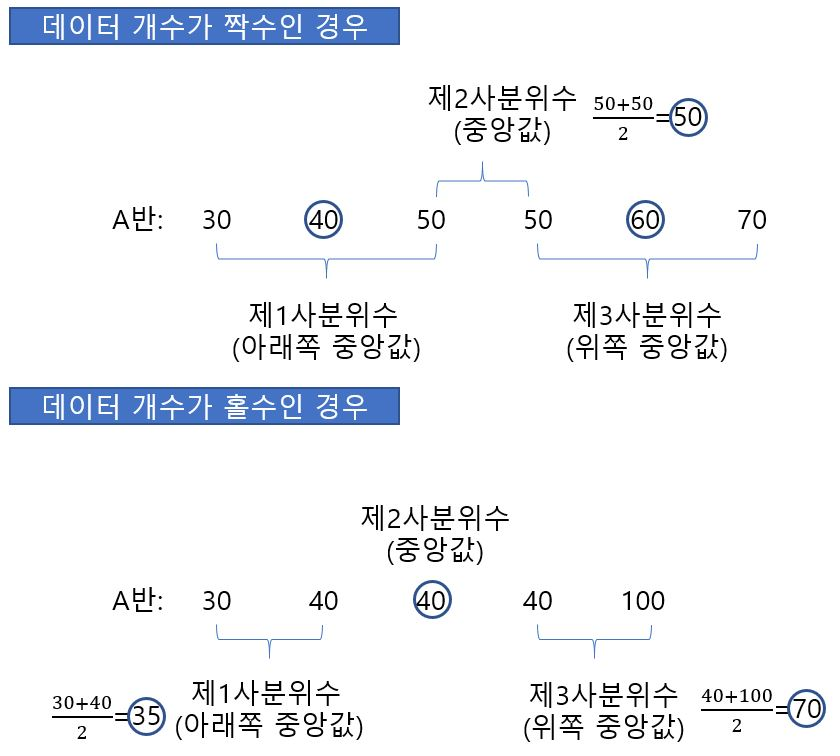
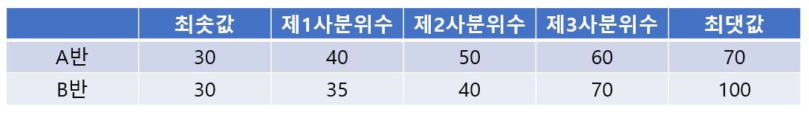
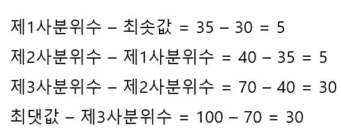

# 데이터 분포 상태를 조사한다.

- 최솟값과 최댓값

  A반의 최솟값은 30점, 최댓값은 70점이고 B반의 최솟값은 30점, 최댓값은 100점이다. 각각에 대해 최댓값 - 최솟값의 범위를 구해보면 다음과 같다.

- 사분위수

  **사분위수(Quantile)** 란 데이터를 크기순으로 배열했을 때 4등분하는 3개의 수치를 말하면 작은 것부터 **제1사분위수, 제2사분위수, 제3사분위수** 라고 부른다. 보통 **제2사분위수는 데이터의 중앙값과 일치** 한다. 사분위수를 구하는 방법은 다음과 같다.

  (i) 데이터의 최솟값과 최댓값을 구한다.

  (ii) 데이터의 중앙값을 구한다. -> 제2사분위수

  (iii) 중앙값 아래쪽 절반의 중앙값을 구한다. -> 제1사분위수

  (iv) 중앙값 위쪽 절반의 중앙값을 구한다. -> 제3사분위수

데이터의 개수가 짝수인지 홀수인지에 따라 사분위수를 구하는 방법이 다르다.

**데이터 분포 상태를 조사하기 위한 최솟값, 최댓값 그리고 3개의 사분위수를 합쳐서 5수요약** 이라고 한다.

5수요약을 보면 A반은 5수요약의 간격이 같으나 B반은 5수요약의 간격이 제각각이며, 특히 제2사분위수보다 위의 간격이 넓다는 사실에서 중앙값보다 위쪽 절반의 데이터가 아래쪽 절반보다 흩어져 있음을 알 수 있다.

