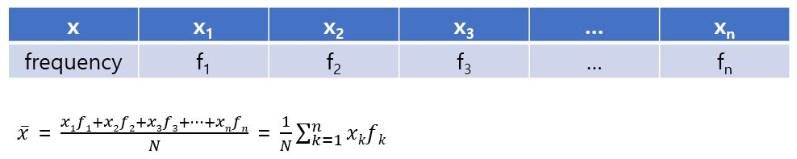
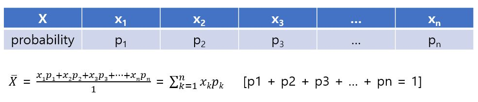
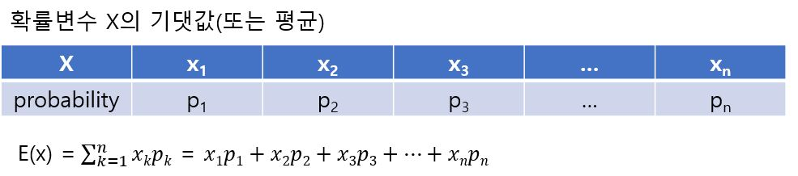

# 기댓값

데이터 x가 x1, x2, x3, ..., xn의 어떤 값을 가지며, 각각의 횟수가 f1, f2, f3, ..., fn이라고 하면 데이터 x의 평균은 아래와 같다. 

이를 확률분포에 적용해보면 다음과 같다.

X_hat은 데이터의 평균과 완전히 똑같이 구할 수 있으므로 X_hat은 확률변수의 평균이라고 생각할 수 있다. 그리고 확률변수의 평균은 기댓값이라고도 부른다. 

데이터는 모두 값이 정해져 있는데 반해 확률변수는 어떤 확률로 일어나는 사건에 대한 변수이므로 값이 정해져 있지 않다. 확률변수의 평균을 기댓값이라고 하는 것은 확률변수의 값을 실제로 관측해볼 때 평균적으로 기대되는 값이라는 의미다.

