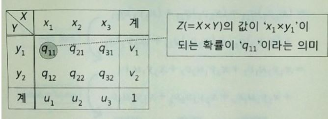
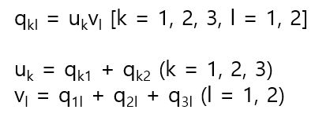
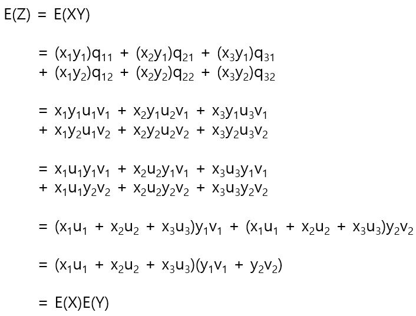
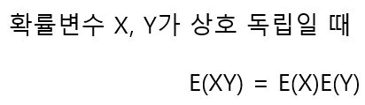

# 곱의 기댓값

확률변수의 곱의 기댓값을 구하는 과정은 다음과 같다. 예를 들어서 x1, x2, x3라는 값을 가지는 확률 변수 X와 y1, y2의 값을 가지는 확률 변수 Y가 있을 때 Z = XY를 만족하는 새로운 확률 변수 Z를 정의한다고 가정한다. 이때 확률 분포는 다음과 같다.

만약에 확률변수 X, Y가 상호 독립이라면 X = x1, Y = y1이 될 확률 q11은 q11 = u1v1이라고 계산할 수 있다. (확률변수가 가질 수 있는 모든 조합에 대해 사건의 독립이 성립할 때 확률 변수가 독립이다라고 한다.)

이를 일반화 하면 다음과 같다. 

E(Z) = E(XY)를 계산하면 다음과 같다.

여기서 중요한 점은 X, Y가 상호 독립이라는 것이다. X, Y가 독립이 아닌 경우 E(XY) = E(X)E(Y)가 성립할 수 없다. 

